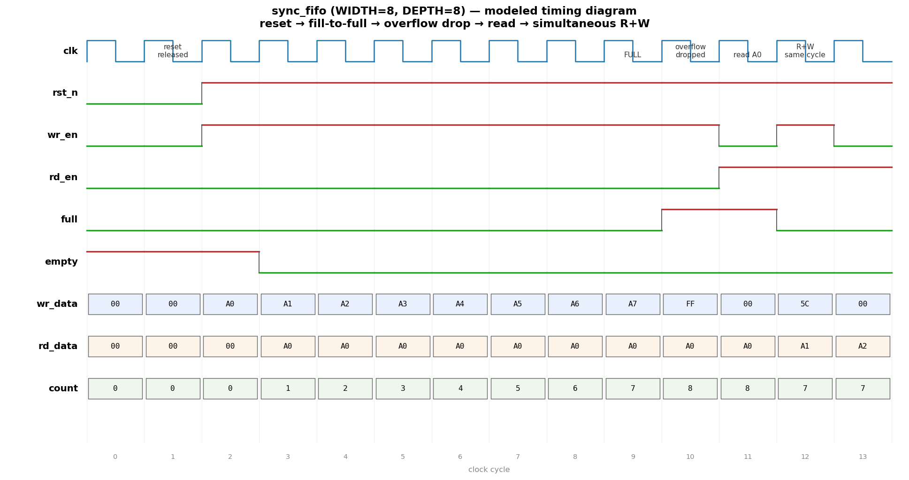

# Day 1 — Constrained-Random FIFO Scoreboard

Verify a parameterized synchronous FIFO with a **self-checking, class-style
SystemVerilog testbench** built around a golden reference model (a
`$`-queue scoreboard), directed + constrained-random stimulus, functional
coverage, and SVA assertions.

## Overview

`sync_fifo` is a single-clock, first-in/first-out buffer with `full`/`empty`
status flags and an occupancy `count`. The testbench mirrors every accepted
transaction into a SystemVerilog queue that acts as the *ideal* FIFO, then
compares the DUT's read data and occupancy against that model on every cycle.
Because the model tracks acceptance using the same rules as the RTL
(`wr_en & !full`, `rd_en & !empty`), the two must agree bit-for-bit or the
scoreboard flags a mismatch.

## Verification goal

Prove that the FIFO:

1. Returns data in strict FIFO order (order-preservation).
2. Accepts a write only when not full and a read only when not empty
   (overflow / underflow are silently dropped, never corrupting state).
3. Keeps `count`, `full`, and `empty` mutually consistent and within
   `0 .. DEPTH` at all times.
4. Behaves correctly on the corner cases: fill-to-full, drain-to-empty, and a
   simultaneous read+write in the same cycle.

## Features / coverage list

- **Reference-model scoreboard** — golden `$`-queue, checked every cycle.
- **Directed stimulus** — fill-to-full, overflow attempt, drain-to-empty,
  underflow attempt, simultaneous R+W.
- **Constrained-random stimulus** — 2000 randomized `{wr_en, rd_en, wr_data}`
  transactions with biased enables to keep both corners under pressure.
- **Functional coverage** — covergroup on `{wr_en,rd_en}` operations crossed
  with `full` and `empty` (were writes attempted while full? reads while empty?).
- **SVA assertions** — count bound, full/empty mutual exclusion, and
  flag↔count consistency.
- **Occupancy cross-check** — DUT `count` vs. reference `size()` every cycle.
- **Safety** — global timeout watchdog; VCD waveform dump.

## DUT parameters

| Parameter | Default | Description |
|-----------|---------|-------------|
| `WIDTH`   | 8       | Data word width in bits |
| `DEPTH`   | 8       | Number of FIFO entries (power of two recommended) |

## DUT ports

| Port      | Dir | Width              | Description |
|-----------|-----|--------------------|-------------|
| `clk`     | in  | 1                  | Clock |
| `rst_n`   | in  | 1                  | Active-low synchronous reset |
| `wr_en`   | in  | 1                  | Write request |
| `wr_data` | in  | `WIDTH`            | Write data |
| `rd_en`   | in  | 1                  | Read request |
| `rd_data` | out | `WIDTH`            | Read data (head of FIFO, combinational) |
| `full`    | out | 1                  | Asserted when `count == DEPTH` |
| `empty`   | out | 1                  | Asserted when `count == 0` |
| `count`   | out | `$clog2(DEPTH)+1`  | Current occupancy (0 .. DEPTH) |

## Testbench architecture

```
              +-------------------------------------------------------+
              |                    tb_sync_fifo                       |
              |                                                       |
  directed +  |   +-------------+        drive        +-----------+   |
  random ---->|   |  stimulus   |-------------------->|           |   |
  program     |   | (initial)   |   wr_en/rd_en/data  |    DUT     |  |
              |   +-------------+                     | sync_fifo |   |
              |         |                             |           |   |
              |         | predict accept              +-----+-----+   |
              |         v                                   | rd_data |
              |   +-------------+     compare (scoreboard)   | full    |
              |   | reference   |<---------------------------+ empty   |
              |   | model ($-q) |     rd_data / count        | count   |
              |   +-------------+                                      |
              |         |                                             |
              |         +--> errors++ on any mismatch                 |
              |                                                       |
              |   +-------------+     +---------------------------+   |
              |   | covergroup  |     |  SVA: bounds / flags      |   |
              |   |  fifo_cg    |     |  count<=DEPTH, !(full&emp) |  |
              |   +-------------+     +---------------------------+   |
              +-------------------------------------------------------+
```

## Simulation timing



*Caption — **This is a hand-modeled timing diagram, not a screenshot from a
real simulator run.** No HDL simulator (verilator/vcs/questa/icarus) was
installed in the build environment, so the waveform was produced by a
cycle-accurate Python model of the RTL (`docs/make_waveform.py`) that
reproduces the exact acceptance rules and count/flag equations. It shows
reset release (cycle 2), eight writes filling the FIFO to `full` at cycle 9
(`count` 0→8), an overflow write of `FF` at cycle 10 that is dropped
(`count` stays 8, `wr_ptr` does not advance), a read of `A0` at cycle 11, and
a simultaneous read+write at cycle 12 where `count` holds steady at 7 while the
head advances `A1`→`A2`.*

## How the checking works

The scoreboard lives in `drive_and_check()`:

1. Before the clock edge, it samples the **combinational** `full`/`empty` flags
   to predict whether the DUT will accept the write and/or read this cycle —
   identical logic to the RTL.
2. For an accepted read it captures the expected head value **before** the edge
   (since `rd_data` is combinational off `rd_ptr`).
3. It drives the stimulus, waits for `@(posedge clk)`, then updates the golden
   queue: `push_back` on accepted writes, `pop_front` on accepted reads.
4. It compares `rd_data` against the captured expected value and `count`
   against `ref_q.size()`. Any disagreement increments `errors`.

The test prints `RESULT: *** PASS ***` only if `errors == 0` (no scoreboard
mismatches and no assertion failures).

## Functional-coverage intent

The `fifo_cg` covergroup samples `{wr_en, rd_en}` (idle / read-only /
write-only / both) crossed with `full` and `empty`. Hitting the
`write_only × full` and `read_only × empty` cross bins is the evidence that the
random phase actually stressed the overflow- and underflow-drop paths rather
than only operating in the FIFO's comfortable mid-range.

## Run instructions

Pick whichever simulator is installed:

```bash
make verilator   # Verilator (--binary --assert --timing)
make vcs         # Synopsys VCS
make questa      # Siemens Questa / ModelSim
make icarus      # Icarus Verilog (partial SVA/covergroup support)
make clean
```

Each target elaborates `sync_fifo.sv` + `tb_sync_fifo.sv`, runs to `$finish`,
and writes `sync_fifo.vcd` for waveform viewing (e.g. `gtkwave sync_fifo.vcd`).

> **Note:** No HDL simulator was available in the environment where this day was
> authored, so the testbench was **not executed** here and no genuine pass log
> is claimed. The RTL and TB are provided to run under any of the simulators
> above; the committed waveform image is the modeled diagram described in the
> Simulation timing section.

## What the testbench checks (summary)

- ✅ FIFO ordering (read data matches golden queue head)
- ✅ Occupancy `count` matches reference model size every cycle
- ✅ Overflow writes and underflow reads are dropped, not corrupting state
- ✅ `count` stays within `0 .. DEPTH` (SVA)
- ✅ `full` and `empty` never assert together (SVA)
- ✅ `full`/`empty` flags stay consistent with `count` (SVA)
- ✅ Coverage of all `{wr_en,rd_en}` combinations at both corners
