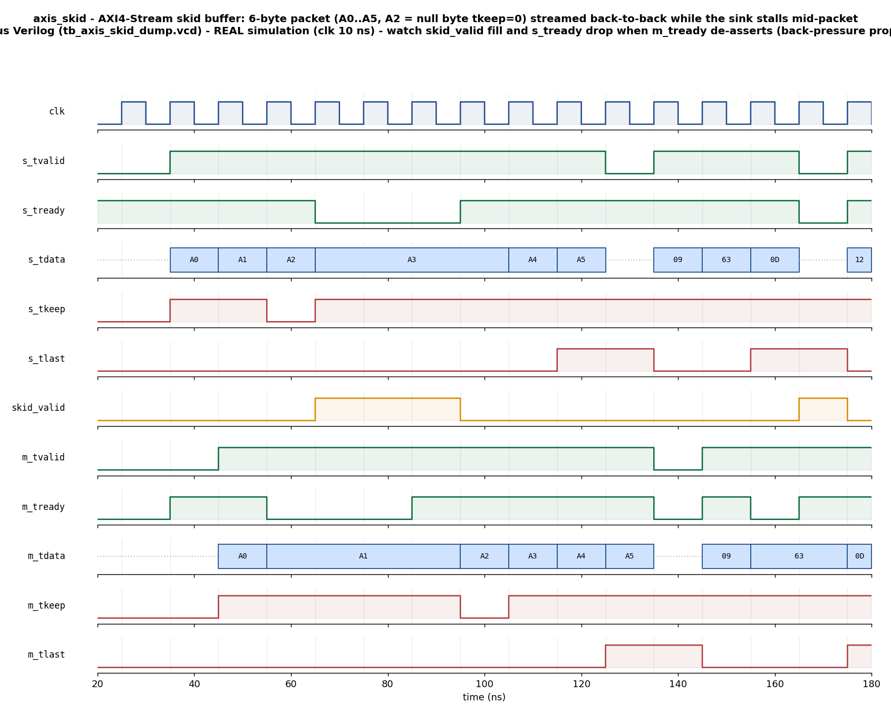

# Day 10 — UVM AXI4-Stream Skid-Buffer (Register-Slice) Verification

A complete UVM-1.2 environment that verifies an **AXI4-Stream skid buffer**
(a.k.a. register slice) against an independent golden **order-preserving queue**
reference model, driven by **two agents** — a stream **source** and a
back-pressure **sink** — with directed + constrained-random stimulus,
functional-coverage collection, and assertion-based checking of the AXI-Stream
handshake contract.

The DUT is a small, timing-friendly pipeline stage, so the verification stays
the star: the point of the day is a clean, layered UVM testbench — transactions,
sequences, drivers, monitors, agents, a **golden-queue scoreboard**, a coverage
collector, a virtual sequencer, and virtual sequences — that proves lossless,
in-order, back-pressure-safe streaming under randomized flow control.

---

## Overview

The DUT ([axis_skid.sv](axis_skid.sv)) is a parameterized `DATA_WIDTH`-bit
AXI4-Stream **skid buffer**. It registers *both* the payload
(`TDATA`/`TKEEP`/`TLAST`) **and** the flow-control signals
(`TVALID`/`TREADY`), which breaks the long combinational `TVALID ↔ TREADY`
path that a naive register slice would create — while still sustaining **full
throughput** (one beat per clock) when the downstream side is ready.

How it stays lossless under back-pressure:

- The output slot is a **registered** beat. When the downstream side stalls
  (`m_tready == 0`) the output slot holds its beat.
- If a fresh beat is accepted from upstream in that same cycle, it cannot enter
  the occupied, stalled output slot, so it is parked in a one-entry **skid
  register**.
- While the skid register is occupied the module de-asserts `s_tready`,
  propagating back-pressure **upstream**.
- The buffer therefore holds at most **two** beats (output slot + skid) and
  **never drops or duplicates** a beat.

Because a skid buffer is a pure pass-through, its executable specification **is**
an order-preserving FIFO: whatever bytes go in must come out, in the same order,
unchanged. That is exactly what the scoreboard encodes.

---

## Verification goal

Prove that, for **every** beat across a directed showcase packet and a large
constrained-random population of packets, under **two-sided randomized
back-pressure**, the DUT forwards each accepted input beat
(`s_tvalid && s_tready`) to the output (`m_tvalid && m_tready`) **exactly once,
in order, with identical `{TDATA, TKEEP, TLAST}`** — nothing dropped, duplicated,
or reordered — with functional coverage demonstrating packet framing and the
null-byte (`TKEEP=0`) case were exercised, and assertions guarding the
AXI-Stream handshake invariants on every cycle.

---

## Features / coverage list

- **Golden-queue reference-model scoreboard** — every observed input beat is
  pushed onto an expected FIFO; every observed output beat pops the oldest and
  compares `{tdata, tkeep, tlast}` exactly (order + data), reporting
  `RESULT: *** PASS ***`.
- **Two active agents** — a `axis_master_agent` (stream **source**, drives the
  `s_*` slave channel with random inter-beat gaps) and a `axis_slave_agent`
  (back-pressure **sink**, drives `m_tready` with randomized ready/stall
  directives). Each has its own driver, monitor, and sequencer.
- **Layered sequences** — source: `axis_directed_seq` (fixed showcase packet
  with a null byte), `axis_packet_seq` (one random packet ending in `tlast`),
  `axis_stream_seq` (many random packets); sink: `axis_rdy_always_seq`
  (max-throughput) and `axis_rdy_random_seq` (randomized back-pressure).
- **Virtual sequencer + virtual sequences** — `axis_smoke_vseq` and
  `axis_regress_vseq` orchestrate the source stream and the back-pressure sink
  **concurrently** on one virtual sequencer holding handles to both leaf
  sequencers.
- **Functional coverage** — payload buckets, packet framing (`tlast` both ways),
  the null-byte (`tkeep=0`) case, and a `tlast × tkeep` cross.
- **SVA** — bound onto the DUT: `TVALID` held until `TREADY` (no retraction),
  payload stable while stalled, and no-X on the output payload / `s_tready`.
- **Directed + constrained-random** stimulus, a **timeout** watchdog, and a
  **VCD** dump.

---

## DUT parameters & ports

### Parameters

| Parameter | Default | Meaning |
|:----------|:-------:|:--------|
| `DATA_WIDTH` | `8` | `TDATA` width in bits |
| `KEEP_WIDTH` | `(DATA_WIDTH+7)/8` | `TKEEP` width — one bit per byte lane (derived) |
| `PW` | `DATA_WIDTH+KEEP_WIDTH+1` | internal payload width `{tlast,tkeep,tdata}` (derived) |

### Ports

| Port | Dir | Width | Description |
|:-----|:---:|:-----:|:------------|
| `clk`      | in  | 1 | clock |
| `rst_n`    | in  | 1 | active-low async reset |
| `s_tvalid` | in  | 1 | slave (upstream) beat valid |
| `s_tready` | out | 1 | slave ready — de-asserts when the skid register is full |
| `s_tdata`  | in  | `DATA_WIDTH` | upstream payload data |
| `s_tkeep`  | in  | `KEEP_WIDTH` | upstream byte-qualifier (a `0` bit ⇒ null byte) |
| `s_tlast`  | in  | 1 | upstream end-of-packet marker |
| `m_tvalid` | out | 1 | master (downstream) beat valid — registered |
| `m_tready` | in  | 1 | master ready (back-pressure from the sink) |
| `m_tdata`  | out | `DATA_WIDTH` | downstream payload data |
| `m_tkeep`  | out | `KEEP_WIDTH` | downstream byte-qualifier |
| `m_tlast`  | out | 1 | downstream end-of-packet marker |

---

## Testbench architecture

```
                     +--------------------------------------------------------+
                     |                        axis_env                        |
                     |                                                        |
  axis_smoke_vseq -> | axis_vsequencer ->  m_sqr (source)                     |
  axis_regress_vseq  |               \                                        |
                     |                \    s_sqr (sink)                       |
                     |                 \        |                             |
                     |    +-------------+        +---------------+            |
                     |    v                                      v            |
                     | axis_master_driver -> s_* pins       axis_slave_driver |
                     |                          |            -> m_tready       |
                     |                     [  axis_skid DUT  ]                 |
                     |                          |                             |
                     |  axis_master_monitor <---+---> axis_slave_monitor      |
                     |    (input beats)               (output beats)          |
                     |          |                            |                |
                     |          | in_imp              out_imp |  (also -> cov) |
                     |          v                            v                |
                     |     +----------- axis_scoreboard ----------+           |
                     |     |  expected FIFO: push in, pop+check    |           |
                     |     +---------------------------------------+           |
                     |                    axis_coverage (covergroup)          |
                     +--------------------------------------------------------+

  reference model = an order-preserving queue (a skid buffer is pure pass-through)
```

- The **master (source) driver** pulls one `axis_beat` per item, inserts
  `pre_delay` idle cycles, then presents the beat and **holds** it (valid high,
  payload stable) until `s_tready` completes the handshake — respecting the
  AXI-Stream rule that a master may not retract a valid beat.
- The **slave (sink) driver** applies `axis_rdy` directives (`ready` held for
  `len` cycles) to `m_tready`, creating randomized downstream back-pressure.
- The **master monitor** samples accepted input beats (`s_tvalid && s_tready`)
  and also measures how many cycles valid waited (upstream back-pressure).
- The **slave monitor** samples output beats (`m_tvalid && m_tready`).
- The **scoreboard** pushes each observed input beat onto an expected FIFO and
  pops/compares each observed output beat — decoupled from the exact latency, so
  only **order and data** are asserted.
- The **coverage collector** subscribes to the output-beat stream.

---

## Simulation timing



**Caption.** Directed showcase window captured from a **real Icarus Verilog run**
(`tb_axis_skid_dump.vcd`, produced by `make icarus_dump`) — this is genuine
captured simulation data, **not** a hand-drawn diagram. A 6-byte packet
(`A0 A1 A2 A3 A4 A5`, with `A2` a **null byte**, `s_tkeep=0`) is streamed
back-to-back into the slave channel while the sink stalls mid-packet. Read the
story top-to-bottom: beats stream through (`s_tvalid && s_tready` → one clock
later `m_tvalid`); the sink de-asserts `m_tready` (~55 ns) so the registered
output slot **holds**; the next accepted beat is parked in the **skid register**
(`skid_valid` rises, ~65 ns); `s_tready` therefore **drops**, pushing
back-pressure upstream (note `s_tdata` freezes on `A3` while stalled, valid held
high); the sink re-asserts `m_tready` and the output + skid **drain**, `s_tready`
recovers; `m_tlast` pulses (~125 ns) exactly one clock after `s_tlast` as `A5`
leaves. On the output, `m_tdata` reproduces `A0 A1 A2 A3 A4 A5` **in order** and
`m_tkeep` preserves the `A2` null byte — lossless, in-order forwarding under
back-pressure.

> The UVM environment (`axis_skid_pkg.sv` / `tb_top.sv`) also dumps `tb_top.vcd`
> under a UVM-capable simulator; the committed PNG is rendered from the portable
> Icarus run because Icarus is the open-source simulator this repo targets.

---

## How the checking works

A skid buffer is a pure pass-through, so the reference model **is** an
order-preserving queue. The scoreboard keeps an **expected-beat FIFO**:

1. On each observed **input** beat (`s_tvalid && s_tready`), `{tdata, tkeep,
   tlast}` is pushed onto the FIFO.
2. On each observed **output** beat (`m_tvalid && m_tready`), the oldest
   expectation is popped and compared field-by-field. A mismatch, or an output
   with no matching input, is a `uvm_error`.
3. `check_phase` fails if any input beat was never forwarded (leftover FIFO);
   `report_phase` prints `RESULT: *** PASS ***` only when there were matches,
   zero mismatches, and an empty leftover FIFO.

The portable Icarus testbench ([tb_axis_skid_dump.sv](tb_axis_skid_dump.sv))
reproduces the identical scheme with a SystemVerilog-queue scoreboard, driving
the source and the `m_tready` back-pressure from two independent processes, so
the design is self-checked even without a UVM-capable simulator.

---

## Functional-coverage intent

The covergroup (`axis_coverage`, sampled on the output-beat stream) targets:

- **cp_data** — payload buckets (`0x00`, `0xFF`, low half, high half).
- **cp_keep** — the fully-kept beat **and** the null-byte (`tkeep=0`) case.
- **cp_last** — packet boundary observed both asserted and de-asserted.
- **x_last_keep** — the `tlast × tkeep` cross (e.g. a null byte landing on the
  last beat of a packet).

`report_phase` prints the achieved instance coverage.

---

## What the testbench checks

- Every accepted input beat appears on the output **exactly once, in order**,
  with identical `{tdata, tkeep, tlast}` (golden-queue scoreboard).
- **No** output beat without a matching input (no duplication / fabrication).
- **No** leftover, un-forwarded input beats at end of test (`check_phase`).
- AXI-Stream handshake invariants hold every cycle (SVA): `m_tvalid` stays
  asserted until `m_tready` (no retraction), the output payload is stable while
  stalled, and no unknown (`X`) on the output payload or `s_tready`.

---

## Run instructions

Open-source flow (Icarus Verilog + VCD → PNG), runs everywhere:

```bash
make icarus_dump     # compile + run the self-checking module TB, prints PASS
make waveform        # re-render docs/axis_skid_waveform.png from the captured VCD
```

UVM flow (needs a UVM-1.2-capable simulator):

```bash
make vcs       UVM_TESTNAME=axis_smoke_test     # Synopsys VCS
make questa    UVM_TESTNAME=axis_regress_test   # Siemens Questa / ModelSim
make verilator UVM_TESTNAME=axis_smoke_test     # Verilator >= 5 built with --uvm
```

Available UVM tests: `axis_smoke_test` (directed showcase packet vs. randomized
back-pressure) and `axis_regress_test` (many random packets vs. two-sided
randomized back-pressure). SVA is enabled with `+define+AXIS_SVA` (already set in
the UVM Makefile targets).

### Simulator status

The portable Icarus testbench was **run** on Icarus Verilog 13.0 and passes
(`beats in=148 out=148 errors=0 leftover=0`, with the skid register and upstream
back-pressure both exercised — `skid_valid` asserted 33 times, `s_tready` driven
low 33 times during the run) — the committed waveform is from that run. A
mutation check confirms the scoreboard is non-vacuous: breaking the DUT's
ordering (ignoring the skid register) or its `TLAST` pass-through both make the
run report `RESULT: *** FAIL ***`. The UVM environment is provided in full but
was **not executed here**, because no UVM-capable simulator
(VCS/Questa/Verilator ≥ 5 `--uvm`) is installed in this environment; run one of
the UVM targets above to execute it.
