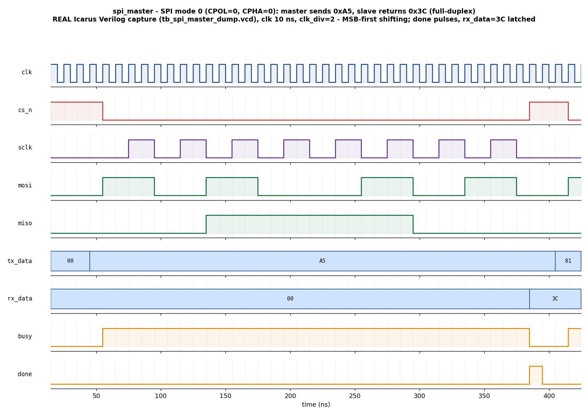

# Day 11 — UVM SPI Master Verification

Verification of a parameterized **SPI master** that supports all four SPI modes
(CPOL/CPHA), a programmable clock divider, and full-duplex MSB-first transfers.
The environment pairs the DUT with an **independent SPI-slave reference model**
and a **golden full-duplex scoreboard**: a correct exchange means each side
receives *exactly* what the other side sent, checked across every mode.

## Overview

SPI (Serial Peripheral Interface) is a synchronous, full-duplex, master-driven
serial bus. On a one-cycle `start` pulse the master latches the mode
(`cpol`, `cpha`), a clock divider (`clk_div`), and a byte (`tx_data`); it then
asserts `cs_n`, generates `sclk`, and simultaneously shifts `DATA_WIDTH` bits
out on `MOSI` and in from `MISO`, MSB first. When the transfer finishes it
latches the received byte on `rx_data` and pulses `done`.

The four SPI modes follow the classic Motorola convention:

| Mode | CPOL | CPHA | SCLK idle | Data sampled on | Data changed on |
|------|------|------|-----------|-----------------|-----------------|
| 0 | 0 | 0 | low  | leading edge  | trailing edge |
| 1 | 0 | 1 | low  | trailing edge | leading edge  |
| 2 | 1 | 0 | high | leading edge  | trailing edge |
| 3 | 1 | 1 | high | trailing edge | leading edge  |

For CPHA=0 the first bit is pre-driven as `cs_n` asserts (before any SCLK edge);
for CPHA=1 the first bit is presented on the first leading edge. The DUT uses an
**output-then-advance** shift rule so a single code path serves all four modes.

## Verification goal

Prove that the master performs a **lossless, correctly-phased, MSB-first
full-duplex exchange in every SPI mode and at every supported clock divider**:

- the byte the master shifts out on MOSI is received intact by the slave, and
- the byte the slave shifts back on MISO is captured intact in `rx_data`,

with correct `busy`/`done` status and a properly framed, gated `sclk`/`cs_n`.

## Features / coverage list

- All four SPI modes (mode 0–3), directed **and** randomized.
- Programmable clock divider (`clk_div` 1–4 in the random space; `clk_div=1`
  gives the fastest SCLK = clk/2).
- Full-duplex **golden reference model**: master.rx == slave.tx (MISO path) and
  slave.rx == master.tx (MOSI path).
- Independent behavioural SPI-slave model that shares no logic with the DUT.
- Directed corner data: `0x00`, `0xFF`, and mixed patterns (`0xA5`, `0xC3`, …).
- Constrained-random regression over mode × divider × data.
- Functional coverage: `mode`, `clk_div`, `tx_data` class, and `mode × divider`
  cross.
- SVA assertions on the pin-level protocol contract (see below).
- VCD dump + a real captured waveform image.

## DUT parameters & ports

### Parameters

| Parameter | Default | Meaning |
|-----------|---------|---------|
| `DATA_WIDTH` | 8 | Bits per SPI transfer (MSB first) |
| `DIV_WIDTH`  | 16 | Width of the `clk_div` field |

### Ports

| Port | Dir | Width | Description |
|------|-----|-------|-------------|
| `clk`     | in  | 1 | System clock |
| `rst_n`   | in  | 1 | Synchronous active-low reset |
| `start`   | in  | 1 | One-cycle pulse to begin a transfer (ignored while busy) |
| `cpol`    | in  | 1 | Clock polarity (latched at `start`) |
| `cpha`    | in  | 1 | Clock phase (latched at `start`) |
| `clk_div` | in  | `DIV_WIDTH` | System cycles per SCLK half-period (≥1) |
| `tx_data` | in  | `DATA_WIDTH` | Byte to shift out (MSB first) |
| `sclk`    | out | 1 | Generated serial clock (idles at CPOL) |
| `cs_n`    | out | 1 | Chip-select, active low |
| `mosi`    | out | 1 | Master-out serial data |
| `miso`    | in  | 1 | Master-in serial data (from the slave) |
| `rx_data` | out | `DATA_WIDTH` | Byte shifted in (valid at `done`) |
| `busy`    | out | 1 | High for the duration of a transfer |
| `done`    | out | 1 | One-cycle pulse when a transfer completes |

## Testbench architecture

```
                         +-------------------------------------------------+
                         |                    spi_env                      |
                         |                                                 |
  +----------------+     |  +-------------------+   +-------------------+   |
  | spi_directed / |     |  |  MASTER agent     |   |  SLAVE agent      |   |
  | spi_random_seq |====>|  |  sqr->drv->[pins] |   |  [pins]->drv->sqr |<==|== spi_slv_resp_seq
  +----------------+     |  |         mon        |   |        mon        |   |
        (mst_sqr)        |  +---------+---------+   +---------+---------+   |
                         |            | ap (spi_txn)          | ap (slv)     |
                         |            v                       v             |
                         |     +--------------------------------------+     |
                         |     |  spi_scoreboard (golden full-duplex)  |     |
                         |     |   master.rx == slave.tx  (MISO)       |     |
                         |     |   slave.rx  == master.tx (MOSI)       |     |
                         |     +--------------------------------------+     |
                         |            |                                     |
                         |            +--> spi_coverage (mode x div x data) |
                         +-------------------------------------------------+
                                       |  virtual sequencer: mst_sqr + slv_sqr
                                       v
     +----------------------------------------------------------------+
     |   spi_master_if  (start/cfg/tx_data | sclk/cs_n/mosi/miso | rx) |
     +----------------------------------------------------------------+
                                       |
                                 +-----------+
                                 | spi_master|  (DUT)  + bound spi_master_sva
                                 +-----------+
```

- The **master agent** drives the parallel request bus and reconstructs each
  completed transfer `{mode, divider, tx_data, rx_data}` from the pins.
- The **slave agent** is the responding SPI device: its driver shifts a byte out
  on `MISO` MSB-first (pre-driving for CPHA=0) and recovers the `MOSI` byte; its
  monitor independently rebuilds the `MOSI` byte straight from the pins.
- A **virtual sequencer** runs the master stimulus and the slave responder
  concurrently via `spi_smoke_vseq` / `spi_regress_vseq`.

## Simulation timing



*Directed SPI mode-0 (CPOL=0, CPHA=0) full-duplex exchange captured from a
**real Icarus Verilog run** (`tb_spi_master_dump.vcd`), clk 10 ns, `clk_div=2`.
`cs_n` asserts, `sclk` steps from its idle-low level, the master shifts `0xA5`
out on `MOSI` while the slave returns `0x3C` on `MISO` (MSB first), and `done`
pulses one cycle with `rx_data = 0x3C` latched as `busy` drops. This image is a
genuine simulator capture, not a hand-drawn diagram.*

## How the checking works (scoreboard / reference model)

The scoreboard is a **golden reference model of the full-duplex contract**. It
receives master transactions and slave transactions on two analysis imports and
correlates them in issue order. For each pair it enforces:

- **MISO path:** `master.rx_data === slave.tx_byte` — the master must capture
  exactly the byte the slave shifted back.
- **MOSI path:** `slave.rx_byte === master.tx_data` — the slave must recover
  exactly the byte the master shifted out.

Because the slave model is independent of the DUT, a phase/polarity bug in any
mode (wrong sample edge, missing pre-drive, off-by-one shift) breaks the
identity and is caught. `report_phase` prints `RESULT: *** PASS ***` only when
every correlated transfer matches.

## Functional-coverage intent

`spi_coverage` samples every completed master transaction:

- **`cp_mode`** — all four `{cpol,cpha}` modes hit.
- **`cp_div`** — each divider value 1–4 exercised.
- **`cp_tx`** — `tx_data` classes: all-zeros, all-ones, low half, high half.
- **`x_mode_div`** — the mode × divider cross, so no mode is left untested at a
  given clock rate.

## SVA assertions

Bound onto the DUT via `spi_master_sva` (enable with `+define+SPI_SVA`):

- `cs_n` is high whenever the master is idle.
- `done` is a strict one-cycle pulse.
- `busy` is low in the cycle `done` pulses.
- `sclk` only toggles while `cs_n` is low (clock is gated to the transfer).
- no X on `sclk`/`mosi` while a transfer is active.

## Run instructions

Portable, open-source path (this is what the committed waveform comes from):

```bash
make icarus_dump     # compile + run the self-checking module TB (Icarus)
make waveform        # regenerate docs/spi_master_waveform.png from the VCD
```

UVM path (needs a UVM-1.2-capable simulator):

```bash
make vcs       UVM_TESTNAME=spi_smoke_test      # Synopsys VCS
make questa    UVM_TESTNAME=spi_regress_test    # Siemens Questa / ModelSim
make verilator UVM_TESTNAME=spi_smoke_test      # Verilator >= 5 (--uvm)
```

> **Note on tooling.** This project was developed and run under **Icarus
> Verilog**, which does not implement the UVM class library, so the UVM
> environment (`spi_master_pkg.sv` / `tb_top.sv`) was **not executed here** — it
> is provided for VCS/Questa/Verilator. The self-checking result and the
> waveform image both come from the portable `tb_spi_master_dump.sv` running on
> Icarus, which reproduces the same verification intent (independent slave
> model, full-duplex golden check across all four modes, random regression).

## What the testbench checks

- Correct, MSB-first, full-duplex data exchange in **all four SPI modes**.
- Correct behaviour across clock dividers, including the fastest `clk_div=1`.
- `rx_data` captures the exact byte shifted in on `MISO`.
- The slave recovers the exact byte shifted out on `MOSI`.
- `busy`/`done` status and `cs_n`/`sclk` framing behave per the pin-level SVA.
- No data is corrupted, dropped, or mis-phased under randomized stimulus.

Icarus run result: **`RESULT: *** PASS ***`** — 66 transfers (all four modes,
several dividers, 60 random), 0 errors.
