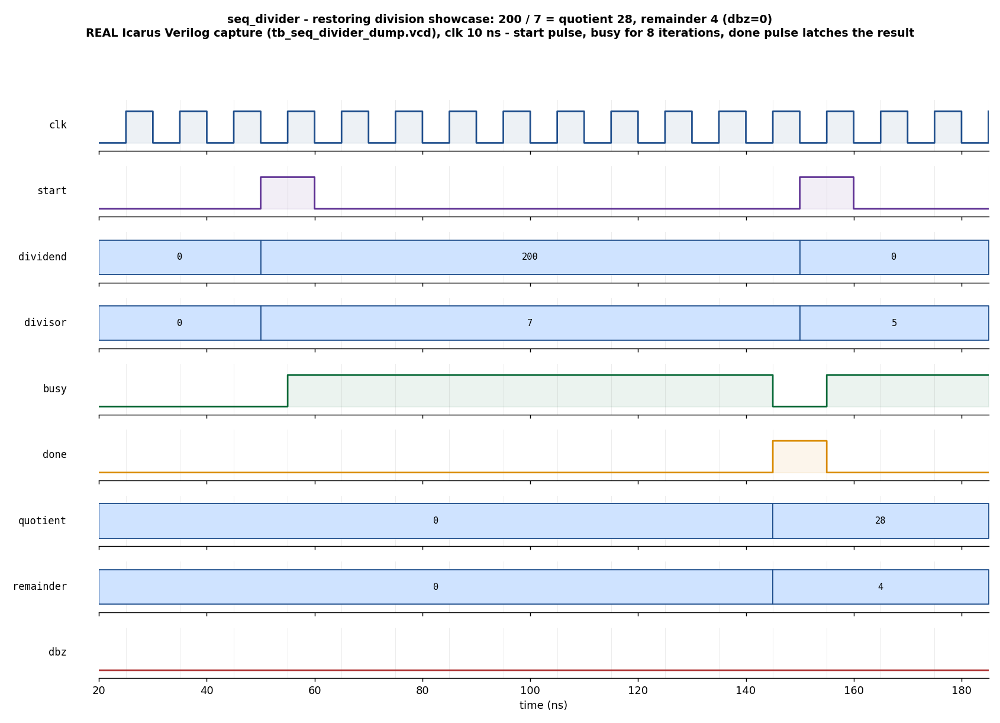

# Day 12 — Sequential (Restoring) Divider Verification

A UVM verification environment for a **multi-cycle unsigned integer divider** that
implements the classic **restoring division** algorithm behind a
`start` / `busy` / `done` handshake, including a well-defined **divide-by-zero**
response.

Where earlier days verified single-cycle datapaths (the Day 9 ALU) and serial
protocols (SPI, UART, SPI), this day targets a **multi-cycle iterative compute
unit**: the interesting verification problems are the *handshake* (a one-cycle
`start`, a `busy` window of exactly `WIDTH` iterations, a one-cycle `done` pulse)
and the *numeric contract* (exact quotient/remainder, the `q*d + r == dividend`
identity, `0 <= r < divisor`, and the x/0 convention).

---

## Overview

`seq_divider` divides an unsigned `dividend` by an unsigned `divisor`, producing
an integer `quotient` and `remainder`. It runs one restoring-division iteration
per clock — `WIDTH` iterations per operation — so a division takes a fixed,
bounded number of cycles.

Handshake:

1. Assert `start` for one cycle (accepted only while `!busy`) with the operands
   on `dividend` / `divisor`.
2. `busy` goes high and stays high for the whole computation.
3. `done` pulses high for **exactly one cycle** when the result is valid.
4. `quotient`, `remainder`, and `dbz` are registered and hold until the next
   result.

**Divide-by-zero convention** (matching common RISC hardware): when
`divisor == 0`, `dbz` is raised with `done`, `quotient = 2**WIDTH - 1`
(all-ones), and `remainder = dividend`.

### The verification goal

Prove that, for **every** operand pair the environment issues, the divider:

* returns the exact quotient and remainder (`quotient == dividend / divisor`,
  `remainder == dividend % divisor`),
* satisfies the fundamental division identity
  `quotient * divisor + remainder == dividend` with `0 <= remainder < divisor`,
* raises `dbz` **iff** `divisor == 0`, and honors the x/0 result convention,
* obeys the handshake contract (`done` is a one-cycle pulse, `busy` is
  continuous until `done`, results are X-free at `done`, and a request always
  completes within a bounded window).

---

## Features / coverage list

- Restoring-division RTL, parameterized on `WIDTH`, reset-safe, lint-friendly.
- Golden reference-model scoreboard using SystemVerilog `/` and `%`, plus an
  **independent identity re-check** (`q*d + r == dividend`, `r < divisor`).
- Directed **showcase** (`200 / 7`) and **corner** stimulus:
  `0/x`, `x/1`, `a<b` (quotient 0), `max/max`, `max/1`, and `x/0`.
- Dedicated **divide-by-zero stress** sequence.
- **Constrained-random** regression with a divisor distribution that keeps x/0
  live (~1 in 16).
- Functional coverage: dividend & divisor magnitude buckets, the `dbz` case, the
  `a<b ⇒ quotient==0` case, and a dividend×divisor cross.
- SVA handshake checks: one-cycle `done`, `busy` cleared at `done`, bounded
  completion, `busy` continuous until `done`, and no-X on the result.
- Global timeout in both the UVM top and the portable companion TB.
- Portable Icarus companion TB that actually runs and self-checks 208 divisions.

---

## DUT parameters & ports

### Parameters

| Parameter | Default | Meaning |
|-----------|---------|---------|
| `WIDTH`   | 8       | Operand / result width in bits; also the number of restoring iterations per division |

### Ports

| Port | Dir | Width | Description |
|------|-----|-------|-------------|
| `clk`       | in  | 1       | System clock |
| `rst_n`     | in  | 1       | Asynchronous active-low reset |
| `start`     | in  | 1       | One-cycle request strobe (ignored while `busy`) |
| `dividend`  | in  | `WIDTH` | Numerator (latched on accepted `start`) |
| `divisor`   | in  | `WIDTH` | Denominator (latched on accepted `start`) |
| `busy`      | out | 1       | High while a division is in progress |
| `done`      | out | 1       | One-cycle pulse: result valid this cycle |
| `quotient`  | out | `WIDTH` | Integer quotient (registered) |
| `remainder` | out | `WIDTH` | Integer remainder (registered) |
| `dbz`       | out | 1       | Divide-by-zero flag (valid with `done`) |

---

## Testbench architecture

```
                         +-------------------------------------------------+
                         |                    tb_top                       |
                         |   clk/reset gen, config_db, run_test()          |
                         |                                                 |
   +-----------------+   |   +-----------------+     +------------------+   |
   |  div_vsequencer |---+-->|   div_agent     |     |  seq_divider_if  |   |
   |  (smoke/regress |   |   |                 |     |  drv_cb / mon_cb  |   |
   |   vseqs)        |   |   |  +-----------+  |     +---------+--------+   |
   +-----------------+   |   |  | driver    |--+---------------+ (drive    |
                         |   |  +-----------+  |    start/operands, wait   |
                         |   |  | sequencer |  |    done)                  |
                         |   |  +-----------+  |               |           |
                         |   |  | monitor   |--+--> analysis   |           |
                         |   |  +-----------+  |     port       v           |
                         |   +--------|--------+            +--------+      |
                         |            |                     |  DUT   |      |
                         |            |  div_txn            | seq_   |      |
                         |            v                     | divider|      |
                         |   +-----------------+            +--------+      |
                         |   |   scoreboard    |  golden /, %, identity     |
                         |   |  (uvm_subscriber)|  re-check                 |
                         |   +-----------------+                            |
                         |   +-----------------+                            |
                         |   |    coverage     |  operand buckets, dbz,     |
                         |   |  (uvm_subscriber)|  a<b, cross               |
                         |   +-----------------+                            |
                         |                                                 |
                         |   bind: seq_divider_sva  (handshake assertions) |
                         +-------------------------------------------------+
```

The monitor snapshots operands the cycle a request is accepted (`start && !busy`)
and the registered result at `done`, so its transaction is an **independent**
reconstruction from the pins — the scoreboard never sees the stimulus object
directly.

---

## Simulation timing



*The directed showcase division `200 / 7`, **captured from a real Icarus Verilog
run** (`tb_seq_divider_dump.vcd`) and rendered with matplotlib — this is a genuine
simulator trace, not a hand-drawn diagram.* `start` pulses for one clock with
`dividend=200`, `divisor=7`; `busy` rises and stays high for the eight restoring
iterations; `done` pulses for exactly one clock as `busy` falls, and on that same
cycle `quotient` latches **28** and `remainder` latches **4**. `dbz` stays low
because this is a legal division. (The next request, `0 / 5`, is just beginning at
the right edge.)

---

## How the checking works

**Golden reference model (scoreboard).** For each observed transaction the
scoreboard recomputes the expected result:

* `divisor == 0` → `dbz=1`, `quotient = all-ones`, `remainder = dividend`;
* otherwise → `quotient = dividend / divisor`, `remainder = dividend % divisor`.

It compares the DUT's `{quotient, remainder, dbz}` against these expected values.
For every **legal** division it *additionally* re-derives the fundamental
identity from the DUT's own outputs — `quotient*divisor + remainder == dividend`
and `remainder < divisor` — so a scoreboard that happened to share a bug with the
DUT's arithmetic would still be caught by the structural invariant.

**Assertions (SVA).** Bound onto the DUT under `+define+DIV_SVA`:

* `done` is a one-cycle pulse (`done |=> !done`),
* `done` implies `!busy` in the same cycle,
* an accepted `start` reaches `done` within `WIDTH+4` cycles (bounded latency),
* the result is X-free at `done`,
* `busy` stays asserted until `done` (no silent drop).

---

## Functional-coverage intent

The `div_coverage` subscriber samples every completed transaction and aims to
close:

- **`cp_dividend`** — dividend in `{0, 1..63, 64..191, 192..255}`.
- **`cp_divisor`** — divisor in `{0, 1, 2..63, 64..191, 192..255}` (isolating the
  x/0 and ÷1 cases).
- **`cp_dbz`** — both the divide-by-zero and normal cases seen.
- **`cp_qz`** — the `divisor != 0 && quotient == 0` (i.e. `dividend < divisor`)
  path is exercised.
- **`x_od`** — the dividend×divisor cross, so magnitude combinations (including
  small/large, large/small) are all hit.

---

## Run instructions

Default (portable, open-source — actually runs and self-checks):

```bash
make            # == make icarus_dump : Icarus Verilog, module-based self-checking TB
make waveform   # re-render docs/seq_divider_waveform.png from the captured VCD
```

UVM (needs a UVM-capable simulator):

```bash
make vcs       UVM_TESTNAME=div_smoke_test     # Synopsys VCS
make questa    UVM_TESTNAME=div_regress_test   # Siemens Questa
make verilator UVM_TESTNAME=div_smoke_test     # Verilator >= 5 built with --uvm
make clean
```

- `div_smoke_test` runs the directed showcase + corner cases.
- `div_regress_test` runs directed + divide-by-zero stress + constrained-random
  regression.

### Toolchain note

This environment was developed on a host with **Icarus Verilog only** (no
UVM-capable simulator). The **UVM environment** (`seq_divider_pkg.sv` +
`tb_top.sv`) is written to the UVM 1.2 API and the targets above but was **not
executed here** — Icarus does not implement the UVM class library. The
**portable companion TB** (`tb_seq_divider_dump.sv`) *was* run on Icarus and
passes:

```
==== SUMMARY : 208 checks, 0 errors ====
RESULT: *** PASS ***
```

It shares the same DUT and the same golden model, so the waveform above and the
pass result are genuine captured simulator output.

---

## What the testbench checks — summary

- Exact `quotient` and `remainder` for every operand pair (directed + random).
- The division identity `q*d + r == dividend` and the bound `r < divisor`.
- Correct `dbz` behavior (raised iff `divisor == 0`) and the x/0 result values.
- Handshake integrity: one-cycle `done`, continuous `busy`, bounded completion,
  X-free results (SVA).
- Coverage of operand magnitudes, the x/0 case, and the `dividend < divisor`
  case.

## Files

| File | Role |
|------|------|
| `seq_divider.sv`            | Restoring-division DUT (synthesizable) |
| `seq_divider_if.sv`         | Interface + driver/monitor clocking blocks |
| `seq_divider_pkg.sv`        | UVM env: txn, agent, driver, monitor, scoreboard, coverage, vseqr, sequences, tests |
| `tb_top.sv`                 | UVM top + bound SVA checker |
| `tb_seq_divider_dump.sv`    | Portable Icarus self-checking companion TB (golden model, VCD dump) |
| `Makefile`                  | `icarus_dump` / `waveform` / `vcs` / `questa` / `verilator` targets |
| `docs/make_waveform.py`     | VCD → PNG renderer (real capture) |
| `docs/seq_divider_waveform.png` | Captured showcase waveform |
