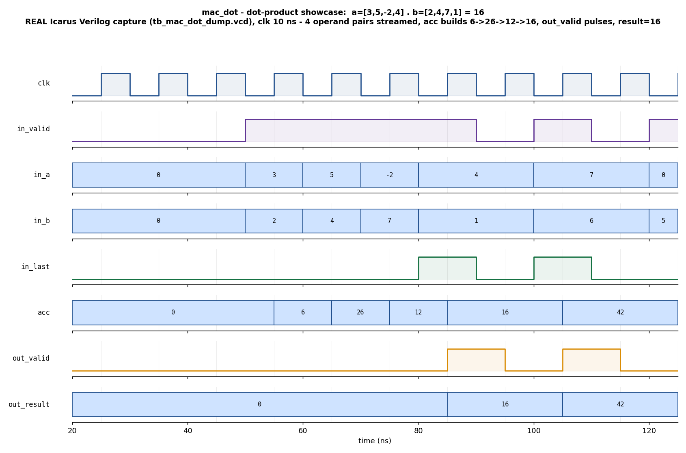

# Day 13 — UVM Verification of a GPU Tensor-Core-Style Dot-Product (MAC) Engine

## Overview

`mac_dot` is the fundamental reduction primitive at the heart of every GPU GEMM
/ tensor-core lane: a streaming **signed multiply-accumulate (MAC)** engine that
consumes a stream of operand pairs `(a, b)`, multiplies and accumulates them, and
emits the completed **dot product** whenever the element flagged with `in_last`
terminates the current vector. The accumulator then restarts cleanly, so an
unbounded stream of variable-length dot products can be issued back to back with
**no bubble** between them — exactly the throughput behaviour a systolic
matrix-multiply lane needs.

```
result_k = Σ (a_i * b_i)   over i = 0 .. L_k-1     (signed, 2's-complement)
```

This day verifies that engine with a complete **UVM** environment — driver,
input/output monitors, golden reference-model scoreboard, functional coverage,
virtual sequencer + virtual sequences — plus a portable module-based
self-checking testbench that runs on open-source Icarus Verilog and captures the
committed waveform.

## Verification goal

Prove that for **every** vector streamed into the engine, the emitted result
equals the independently computed signed dot product, that results appear **in
order**, exactly **one per `in_last`**, and that the handshake / result bus obey
their timing contract (single-cycle `out_valid` pulse, no `X` on the result,
result only ever follows an `in_valid & in_last`). Coverage confirms the vector
length ranges, operand-sign combinations, and zero-operand cases were all
exercised.

## Features / coverage list

- **Golden signed dot-product reference model** driving the scoreboard, with
  `ACC_W`-width 2's-complement wraparound that matches the DUT bit-for-bit.
- **Input monitor** that reconstructs each dot-product *vector* from the operand
  stream (accumulating `(a,b)` pairs until `in_last`) and publishes it.
- **Output monitor** that captures every completed result.
- **In-order scoreboard**: golden result per reconstructed vector is queued and
  compared against each observed result; flags extra/missing results too.
- Directed **showcase**, directed **corners** (length-1, all-zero, all-negative,
  most-negative-magnitude), and **constrained-random** variable-length regression.
- **Virtual sequencer + virtual sequences** (`smoke`, `regress`).
- **Functional coverage**: vector length bins × operand-sign cross × zero-operand.
- **SVA** assertions on the result contract (pulse, causality, no-X).
- **Timeout** watchdog and a captured **VCD** waveform.

## DUT parameters

| Parameter | Default | Meaning |
|-----------|---------|---------|
| `A_W`   | 8  | Signed operand width (bits) for `in_a` / `in_b` |
| `ACC_W` | 32 | Signed accumulator / result width (bits) |

## DUT ports

| Port | Dir | Width | Description |
|------|-----|-------|-------------|
| `clk`        | in  | 1       | Clock (100 MHz in the TBs) |
| `rst_n`      | in  | 1       | Active-low reset |
| `in_valid`   | in  | 1       | This cycle presents a valid `(a,b)` element |
| `in_a`       | in  | `A_W`   | First operand (signed) |
| `in_b`       | in  | `A_W`   | Second operand (signed) |
| `in_last`    | in  | 1       | `(a,b)` is the final element of the current dot product |
| `out_valid`  | out | 1       | One-cycle pulse: `out_result` is valid |
| `out_result` | out | `ACC_W` | Completed dot-product value (signed) |

The engine has no backpressure on the operand stream (it always accepts), which
keeps the reduction lane fully pipelined; `out_valid` pulses exactly one cycle
after the `in_last` element is accepted.

## Testbench architecture

```
                         +-------------------------------------------------+
                         |                    mac_env                      |
                         |                                                 |
  mac_smoke_vseq   +-----+--> mac_vseqr                                    |
  mac_regress_vseq |     |        |  (virtual sequences target agt.sqr)     |
                   |     |        v                                        |
                   |     |   +---------+   seq_item   +------------+        |
                   |     |   | mac_    |------------->| mac_driver |---+    |
                   |     |   | sequencer|             +------------+   |    |
                   |     |   +---------+                               |    |
                   |     |                                             v    |
                   |     |                                      +===========+====+
                   |     |   +----------------+   in stream     |  mac_dot_if     |
                   |     |   | mac_in_monitor |<----------------+  (DUT pins)     |
                   |     |   +----------------+                 +====+============+
                   |     |         | vector ap                       |  DUT
                   |     |         |                                  v
                   |     |         |                          +--------------+
                   |     |   +----------------+  result ap    |   mac_dot    |
                   |     |   | mac_out_monitor|<--------------|   (RTL)      |
                   |     |   +----------------+               +--------------+
                   |     |         |  ^                              |  out stream
                   |     |         v  | vector ap                    |
                   |     |   +-----------------+   +--------------+   |
                   |     +-->| mac_scoreboard  |<--| golden dot   |<--+
                   |         | (in-order cmp)  |   | product ref  |
                   |         +-----------------+   +--------------+
                   |         +-----------------+
                   +-------->| mac_coverage    |  (subscribes to vector ap)
                             +-----------------+
```

## Simulation timing



*Directed showcase captured from a **real Icarus Verilog run**
(`tb_mac_dot_dump.vcd`, produced by `make icarus_dump`) — this is a genuine
simulator trace, **not** a hand-drawn diagram. The window shows the dot product
`a=[3,5,-2,4] · b=[2,4,7,1] = 6 + 20 − 14 + 4 = 16`: `in_valid` is high for four
consecutive clocks while the operand pairs stream in on `in_a`/`in_b`, the
internal accumulator `acc` builds up `6 → 26 → 12 → 16`, `in_last` marks the
fourth element, and one clock later `out_valid` pulses for exactly one cycle with
`out_result = 16`. The accumulator then restarts cleanly and the next back-to-back
vector (`a=[7]·b=[6]=42`) begins immediately, demonstrating zero-bubble streaming.*

## How the checking works (scoreboard / reference model)

The **input monitor** watches the operand stream and rebuilds each dot-product
vector: it pushes every `(in_a, in_b)` seen while `in_valid` is high, and when
`in_last` is seen it publishes the finished vector on its analysis port. The
**scoreboard** subscribes to that port and, for each vector, runs the **golden
reference model** — a plain signed accumulation `Σ a_i·b_i` performed in
`ACC_W`-bit 2's-complement arithmetic, identical in width and wraparound to the
RTL — and pushes the expected value into an in-order queue. The **output monitor**
publishes every observed `out_result`; the scoreboard pops the head of the
expected queue and compares. A mismatch, an unexpected result (empty queue), or a
vector that never produced a result all raise a `uvm_error`. `check_phase` prints
`RESULT: *** PASS ***` only when every result matched and none were left pending.

The portable Icarus TB (`tb_mac_dot_dump.sv`) uses the **same golden model**
inline and prints the same `RESULT:` string, so both flows are self-checking
against an independent reference.

## Functional-coverage intent

`mac_coverage` samples each reconstructed vector and covers:

- **`LEN`** — vector length bins: `1`, `2–4`, `5–16`, `17–32`.
- **`NEG_A` / `NEG_B`** — whether the vector contained any negative `a` / `b`.
- **`ZERO`** — whether any operand in the vector was zero.
- **`SIGNS`** — cross of `NEG_A × NEG_B` (all-positive, one-signed, mixed-sign
  vectors) to make sure signed products of every polarity were accumulated.

## What the testbench checks

1. **Value** — every emitted result equals the golden signed dot product.
2. **Ordering** — results appear one-per-vector, in issue order (queue compare).
3. **Accounting** — no extra results and no vectors left without a result.
4. **Result-bus contract (SVA)** — `out_valid` is a strict one-cycle pulse, only
   ever follows an `in_valid & in_last` a cycle earlier, and `out_result` is
   never `X` while valid.
5. **Corners** — length-1, all-zero (result 0), all-negative operands (positive
   products), and most-negative-magnitude stress (`−128·−128`).
6. **Randomization** — constrained-random variable-length vectors with signed
   operands, including runs that produce negative accumulated results.

## Run instructions

Portable, open-source (Icarus Verilog) — runs the self-checking TB and regenerates
the committed waveform:

```bash
make icarus_dump      # compile + run, prints RESULT: *** PASS ***
make waveform         # re-render docs/mac_dot_waveform.png from the fresh VCD
```

Full UVM environment on a UVM-capable simulator:

```bash
make vcs       UVM_TESTNAME=mac_smoke_test
make questa    UVM_TESTNAME=mac_regress_test
make verilator UVM_TESTNAME=mac_smoke_test
```

### Verification status

The portable module-based testbench was **run on Icarus Verilog** (155 checks,
0 mismatches, `RESULT: *** PASS ***`) and the waveform above is a real capture
from that run. The full UVM environment is provided for VCS / Questa / Verilator;
those simulators are not installed in this environment, so the UVM flow was not
executed here.
