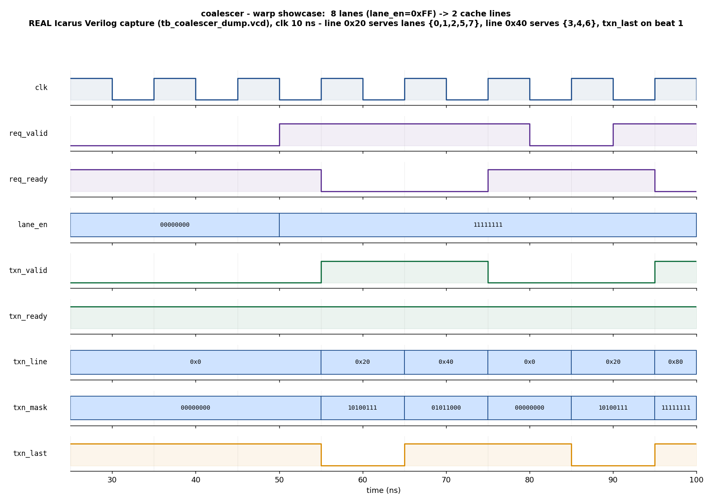

# Day 14 — GPU Memory-Coalescing Unit Verification

A UVM verification environment (with a portable Icarus companion testbench) for a
**GPU memory-coalescing unit** — the memory-subsystem block that turns a warp of
per-lane byte addresses into the minimum set of cache-line transactions. This is
the block behind the "coalesced vs. uncoalesced access" and "memory efficiency"
numbers every GPU programmer chases.

## Overview

When a SIMT instruction executes, every active lane of a warp issues its own
memory address. The memory system does **not** fire one request per lane; a
*coalescer* groups the addresses that fall in the same cache line into a single
line transaction. The number of transactions a warp generates is the classic
efficiency metric:

- 8 lanes all hitting one line → **1** transaction (fully coalesced, best case)
- 8 lanes hitting 8 distinct lines → **8** transactions (fully uncoalesced)

The DUT ([`coalescer.sv`](coalescer.sv)) accepts one warp at a time — `NLANES`
byte addresses plus an active mask — and streams out, one per cycle, the unique
cache lines touched by the active lanes, each with a per-line lane mask and a
`txn_last` marker on the final line. Lines are emitted in **first-seen lane-index
order**, both handshakes support full back-pressure, and an all-disabled warp is
consumed with zero transactions.

```
line id of lane i = lane_addr[i][ADDR_W-1 : OFF_W]      (LINE_BYTES = 2**OFF_W)
```

## Verification goal

Prove that, for **any** warp (any address pattern, any active mask, under
arbitrary line-stream back-pressure), the coalescer emits **exactly** the set of
cache-line transactions an independent golden model predicts:

- the correct **number** of transactions (the coalescing/efficiency contract),
- the correct **line id** per transaction, in first-seen lane order,
- the correct **lane mask** per transaction (every sharing lane, and only those),
- `txn_last` on the final transaction and only there,
- lossless, disjoint coverage: every active lane served exactly once, no lane
  served twice, no spurious transactions, none dropped.

## Features / coverage list

- Parameterized coalescer (`NLANES`, `ADDR_W`, `OFF_W` = cache-line offset bits)
- Golden coalescing reference model (`coal_ref::expand`) reused by both the
  scoreboard and the coverage model
- Full UVM env: **source agent** (warp-request driver/monitor/sequencer) +
  **sink agent** (line-stream back-pressure driver + transaction monitor)
- Scoreboard that expands each request through the golden model and matches the
  observed line stream **in order** (line / mask / last)
- Directed showcase, directed corners, and constrained-random layered sequences
- Virtual sequencer + smoke / regress **virtual sequences** running request and
  back-pressure sequences concurrently
- Functional coverage: active-lane count × number-of-lines cross, plus a
  memory-efficiency coverpoint (best / mid / worst)
- SVA assertions on the streaming contract (see below)
- Portable Icarus companion TB with the same golden model, random back-pressure,
  a timeout, and a VCD dump for the captured waveform

## DUT parameters

| Parameter | Default | Meaning |
|-----------|---------|---------|
| `NLANES`  | 8   | Warp width (lanes / addresses per request) |
| `ADDR_W`  | 32  | Byte-address width |
| `OFF_W`   | 7   | Cache-line offset bits → `LINE_BYTES = 128`; line id width `LINE_W = ADDR_W-OFF_W = 25` |

## DUT ports

| Port | Dir | Width | Description |
|------|-----|-------|-------------|
| `clk`       | in  | 1 | Clock |
| `rst_n`     | in  | 1 | Active-low async reset |
| `req_valid` | in  | 1 | Warp request valid |
| `req_ready` | out | 1 | Coalescer accepts a warp (high only when idle) |
| `lane_addr` | in  | `NLANES*ADDR_W` | Flattened per-lane byte addresses |
| `lane_en`   | in  | `NLANES` | Per-lane active mask (predicated-off lanes ignored) |
| `txn_valid` | out | 1 | Coalesced line transaction valid |
| `txn_ready` | in  | 1 | Downstream accepts the line transaction |
| `txn_line`  | out | `LINE_W` | Cache-line id (`addr >> OFF_W`) |
| `txn_mask`  | out | `NLANES` | Lanes served by this line |
| `txn_last`  | out | 1 | Final line transaction of this warp |

## Testbench architecture

```
            +--------------------------------------------------------------+
            |                         coal_env                             |
            |                                                              |
  req seq   |  +-------------+      +----------------+                     |
 ---------->|  | coal_agent  |----->| coal_req_mon   |---ap(req)---+       |
            |  | (source)    |      +----------------+             |       |
            |  |  driver     |                                     v       |
            |  |  sequencer  |                             +---------------+|
            |  +------+------+                             | coal_score-   ||
            |         | req_valid/ready, lane_addr, lane_en| board         ||
            |         v            (virtual coalescer_if)  |  golden model ||
            |   +===========================================+  exp FIFO    ||
            |   ||                 DUT: coalescer          ||  match line/ ||
            |   +===========================================+  mask/last   ||
            |         ^  txn_valid/ready, txn_line/mask/last |             ||
            |         |                                     +---------------+|
            |  +------+------+      +----------------+             ^       |
 sink seq   |  | coal_sink   |----->| coal_txn_mon   |---ap(txn)---+       |
 ---------->|  | _agent      |      +----------------+                     |
            |  |  ready drv  |                                             |
            |  |  monitor    |      +----------------+                     |
            |  +-------------+      | coal_coverage  |<---ap(req)          |
            |                       +----------------+                     |
            |   coal_vseqr : { req_sqr, sink_sqr }  (virtual sequences)    |
            +--------------------------------------------------------------+
```

## Simulation timing



*The directed showcase warp, captured from a **real Icarus Verilog run**
(`tb_coalescer_dump.vcd`) and rendered by [`docs/make_waveform.py`](docs/make_waveform.py)
— this is a genuine simulator capture, **not** a hand-drawn diagram. All 8 lanes
are active (`lane_en = 0xFF`). `req_valid`/`req_ready` accept the warp, then the
coalescer streams two cache-line transactions: beat 0 is line `0x20` with mask
`10100111` (lanes 0,1,2,5,7 — the 0x1000-region), beat 1 is line `0x40` with mask
`01011000` (lanes 3,4,6 — the 0x2000-region) and `txn_last` asserted. Eight lane
accesses coalesced into two line transactions — a 4× memory-efficiency win. The
window's right edge shows the next directed warp (all-same-address, line `0x80`,
mask `11111111`) beginning.*

## How the checking works

Both the UVM scoreboard and the Icarus TB drive a **golden coalescing reference
model** that independently re-derives the expected transaction list from
`(lane_addr, lane_en)`: repeatedly take the lowest still-pending active lane as
the leader, gather every pending lane sharing its line into a mask, mark the beat
`last` when it drains the final pending lanes, and record `(line, mask, last)`.

- **UVM scoreboard** — each accepted warp seen by the request monitor is expanded
  and its expected transactions pushed to a FIFO. Each transaction seen by the
  line monitor is popped and compared field-by-field. `check_phase` flags any
  expected transaction never seen; unexpected transactions are errors too.
- **Icarus TB** — computes the golden lists per warp and compares the emitted
  stream beat-by-beat, including the zero-transaction case for all-disabled warps.

## Functional-coverage intent

`coal_coverage` (a `uvm_subscriber` on the request stream) samples per warp:

- **active lanes** — `$countones(lane_en)`: none / low / mid / full
- **number of lines** — 1 / few / many / scatter (fully uncoalesced)
- **efficiency** — `100*active/lines`: worst / mid / best
- **cross** active-lanes × number-of-lines — makes sure the regression exercises
  the coalescing regime from fully-coalesced to fully-scattered.

## SVA assertions

Enabled with `+define+COAL_SVA` (bound inside the DUT):

- **`a_mask_nonzero`** — a live transaction always serves ≥1 lane
- **`a_valid_held`** — `txn_valid` held with stable `line`/`mask`/`last` until
  `txn_ready` (the streaming/back-pressure contract)
- **`a_disjoint`** — no lane is served by two transactions of the same warp
- **`a_no_x`** — outputs are known (no X/Z) whenever a transaction is presented
- **`a_last_drains`** — `txn_last` asserts exactly when the beat drains the last
  pending lanes

## Run instructions

Open-source flow (Icarus Verilog — runs everywhere, captures the waveform):

```bash
make icarus_dump      # compile + run the self-checking TB -> "RESULT: *** PASS ***"
make waveform         # re-render docs/coalescer_waveform.png from the VCD
```

UVM flow (needs a UVM-capable simulator):

```bash
make vcs       UVM_TESTNAME=coal_smoke_test
make questa    UVM_TESTNAME=coal_regress_test
make verilator UVM_TESTNAME=coal_smoke_test
```

## What the testbench checks

- Correct **coalescing**: number of line transactions equals the number of unique
  cache lines among active lanes (the efficiency contract)
- Correct **line id** and **lane mask** per transaction, in first-seen lane order
- `txn_last` on the final transaction and only there
- **Lossless / disjoint**: every active lane served exactly once; no lane twice;
  no spurious or dropped transactions
- **All-disabled warp** produces zero transactions and is still consumed
- Correct behaviour under **arbitrary line-stream back-pressure**
- Coverage of the full coalesced-to-scattered regime and the streaming SVA
  contract

## Notes

- The design was simulated with **Icarus Verilog** via `make icarus_dump`; the
  self-checking companion TB reports `RESULT: *** PASS ***` (327 checks, 0
  errors) and produces the VCD from which the committed waveform is rendered.
- The full UVM environment targets VCS / Questa / Verilator (≥5, `--uvm`), which
  provide the UVM class library that Icarus does not.

## Files

| File | Role |
|------|------|
| [`coalescer.sv`](coalescer.sv) | Parameterized coalescer DUT + SVA |
| [`coalescer_if.sv`](coalescer_if.sv) | Interface with source/sink/monitor clocking blocks |
| [`coalescer_pkg.sv`](coalescer_pkg.sv) | UVM env: items, agents, golden model, scoreboard, coverage, sequences, virtual sequences, tests |
| [`tb_top.sv`](tb_top.sv) | UVM top (clock/reset, DUT, `run_test`) |
| [`tb_coalescer_dump.sv`](tb_coalescer_dump.sv) | Portable Icarus self-checking TB (VCD dump) |
| [`Makefile`](Makefile) | Icarus / VCS / Questa / Verilator run targets |
| [`docs/make_waveform.py`](docs/make_waveform.py) | Renders the waveform PNG from the captured VCD |
| [`docs/coalescer_waveform.png`](docs/coalescer_waveform.png) | Captured showcase waveform |
