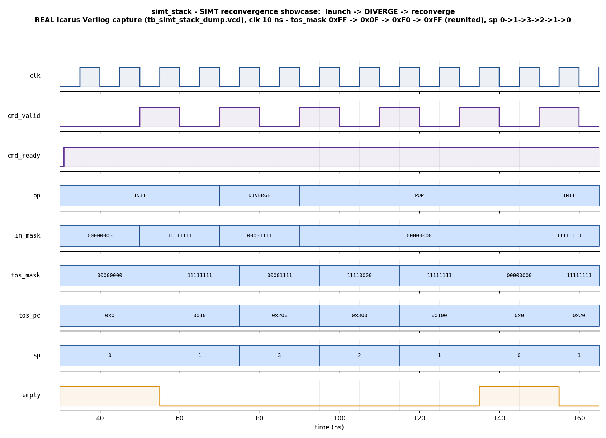

# Day 15 — UVM GPU SIMT Reconvergence (Divergence) Stack Verification

Verification of `simt_stack` — the hardware **SIMT reconvergence stack** that a
GPU uses to manage a warp's active mask across data-dependent branches. This is
the control-flow counterpart to the earlier GPU days (tensor-core MAC in Day 13,
memory coalescing in Day 14): instead of grouping memory accesses, this block
tracks *which lanes execute next and from what PC* as a warp **diverges** and
later **reconverges**.

---

## Overview

A GPU runs a **warp** of `NLANES` threads in lock-step (SIMT — Single
Instruction, Multiple Threads). A data-dependent branch may be *taken* by some
lanes and *not-taken* by others; the warp cannot run both sides at once, so the
hardware executes one side, then the other, and **reconverges** the whole warp
at the branch's immediate post-dominator (the *reconvergence PC*). NVIDIA-class
GPUs implement this with a hardware stack of `{active-mask, PC}` entries — the
**SIMT stack**. The top-of-stack (TOS) entry names the lanes that execute next
and the PC they run from.

`simt_stack` is that stack. It accepts one control command per handshake and
exposes the current TOS mask/PC and stack depth combinationally:

| Command      | Effect |
|--------------|--------|
| `OP_INIT`    | Launch a warp — clear the stack and push `{mask = in_mask, pc = fpc}`. An all-off mask (`in_mask == 0`) leaves the stack retired (empty). |
| `OP_DIVERGE` | A branch at the TOS. Split the current active mask `cur` into `t = in_mask & cur` (lanes that take the branch) and `nt = cur & ~in_mask` (fall-through lanes). |
| `OP_POP`     | A path reached its reconvergence point — pop the TOS, exposing the next entry (the other divergent path, then the reunited warp). Popping the last entry retires the warp. |

**Divergence cases handled by `OP_DIVERGE`:**

* **True divergence** (`t != 0 && nt != 0`): the current entry becomes the
  **reconvergence entry** `{cur, rpc}`; the **fall-through** path `{nt, fpc}` is
  pushed; the **taken** path `{t, tpc}` is pushed as the new TOS. Depth grows by
  2. Threads then run *taken → fall-through → (POP) → reunited warp @ `rpc`*.
* **Uniform-taken** (`nt == 0`): the whole active mask takes the branch — just
  retarget the TOS PC to `tpc`, depth unchanged.
* **Uniform-fall-through** (`t == 0`): nobody takes it — retarget the TOS PC to
  `fpc`, depth unchanged.

`full`/`cmd_ready` form a defensive overflow guard: a *growing* divergence that
would exceed `DEPTH` is refused (`cmd_ready` low) and leaves the stack unchanged.
(With `NLANES = 8` the reachable nesting depth is bounded far below `DEPTH = 32`,
so `full` is a safety net rather than a hot path.)

---

## Verification goal

Prove that, command-by-command, the DUT's exposed state
`{tos_mask, tos_pc, sp, empty, full}` **exactly matches an independent golden
shadow-stack reference model** for every sequence of `INIT`/`DIVERGE`/`POP`
commands — including the full divergence→reconvergence life-cycle, nested
divergence, uniform branches, empty-warp launch, and pop-past-empty — under both
directed and constrained-random stimulus.

---

## Features / coverage list

* Parameterized warp width (`NLANES`), PC width (`PC_W`), and stack depth (`DEPTH`).
* Golden **shadow-stack reference model** reused by both the scoreboard (as a
  live predictor) and the coverage collector.
* **Predictor scoreboard**: applies each observed command to its own stack and
  checks the resulting TOS mask/PC, depth, `empty`, and `full`.
* Directed **launch → diverge → reconverge → retire** showcase.
* Directed **corners**: uniform-taken branch, uniform-fall-through branch,
  nested divergence (diverge a taken subset again), single-lane warp,
  empty-warp launch, pop-past-empty (no-op).
* **Constrained-random** legal-program regression (INIT/DIVERGE/POP with random
  masks and PCs, generated so the program never overflows the stack).
* **Functional coverage**: op × divergence-outcome × stack-depth cross.
* **SVA** (UVM sims, `+define+SIMT_SVA`): depth bound, `empty ⇔ sp==0`, nonzero
  TOS mask, diverge-grows-by-2, pop-shrinks-by-1, no-X on live outputs.
* Global **timeout** watchdog and VCD dump.

---

## DUT parameters

| Parameter | Default | Meaning |
|-----------|---------|---------|
| `NLANES`  | 8       | Warp width (threads per warp / active-mask bits) |
| `PC_W`    | 16      | Program-counter width |
| `DEPTH`   | 32      | Maximum stack entries (nesting depth) |

## DUT ports

| Port | Dir | Width | Description |
|------|-----|-------|-------------|
| `clk`       | in  | 1              | Clock |
| `rst_n`     | in  | 1              | Active-low synchronous-ish reset (async assert) |
| `cmd_valid` | in  | 1              | Command valid |
| `cmd_ready` | out | 1              | Command accepted (low only on a would-overflow diverge) |
| `op`        | in  | 2              | `OP_INIT`=0 / `OP_DIVERGE`=1 / `OP_POP`=2 |
| `in_mask`   | in  | `NLANES`       | INIT: warp mask; DIVERGE: taken-lane set |
| `rpc`       | in  | `PC_W`         | DIVERGE: reconvergence PC |
| `tpc`       | in  | `PC_W`         | DIVERGE: taken-path PC |
| `fpc`       | in  | `PC_W`         | DIVERGE: fall-through PC / INIT: entry PC |
| `tos_mask`  | out | `NLANES`       | Active mask of the top-of-stack entry (0 if empty) |
| `tos_pc`    | out | `PC_W`         | PC of the top-of-stack entry |
| `sp`        | out | `clog2(DEPTH)+1`| Current stack depth (# valid entries) |
| `empty`     | out | 1              | `sp == 0` (warp retired) |
| `full`      | out | 1              | `sp == DEPTH` (cannot diverge further) |

---

## Testbench architecture

```
              +--------------------------------------------------------------+
              |                        simt_env                              |
              |                                                              |
  vseq  --->  |  simt_vseqr ---> simt_agent.sqr                             |
 (smoke/      |                       |                                      |
  regress)    |                       v                                      |
              |                 simt_driver  --cmd(op,mask,pcs)-->  +------+  |
              |                                                     | DUT  |  |
              |                 simt_monitor <--tos/sp/empty/full-- | simt |  |
              |                       |                             |_stack|  |
              |          {cmd + resulting status} (analysis)        +------+  |
              |               |                    |                          |
              |               v                    v                          |
              |        simt_scoreboard       simt_coverage                    |
              |     (golden shadow stack      (op x kind x depth)             |
              |      predictor: compare                                       |
              |      tos_mask/tos_pc/sp/                                      |
              |      empty/full each cmd)                                     |
              +--------------------------------------------------------------+

  Golden model (simt_model): independent LIFO of {mask, pc} entries applying the
  exact INIT / DIVERGE / POP semantics; drives both the scoreboard and coverage.
```

The monitor captures each accepted command and the TOS status it produces one
cycle later (state is registered), pairing them into a single analysis
transaction. A one-cycle *pending* record lets it capture back-to-back commands
without gaps.

---

## Simulation timing



*Directed showcase captured from a **real Icarus Verilog run**
(`tb_simt_stack_dump.vcd`) — this is a genuine simulator trace, not a
hand-drawn diagram.* An 8-lane warp is launched (`INIT`, `tos_mask = 0xFF`,
`sp 0→1`), then a branch **diverges** it (`DIVERGE`, taken lanes `{0..3}`):
`sp` jumps `1→3` and the TOS becomes the taken path `tos_mask = 0x0F @ 0x200`.
The first `POP` exposes the fall-through path `0xF0 @ 0x300`; the second `POP`
exposes the **reconverged** full warp `0xFF @ 0x100` (the reconvergence PC); the
third `POP` retires the warp (`sp → 0`, `empty` asserts). The active mask thus
splits `0xFF → 0x0F → 0xF0` and **reunites** to `0xFF`, the essence of SIMT
divergence/reconvergence.

---

## How the checking works

The **golden reference** is `simt_model` — an independent last-in/first-out
stack of `{mask, pc}` entries that re-implements the `INIT`/`DIVERGE`/`POP`
semantics from scratch. It is deliberately *not* derived from the RTL.

* The **scoreboard** is a live **predictor**: on every observed command it
  applies that command to its own shadow stack, then compares the DUT's reported
  `{tos_mask, tos_pc, sp, empty, full}` against the model's prediction. Any
  divergence (wrong mask, wrong PC, wrong depth, wrong empty/full) is an error.
* The portable Icarus TB (`tb_simt_stack_dump.sv`) carries the same golden logic
  as a task and checks after every command, printing `RESULT: *** PASS ***`
  only if `errors == 0`.
* In UVM sims, the DUT's own **SVA** independently guard the structural
  invariants (depth bound, grow-by-2, shrink-by-1, `empty ⇔ sp==0`, no-X).

## Functional-coverage intent

`simt_coverage` samples every observed command and crosses:

* **op** — `INIT` / `DIVERGE` / `POP`,
* **divergence outcome** — no-op, true grow, uniform-taken, uniform-fall-through,
* **stack depth reached** — empty / one / few (2–5) / deep (6+),
* **op × depth** cross — e.g. did we `DIVERGE` while already nested, and `POP`
  from every depth bucket?

The goal is to confirm the regression exercises real nesting and both uniform
branch flavours, not just shallow one-level divergence.

---

## What the testbench checks

1. `INIT` launches exactly one entry (or none for an all-off mask) with the
   right mask and PC.
2. **True divergence** grows the stack by exactly 2 and makes the taken subset
   the new TOS at `tpc`; the fall-through subset and reconvergence entry sit
   below it at `fpc`/`rpc`.
3. **Uniform** branches retarget the TOS PC without changing depth.
4. `POP` exposes the divergent paths in order and finally the **reconverged**
   warp at `rpc`, then retires it.
5. `sp`, `empty`, and `full` always match the golden depth.
6. Pop-past-empty and empty-warp launch are safe no-ops.
7. Live outputs are never X.

---

## Run instructions

Default (open-source, **actually runs** — Icarus Verilog):

```bash
make icarus_dump      # compile + run the self-checking TB (prints RESULT: *** PASS ***)
make waveform         # regenerate docs/simt_stack_waveform.png from the fresh VCD
```

UVM-capable simulators (full agent/scoreboard/coverage/virtual-sequences + SVA):

```bash
make vcs       UVM_TESTNAME=simt_smoke_test
make questa    UVM_TESTNAME=simt_regress_test
make verilator UVM_TESTNAME=simt_smoke_test
```

**Toolchain note:** the UVM environment (`simt_stack_pkg.sv` + `tb_top.sv`) needs
a UVM-capable simulator. Icarus Verilog does not implement the UVM class library,
so the portable `tb_simt_stack_dump.sv` provides an equivalent module-based
self-checking flow (same golden model, directed + random stimulus) that runs
anywhere. The committed waveform and the `RESULT: *** PASS ***` result on this
machine come from that genuine Icarus run.
