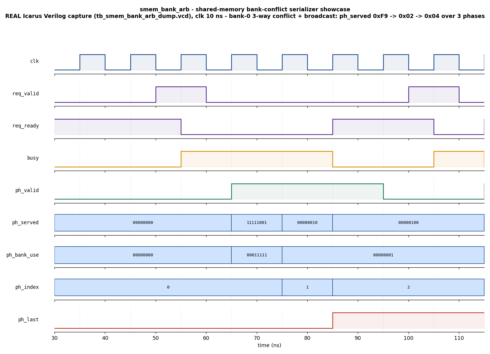

# Day 16 — UVM GPU Shared-Memory Bank-Conflict Serializer Verification

Verification of `smem_bank_arb` — the hardware block that turns a warp-wide
**shared-memory** access into a **serialized stream of bank-access phases**,
resolving *bank conflicts* and applying the *broadcast* optimization. This is
the on-chip-memory counterpart to the earlier GPU days: Day 13 verified the
tensor-core MAC datapath, Day 14 the **global-memory** cache-line coalescer, and
Day 15 the SIMT reconvergence stack. This day tackles **shared-memory banks** —
a different memory system with its own, distinct conflict model (per-bank
serialization + same-address broadcast), not cache lines.

---

## Overview

A GPU streaming multiprocessor runs a **warp** of `NLANES` threads in lock-step.
Their on-chip **shared memory** is split into `NBANKS` equal-width banks; a word
address maps to a bank by `bank = addr % NBANKS`. Each bank can service exactly
**one word address per cycle**, so a single warp-wide shared-memory instruction
completes in as many cycles (**phases**) as the worst-case number of *distinct
addresses* mapped to any one bank:

| Lane pattern                       | Outcome |
|------------------------------------|---------|
| Different banks                    | Served **in parallel**, same phase — no conflict. |
| Same bank, **same** address        | **Broadcast**: all those lanes are satisfied by one access in one phase (NVIDIA's broadcast/multicast optimization). |
| Same bank, **different** address   | **Bank conflict**: the accesses **serialize** — one distinct address per phase. |

The number of phases is the **conflict degree**: `1` = conflict-free, up to
`NLANES` = a fully serialized `NLANES`-way conflict.

`smem_bank_arb` is that serializer. It accepts one warp request per handshake
and drains it into a phase stream:

* **IDLE** — `req_ready = 1`. On `req_valid & req_ready` the request
  `{req_mask, req_addr[]}` is latched.
* **RUN** — one phase is emitted per cycle (`ph_valid = 1`). Each phase asserts
  `ph_served` (the lanes satisfied this cycle), `ph_bank_use` (the banks that
  did an access), and `ph_index` (0-based phase number). The final phase asserts
  `ph_last`, after which the block returns to IDLE.

Per phase, per bank, the **winner is the lowest-index still-pending lane** in
that bank; every pending lane in that bank sharing the winner's address is
served (broadcast). This drains one distinct address per bank per phase in
first-seen lane order. An all-inactive request (`req_mask == 0`) emits exactly
one **empty** phase (`ph_served = 0`, `ph_last = 1`), so *every* accepted request
produces at least one `ph_last` — a uniform, easy-to-check streaming contract.

---

## Verification goal

Prove that, request-by-request, the DUT's serialized phase stream
`{ph_served, ph_bank_use, ph_index, ph_last}` and its **total phase count**
**exactly match an independent golden bank-conflict reference model** for every
warp request — across conflict-free, broadcast, partially-masked, single-lane,
worst-case fully-serialized, and all-inactive patterns — under both directed and
constrained-random stimulus.

---

## Features / coverage

- **Bank mapping** `bank = addr % NBANKS`, parameterized `NLANES`/`NBANKS`/`ADDR_W`.
- **Broadcast** — same-bank/same-address lanes coalesced into one access.
- **Bank-conflict serialization** — same-bank/different-address lanes drained one
  distinct address per phase, in first-seen lane order.
- **Parallel banks** — independent banks all serviced in the same phase.
- **Golden reference model** shared by the scoreboard and the coverage collector
  (single source of truth for the expected phase stream).
- **Directed showcase**: 3-way bank-0 conflict *with* a broadcast pair *and* four
  parallel banks in one request.
- **Directed corners**: conflict-free 8-way, full 8-lane broadcast, worst-case
  8-way serialized conflict, partial active mask, single active lane, all-inactive
  request (empty phase).
- **Constrained-random regression**: random masks and bank-aliasing addresses.
- **Functional coverage**: conflict-degree × active-lanes cross, plus a broadcast
  coverpoint.
- **SVA** (commercial-simulator flow): ready⇔idle, `ph_last`⇒`ph_valid`,
  valid⇒busy, progress, contiguous stream, monotonic `ph_index`, no-X.
- **Timeout** watchdog and **VCD** dump in both testbenches.

---

## DUT parameters & ports

### Parameters

| Parameter | Default | Meaning |
|-----------|---------|---------|
| `NLANES`  | 8       | Warp width (threads / lanes per request). |
| `NBANKS`  | 8       | Shared-memory banks (expected to be a power of two). |
| `ADDR_W`  | 16      | Per-lane word-address width. |

### Ports

| Port          | Dir | Width               | Description |
|---------------|-----|---------------------|-------------|
| `clk`         | in  | 1                   | Clock. |
| `rst_n`       | in  | 1                   | Active-low synchronous-release reset. |
| `req_valid`   | in  | 1                   | Warp request valid. |
| `req_ready`   | out | 1                   | Block ready (asserted when not busy). |
| `req_mask`    | in  | `NLANES`            | Active-lane mask for the request. |
| `req_addr`    | in  | `NLANES*ADDR_W`     | Packed per-lane word addresses. |
| `ph_valid`    | out | 1                   | A phase beat is present this cycle. |
| `ph_served`   | out | `NLANES`            | Lanes satisfied this phase. |
| `ph_bank_use` | out | `NBANKS`            | Banks that performed an access this phase. |
| `ph_last`     | out | 1                   | Final phase of the current request. |
| `ph_index`    | out | `$clog2(NLANES+1)`  | 0-based phase number (conflict-degree progress). |
| `busy`        | out | 1                   | A request is in flight. |

---

## Testbench architecture

```
            +-------------------------------------------------------------+
            |                        tb_top (UVM)                         |
            |                                                             |
            |   +-----------------+        smem_bank_arb_if               |
            |   |  smem_agent     |   (req handshake + phase stream)      |
            |   |                 |                                       |
 sequences  |   |  sequencer      |          +-------------------------+  |
 --------->  |   |     |           |  drive   |      DUT                |  |
 showcase   |   |  driver  -------)---------->| smem_bank_arb           |  |
 corners    |   |                 |  req      |  (bank-conflict          |  |
 random     |   |  monitor <------)-----------|   serializer)           |  |
            |   +--------|--------+  observe  +-------------------------+  |
            |            | analysis (one obs item per request:            |
            |            |          request + its phase-beat list)        |
            |     +------+--------------------+                           |
            |     |                           |                           |
            |  +--v-------------+     +--------v---------+                 |
            |  | smem_scoreboard|     |  smem_coverage   |                 |
            |  | golden model,  |     |  golden model,   |                 |
            |  | phase stream   |     |  degree x active |                 |
            |  | beat-for-beat  |     |  x broadcast     |                 |
            |  +----------------+     +------------------+                 |
            |                                                             |
            |   smem_vseqr (virtual sequencer) -> smoke / regress vseqs   |
            +-------------------------------------------------------------+
```

The monitor reassembles one **observed transaction per request** — the captured
`{req_mask, req_addr}` plus the ordered list of `{ph_served, ph_bank_use}` beats
up to and including `ph_last`. The scoreboard recomputes the golden phase stream
from the request and checks the two lists beat-for-beat (and their lengths).

---

## Simulation timing



*Directed showcase captured from a **real Icarus Verilog run** (`make waveform`
parses `tb_smem_bank_arb_dump.vcd`). An 8-lane warp is issued whose addresses
give **bank 0** three distinct addresses `{0x00, 0x08, 0x10}` — a 3-way conflict
— with lanes 0 & 3 sharing `0x00` (**broadcast**) and lanes 4–7 hitting banks
1–4 (**parallel**). The single `req_valid` pulse raises `busy` and the request
drains into a contiguous 3-beat phase stream: `ph_served` = `0xF9 → 0x02 → 0x04`,
`ph_bank_use` = `0x1F → 0x01 → 0x01`, `ph_index` = `0 → 1 → 2`, with `ph_last`
on the final beat. Phase 0 serves the broadcast pair and all four parallel banks;
phases 1 and 2 drain the two remaining conflicting bank-0 accesses one per cycle.
This is a genuine simulator capture, **not** a hand-drawn diagram.*

---

## How the checking works

The **golden reference model** (`smem_model`) is an independent re-implementation
of the serialization algorithm. For a request `{mask, addr[]}` it produces the
expected list of phases by repeatedly: (1) selecting, per bank, the lowest-index
pending lane's address as that bank's winner; (2) serving every pending lane in
the bank whose address equals the winner (broadcast); (3) removing the served
lanes; and looping until none remain (an all-inactive request yields one empty
phase). Because the DUT uses the same lowest-index-wins rule, the two must agree
exactly.

The **scoreboard** receives one observed transaction per request, recomputes the
golden phase stream, and flags a mismatch if the phase **count** differs or if
any beat's `ph_served`/`ph_bank_use` differs. It prints
`RESULT: *** PASS ***` only if every request matched.

The portable Icarus TB (`tb_smem_bank_arb_dump.sv`) uses the same golden
algorithm inline and additionally checks `ph_last` position and `ph_index`
per beat.

---

## Functional-coverage intent

- **`cp_degree`** — conflict degree (phase count): conflict-free (`1`), low
  (`2–3`), mid (`4–7`), max-way (`8`).
- **`cp_active`** — active lanes: none / one / some / full-warp.
- **`cp_bcast`** — whether a broadcast occurred in the request.
- **`x_degree_active`** — cross of degree × active-lanes, so that (for example) a
  full warp is exercised both conflict-free and fully serialized.

---

## What the testbench checks

1. **Phase count** equals the golden conflict degree for every request.
2. **`ph_served`** per phase — exactly the lanes the model serves (broadcast and
   parallel banks included).
3. **`ph_bank_use`** per phase — exactly the banks the model activates.
4. **`ph_last`** marks the final phase (and only the final phase).
5. **`ph_index`** increments `0,1,2,…` across the contiguous stream.
6. **Empty request** produces exactly one empty phase.
7. **SVA** (commercial flow): ready⇔idle, contiguous stream, monotonic index,
   progress, and no-X on the outputs.

---

## Run instructions

Open-source flow (Icarus Verilog + Python), used to produce the committed
waveform:

```bash
make icarus_dump      # compile + run the self-checking TB (prints RESULT)
make waveform         # re-render docs/smem_bank_arb_waveform.png from the VCD
```

UVM flow (needs a UVM-capable simulator):

```bash
make vcs       UVM_TESTNAME=smem_smoke_test     # Synopsys VCS
make questa    UVM_TESTNAME=smem_regress_test   # Siemens Questa
make verilator UVM_TESTNAME=smem_smoke_test     # Verilator >= 5 (--uvm)
```

> **Toolchain note.** This project was simulated with **Icarus Verilog** via the
> portable `tb_smem_bank_arb_dump.sv` companion (647 checks, 0 errors,
> `RESULT: *** PASS ***`), and the committed waveform is a **real capture** from
> that run. The full UVM environment (`smem_bank_arb_pkg.sv` + `tb_top.sv`)
> targets VCS/Questa/Verilator and was **not** executed here, as no UVM-capable
> simulator is installed in this environment.
