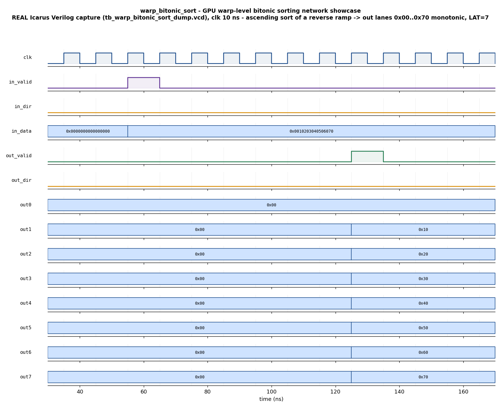

# Day 17 — GPU Warp-Level Bitonic Sorting Network Verification

A fully-pipelined **bitonic sorting network** (`warp_bitonic_sort`) that sorts a
warp of `N` key/tag records in a fixed number of clock cycles, verified with a
UVM environment (agent · driver · monitor · scoreboard · coverage · virtual
sequences · SVA) and a portable, self-checking companion testbench that runs on
open-source Icarus Verilog.

## Overview

Sorting a small vector in a *fixed, data-independent* number of steps is a core
GPU primitive. Bitonic sort is the algorithm CUDA/Thrust, `cub::BlockRadixSort`
fallbacks, and GPU top-K / selection kernels reach for, because its comparator
schedule never branches on the data — perfect for a SIMT lane array *and* for a
pipelined ASIC/FPGA datapath. The same block is what a low-latency (HFT) pipeline
drops in to keep a price ladder / top-of-book in priority order at line rate:
feed a vector of `{price, order-tag}` records, get the sorted vector back a fixed
latency later, every cycle.

The DUT is a **Batcher bitonic network** over `N = 2**L` records. Each record is
`{key, tag}` — a `KEY_W`-bit sort key in the high bits and a `TAG_W`-bit tie-break
tag in the low bits. Because the whole `RW = KEY_W+TAG_W`-bit record is compared
as one unsigned number, the sort is a **total order** (key first, tag breaks
ties) and therefore *deterministic even with duplicate keys* — the tag behaves
like an order-id / arrival stamp, i.e. price-then-tag priority.

The network runs `NSTAGE = L·(L+1)/2` compare-exchange layers
(`k = 2,4,…,N`; `j = k/2,…,1`), each **registered**, so the pipeline has a fixed
latency `LAT = NSTAGE+1` and accepts a new vector **every cycle** (zero-bubble).
For the verified configuration (`N=8`): `L=3`, `NSTAGE=6`, `LAT=7`.

## Verification goal

Prove that, for **every** accepted input vector and both directions, the vector
that emerges `LAT` cycles later is:

1. **sorted** in the requested direction (ascending → smallest record at lane 0),
2. a **permutation** of the input (no records lost, duplicated, or invented),
3. **deterministic** under duplicate keys (tag tie-break), and
4. delivered at the **fixed pipeline latency**, back-to-back, with no `X`.

An independent golden reference sorter (insertion sort over the full `RW`-bit
records) computes the expected vector; exact lane-by-lane equality proves (1)+(2)
simultaneously (an exact match to the sorted multiset *is* a sorted permutation).

## Features / coverage list

- Parameterized bitonic network (`N` a power of two, `KEY_W`, `TAG_W`); all
  outputs registered; reset-safe; lint-friendly generate-built pipeline.
- Runtime-selectable **ascending / descending** sort (`in_dir`).
- **Key + tag** records → total order → deterministic duplicate-key handling.
- Fixed-latency, **zero-bubble streaming** (one vector in and one sorted vector
  out per cycle when kept full).
- Golden reference sorter **reused by both** the scoreboard and the coverage
  collector.
- Directed **showcase** + directed **corners** + **constrained-random** regress.
- Functional coverage: direction × input-orderedness × distinct-key count ×
  min/max extremes, with crosses.
- SVA: fixed-latency contract, per-lane monotonicity (split by direction), no-`X`.
- Self-checking companion TB that captures a **real** VCD on Icarus.

## DUT — `warp_bitonic_sort`

### Parameters

| Parameter | Default | Meaning |
|-----------|---------|---------|
| `N`       | 8       | Warp width / vector length (**power of two**) |
| `KEY_W`   | 6       | Sort-key width (high bits of a record) |
| `TAG_W`   | 2       | Tie-break tag width (low bits; `0` = keys only) |

Derived: `RW = KEY_W+TAG_W` (record width), `L = log2(N)`,
`NSTAGE = L·(L+1)/2`, `LAT = NSTAGE+1`.

### Ports

| Port | Dir | Width | Description |
|------|-----|-------|-------------|
| `clk`       | in  | 1        | Clock |
| `rst_n`     | in  | 1        | Async active-low reset |
| `in_valid`  | in  | 1        | A new `N`-record vector is present this cycle |
| `in_dir`    | in  | 1        | `0` = ascending, `1` = descending |
| `in_data`   | in  | `N*RW`   | `N` records packed low-lane-first, each `{key,tag}` |
| `out_valid` | out | 1        | `LAT` cycles later: sorted vector is present |
| `out_dir`   | out | 1        | Direction that produced `out_data` (pipeline-aligned) |
| `out_data`  | out | `N*RW`   | Sorted `N`-record vector |

## Testbench architecture

```
                       +------------------------------------------------+
                       |                 bsort_env                      |
                       |                                                |
  bsort_*_seq          |   +----------------+     +------------------+  |
  (showcase/corner/    |   |   bsort_agent  |     |  bsort_scoreboard|  |
   random) on          |   |                |     |  (golden re-sort, |  |
   virtual sequencer   |   |  +----------+  |     |   lane-by-lane)   |  |
        |              |   |  |  driver  |--+--in_data-->[ DUT ]      |  |
        v              |   |  +----------+  |            warp_bitonic |  |
  +--------------+     |   |  +----------+  |               sort      |  |
  | bsort_vseqr  |-----+-->|  |sequencer |  |                 |        |  |
  +--------------+ req |   |  +----------+  |             out_data     |  |
                       |   |  +----------+  |                 |        |  |
                       |   |  | monitor  |<-+---in/out--------+        |  |
                       |   |  +----+-----+  |   (FIFO-pairs input     |  |
                       |   |       | ap     |    vector with the      |  |
                       |   +-------|--------+    sorted output)        |  |
                       |           |            +------------------+   |  |
                       |           +--------------------------------> bsort_coverage
                       |                        (dir x order x dkeys)  |  |
                       +------------------------------------------------+
```

The **monitor** pairs each accepted input vector with the sorted vector that
later emerges using a small FIFO, so the environment is **independent of the
exact pipeline latency** — no magic-number delays. Each `bsort_obs_item`
therefore carries `{in_recs, in_dir, out_recs, out_dir}`: a self-contained
transaction the scoreboard can re-sort and check on its own.

## Simulation timing



*The directed showcase, captured from a **real Icarus Verilog run** (`make
icarus_dump` → `tb_warp_bitonic_sort_dump.vcd`) and rendered by
`docs/make_waveform.py` — **not** a hand-drawn diagram. An 8-record warp is
presented for one cycle with `in_dir=0` (ascending) and `in_data =
0x0010203040506070`, i.e. a fully **reverse-sorted** ramp (lane 0 = `0x70`, the
largest, down to lane 7 = `0x00`). Exactly `LAT = 7` cycles later `out_valid`
pulses and the eight output lanes read `out0=0x00, out1=0x10, … out7=0x70` — a
clean ascending monotonic ramp. The jumbled input has been sorted in a fixed
7-cycle pipeline latency.*

## How the checking works

- **Golden reference model** (`bsort_model` / `golden()` in the Icarus TB): an
  independent insertion sort over the full `RW`-bit records, direction-aware.
  It is deliberately a *different algorithm* from the DUT's Batcher network, so
  the two agreeing is real evidence, not a copy of the same code.
- **Scoreboard**: for each observed transaction it re-sorts the captured input
  and compares the DUT's `out_data` **lane-by-lane** (plus `out_dir == in_dir`).
  An exact match to the golden sorted vector proves the output is *both* a
  permutation of the input *and* monotonic in the requested direction.
- **FIFO latency-independence**: because the monitor pairs inputs and outputs by
  order of appearance, back-to-back streaming (pipeline full) is checked the same
  way as isolated vectors — every vector pushed must come out sorted, in order.
- **Verdict**: the Icarus TB prints `RESULT: *** PASS ***` only when every check
  passed *and* the expected-output FIFO drained empty (no vector went missing).

## Functional-coverage intent

`bsort_coverage` samples every observed vector and crosses:

- **`cp_dir`** — ascending vs descending.
- **`cp_order`** — input already ascending / already descending / unordered.
- **`cp_dkeys`** — number of distinct key values: `1` (all same), `2–3`,
  `4–N-1`, `N` (all unique) — the duplicate-key axis.
- **`cp_min` / `cp_max`** — a min-key (`0`) / max-key (all-ones) record present.
- Crosses **`dir × order`** and **`dir × dkeys`** so both directions are
  exercised against already-sorted inputs and against heavy-duplicate inputs
  (the cases where a *stable/deterministic* tie-break actually matters).

## What the testbench checks

Directed **showcase** (reverse-ramp ascending sort, ascending-ramp descending
sort, already-sorted identity), directed **corners** (equal keys with distinct
tags → tie-break, all-identical records, min/max extremes, single large element,
and a **zero-bubble back-to-back stream** that fills the pipeline), and a
**constrained-random** regression of random records + random direction with a
fraction forced to a small key set to stress duplicate keys. For every vector it
checks the sorted output against the golden model and confirms fixed-latency
delivery with no lost vectors.

## Assertions (SVA)

Enabled with `+define+BSORT_SVA` on a UVM-capable simulator:

- **`a_latency`** — `in_valid |-> ##LAT out_valid` (fixed pipeline latency).
- **`a_mono_asc` / `a_mono_desc`** — per adjacent lane pair, the output is
  non-decreasing (ascending) / non-increasing (descending) while `out_valid`.
- **`a_no_x`** — `out_dir` and `out_data` are known whenever `out_valid`.

## Run instructions

```bash
# Portable, self-checking, captures the committed waveform (open-source):
make icarus_dump        # Icarus Verilog: runs tb_warp_bitonic_sort_dump.sv
make waveform           # re-render docs/warp_bitonic_sort_waveform.png from the VCD

# Full UVM environment (needs a UVM-capable simulator):
make vcs       UVM_TESTNAME=bsort_smoke_test     # Synopsys VCS
make questa    UVM_TESTNAME=bsort_regress_test   # Siemens Questa
make verilator UVM_TESTNAME=bsort_smoke_test     # Verilator >= 5 (--uvm)

make clean
```

> **Toolchain note.** The self-checking `tb_warp_bitonic_sort_dump.sv` flow was
> run on Icarus Verilog and reports `RESULT: *** PASS ***` (213 checks, 0 errors);
> the committed waveform is a genuine capture from that run. The UVM environment
> and SVA (`warp_bitonic_sort_pkg.sv` / `tb_top.sv`) target VCS/Questa/Verilator
> and are **not** exercised by the Icarus flow, which does not implement the UVM
> class library.
