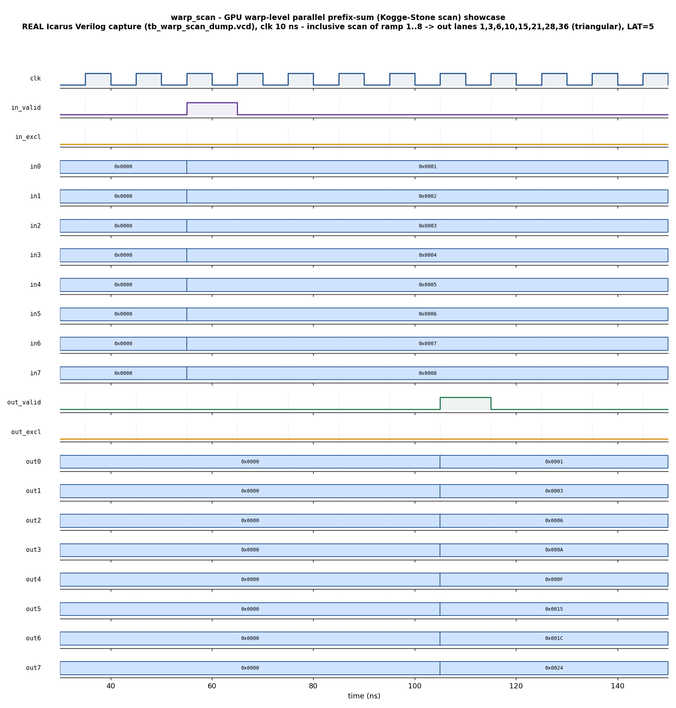

# Day 18 — GPU Warp-Level Parallel Prefix-Sum (Scan) Verification

A fully-pipelined **Kogge-Stone parallel prefix-sum (scan) engine** (`warp_scan`)
that computes the running cumulative sum across a warp of `N` lanes in a fixed
number of clock cycles, verified with a UVM environment (agent · driver · monitor
· scoreboard · coverage · virtual sequences · SVA) and a portable, self-checking
companion testbench that runs on open-source Icarus Verilog.

## Overview

A **prefix sum (scan)** is one of the most heavily used GPU primitives — the
workhorse behind stream compaction, radix-sort digit counting, sparse-matrix row
pointers, histogram/CDF construction, and warp aggregation. CUDA exposes it
directly as `__shfl`-based warp scans, `cub::WarpScan`, and
`thrust::inclusive_scan`. The same block is exactly what a low-latency (HFT)
pipeline drops in to keep a **running cumulative volume / order-book depth
ladder** or a **running P&L** at line rate: feed an `N`-lane vector, get one
distinct partial sum per price level back a fixed latency later, every cycle.

The DUT is a **Kogge-Stone scan network** over an `N = 2**L`-lane vector.
Kogge-Stone is the data-*independent* parallel-prefix schedule (no branching, no
divergence) that a SIMT lane array *and* a pipelined ASIC/FPGA datapath both
want: for `N` lanes it runs exactly `L = log2(N)` add layers, where layer `s`
(offset `= 2**(s-1)`) performs `lane[i] += lane[i-offset]` for every `i ≥ offset`.
Each layer is **registered**, so the pipeline has a fixed latency `LAT = L+2` and
accepts a new vector **every cycle** (zero-bubble). For the verified
configuration (`N=8`): `L=3`, `LAT=5`.

Both **inclusive** and **exclusive** scans are runtime-selectable via `in_excl`:

- `inclusive out[i] = sum(in[0..i])`   — lane `i` includes its own value,
- `exclusive out[i] = sum(in[0..i-1])`, `out[0] = 0` — the additive identity
  shifted right one lane.

Lanes are `DW`-bit **two's-complement** values summed **modulo `2**DW`**, so
signed running sums that overflow the lane width wrap *deterministically* —
matching a golden modular reference exactly.

## Verification goal

Prove that, for **every** accepted input vector and both scan modes, the vector
that emerges `LAT` cycles later is:

1. the **correct running cumulative sum** of the input lanes (per lane),
2. the right **mode** (inclusive vs exclusive; exclusive lane 0 is the identity),
3. **modular-exact** even when the running sum overflows `DW` bits, and
4. delivered at the **fixed pipeline latency**, back-to-back, with no `X`.

An independent golden reference (a sequential modular prefix sum — a *different*
formulation from the DUT's parallel Kogge-Stone tree) computes the expected
vector; exact lane-by-lane equality proves (1)+(2)+(3) simultaneously.

## Features / coverage list

- Parameterized Kogge-Stone network (`N` a power of two, `DW`); all outputs
  registered; reset-safe; lint-friendly generate-built pipeline.
- Runtime-selectable **inclusive / exclusive** scan (`in_excl`).
- Signed **modular `DW`-bit** accumulation with well-defined wraparound.
- Fixed-latency, **zero-bubble streaming** (one vector in, one scanned vector out
  per cycle when kept full).
- Golden modular-prefix reference **reused by both** the scoreboard and the
  coverage collector.
- Directed **showcase** + directed **corners** + **constrained-random** regress.
- Functional coverage: mode × total-sign × zero-content × wrap-occurred, crosses.
- SVA: fixed-latency contract, exclusive-lane-0-is-zero, no-`X`.
- Self-checking companion TB that captures a **real** VCD on Icarus.

## DUT — `warp_scan`

### Parameters

| Parameter | Default | Meaning |
|-----------|---------|---------|
| `N`  | 8  | Warp width / vector length (**power of two**) |
| `DW` | 16 | Per-lane data width (bits) |

Derived: `L = log2(N)` (Kogge-Stone layers), `LAT = L+2` (input-reg + `L` layers
+ output-reg).

### Ports

| Port | Dir | Width | Description |
|------|-----|-------|-------------|
| `clk`       | in  | 1      | Clock |
| `rst_n`     | in  | 1      | Async active-low reset |
| `in_valid`  | in  | 1      | A new `N`-lane vector is present this cycle |
| `in_excl`   | in  | 1      | `0` = inclusive scan, `1` = exclusive scan |
| `in_data`   | in  | `N*DW` | `N` lanes packed low-lane-first, each `DW` bits |
| `out_valid` | out | 1      | `LAT` cycles later: scanned vector is present |
| `out_excl`  | out | 1      | Scan mode that produced `out_data` (pipeline-aligned) |
| `out_data`  | out | `N*DW` | Scanned `N`-lane vector (running cumulative sums) |

## Testbench architecture

```
                       +------------------------------------------------+
                       |                  scan_env                      |
                       |                                                |
  scan_*_seq           |   +----------------+     +------------------+  |
  (showcase/corner/    |   |   scan_agent   |     |  scan_scoreboard |  |
   random) on          |   |                |     |  (golden re-scan, |  |
   virtual sequencer   |   |  +----------+  |     |   lane-by-lane)   |  |
        |              |   |  |  driver  |--+--in_data-->[ DUT ]      |  |
        v              |   |  +----------+  |            warp_scan     |  |
  +--------------+     |   |  +----------+  |               |          |  |
  | scan_vseqr   |-----+-->|  |sequencer |  |            out_data       |  |
  +--------------+ req |   |  +----------+  |               |          |  |
                       |   |  +----------+  |               |          |  |
                       |   |  | monitor  |<-+---in/out------+          |  |
                       |   |  +----+-----+  |   (FIFO-pairs input      |  |
                       |   |       | ap     |    vector with the       |  |
                       |   +-------|--------+    scanned output)        |  |
                       |           |            +------------------+    |  |
                       |           +---------------------------------> scan_coverage
                       |                        (mode x sign x zero)    |  |
                       +------------------------------------------------+
```

The **monitor** pairs each accepted input vector with the scanned vector that
later emerges using a small FIFO, so the environment is **independent of the
exact pipeline latency** — no magic-number delays. Each `scan_obs_item` therefore
carries `{in_lanes, in_excl, out_lanes, out_excl}`: a self-contained transaction
the scoreboard can re-scan and check on its own.

## Simulation timing



*The directed showcase, captured from a **real Icarus Verilog run** (`make
icarus_dump` → `tb_warp_scan_dump.vcd`) and rendered by `docs/make_waveform.py` —
**not** a hand-drawn diagram. An 8-lane vector is presented for one cycle with
`in_excl=0` (inclusive) and lanes `in0..in7 = 1,2,3,4,5,6,7,8`. Exactly
`LAT = 5` cycles later `out_valid` pulses and the eight output lanes read
`out0=0x0001, out1=0x0003, out2=0x0006, out3=0x000A, out4=0x000F, out5=0x0015,
out6=0x001C, out7=0x0024` — the running **triangular numbers**
`1, 3, 6, 10, 15, 21, 28, 36`, i.e. `out[i] = sum(in[0..i])`. The cumulative sum
has been computed in a fixed 5-cycle pipeline latency.*

## How the checking works

- **Golden reference model** (`scan_model` / `golden()` in the Icarus TB): an
  independent *sequential* modular `DW`-bit prefix sum, inclusive or exclusive.
  It is deliberately a *different formulation* from the DUT's parallel
  Kogge-Stone tree, so the two agreeing is real evidence, not a copy of the same
  code.
- **Scoreboard**: for each observed transaction it re-scans the captured input
  and compares the DUT's `out_data` **lane-by-lane** (plus `out_excl == in_excl`).
- **Modular-exact wrap check**: because the golden model wraps at `DW` bits the
  same way the DUT's adders do, the large-magnitude corners (`0x4000` × 8,
  `0xC000` × 8) are checked to the bit — a deterministic wraparound, not a
  don't-care.
- **FIFO latency-independence**: the monitor pairs inputs and outputs by order of
  appearance, so back-to-back streaming (pipeline full) is checked exactly like
  isolated vectors — every vector pushed must come out scanned, in order.
- **Verdict**: the Icarus TB prints `RESULT: *** PASS ***` only when every check
  passed *and* the expected-output FIFO drained empty (no vector went missing).

## Functional-coverage intent

`scan_coverage` samples every observed vector and crosses:

- **`cp_excl`** — inclusive vs exclusive scan.
- **`cp_sign`** — sign of the full-vector total (negative / zero / positive),
  interpreted as two's complement — the running-P&L axis.
- **`cp_zero`** — zero content of the input: no zero lanes / some / all zero.
- **`cp_wrap`** — whether the signed running sum overflowed `DW` bits at any
  prefix (a modular wraparound occurred).
- Crosses **`excl × sign`** and **`excl × wrap`** so both modes are exercised
  against negative totals and against wrap-inducing inputs (the cases where
  *modular* semantics actually matter).

## What the testbench checks

Directed **showcase** (inclusive scan of the ramp `1..8`, the same ramp as an
exclusive scan, all-ones inclusive → plain rank), directed **corners** (all-zero,
a single one, alternating `+1/-1` that toggles the running sum, large-positive
lanes forcing a **16-bit wraparound**, large-negative lanes, and a **zero-bubble
back-to-back stream** that fills the pipeline), and a **constrained-random**
regression of random lanes + random mode with a fraction forced to small signed
magnitudes to exercise sign toggling. For every vector it checks the scanned
output against the golden model and confirms fixed-latency delivery with no lost
vectors.

## Assertions (SVA)

Enabled with `+define+WSCAN_SVA` on a UVM-capable simulator:

- **`a_latency`** — `in_valid |-> ##LAT out_valid` (fixed pipeline latency).
- **`a_excl_lane0_zero`** — an exclusive scan always emits `0` (the additive
  identity) in lane 0 while `out_valid`.
- **`a_no_x`** — `out_excl` and `out_data` are known whenever `out_valid`.

## Run instructions

```bash
# Portable, self-checking, captures the committed waveform (open-source):
make icarus_dump        # Icarus Verilog: runs tb_warp_scan_dump.sv
make waveform           # re-render docs/warp_scan_waveform.png from the VCD

# Full UVM environment (needs a UVM-capable simulator):
make vcs       UVM_TESTNAME=scan_smoke_test     # Synopsys VCS
make questa    UVM_TESTNAME=scan_regress_test   # Siemens Questa
make verilator UVM_TESTNAME=scan_smoke_test     # Verilator >= 5 (--uvm)

make clean
```

> **Toolchain note.** The self-checking `tb_warp_scan_dump.sv` flow was run on
> Icarus Verilog and reports `RESULT: *** PASS ***` (213 checks, 0 errors); the
> committed waveform is a genuine capture from that run. The UVM environment and
> SVA (`warp_scan_pkg.sv` / `tb_top.sv`) target VCS/Questa/Verilator and are
> **not** exercised by the Icarus flow, which does not implement the UVM class
> library.
