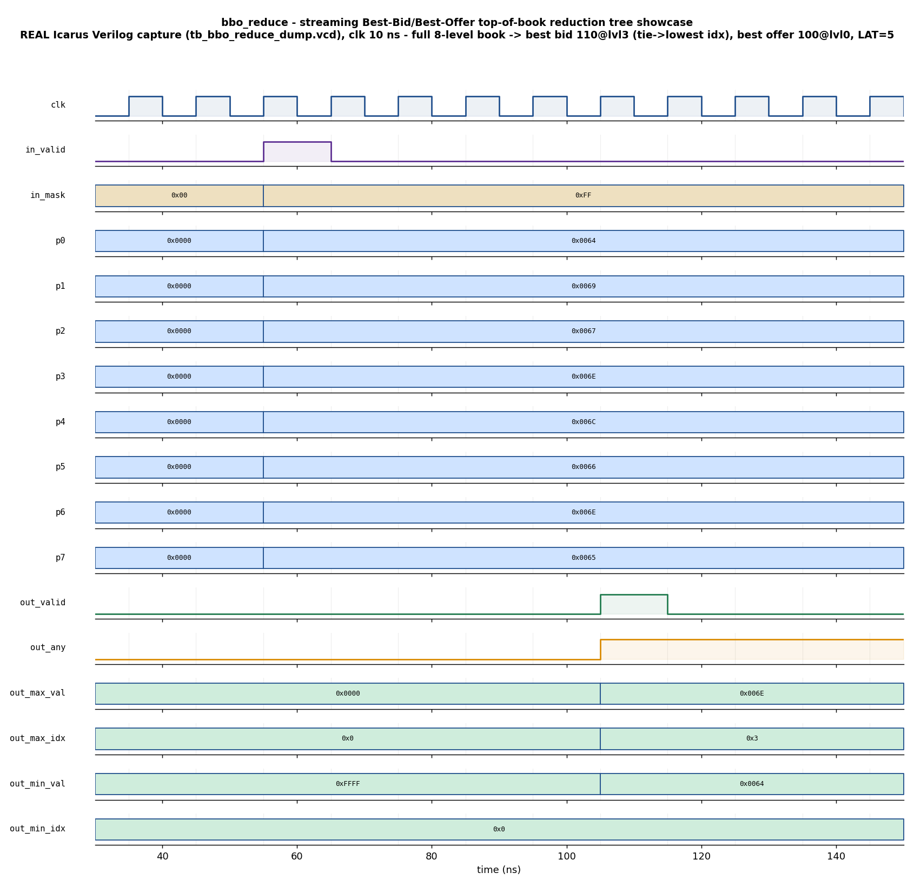

# Day 19 — Streaming Best-Bid / Best-Offer (BBO) Top-of-Book Reduction Tree

A fully-pipelined, fixed-latency **argmax + argmin reduction tree** over an
`N`-level price ladder, verified with a self-checking UVM environment (golden
reference-model scoreboard, functional coverage, SVA) plus a portable Icarus
companion testbench.

## Overview

**Top-of-book / BBO tracking** is the single most latency-critical block in a
hardware (FPGA/ASIC) matching engine or a market-data handler for
high-frequency trading. Given the `N` resting price levels of an order book, the
engine must know, *every cycle*, the:

- **best bid**  — the highest price and *which level* it sits on, and
- **best offer / ask** — the lowest price and *which level* it sits on.

A software `for`-loop over `N` levels cannot keep up at line rate. The hardware
answer is a **balanced reduction tree** that collapses `N` candidates down to 1
in `L = log2(N)` compare layers, each layer registered, so the block has a
**fixed latency `LAT = log2(N)+2`** and accepts a brand-new book snapshot on
*every* clock (zero-bubble, one book per cycle).

The same block is the generic hardware **argmax / argmin** reduction — max/min
*plus the index that produced it* — behind priority selection, winner-take-all,
nearest-neighbour, and top-1 selection datapaths on an FPGA/ASIC.

The DUT (`bbo_reduce.sv`) is parameterized (`N` a power of two, `DW`-bit
unsigned prices), reset-safe, and fully registered (every compare layer is a
pipeline stage).

## Verification goal

Prove that, for **every** streamed price ladder — directed, corner, and
constrained-random — the DUT's registered BBO output exactly matches an
independent golden reference model:

- `out_max_val` / `out_max_idx` = the highest valid price and its level index,
- `out_min_val` / `out_min_idx` = the lowest valid price and its level index,
- `out_any` = whether the book had any populated level,

with a **deterministic lowest-index-wins tie-break** on equal prices, correct
**per-level valid masking** (empty levels never win), correct **empty-book
identity** outputs, and a **fixed pipeline latency** that never varies with the
data or with back-to-back (zero-bubble) traffic.

## Features / coverage

- **Fixed-latency reduction tree** — `L = log2(N)` registered compare layers,
  `LAT = L+2`, one book snapshot accepted per cycle (zero-bubble).
- **Argmax + argmin with index tracking** — each node carries value *and* the
  original level index that produced it.
- **Deterministic tie-break** — on equal prices the **lowest level index** wins,
  for both best bid and best offer. The tree guarantees this because each node's
  left child always holds strictly lower original indices, so a "keep left on a
  tie" rule at every node is globally lowest-index-wins.
- **Per-level populated mask** — an empty level never wins; validity is reduced
  up the tree alongside the values.
- **Empty-book identities** — when no level is populated: `out_any=0`,
  `out_max_val=0`, `out_min_val=all-ones`, indices `0`.
- **Golden reference scoreboard** — an independent lowest-index argmax/argmin
  over the valid levels, checked against the DUT value-by-value and index-by-index.
- **Directed + constrained-random stimulus**, including tie-forcing small-range
  prices and occasional empty books.
- **Functional coverage** — occupancy × max-tie × min-tie × edge-of-book crosses.
- **SVA** — fixed-latency contract, best-bid ≥ best-offer, index-in-range, no-X.

## DUT parameters

| Parameter | Default | Meaning |
|-----------|---------|---------|
| `N`  | 8  | Number of book price levels (must be a power of two) |
| `DW` | 16 | Price width in bits (unsigned) |
| `IW` | `$clog2(N)` | Level-index width (derived; do not override) |

Derived: `L = $clog2(N)` reduction layers, `LAT = L + 2` cycles of latency.

## DUT ports

| Port | Dir | Width | Description |
|------|-----|-------|-------------|
| `clk`         | in  | 1        | Clock |
| `rst_n`       | in  | 1        | Active-low synchronous-release reset |
| `in_valid`    | in  | 1        | A new `N`-level price vector is present this cycle |
| `in_price`    | in  | `N*DW`   | `N` unsigned prices packed low-level-first |
| `in_mask`     | in  | `N`      | Populated-level mask (bit *i* = level *i* holds an order) |
| `out_valid`   | out | 1        | `LAT` cycles later: BBO result is presented |
| `out_any`     | out | 1        | Book was non-empty (at least one level valid) |
| `out_max_val` | out | `DW`     | Best bid  — highest valid price |
| `out_max_idx` | out | `IW`     | Best bid  — its level index |
| `out_min_val` | out | `DW`     | Best offer — lowest valid price |
| `out_min_idx` | out | `IW`     | Best offer — its level index |

## Testbench architecture

```
                         +-------------------------------------------------+
                         |                  bbo_env                        |
                         |                                                 |
   bbo_*_seq  --->  sequencer ---> bbo_driver --+                          |
   (showcase/corner/random)                     |                          |
                         |                       v  (price ladder / cycle) |
                         |                 +-----------+                   |
                         |                 | bbo_reduce|  DUT (LAT=L+2)     |
                         |                 |  argmax + |                    |
                         |                 |  argmin   |                    |
                         |                 |  tree     |                    |
                         |                 +-----------+                   |
                         |                       | (BBO result, fixed lat) |
                         |                       v                         |
                         |                  bbo_monitor                    |
                         |            (FIFO-pairs ladder <-> result)       |
                         |                       | analysis                |
                         |             +---------+---------+               |
                         |             v                   v               |
                         |      bbo_scoreboard        bbo_coverage         |
                         |   (golden lowest-index   (occupancy x max-tie   |
                         |    argmax/argmin model)    x min-tie x edge)     |
                         +-------------------------------------------------+
             virtual sequencer (bbo_vseqr) drives smoke / regress vseqs
```

The **monitor** pushes each accepted input ladder into a FIFO and pops it when
the matching `out_valid` appears, so the checking is *independent of the exact
pipeline latency* and works unchanged under back-to-back streaming.

## Simulation timing



*Directed showcase, **captured from a real Icarus Verilog run** (`make waveform`
parses `tb_bbo_reduce_dump.vcd`) — this is a genuine simulator trace, not a
hand-drawn diagram.* A full 8-level book is presented for one cycle
(`in_valid` pulse, `in_mask=0xFF`) with prices
`p0..p7 = 100,105,103,110,108,102,110,101` (`0x0064,0x0069,0x0067,0x006E,0x006C,
0x0066,0x006E,0x0065`). Exactly `LAT = 5` cycles later `out_valid` pulses with
the top of book:

- **best bid**  `out_max_val = 0x006E` (110) at `out_max_idx = 3` — note 110 is
  *also* at level 6, and the **lowest index wins the tie**, so level 3 is chosen;
- **best offer** `out_min_val = 0x0064` (100) at `out_min_idx = 0`;
- `out_any = 1` (book non-empty).

## How the checking works

The **scoreboard** holds an independent `bbo_model` (a plain lowest-index-wins
linear argmax/argmin over the valid levels — a completely different
implementation from the tree). For every monitored result it recomputes the
expected `{any, max_val, max_idx, min_val, min_idx}` from the observed input
ladder and mask, and flags any mismatch in value **or** index **or** the `any`
flag. It prints `RESULT: *** PASS ***` only if every checked result matched and
at least one result was checked.

Because the golden model resolves ties by *lowest index* exactly as the tree
does, the index fields are checked as strictly as the values — a design that
returned the *right price* at the *wrong tied level* would be caught.

## Functional-coverage intent

`bbo_coverage` samples every result and crosses:

- **occupancy** — empty / single / few / full book,
- **max-tie** — was the winning best-bid price present on more than one level?
- **min-tie** — same for the best offer,
- **max-at-edge** — did the best bid land on level 0 or level `N-1`
  (the tree's outermost leaves)?

with `occupancy × max-tie` and `max-tie × min-tie` crosses, so a regression is
only "done" once empty, single, partial, and full books have each been seen with
and without simultaneous max/min ties.

## What the testbench checks

- Best-bid value **and** level index correct for every ladder.
- Best-offer value **and** level index correct for every ladder.
- Ties resolved to the **lowest** level index (max and min independently).
- Populated mask honoured — masked-out levels never win.
- Empty book → `any=0` and identity outputs.
- Fixed `LAT`-cycle latency, including under zero-bubble back-to-back streaming.
- `out_valid` never fires without a matching pending input (FIFO drain check).
- (UVM/SVA sims) best bid ≥ best offer when non-empty, indices in range, no-X.

## Run instructions

Portable open-source flow (Icarus Verilog — the module-based self-checking TB,
also the source of the committed waveform):

```bash
make icarus_dump     # compile + run tb_bbo_reduce_dump.sv, prints RESULT: *** PASS ***
make waveform        # regenerate docs/bbo_reduce_waveform.png from the captured VCD
```

Full UVM environment (needs a UVM-capable simulator):

```bash
make vcs       UVM_TESTNAME=bbo_smoke_test     # Synopsys VCS
make questa    UVM_TESTNAME=bbo_regress_test   # Siemens Questa / ModelSim
make verilator UVM_TESTNAME=bbo_smoke_test     # Verilator >= 5 built with --uvm
```

Available UVM tests: `bbo_smoke_test` (showcase + short random) and
`bbo_regress_test` (showcase + corners + long random).

## Files

| File | Role |
|------|------|
| `bbo_reduce.sv`            | Synthesizable DUT — pipelined argmax/argmin reduction tree (+ SVA) |
| `bbo_reduce_if.sv`         | SystemVerilog interface with driver/monitor clocking blocks |
| `bbo_reduce_pkg.sv`        | UVM env: item/model/driver/monitor/agent/scoreboard/coverage/seqs/vseqs/tests |
| `tb_top.sv`                | UVM top: clock/reset, interface, DUT, `run_test()` |
| `tb_bbo_reduce_dump.sv`    | Portable module-based self-checking TB (Icarus) — dumps the VCD |
| `docs/make_waveform.py`    | Renders `docs/bbo_reduce_waveform.png` from the captured VCD |
| `Makefile`                 | `icarus_dump` / `waveform` / `vcs` / `questa` / `verilator` targets |

## Notes

- The portable Icarus run is genuine: `make icarus_dump` compiles and simulates
  the DUT and prints `RESULT: *** PASS ***` (313 results checked across the
  showcase, all corners, the back-to-back stream, and 300 constrained-random
  ladders). The committed waveform PNG is captured from that real VCD.
- The SVA properties in `bbo_reduce.sv` are guarded by `` `ifdef BBO_SVA `` and
  are exercised by the UVM simulators (VCS/Questa/Verilator); Icarus does not
  implement this concurrent-assertion subset, so its flow leaves them off.
