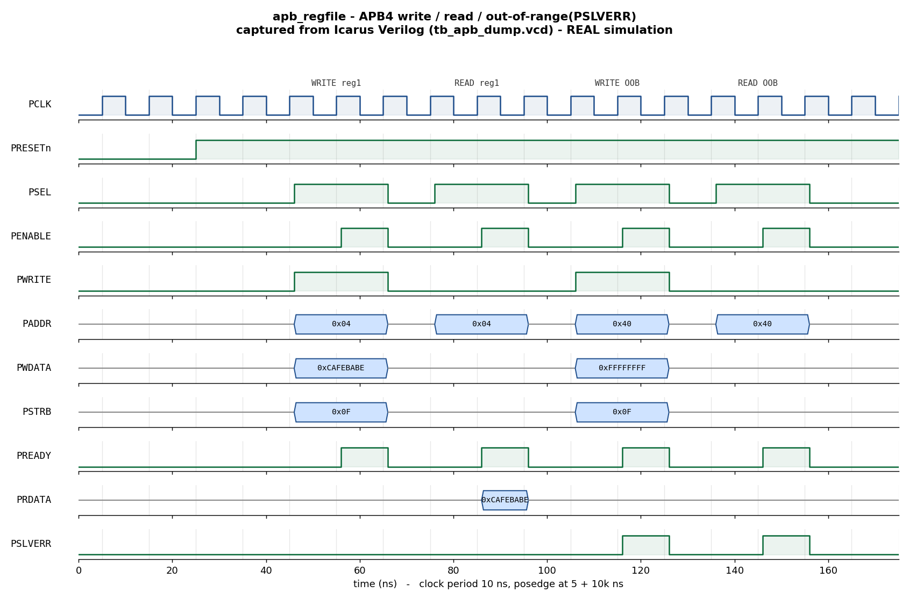

# Day 2 — UVM Verification of an APB4 Slave Register File

A complete **UVM** testbench for an AMBA-APB (APB4) slave register file:
a full agent (**driver + monitor + sequencer**), a **golden reference-model
scoreboard**, a layered set of **sequences**, a **virtual sequencer** with
**virtual sequences**, **functional coverage**, and **SVA** protocol
assertions on the interface.

## Overview

`apb_regfile` is a zero-wait-state APB4 slave exposing `NUM_REGS` 32-bit
registers. It implements the classic two-phase APB handshake —
`SETUP` (`PSEL=1, PENABLE=0`) followed by `ACCESS` (`PSEL=1, PENABLE=1`,
transfer completes when `PREADY=1`) — supports **byte-granular writes** via
`PSTRB`, and raises **`PSLVERR`** on an out-of-range word address.

The UVM environment observes every completed transfer with a passive monitor
and checks it against a **golden register model** kept in the scoreboard. The
model applies the exact same byte-strobe write rules and address-range check
as the RTL, so DUT and model must agree bit-for-bit on read data and on the
error response, or the scoreboard flags a mismatch.

## Verification goal

Prove that the register file:

1. Stores and returns data correctly for every register (write/read
   round-trip across the whole address space).
2. Honors **byte strobes** — only the selected byte lanes of a register change
   on a write.
3. Raises **`PSLVERR`** exactly when (and only when) the addressed word is out
   of range, and an out-of-range access never corrupts stored state.
4. Returns `0` on an out-of-range read and on idle cycles.
5. Obeys the **APB phase protocol**: every `SETUP` beat is followed by an
   `ACCESS` beat with stable address/control (checked by SVA).

## Features / coverage list

- **UVM agent** — configurable `UVM_ACTIVE`/`UVM_PASSIVE`; driver runs the
  SETUP/ACCESS handshake, monitor reconstructs completed transfers onto an
  analysis port.
- **Reference-model scoreboard** — golden 16×32-bit register array, checked on
  every observed transfer (read data, error response, OOB integrity).
- **Layered sequences** — `write_all`, `read_all`, constrained-`rand`, and an
  `oob` (out-of-bounds) error burst.
- **Virtual sequencer + virtual sequences** — `apb_smoke_vseq` (write-all then
  read-all) and `apb_regress_vseq` (write → random → OOB errors → read-back
  sweep) coordinating sub-sequences on the agent sequencer.
- **Functional coverage** — direction, error response, address region
  (low/mid/high/OOB), byte-strobe pattern, and a direction×error cross.
- **SVA assertions** — SETUP→ACCESS progression, address/control stability
  across the handshake, and `PENABLE ⇒ PSEL`.
- **Safety** — global watchdog timeout; VCD waveform dump.

## DUT parameters

| Parameter    | Default | Description |
|--------------|---------|-------------|
| `ADDR_WIDTH` | 8       | `PADDR` width (byte address) |
| `DATA_WIDTH` | 32      | Register / data-bus width in bits |
| `NUM_REGS`   | 16      | Number of 32-bit registers |

## DUT ports

| Port      | Dir | Width          | Description |
|-----------|-----|----------------|-------------|
| `PCLK`    | in  | 1              | Bus clock |
| `PRESETn` | in  | 1              | Active-low reset (async assert, sync release) |
| `PSEL`    | in  | 1              | Slave select |
| `PENABLE` | in  | 1              | Enable — marks the ACCESS phase |
| `PWRITE`  | in  | 1              | 1 = write, 0 = read |
| `PADDR`   | in  | `ADDR_WIDTH`   | Byte address |
| `PWDATA`  | in  | `DATA_WIDTH`   | Write data |
| `PSTRB`   | in  | `DATA_WIDTH/8` | Byte-lane write strobes |
| `PRDATA`  | out | `DATA_WIDTH`   | Read data (combinational during ACCESS) |
| `PREADY`  | out | 1              | Transfer-ready (zero wait states) |
| `PSLVERR` | out | 1              | Error response (out-of-range address) |

## Testbench architecture

```
                      +-------------------------- tb_top ---------------------------+
                      |  clk/reset gen        apb_if (SVA)          apb_regfile DUT  |
                      |        |                  | vif                    ^         |
                      |        v                  v                        |         |
  +-------------------------------- apb_env --------------------------------------+  |
  |                                                                               |  |
  |   apb_vsequencer                     apb_agent                                |  |
  |   (virtual seqr)                +-----------------------------------------+   |  |
  |        |  apb_seqr handle       |  apb_sequencer                          |   |  |
  |        v                        |      | seq_item                         |   |  |
  |   apb_*_vseq  --- start ------> |      v                                  |   |  |
  |   (write/rand/oob/read)         |  apb_driver  --drive SETUP/ACCESS-->  DUT   |  |
  |                                 |                                         |   |  |
  |                                 |  apb_monitor <--sample bus-------------  DUT |  |
  |                                 |      | analysis port (ap)               |   |  |
  |                                 +------|----------------------+-----------+   |  |
  |                                        |                      |               |  |
  |                              +---------v-------+     +--------v----------+    |  |
  |                              | apb_coverage    |     | apb_scoreboard    |    |  |
  |                              | (covergroup)    |     | golden reg model  |    |  |
  |                              +-----------------+     | + error checking  |    |  |
  |                                                      +-------------------+    |  |
  +-------------------------------------------------------------------------------+  |
                      +-------------------------------------------------------------+
```

## Simulation timing



*Caption — **This is a real waveform captured from an Icarus Verilog
simulation** (not a hand-drawn mock-up). `docs/make_waveform.py` parses the
`tb_apb_dump.vcd` produced by `make icarus_dump` and renders the "showcase"
window. It shows reset release (~25 ns), a **write** to `reg1` (`PADDR=0x04`,
`PWDATA=0xCAFEBABE`, `PSTRB=0x0F`) with the SETUP→ACCESS handshake and
`PSLVERR` low, a **read** of `reg1` returning `0xCAFEBABE`, then an
**out-of-range write and read** to `PADDR=0x40` (word index 16, ≥ `NUM_REGS`)
where **`PSLVERR` asserts** and `PRDATA` stays `0`. Note how `PENABLE` always
rises exactly one cycle after `PSEL` — the APB two-phase handshake.*

> The image is rendered from the **module-based** companion testbench
> (`tb_apb_dump.sv`), because the open-source simulator available here (Icarus
> Verilog) does not implement the UVM class library. The DUT, checks, and
> waveform are genuine; see the run note below regarding the UVM testbench.

## How the checking works

The scoreboard (`apb_scoreboard`) holds a golden `model[NUM_REGS]` initialized
to `0` (the DUT reset value). For every transfer the monitor publishes:

1. **Error check** — recompute `oob = (word_index >= NUM_REGS)` and require
   `PSLVERR == oob`.
2. **OOB integrity** — on an out-of-range access the model is left untouched;
   an out-of-range read must return `0`.
3. **Write** — apply the byte-strobed write to the model
   (`for each lane b: if strb[b], model[idx][8b+:8] = data[8b+:8]`).
4. **Read** — compare `PRDATA` against `model[idx]`.

Any disagreement is a `uvm_error`; the run ends with `UVM_ERROR : 0` only if
every transfer matched. The `report_phase` also fails if the scoreboard saw no
transfers at all (a silent-testbench guard).

The portable `tb_apb_dump.sv` uses the same golden-model logic inline and
prints `RESULT: *** PASS ***` when `errors == 0`.

## Functional-coverage intent

`apb_coverage` samples every completed transfer:

- `cp_dir` — read vs. write.
- `cp_err` — normal vs. `PSLVERR`.
- `cp_idx` — address region: low / mid / high / **OOB**.
- `cp_strb` — single-byte lanes vs. full-word writes.
- `x_dir_err` — cross of direction × error, so we have evidence that **both**
  a bad-address write *and* a bad-address read were observed, not just one.

Hitting the OOB and single-byte-strobe bins is the proof that the random and
`oob` sequences actually stressed the error and partial-write paths.

## Run instructions

UVM testbench (needs a UVM-capable simulator), pick the test with
`UVM_TESTNAME`:

```bash
make vcs        UVM_TESTNAME=apb_regress_test   # Synopsys VCS
make questa     UVM_TESTNAME=apb_smoke_test     # Siemens Questa / ModelSim
make verilator  UVM_TESTNAME=apb_smoke_test     # Verilator 5 built with --uvm
```

Portable self-checking run + waveform (works with open-source Icarus Verilog):

```bash
make icarus_dump    # runs tb_apb_dump.sv -> prints RESULT: *** PASS ***
make waveform       # regenerates docs/apb_regfile_waveform.png from the VCD
make clean
```

> **Run status (honest):** The **module-based** testbench (`tb_apb_dump.sv`)
> **was executed** here with Icarus Verilog 13.0 and printed
> `RESULT: *** PASS ***`; the committed waveform is captured from that run's
> VCD. The **UVM** testbench (`apb_regfile_pkg.sv` + `tb_top.sv`) was **not
> run** here because no UVM-capable simulator (VCS/Questa/Verilator-uvm) is
> installed in this environment; it is provided to compile and run under any of
> the UVM targets above. No UVM pass log is claimed.

## What the testbench checks (summary)

- ✅ Write/read round-trip correct for every register
- ✅ Byte-strobed writes modify only the selected lanes
- ✅ `PSLVERR` asserts iff the word address is out of range
- ✅ Out-of-range accesses never corrupt stored state; OOB reads return `0`
- ✅ APB SETUP→ACCESS progression with stable address/control (SVA)
- ✅ `PENABLE` never asserts without `PSEL` (SVA)
- ✅ Functional coverage of direction, error, address region, and strobe
