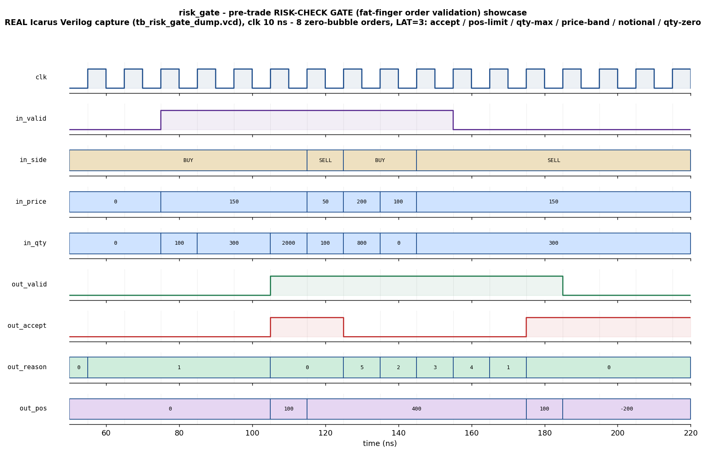

# Day 20 — Pre-Trade Risk-Check Gate ("Fat-Finger" Order-Validation Gateway)

A fully-pipelined, fixed-latency **pre-trade risk-check gate** verified with a
full UVM environment (driver / monitor / agent / scoreboard / coverage / virtual
sequencer + virtual sequences + SVA) and a portable, self-checking Icarus
testbench built around an **independent, stateful golden reference model**.

## Overview

The risk gate is the **first block an order crosses in a hardware (FPGA) trading
gateway** and the most latency-critical safety element in the entire path. Before
any order is allowed onto the wire to the exchange it must be validated against
the firm's risk limits, and that verdict has to be produced **at line rate — one
order per clock, at a small, fixed, deterministic latency** — or the gate becomes
the very bottleneck it exists to prevent. A branch-heavy software validator
cannot meet that budget; the hardware answer is a flat, fully-registered check
datapath that accepts a brand-new order **every cycle** (zero-bubble) and emits
the accept/reject verdict `LAT = PIPE + 1` cycles later.

Each order carries `{side (buy/sell), price, qty}`. The gate applies, in strict
**priority order**, the classic pre-trade checks and reports the highest-priority
rule that fired as a compact reason code (`0` = order accepted):

| Code | Reason | Fires when |
|------|--------|------------|
| 0 | `ACCEPT`      | all checks pass |
| 1 | `QTY_ZERO`    | `qty == 0` (malformed / no-op order) |
| 2 | `QTY_MAX`     | `qty > max_qty` (fat-finger size) |
| 3 | `PRICE_BAND`  | `price < min_price` or `price > max_price` (price collar / away-market protection) |
| 4 | `NOTIONAL_MAX`| `price*qty > max_notional` (fat-finger notional value) |
| 5 | `POS_LIMIT`   | `\|position after this order\| > pos_limit` (net inventory / exposure limit) |

**State.** The gate maintains the running **net position** (signed): an
*accepted* buy adds `qty`, an *accepted* sell subtracts `qty`; a rejected order
never moves the book. The position check is evaluated against the *projected*
position, so an order that would breach the inventory limit is blocked. Because
that check depends on the current position and the position only advances on an
accept, the decision + position update are computed in the **first** (combinational
then registered) stage, so back-to-back orders always see the up-to-date
position; the verdict and echoed order are then carried through `PIPE` further
register stages purely for fixed latency / timing closure.

The limits are programmed once via a `cfg_load` pulse (they are slow-changing
risk parameters held stable during a trading burst). Reset opens the gate wide
(max-permissive limits, flat book).

## Verification goal

Prove that, for **every** order and every ordering of orders, the gate:

1. produces the verdict at the **fixed latency** `LAT` (one order in → one verdict
   out, `LAT` cycles later, zero-bubble under a continuous stream);
2. selects the **correct priority-encoded reason** when one or several checks fire
   simultaneously (e.g. a 2000-lot order that is also over-notional and would
   breach the position limit must report `QTY_MAX`, the highest-priority rule);
3. tracks the **running net position** exactly — advancing only on accepts,
   frozen on rejects, and correctly reduced by accepted sells — across long,
   randomized order streams;
4. honours the **strict** limit boundaries (a value *equal* to a limit is accepted;
   one tick beyond is rejected), on both the positive and negative position
   limits.

The check is done by an **independent, stateful golden reference model** that
re-implements the priority checks and the running position and is compared,
order-for-order, against the DUT.

## Features / coverage list

- Fully-pipelined, parameterized, reset-safe, lint-friendly synthesizable DUT.
- Fixed-latency streaming contract (`LAT = PIPE + 1`), zero-bubble one-order-per-cycle.
- Strict-priority reason encoder over five pre-trade checks.
- Stateful signed net-position accumulator with a symmetric `±pos_limit` inventory check.
- Runtime-programmable risk limits via a `cfg_load` strobe; max-permissive reset defaults.
- Full UVM environment: config object, driver (programs limits + streams orders),
  latency-independent FIFO-pairing monitor, agent, **stateful** golden reference
  model, scoreboard, functional coverage, virtual sequencer, virtual sequences,
  and SVA.
- Directed **showcase** (one order per reject reason + accepts + a position-reducing
  sell), directed **corners** (boundary values exactly at every limit, strict `+1`
  breaches on both position limits, a full swing from `+pos_limit` through zero to
  `-pos_limit`), and a **constrained-random** regression squeezed toward the limits.
- Functional coverage: `reason × side` cross, accept/reject, and every reject-reason bin.
- SVA: fixed-latency contract, `accept ⇔ reason==0`, reason-in-range, no-X on the verdict.

## DUT parameters

| Parameter | Default | Meaning |
|-----------|---------|---------|
| `PW`   | 16 | price width (unsigned ticks) |
| `QW`   | 16 | quantity width (unsigned) |
| `POSW` | 32 | signed net-position accumulator width |
| `PIPE` | 2  | extra echo / latency stages (**`LAT = PIPE + 1`**, so 3 here) |
| `NW`   | `PW+QW` (32) | derived — notional (`price*qty`) width |
| `RW`   | 3  | derived — reason-code width (holds 0..5) |

## DUT ports

| Port | Dir | Width | Meaning |
|------|-----|-------|---------|
| `clk`               | in  | 1      | clock |
| `rst_n`             | in  | 1      | async active-low reset |
| `cfg_load`          | in  | 1      | latch the `cfg_*` limits into the hold registers |
| `cfg_max_qty`       | in  | `QW`   | maximum order quantity |
| `cfg_min_price`     | in  | `PW`   | lower price-band edge |
| `cfg_max_price`     | in  | `PW`   | upper price-band edge |
| `cfg_max_notional`  | in  | `NW`   | maximum order notional (`price*qty`) |
| `cfg_pos_limit`     | in  | `POSW` | magnitude ceiling for `\|net position\|` |
| `in_valid`          | in  | 1      | an order is present this cycle |
| `in_side`           | in  | 1      | 0 = buy, 1 = sell |
| `in_price`          | in  | `PW`   | order price |
| `in_qty`            | in  | `QW`   | order quantity |
| `out_valid`         | out | 1      | a verdict is present (`LAT` cycles after `in_valid`) |
| `out_accept`        | out | 1      | 1 = order passed all checks |
| `out_reason`        | out | `RW`   | 0 = accept, else the highest-priority reject reason 1..5 |
| `out_side`          | out | 1      | echoed order side (observability) |
| `out_price`         | out | `PW`   | echoed order price |
| `out_qty`           | out | `QW`   | echoed order quantity |
| `out_pos`           | out | `POSW` signed | net position **after** this order |

`out_reason`, `out_pos` and the echoed order fields are qualified by `out_valid`.

## Testbench architecture

```
                          risk_gate_pkg (UVM)
  +-----------------------------------------------------------------------+
  |                                                                       |
  |   risk_vseqr (virtual sequencer)                                      |
  |     └── smoke_vseq / regress_vseq                                     |
  |            │ start                                                    |
  |            ▼                                                          |
  |     risk_sqr ──► risk_driver ──────────────┐                         |
  |     (showcase / corner / random seqs)      │ program limits (cfg_load)|
  |                                            │ + drive 1 order / cycle  |
  |                                            ▼                          |
  |                                   ┌─────────────────┐                 |
  |                                   │   risk_gate     │  DUT            |
  |                                   │  (fixed-latency │                 |
  |                                   │  check datapath)│                 |
  |                                   └───────┬─────────┘                 |
  |                                           │ verdict (LAT later)       |
  |                          risk_monitor  ◄──┘                           |
  |                          (FIFO-pairs each order with its verdict,     |
  |                           latency-independent)                        |
  |                                   │ analysis port (risk_obs_item)     |
  |                    ┌──────────────┴───────────────┐                   |
  |                    ▼                              ▼                    |
  |          risk_scoreboard                   risk_coverage              |
  |   (STATEFUL golden model:                 (reason × side cross,       |
  |    re-derive verdict + running             accept/reject, reason bins)|
  |    net position, in arrival order,                                    |
  |    check accept + reason + side + pos)                                |
  +-----------------------------------------------------------------------+
```

The monitor pairs each observed order with the verdict that emerges later using a
FIFO, so the environment is **independent of the exact pipeline latency**. The
scoreboard maintains its own copy of the golden model and, because the order
stream is single and in-order, replays the running net position in lock-step with
the DUT.

## Simulation timing



*Directed showcase — a **real Icarus Verilog capture** (from `tb_risk_gate_dump.vcd`,
`make icarus_dump`), not a hand-drawn diagram.* Eight orders are streamed
back-to-back (zero-bubble, `in_valid` held high) against the programmed limits
`max_qty=1000`, price band `[100,200]`, `max_notional=100000`, `pos_limit=500`.
Each verdict appears `LAT = 3` cycles later:

| # | order | verdict (`out_reason`) | `out_pos` after |
|---|-------|------------------------|-----------------|
| 1 | BUY 150 ×100  | ACCEPT (0)     | +100 |
| 2 | BUY 150 ×300  | ACCEPT (0)     | +400 |
| 3 | BUY 150 ×300  | POS_LIMIT (5)  | +400 (would be +700 > 500) |
| 4 | BUY 150 ×2000 | QTY_MAX (2)    | +400 |
| 5 | SELL 50 ×100  | PRICE_BAND (3) | +400 (50 < 100) |
| 6 | BUY 200 ×800  | NOTIONAL (4)   | +400 (160000 > 100000) |
| 7 | BUY 100 ×0    | QTY_ZERO (1)   | +400 |
| 8 | SELL 150 ×300 | ACCEPT (0)     | +100 (sell reduces position) |

You can read the whole risk story off the trace: `out_accept` pulses only on the
accepted orders, `out_reason` walks `0,0,5,2,3,4,1,0`, and `out_pos` accumulates
(`+100 → +400`), **freezes** across the five rejects, then drops back to `+100`
on the accepted position-reducing sell. (`out_reason`/`out_pos` are only
meaningful while `out_valid` is high; their idle values are don't-care.)

## How the checking works

- **Golden reference model** (`risk_model` in UVM; a mirrored stateful task in the
  Icarus TB) is an *independent* re-implementation: it applies the same
  strict-priority checks and tracks the same running signed net position,
  advancing only on an accept. It never shares logic with the DUT.
- The **scoreboard** consumes `{order, verdict}` pairs in arrival order, asks the
  golden model for the expected `{accept, reason, position-after}`, and flags any
  mismatch on the verdict, the priority-encoded reason, the echoed side, or the
  net position. It prints `RESULT: *** PASS ***` only if every checked verdict
  matched and at least one was checked.
- The **monitor** is latency-independent (FIFO pairing), so the same environment
  verifies any `PIPE` without change.

## Functional-coverage intent

`risk_coverage` samples every verdict and crosses **reason × side**, plus
accept/reject and a bin per reject reason. The goal is to confirm the regression
actually exercised **every reject reason for both buys and sells** (not just the
easy `QTY_ZERO`/`QTY_MAX` cases), that accepts and rejects were both seen, and
that the position-limit rule fired in both the long (buy) and short (sell)
directions. The constrained-random sequence deliberately squeezes prices and
quantities toward the programmed limits so the rarer `NOTIONAL_MAX` and
`POS_LIMIT` bins fill in.

## Run instructions

Portable / open-source (Icarus Verilog — no UVM required):

```bash
make icarus_dump     # compile + run the self-checking TB, prints RESULT: *** PASS ***
make waveform        # regenerate docs/risk_gate_waveform.png from the captured VCD
```

UVM-capable simulators:

```bash
make vcs       UVM_TESTNAME=risk_smoke_test      # Synopsys VCS
make questa    UVM_TESTNAME=risk_regress_test    # Siemens Questa / ModelSim
make verilator UVM_TESTNAME=risk_smoke_test      # Verilator >= 5, built with --uvm
```

`make clean` removes all build artifacts.

## What the testbench checks

- **Verdict correctness** — `out_accept` and the priority-encoded `out_reason`
  match the independent golden model for every order.
- **Priority ordering** — when several checks fire at once, the highest-priority
  reason is the one reported.
- **Net-position tracking** — `out_pos` matches the golden running position,
  order-for-order, advancing only on accepts and reducing on accepted sells.
- **Strict boundaries** — values exactly at a limit are accepted; one tick beyond
  is rejected, on both the positive and negative position limits.
- **Fixed latency & fidelity** — one verdict per order at `LAT` cycles, side
  echoed correctly, no unknown (X) bits on the verdict (SVA), under directed,
  boundary, and constrained-random streams (Icarus run: **316 verdicts checked, 0
  errors**).

## Files

| File | Purpose |
|------|---------|
| `risk_gate.sv`            | synthesizable DUT — fixed-latency pre-trade risk-check gate |
| `risk_gate_if.sv`         | SystemVerilog interface + driver/monitor clocking blocks |
| `risk_gate_pkg.sv`        | full UVM environment (model/driver/monitor/agent/scoreboard/coverage/sequences/tests) |
| `tb_top.sv`               | UVM top (clock/reset, DUT, `run_test`) |
| `tb_risk_gate_dump.sv`    | portable self-checking Icarus TB + stateful golden model + VCD dump |
| `Makefile`                | Icarus / VCS / Questa / Verilator run targets |
| `docs/make_waveform.py`   | renders the committed waveform PNG from the captured VCD |
| `docs/risk_gate_waveform.png` | real Icarus capture of the directed showcase |
