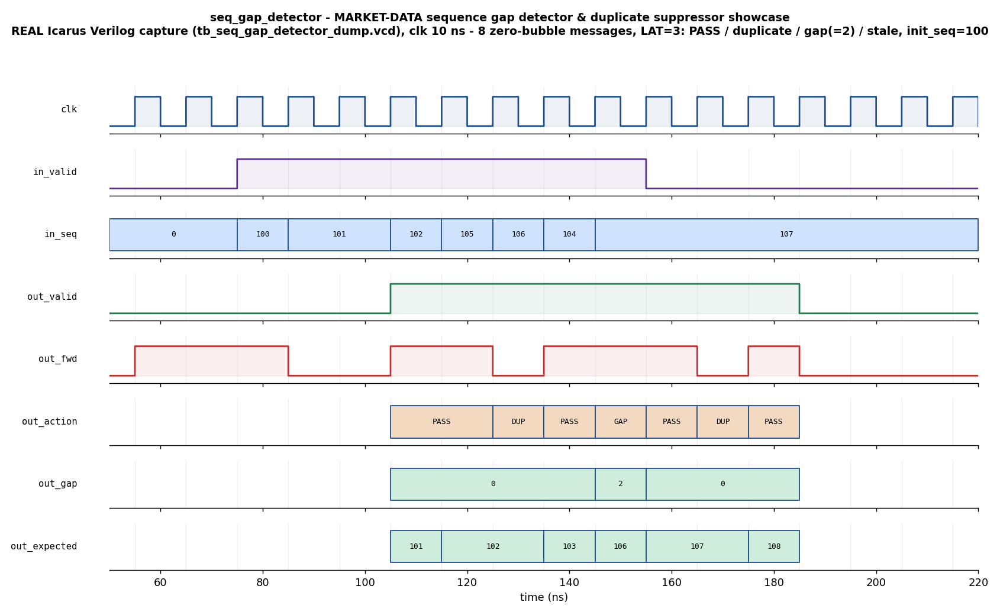

# Day 21 — Market-Data Sequence Gap Detector & Duplicate Suppressor

A cut-through, fixed-latency **market-data sequence gap detector & duplicate
suppressor** — the front end of a hardware (FPGA) feed handler / ticker plant —
verified with a full UVM environment (driver / monitor / agent / scoreboard /
coverage / virtual sequencer + virtual sequences + SVA) and a portable,
self-checking Icarus testbench built around an **independent, stateful golden
reference model**.

## Overview

This is the **first block a market-data message crosses inside a hardware feed
handler**, and one of the most latency-critical elements in the whole ingest
path. Exchanges publish an identical, monotonically-numbered message stream on
**two redundant multicast feeds** (the "A" and "B" lines) so a datagram dropped
on one line can be recovered from the other. Downstream order-book logic must see
each sequence number **exactly once, in order**, and must be told the instant a
message is **missing from both lines** (a real gap) so a retransmit / recovery
request can be fired. Doing that arbitration and gap bookkeeping in software
cannot keep up at line rate; the hardware answer is a flat, fully-registered,
**cut-through** sanitizer that accepts a brand-new message **every cycle**
(zero-bubble) and emits its decision `LAT = PIPE + 1` cycles later.

Each inbound message carries `{seq, data}`. Against the running **next-expected**
sequence number the block emits one of three actions:

| Code | Action | Fires when | Effect |
|------|--------|------------|--------|
| 0 | `PASS` | `seq == expected` | the next in-order message — **forward** it, `expected := seq + 1` |
| 1 | `DUP`  | `seq <  expected` | a duplicate (B-line copy) or stale late retransmit — **drop** it, `expected` unchanged |
| 2 | `GAP`  | `seq >  expected` | one or more messages missing — report `gap = seq - expected`, **forward** this message and **resync** `expected := seq + 1` |

`out_fwd` is high on `PASS` and `GAP` (a message goes downstream) and low on
`DUP`. On a gap, `out_gap` carries the count of missing sequence numbers — the
size of the retransmit request the recovery block must issue.

**State.** The gate maintains the running **next-expected sequence number**. It
advances only on a *forwarded* message (`PASS` or `GAP`) and is frozen on a
duplicate. Because the decision depends on it and it can change every cycle, the
compare + update are computed in the **first** (combinational-then-registered)
stage, so back-to-back messages always see the up-to-date value; the decision and
echoed message are then carried through `PIPE` further register stages purely for
fixed latency / timing closure.

This is a **detector / sanitizer, not a reorder buffer** — on a gap it flags the
loss and keeps the stream moving at line rate rather than stalling to buffer and
re-order (which real feed handlers delegate to a separate, non-latency-critical
recovery path). A `cfg_load` pulse programs `cfg_init_seq`, the session's first
expected sequence number (e.g. start-of-day / session reset); reset defaults it
to 0.

## Verification goal

Prove that, for **every** message and every arrival pattern, the block:

1. produces its decision at the **fixed latency** `LAT` (one message in → one
   decision out, `LAT` cycles later, zero-bubble under a continuous stream);
2. **classifies** each message correctly against the running expected sequence —
   forwarding in-order messages, suppressing duplicates *and* stale late
   retransmits, and detecting genuine gaps;
3. reports the **exact gap size** (`seq - expected`) on a gap, and `0` otherwise;
4. tracks the **running next-expected** sequence exactly — advancing on forwards,
   frozen on duplicates, and **resynchronising** correctly past a gap — across
   long, randomized streams;
5. handles the **session boundary** (`cfg_init_seq`) and both duplicate flavours
   (an immediate B-line copy and a far-behind stale retransmit).

The check is done by an **independent, stateful golden reference model** that
re-implements the classification and the running expected sequence and is
compared, message-for-message, against the DUT.

## Features / coverage list

- Cut-through, fixed-latency, parameterized, reset-safe, lint-friendly synthesizable DUT.
- Fixed-latency streaming contract (`LAT = PIPE + 1`), zero-bubble one-message-per-cycle.
- Three-way classification: in-order `PASS`, `DUP` (duplicate / stale), `GAP`.
- Exact missing-message count (`out_gap`) for the downstream retransmit request.
- Stateful running next-expected accumulator with **gap resynchronisation**.
- Runtime-programmable session start via a `cfg_load` strobe; zero reset default.
- Full UVM environment: config object, driver (programs the session + streams
  messages), latency-independent FIFO-pairing monitor, agent, **stateful** golden
  reference model, scoreboard, functional coverage, virtual sequencer, virtual
  sequences, and SVA.
- Directed **showcase** (PASS / duplicate / gap / stale in one zero-bubble
  stream), directed **corners** (resume, immediate duplicate, minimal gap-of-1,
  large gap, far-behind stale, resync-and-continue), and a **constrained-random**
  regression that random-walks around the expected sequence.
- Functional coverage: `action × gap-size` cross (PASS/DUP/GAP × none/1/small/large).
- SVA: fixed-latency contract, action-in-range, `fwd ⇔ action≠DUP`, `gap≠0 ⇔ GAP`, no-X.

## DUT parameters

| Parameter | Default | Meaning |
|-----------|---------|---------|
| `SEQW` | 32 | sequence-number width |
| `DW`   | 64 | message payload width |
| `PIPE` | 2  | extra echo / latency stages (**`LAT = PIPE + 1`**, so 3 here) |
| `ACTW` | 2  | derived — action-code width (holds 0..2) |

## DUT ports

| Port | Dir | Width | Meaning |
|------|-----|-------|---------|
| `clk`          | in  | 1      | clock |
| `rst_n`        | in  | 1      | async active-low reset |
| `cfg_load`     | in  | 1      | latch `cfg_init_seq` (session start) |
| `cfg_init_seq` | in  | `SEQW` | first expected sequence number of the session |
| `in_valid`     | in  | 1      | a message is present this cycle |
| `in_seq`       | in  | `SEQW` | message sequence number |
| `in_data`      | in  | `DW`   | message payload |
| `out_valid`    | out | 1      | a decision is present (`LAT` cycles after `in_valid`) |
| `out_fwd`      | out | 1      | 1 = forward this message downstream (`PASS`/`GAP`) |
| `out_action`   | out | `ACTW` | 0 = PASS, 1 = DUP, 2 = GAP |
| `out_seq`      | out | `SEQW` | echoed message sequence |
| `out_data`     | out | `DW`   | echoed payload (meaningful on `out_fwd`) |
| `out_gap`      | out | `SEQW` | number of missing sequence numbers (0 unless GAP) |
| `out_expected` | out | `SEQW` | next-expected sequence number **after** this message |

`out_action`, `out_gap`, `out_expected` and the echoed message fields are
qualified by `out_valid`.

## Testbench architecture

```
                      seq_gap_detector_pkg (UVM)
  +-----------------------------------------------------------------------+
  |                                                                       |
  |   sgd_vseqr (virtual sequencer)                                       |
  |     └── smoke_vseq / regress_vseq                                     |
  |            │ start                                                    |
  |            ▼                                                          |
  |     sgd_sqr ──► sgd_driver ───────────────┐                          |
  |     (showcase / corner / random seqs)     │ program session (cfg_load)|
  |                                           │ + drive 1 message / cycle |
  |                                           ▼                           |
  |                                 ┌───────────────────┐                 |
  |                                 │ seq_gap_detector  │  DUT            |
  |                                 │ (cut-through gap  │                 |
  |                                 │  detect / dedup)  │                 |
  |                                 └────────┬──────────┘                 |
  |                                          │ decision (LAT later)       |
  |                          sgd_monitor  ◄──┘                            |
  |                          (FIFO-pairs each message with its decision,  |
  |                           latency-independent)                        |
  |                                   │ analysis port (sgd_obs_item)      |
  |                    ┌──────────────┴───────────────┐                   |
  |                    ▼                              ▼                    |
  |          sgd_scoreboard                    sgd_coverage               |
  |   (STATEFUL golden model:                 (action × gap-size cross,   |
  |    re-derive action + gap +                PASS/DUP/GAP, gap bins)    |
  |    running next-expected, in                                          |
  |    arrival order, check fwd +                                         |
  |    action + gap + seq + expected)                                     |
  +-----------------------------------------------------------------------+
```

The monitor pairs each observed message with the decision that emerges later
using a FIFO, so the environment is **independent of the exact pipeline latency**.
The scoreboard maintains its own copy of the golden model and, because the
message stream is single and in-order, replays the running next-expected sequence
in lock-step with the DUT.

## Simulation timing



*Directed showcase — a **real Icarus Verilog capture** (from
`tb_seq_gap_detector_dump.vcd`, `make icarus_dump`), not a hand-drawn diagram.*
Eight messages are streamed back-to-back (zero-bubble, `in_valid` held high)
against a session programmed with `init_seq = 100`. Each decision appears
`LAT = 3` cycles later (the output buses are drawn only while `out_valid` is high,
since their idle values are don't-care):

| # | `in_seq` | action (`out_action`) | `out_gap` | `out_expected` after |
|---|----------|------------------------|-----------|----------------------|
| 1 | 100 | PASS | 0 | 101 |
| 2 | 101 | PASS | 0 | 102 |
| 3 | 101 | DUP  | 0 | 102 (duplicate B-line copy — dropped) |
| 4 | 102 | PASS | 0 | 103 |
| 5 | 105 | GAP  | 2 | 106 (103,104 missing — forward 105, resync) |
| 6 | 106 | PASS | 0 | 107 |
| 7 | 104 | DUP  | 0 | 107 (stale late retransmit — dropped) |
| 8 | 107 | PASS | 0 | 108 |

You can read the whole feed-handler story off the trace: `out_fwd` drops on the
two duplicates, `out_action` walks `PASS,PASS,DUP,PASS,GAP,PASS,DUP,PASS`,
`out_gap` pulses to `2` on the one genuine gap, and `out_expected` climbs
`101→102→103→106(resync)→107→108`, freezing across each duplicate.

## How the checking works

- **Golden reference model** (`sgd_model` in UVM; a mirrored stateful task in the
  Icarus TB) is an *independent* re-implementation: it applies the same
  compare/dedup/gap classification and tracks the same running next-expected
  sequence, advancing only on a forward. It never shares logic with the DUT.
- The **scoreboard** consumes `{message, decision}` pairs in arrival order, asks
  the golden model for the expected `{action, fwd, gap, expected-after}`, and
  flags any mismatch on the action, the forward flag, the gap count, the echoed
  sequence, or the next-expected state. It prints `RESULT: *** PASS ***` only if
  every checked decision matched and at least one was checked.
- The **monitor** is latency-independent (FIFO pairing), so the same environment
  verifies any `PIPE` without change.

## Functional-coverage intent

`sgd_coverage` samples every decision and crosses **action × gap-size**. The goal
is to confirm the regression actually exercised **all three actions** (not just
the easy in-order `PASS` path), that duplicates *and* gaps both fired, and that
gaps of different magnitudes were seen — a minimal gap of 1, small gaps (2–8),
and large gaps (≥ 9). Illegal crosses (a non-zero gap on a non-`GAP` action) are
excluded as `ignore_bins`. The constrained-random sequence random-walks around
the expected sequence — advancing, repeating the last value, jumping ahead, and
reaching far behind — so every bin fills in.

## Run instructions

Portable / open-source (Icarus Verilog — no UVM required):

```bash
make icarus_dump     # compile + run the self-checking TB, prints RESULT: *** PASS ***
make waveform        # regenerate docs/seq_gap_detector_waveform.png from the captured VCD
```

UVM-capable simulators:

```bash
make vcs       UVM_TESTNAME=sgd_smoke_test      # Synopsys VCS
make questa    UVM_TESTNAME=sgd_regress_test    # Siemens Questa / ModelSim
make verilator UVM_TESTNAME=sgd_smoke_test      # Verilator >= 5, built with --uvm
```

`make clean` removes all build artifacts.

## What the testbench checks

- **Classification correctness** — `out_action` and `out_fwd` match the
  independent golden model for every message (in-order forward, duplicate/stale
  drop, gap detect-and-resync).
- **Gap sizing** — `out_gap` equals `seq - expected` on a gap and is `0` otherwise.
- **Next-expected tracking** — `out_expected` matches the golden running value,
  message-for-message, advancing on forwards, frozen on duplicates, and
  resynchronising past a gap.
- **Fixed latency & fidelity** — one decision per message at `LAT` cycles, the
  sequence echoed correctly, no unknown (X) bits on the decision (SVA), under
  directed, boundary, and constrained-random streams (Icarus run: **317
  decisions checked, 0 errors**).

## Files

| File | Purpose |
|------|---------|
| `seq_gap_detector.sv`         | synthesizable DUT — cut-through, fixed-latency sequence gap detector / dedup |
| `seq_gap_detector_if.sv`      | SystemVerilog interface + driver/monitor clocking blocks |
| `seq_gap_detector_pkg.sv`     | full UVM environment (model/driver/monitor/agent/scoreboard/coverage/sequences/tests) |
| `tb_top.sv`                   | UVM top (clock/reset, DUT, `run_test`) |
| `tb_seq_gap_detector_dump.sv` | portable self-checking Icarus TB + stateful golden model + VCD dump |
| `Makefile`                    | Icarus / VCS / Questa / Verilator run targets |
| `docs/make_waveform.py`       | renders the committed waveform PNG from the captured VCD |
| `docs/seq_gap_detector_waveform.png` | real Icarus capture of the directed showcase |
