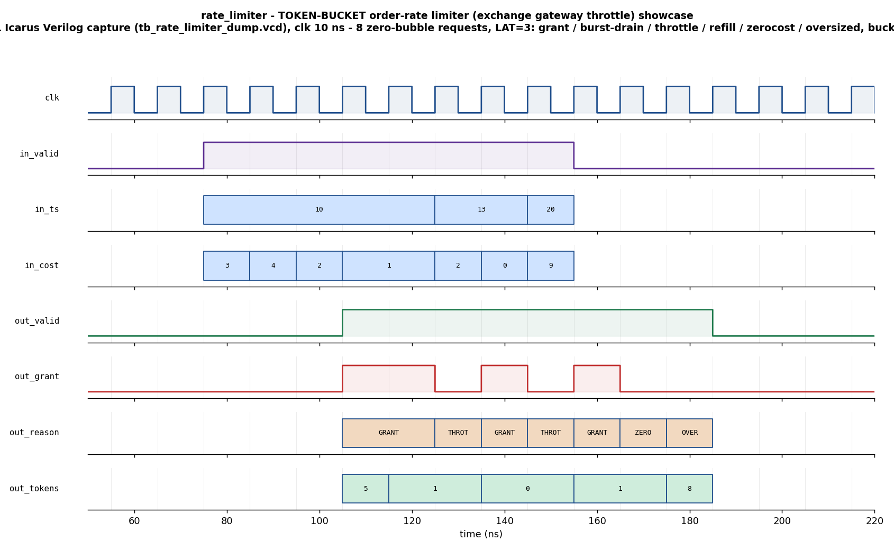

# Day 22 — UVM Token-Bucket Order-Rate Limiter ("Exchange Gateway Throttle") Verification

## Overview

Every exchange caps the rate at which a member firm may submit orders and
messages (an orders-per-second / messages-per-window ceiling). Breaching that
limit earns throttling, fines, or an outright disconnect, so the **outbound**
path of an FPGA trading gateway must police *its own* send rate **before** a
message leaves the wire — and it has to do so at line rate without adding jitter.
The textbook mechanism is a **token bucket**: tokens accrue at a fixed average
rate up to a burst capacity, each admitted order spends `cost` tokens, and an
order that cannot be paid for is **throttled** instead of sent. The bucket grants
a firm a sustained rate while still tolerating a short burst up to the bucket
depth.

`rate_limiter.sv` is a **lazy-refill** token bucket. Instead of a free-running
refill timer, each request carries the current **timestamp** `ts` (a
monotonically non-decreasing tick / microsecond counter). On each request the
bucket first accrues the tokens earned since the previous request —
`elapsed = ts − last_ts`, `refill = elapsed × REFILL_PER_TICK`, saturated at
`BUCKET_MAX` — then judges the order against the refilled level. This is exactly
how a production token bucket avoids a per-cycle adder, and it makes the
admission decision a **pure function of the `{ts, cost}` request stream**
(independent of how many idle clock cycles sit between requests) — which is what
lets an independent golden model check the block transaction-by-transaction.

The block is fully pipelined and fixed-latency: it accepts a brand-new request
**every cycle** (zero-bubble) and emits its decision `LAT = PIPE + 1` cycles
later. Against the refilled available level `avail` it emits, in **strict
priority**, one of four reason codes plus the grant flag:

| Reason | Code | Condition (checked in priority order) | Grant | Tokens after |
|--------|:----:|----------------------------------------|:-----:|--------------|
| `GRANT`     | 0 | `cost ∈ [1..BUCKET_MAX]` and `avail ≥ cost` | 1 | `avail − cost` |
| `THROTTLE`  | 1 | `cost ∈ [1..BUCKET_MAX]` but `avail < cost` | 0 | `avail` |
| `ZEROCOST`  | 2 | `cost == 0` (malformed request)             | 0 | `avail` |
| `OVERSIZED` | 3 | `cost > BUCKET_MAX` (can never be satisfied)| 0 | `avail` |

On every accepted request (any reason) the bucket absorbs the accrued refill and
`last_ts` advances to this request's `ts`.

## Verification goal

Prove that, for an arbitrary stream of `{ts, cost}` requests, the DUT's decision
— **grant flag + reason code + echoed request + available level + remaining
tokens** — exactly matches an **independent, stateful golden token-bucket
reference model** on every request, at fixed latency, with the bucket never
over-refilling past `BUCKET_MAX`, grants only issued when the bucket can pay, and
no X on any decision output.

## Features / coverage list

- Independent **stateful golden reference** (lazy refill + strict-priority
  admission + running `{tokens, last_ts}`), reused by the scoreboard **and** the
  coverage model.
- **Latency-independent FIFO-pairing monitor**: pairs each input request with the
  decision that emerges `LAT` cycles later, so the testbench is robust to `PIPE`.
- **Directed showcase** — eight zero-bubble requests exercising every reason code
  plus a burst drain, a same-tick `refill = 0`, a refill-and-recover, and both
  malformed rejects.
- **Directed corners** — long-idle saturation to `BUCKET_MAX`, an exact-boundary
  grant (`avail == cost`), a one-over throttle (`avail == cost − 1`), a
  single-shot full drain, oversized and zero-cost rejects.
- **Constrained-random regression** — a monotonically advancing timestamp with
  random small inter-arrival gaps (including `0` for same-tick bursts) and costs
  squeezed toward the bucket depth so grants, throttles, zero-cost, and oversized
  all fire.
- **Functional coverage** — `reason × cost-class` cross, plus an available-level
  coverpoint (empty / mid / full).
- **SVA** — fixed-latency contract, reason-in-range, `grant ⇔ reason == GRANT`,
  `tokens ≤ BUCKET_MAX`, grant-implies-could-pay, monotonic timestamps, and no-X.
- **Full UVM environment** — sequence item, config, model, driver, monitor,
  agent, scoreboard, coverage subscriber, virtual sequencer, virtual sequences,
  and smoke / regress tests.

## DUT parameters

| Parameter | Default | Meaning |
|-----------|:-------:|---------|
| `TSW`             | 32 | Timestamp / tick width |
| `TOKW`            | 16 | Token-count width |
| `COSTW`           | 8  | Per-request cost width |
| `BUCKET_MAX`      | 8  | Burst capacity (bucket depth) |
| `REFILL_PER_TICK` | 1  | Tokens accrued per elapsed tick |
| `PIPE`            | 2  | Extra echo/latency stages (`LAT = PIPE + 1`) |
| `RSNW`            | 2  | Reason-code width (derived, holds 0..3) |

## DUT ports

| Port | Dir | Width | Description |
|------|:---:|:-----:|-------------|
| `clk`         | in  | 1      | Clock |
| `rst_n`       | in  | 1      | Async active-low reset (bucket → full, `last_ts → 0`) |
| `cfg_load`    | in  | 1      | Session (re)start strobe |
| `cfg_init_ts` | in  | `TSW`  | Session start timestamp (latched on `cfg_load`; bucket → full) |
| `in_valid`    | in  | 1      | Request present this cycle (zero-bubble capable) |
| `in_ts`       | in  | `TSW`  | Request timestamp (non-decreasing) |
| `in_cost`     | in  | `COSTW`| Tokens this order needs |
| `out_valid`   | out | 1      | Decision present (`LAT` cycles after `in_valid`) |
| `out_grant`   | out | 1      | Admit (asserted only on reason `GRANT`) |
| `out_reason`  | out | `RSNW` | `0 GRANT · 1 THROTTLE · 2 ZEROCOST · 3 OVERSIZED` |
| `out_ts`      | out | `TSW`  | Echoed request timestamp |
| `out_cost`    | out | `COSTW`| Echoed request cost |
| `out_avail`   | out | `TOKW` | Tokens available **after** refill, **before** spend |
| `out_tokens`  | out | `TOKW` | Tokens remaining **after** this request |

## Testbench architecture

```
                              rate_limiter_pkg (UVM)
  ┌───────────────────────────────────────────────────────────────────────┐
  │                                                                         │
  │   rl_*_vseq (smoke/regress) ── on ──▶ rl_vseqr ──▶ rl_sqr               │
  │        │ showcase / corner / random                     │              │
  │        ▼                                                 ▼              │
  │   rl_showcase_seq / rl_corner_seq / rl_random_seq    rl_driver          │
  │                                                          │ {ts,cost}    │
  │                                                          ▼ (drv_cb)     │
  │                                             ┌────────────────────────┐  │
  │                                             │   rate_limiter (DUT)   │  │
  │   rl_cfg{vif, init_ts} ────────────────────▶│  lazy refill + admit   │  │
  │                                             │  {tokens,last_ts} state│  │
  │                                             │  LAT = PIPE+1 pipeline │  │
  │                                             └───────────┬────────────┘  │
  │                                                         │ decision      │
  │                                            (mon_cb) ▼   ▼               │
  │                                             rl_monitor (FIFO pairing)    │
  │                                                 │ rl_obs_item            │
  │                                    ┌────────────┴────────────┐          │
  │                                    ▼                         ▼          │
  │                            rl_scoreboard              rl_coverage        │
  │                     (rl_model golden bucket:    (reason × cost-class,    │
  │                      grant+reason+avail+tokens)  avail empty/mid/full)   │
  │                                    │                                     │
  │                                    ▼  RESULT: *** PASS ***               │
  └───────────────────────────────────────────────────────────────────────┘
```

## Simulation timing



*Real Icarus Verilog capture (`tb_rate_limiter_dump.vcd`), **not** hand-modeled.*
The directed showcase streams eight back-to-back requests (one per clock,
`in_valid` held high, zero bubbles) against the programmed session
(`init_ts = 0`, bucket full = 8); each decision emerges `LAT = 3` cycles later on
`out_valid`. Reading the eight requests (`in_ts` / `in_cost`) against the results
(`out_reason` / `out_grant` / `out_tokens`):

1. `ts=10 cost=3` → **GRANT** (full bucket) → tokens **5**
2. `ts=10 cost=4` → **GRANT** (same tick, no refill) → tokens **1**
3. `ts=10 cost=2` → **THROTTLE** (rate exceeded) → tokens **1**
4. `ts=10 cost=1` → **GRANT** → tokens **0**
5. `ts=10 cost=1` → **THROTTLE** (bucket empty) → tokens **0**
6. `ts=13 cost=2` → **GRANT** (+3 refill over 3 ticks) → tokens **1**
7. `ts=13 cost=0` → **ZEROCOST** (malformed) → tokens **1**
8. `ts=20 cost=9` → **OVERSIZED** (`cost > BUCKET_MAX`, +7 refill saturates to 8) → tokens **8**

(Adjacent identical bus values coalesce into one box in the drawing, e.g. the two
opening GRANTs and the paired `tokens` values.) The window shows the classic
throttle story: a burst drains the bucket to empty, further orders are throttled
at line rate, and grants resume only once the advancing timestamp has refilled
enough tokens.

## How the checking works (scoreboard / reference model)

`rl_model` is an **independent** re-implementation of the bucket — it never reads
the DUT's internal state. For each observed request it recomputes
`elapsed → refill → avail` (saturated at `BUCKET_MAX`), applies the same
strict-priority classification, updates its own running `{tokens, last_ts}`, and
returns the expected `{reason, grant, avail, tokens_after}`. The scoreboard
consumes the monitor's `{input request, DUT decision}` pairs **in arrival order**
and flags any mismatch in the echoed `ts`/`cost`, the reason, the grant flag, the
available level, or the remaining tokens. Because the model advances its state
per request (not per clock), it stays in lock-step with the DUT across
zero-bubble bursts, same-tick requests, and arbitrary idle gaps. `report_phase`
prints `RESULT: *** PASS ***` only if at least one decision was checked and no
mismatch was seen.

## Functional-coverage intent

- **`cp_reason`** — all four reasons (`GRANT`, `THROTTLE`, `ZEROCOST`,
  `OVERSIZED`) observed.
- **`cp_cost`** — cost classes: zero, unit, in-bucket burst `[2..BUCKET_MAX]`,
  and oversized `> BUCKET_MAX`.
- **`cp_avail`** — the refilled level hits empty (0), mid, and full
  (`BUCKET_MAX`).
- **`x_reason_cost`** — the reason × cost-class cross, confirming e.g. that both a
  throttle *and* a grant are seen for in-bucket costs, and that oversized/zerocost
  rejects fire for their respective cost classes.

## Run instructions

Open-source Icarus flow (portable, module-based self-checking TB — captures the
committed waveform):

```bash
make icarus_dump      # compile + run the self-checking TB (prints RESULT: *** PASS ***)
make waveform         # regenerate docs/rate_limiter_waveform.png from the VCD
```

UVM flow (needs a UVM-capable simulator):

```bash
make vcs       UVM_TESTNAME=rl_smoke_test      # Synopsys VCS
make questa    UVM_TESTNAME=rl_regress_test    # Siemens Questa
make verilator UVM_TESTNAME=rl_smoke_test      # Verilator >= 5 (--uvm)
```

## What the testbench checks

- **Grant flag + reason code** match the golden model in strict priority for
  every request.
- **Echoed `ts` / `cost`** on the output equal the request that produced the
  decision (correct pipeline pairing).
- **`out_avail`** (post-refill, pre-spend) matches the lazy-refill computation,
  saturated at `BUCKET_MAX`.
- **`out_tokens`** (remaining) matches: `avail − cost` on a grant, `avail`
  otherwise — and never exceeds `BUCKET_MAX`.
- **Fixed latency** — every request yields exactly one decision `LAT` cycles
  later (SVA `a_latency`); the expected-decision FIFO drains empty at end of test.
- **No X** on any decision output while `out_valid` is high (SVA `a_no_x`).

## Toolchain note

Verified with **Icarus Verilog** (`iverilog -g2012`) via `make icarus_dump`:
the portable self-checking testbench runs the directed showcase, directed
corners, and a 300-iteration constrained-random regression, checking **316
decisions** against the independent golden token-bucket model with **0 errors**
(`RESULT: *** PASS ***`). The committed waveform is a genuine capture of that run.
The full UVM environment (`rate_limiter_pkg.sv` + `tb_top.sv`) targets a
UVM-capable simulator (VCS / Questa / Verilator ≥ 5) via the other Make targets;
UVM was not run here because no UVM-capable simulator is installed in this
environment.
