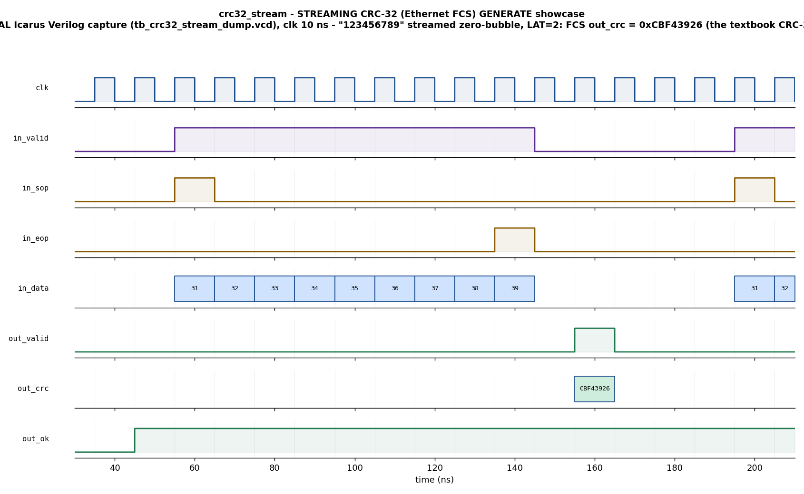

# Day 23 — Streaming CRC-32 (Ethernet FCS) Generator/Checker Verification

A UVM verification environment (with a portable, open-source companion testbench)
for a **byte-serial streaming CRC-32** engine — the *Frame Check Sequence (FCS)*
block that guards integrity on essentially every wire protocol: Ethernet, PCIe
TLPs, USB, SATA, CAN-FD, MPEG-TS, and the gzip/PNG payload CRC. The design both
**generates** the 32-bit FCS a transmitter appends and **checks** an incoming
frame's residue the way a receiver's MAC does.

## Overview

The DUT (`crc32_stream.sv`) is a one-byte-per-cycle CRC engine implementing
**CRC-32/ISO-HDLC** — the *zlib / PNG / IEEE-802.3 Ethernet* CRC:

| Property | Value |
|----------|-------|
| Width | 32 bits |
| Polynomial | `0x04C11DB7` (reflected form `0xEDB88320`) |
| Reflect in / out | yes / yes |
| Init | `0xFFFFFFFF` |
| Final XOR | `0xFFFFFFFF` |
| Good-frame residue | `0x2144DF1C` |
| Check value of `"123456789"` | **`0xCBF43926`** |

This variant is **bit-for-bit identical to Python's `binascii.crc32` / `zlib.crc32`**,
which is exactly what lets an independent golden model check the block
byte-for-byte.

Bytes are streamed with a `sop`/`eop` framing protocol (zero-bubble capable). Each
frame carries a per-frame **mode**, latched at `sop`:

- **GENERATE (0):** the stream is the raw message. `out_crc = running ^ XOROUT` is
  the FCS the transmitter appends (little-endian on the wire). `out_ok` is forced 1.
- **CHECK (1):** the stream is `message || appended-FCS` as a receiver sees it.
  `out_crc` is the CRC **residue**, which for an intact frame equals the constant
  `0x2144DF1C`; `out_ok = (out_crc == RESIDUE)` is the frame-good flag — exactly how
  real Ethernet MAC RX hardware validates a frame.

The running remainder updates combinationally-then-registered on every accepted
byte (so back-to-back zero-bubble bytes always see the up-to-date remainder); the
final XOR, residue compare, and echo are carried through `PIPE` output register
stages, so **`out_valid` pulses exactly `LAT = PIPE` cycles after the `in_eop`
byte** (fixed latency).

## Verification goal

Prove that, for any legal frame streamed at line rate in either mode, the DUT
emits the **correct 32-bit CRC**, the **correct per-frame mode echo**, and — in
CHECK mode — the **correct good/corrupt verdict** (`out_ok`), with a fixed,
byte-count-independent latency and no X on the result bus. The check is
transaction-accurate because the golden model is the same reflected CRC-32 the
rest of the world (zlib/Ethernet) uses.

## Features / coverage list

- Reflected CRC-32 (zlib/Ethernet) streaming engine, `sop`/`eop` framed, zero-bubble.
- Dual **GENERATE** (emit FCS) / **CHECK** (residue verdict) mode, latched per frame.
- Independent golden reference model reused by scoreboard and coverage.
- Directed showcase: canonical `"123456789"` → `0xCBF43926`, a good CHECK frame
  (`ok=1`, residue `0x2144DF1C`), and a corrupted CHECK frame (`ok=0`).
- Directed corners: single-byte frame (`sop`&`eop` same cycle), all-zero payload,
  all-`0xFF` payload, back-to-back zero-bubble frames.
- Constrained-random regression: random-length, mixed-mode frames with a fair mix
  of intact and single-bit-corrupted CHECK frames.
- Functional coverage: mode × length-class, mode × ok.
- SVA (commercial-sim flow): fixed-latency contract, result caused by an `eop`,
  generate-mode `ok`, no-X on result, `sop`/`eop` imply `valid`.
- Global timeout watchdog; self-checking `RESULT: *** PASS ***`.

## DUT parameters

| Parameter | Default | Meaning |
|-----------|---------|---------|
| `DW` | `8` | data (byte) width |
| `CRCW` | `32` | CRC width |
| `POLY` | `0xEDB88320` | reflected CRC-32 polynomial |
| `INIT` | `0xFFFFFFFF` | initial remainder |
| `XOROUT` | `0xFFFFFFFF` | final XOR |
| `RESIDUE` | `0x2144DF1C` | good-frame check residue (CHECK mode) |
| `PIPE` | `2` | output latency in cycles (`LAT = PIPE`, ≥1) |

## DUT ports

| Port | Dir | Width | Description |
|------|-----|-------|-------------|
| `clk` | in | 1 | clock |
| `rst_n` | in | 1 | async active-low reset |
| `in_valid` | in | 1 | byte present this cycle |
| `in_sop` | in | 1 | first byte of a frame (seed CRC to `INIT`, latch mode) |
| `in_eop` | in | 1 | last byte of a frame (emit result `LAT` cycles later) |
| `in_mode` | in | 1 | `0`=GENERATE, `1`=CHECK (latched at `sop`) |
| `in_data` | in | `DW` | the byte |
| `out_valid` | out | 1 | 1-cycle strobe: a frame result is valid |
| `out_crc` | out | `CRCW` | GENERATE: FCS to append; CHECK: residue |
| `out_mode` | out | 1 | echoed per-frame mode |
| `out_ok` | out | 1 | CHECK: frame good (residue match); GENERATE: 1 |

## Testbench architecture

```
                          crc32_stream_pkg (UVM)
   +--------------------------------------------------------------------+
   |  crc_vseqr (virtual sequencer)                                     |
   |     |  smoke / regress virtual sequences                           |
   |     v                                                              |
   |  crc_agent.seqr --> crc_driver ==(sop/eop byte stream)==> [ DUT ]  |
   |                                                              |     |
   |  crc_monitor <=====(pins: in_* and out_*)====================+     |
   |     |  ap_in  (reconstructed input frame: mode + bytes)            |
   |     |  ap_out (frame result: crc + mode + ok)                      |
   |     +----------------+-------------------------+                   |
   |                      v                         v                   |
   |               crc_scoreboard             crc_coverage             |
   |          (golden CRC-32 expected           (mode x len,           |
   |           vs DUT, FIFO ordered)             mode x ok)            |
   +--------------------------------------------------------------------+
        golden model: crc_model::crc()  ==  zlib/binascii.crc32
```

The **driver** streams each frame's bytes one per clock with `sop`/`eop` framing.
The **monitor** reconstructs each input frame from the pins and captures each
result, publishing both to the scoreboard and coverage. The **scoreboard** feeds
every reconstructed input frame through the golden model to obtain the expected
`{crc, mode, ok}` and compares it against the DUT result in arrival order.

The portable Icarus companion (`tb_crc32_stream_dump.sv`) contains the same golden
model and a FIFO scoreboard in plain module style so the design can be genuinely
simulated with free tools.

## Simulation timing



*The canonical CRC-32 check vector `"123456789"` (bytes `0x31..0x39`) streamed one
byte per clock (zero-bubble, `in_valid` held high) in GENERATE mode. `in_sop`
marks the first byte (the reflected remainder is seeded to `0xFFFFFFFF`), `in_eop`
marks the last, and exactly `LAT=2` cycles later `out_valid` pulses with the Frame
Check Sequence `out_crc = 0xCBF43926` — the textbook CRC-32 of `"123456789"` — and
`out_ok = 1`.* **This image is a REAL capture** from an Icarus Verilog run
(`make icarus_dump` → `tb_crc32_stream_dump.vcd`, rendered by
`docs/make_waveform.py`) — it is **not** a hand-modeled diagram.

## How the checking works

The golden reference model (`crc_model::crc`, and the identical `crc_prefix`/
`gm_crc` in the Icarus TB) runs the reflected CRC-32 LFSR over the exact byte
stream the driver sent:

```
c = 0xFFFFFFFF
for each byte b:  c ^= b;  repeat 8:  c = (c & 1) ? (c>>1) ^ 0xEDB88320 : c>>1
FCS/residue = c ^ 0xFFFFFFFF
```

For **GENERATE** frames the expected `out_crc` is that value and `out_ok` is 1.
For **CHECK** frames the stream already ends with the appended FCS, so the expected
`out_crc` is the residue and `out_ok = (residue == 0x2144DF1C)`. A corrupted CHECK
frame yields a residue ≠ the constant, so `out_ok` must be 0. Expected results are
queued and compared against DUT outputs **in order** (a FIFO scoreboard), which
also catches any missing or extra result.

Because the model is bit-identical to `zlib`/`binascii.crc32`, the numbers are
externally verifiable: `CRC32("123456789") == 0xCBF43926`,
`CRC32("A") == 0xD3D99E8B`, and the residue constant `0x2144DF1C`.

## Functional-coverage intent

- **mode × length-class:** GENERATE and CHECK each exercised across single-byte,
  small (2–4), medium (5–8), and large (≥9) frames.
- **mode × ok:** both verdicts (`ok`/not-`ok`) seen in CHECK mode, and the always-1
  `ok` in GENERATE mode — confirming corrupted frames were actually generated.

## Run instructions

Open-source (Icarus Verilog + Python), runs everywhere:

```bash
make icarus_dump     # compile + run the self-checking TB -> RESULT: *** PASS ***
make waveform        # re-render docs/crc32_stream_waveform.png from the VCD
```

UVM flow on a UVM-capable simulator (enables SVA via `+define+CRC_SVA`):

```bash
make vcs       UVM_TESTNAME=crc_smoke_test
make questa    UVM_TESTNAME=crc_regress_test
make verilator UVM_TESTNAME=crc_smoke_test
```

## What the testbench checks

- **`out_crc`** equals the golden reflected CRC-32 for every GENERATE frame (the
  FCS) and the residue for every CHECK frame.
- **`out_ok`** is 1 exactly for intact CHECK frames and 0 for corrupted ones; 1 in
  GENERATE mode.
- **`out_mode`** echoes the frame's mode.
- **Ordering / completeness:** results arrive one-per-frame, in order, with no
  missing or spurious result (FIFO scoreboard drains to empty).
- **Fixed latency & cleanliness** (SVA, commercial flow): `out_valid` exactly
  `LAT` cycles after `in_eop`, each result traceable to an `eop`, and no X/Z on the
  result bus.

> Toolchain note: this machine has Icarus Verilog, which does not implement the UVM
> class library or full concurrent SVA, so the committed waveform and `PASS` come
> from the portable module-based testbench (`tb_crc32_stream_dump.sv`). The UVM
> environment and assertions are provided for a commercial simulator and were not
> run here.
