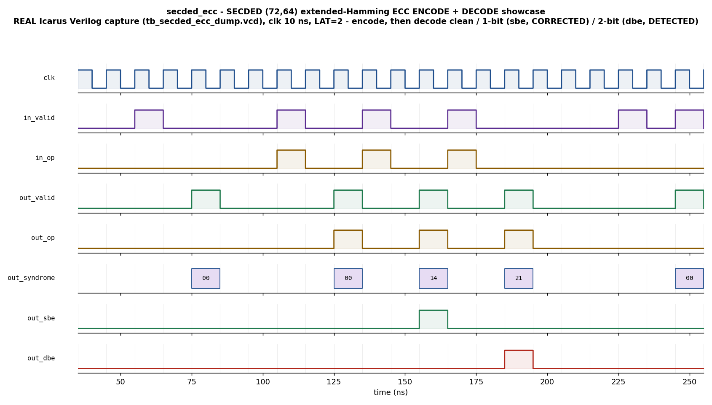

# Day 24 — SECDED (72,64) Extended-Hamming ECC Encoder/Decoder Verification

Single-Error-Correct / Double-Error-Detect (SECDED) is the integrity guard that
lives **inside** memory. Every ECC DRAM DIMM, L2/L3 cache line, register file,
and on-die SRAM stores a handful of extra check bits with each word so that a
**single** flipped bit (cosmic-ray strike, weak retention cell, aging) is
transparently **corrected**, and any **double**-bit error is at least **detected**
and flagged uncorrectable rather than being silently returned as good data.

Where a CRC (Day 23) only *detects* corruption travelling on a wire, an ECC code
*corrects* it in place. This project verifies that block: a parameterized
extended-Hamming SECDED **encoder + decoder**, showcased at the classic memory
geometry **(72, 64)** — 64 data bits, 8 check bits.

---

## Verification goal

Prove, against an **independent golden reference model**, that for every operation:

- **ENCODE** turns a `DW`-bit data word into the correct `CW`-bit codeword.
- **DECODE** of a *clean* codeword returns the original data with `sbe = dbe = 0`
  and a zero syndrome (lossless round-trip).
- **DECODE** of a codeword with **one** flipped bit **corrects** it — the original
  data is restored, `out_sbe = 1`, `out_dbe = 0`, and the syndrome points at the
  error.
- **DECODE** of a codeword with **two** flipped bits is **detected** as
  uncorrectable — `out_dbe = 1`, `out_sbe = 0`.
- Every result is presented at a **fixed latency** `LAT = PIPE` cycles after its
  request, with **no X/Z** on the result buses and `sbe`/`dbe` mutually exclusive.

The golden model mirrors the DUT's exact correction step, so `out_code` and
`out_data` are checked **bit-for-bit in every case** — including the double-bit
case, where the DUT applies a deterministic (but meaningless) "correction" that
the model reproduces exactly.

---

## The code (why it is bit-exact against software)

Extended-Hamming SECDED, built by a textbook construction so an independent model
can reproduce it with zero ambiguity:

- Choose `HAM` = smallest `r` with `2^r ≥ DW + r + 1` (Hamming bound including the
  SECDED bit). For `DW = 64` → `HAM = 7`.
- Base Hamming positions are numbered `1..NBASE` (`NBASE = DW + HAM = 71`).
  **Power-of-two** positions (1, 2, 4, 8, 16, 32, 64) hold the `HAM` Hamming
  parity bits; every other position holds a data bit (assigned in increasing
  position order). Hamming parity *i* (at position `2^i`) is the XOR of all
  positions whose index has bit *i* set.
- One extra **overall parity** bit is the XOR of the whole base codeword — this is
  what upgrades plain Hamming (SEC) to SECDED. The packed codeword is
  `code[0] = overall parity`, `code[p] = base position p` for `p = 1..NBASE`, so
  `CW = NBASE + 1 = 72`.

**Decode** recomputes the `HAM` syndrome bits `S` and the overall parity `P` over
all `CW` bits:

| `P` | `S` | Meaning | Action |
|-----|-----|---------|--------|
| 0 | 0 | no error | pass data through |
| 1 | 0 | flip is in the overall-parity bit itself | correct bit 0, `sbe=1` |
| 1 | ≠0 | single-bit error at position `S` | flip position `S`, `sbe=1` |
| 0 | ≠0 | double-bit error (even, >0) | **uncorrectable**, `dbe=1` |

The construction was cross-checked in Python over **200,000** random words ×
{0,1,2} injected flips before the RTL was written: clean decode lossless,
single-bit always corrected, double-bit always detected.

---

## DUT — `secded_ecc.sv`

### Parameters

| Parameter | Default | Meaning |
|-----------|---------|---------|
| `DW`    | `64` | data-word width *K* |
| `PIPE`  | `2`  | output-register depth = latency `LAT` (≥1) |
| `HAM`   | `ham_bits(DW)` = 7 | derived: number of Hamming parity bits |
| `NBASE` | `DW+HAM` = 71 | derived: base Hamming length |
| `CW`    | `NBASE+1` = 72 | derived: codeword width |

`HAM`/`NBASE`/`CW` are derived (via a compilation-unit `ham_bits()` function) —
do not override them.

### Ports

| Port | Dir | Width | Description |
|------|-----|-------|-------------|
| `clk`          | in  | 1     | clock |
| `rst_n`        | in  | 1     | active-low async reset |
| `in_valid`     | in  | 1     | request present this cycle |
| `in_op`        | in  | 1     | `0` = ENCODE, `1` = DECODE |
| `in_data`      | in  | `DW`  | ENCODE: the data word |
| `in_code`      | in  | `CW`  | DECODE: received (possibly-corrupted) codeword |
| `out_valid`    | out | 1     | 1-cycle result strobe, `LAT` cycles after request |
| `out_op`       | out | 1     | echoed op |
| `out_code`     | out | `CW`  | ENCODE: codeword; DECODE: corrected codeword |
| `out_data`     | out | `DW`  | ENCODE: echoed data; DECODE: corrected data |
| `out_syndrome` | out | `HAM` | DECODE: raw Hamming syndrome |
| `out_sbe`      | out | 1     | DECODE: single-bit error corrected |
| `out_dbe`      | out | 1     | DECODE: double-bit error detected (uncorrectable) |

The encode/decode datapath is combinational, then carried through `PIPE` output
registers for fixed latency; the outputs are fully registered.

---

## Features / coverage

- Parameterized extended-Hamming **SECDED** encode + decode, `(72,64)` showcase.
- **Single-error correction** and **double-error detection** with a raw syndrome
  read-out and correct-vs-detect verdict flags.
- Fixed-latency (`LAT = PIPE`), zero-bubble-capable streaming of operations.
- Independent golden model shared by the driver (fault injection), the scoreboard
  (result prediction) and the coverage collector.
- Directed **showcase** (encode → clean / 1-bit / 2-bit decode) + **corners**
  (all-zero, all-ones, Hamming-parity-bit flip, overall-parity-bit flip,
  data-bit flip, back-to-back zero-bubble).
- **Constrained-random** fault campaign — random data, random op, and {0,1,2}
  injected bit flips at random positions.
- Functional coverage: `op × error-class {none, single, double}` cross, and
  syndrome-is-zero.
- SVA: fixed-latency contract, result caused by a request, `sbe`/`dbe` mutual
  exclusion, ENCODE-never-errors, no-X on the result bus.

---

## Testbench architecture

Two testbenches drive the same DUT:

- **`tb_secded_ecc_dump.sv`** — portable, module-based, self-checking TB that runs
  on open-source **Icarus Verilog** (which does not implement UVM). It is what
  captures the committed VCD/waveform.
- **`secded_ecc_pkg.sv` + `tb_top.sv`** — a full **UVM** environment
  (agent/driver/monitor/scoreboard/coverage + virtual sequences + SVA) for a
  UVM-capable simulator (VCS / Questa / Verilator ≥ 5 `--uvm`).

```
                +--------------------------------------------------------+
                |                    tb_top (UVM)                        |
                |                                                        |
  smoke/regress |   +----------------+        +----------------------+   |
  virtual seq --+-->| secded_vseqr   |        |   secded_scoreboard  |   |
                |   +-------+--------+         |  golden-model expect |   |
                |           | seq_item         |  vs DUT, FIFO order  |   |
                |           v                  +----------^-----------+   |
                |   +----------------+   ap_in            | ap_out        |
                |   |  secded_driver |-------------+      |               |
                |   |  encode+inject |             |      |               |
                |   +-------+--------+       +-----+------+-----+         |
                |           | pins           |   secded_monitor |         |
                |           v                +-----+------+-----+         |
                |   +----------------+   ap_in|      |ap_out               |
                |   | secded_ecc_if  |<-------+      +----> secded_coverage|
                |   +-------+--------+  (req + result pins)                |
                |           |                                             |
                |           v                                             |
                |   +----------------+                                    |
                |   |   secded_ecc   |  (DUT: encode / decode datapath    |
                |   |     (DUT)      |   + fixed-latency output pipeline)  |
                |   +----------------+                                    |
                +--------------------------------------------------------+

  golden secded_model: encode() / syndrome() / correct() / extract() / sbe() / dbe()
  is shared by the driver (build faulty codewords) and the scoreboard+coverage.
```

---

## Simulation timing



*Directed showcase captured from a **real Icarus Verilog run**
(`tb_secded_ecc_dump.vcd`), rendered to PNG by `docs/make_waveform.py` — this is a
genuine simulator capture, **not** a hand-drawn diagram. Reading left to right at
`clk = 10 ns`, `LAT = 2`: first `in_op = 0` **ENCODE** (result: syndrome `00`,
`sbe = dbe = 0`); then three `in_op = 1` **DECODE**s of the same word — **clean**
(syndrome `00`, no flags), **single-bit** (syndrome `14`, `out_sbe` pulses — the
error is **corrected**), and **double-bit** (syndrome `21`, `out_dbe` pulses — the
error is **detected** uncorrectable). Each `out_valid` strobe lands exactly two
cycles after its request.*

---

## How the checking works

For every operation the **golden `secded_model`** predicts the expected result:

- **ENCODE**: `expected_code = encode(data)`, `expected_data = data`,
  syndrome `0`, `sbe = dbe = 0`.
- **DECODE**: `corrected = correct(rcv)`, `expected_data = extract(corrected)`,
  `expected_syndrome = syndrome(rcv)`, `expected_sbe = sbe(rcv)`,
  `expected_dbe = dbe(rcv)`.

The predictions are pushed into per-field FIFOs as requests are issued; each DUT
`out_valid` pops the FIFO heads and compares `{op, code, data, syndrome, sbe,
dbe}` exactly, in arrival order. The DUT and the model are **structurally
independent** implementations of the same code (the DUT builds parity via
covered-position loops; the model is a separate copy), so agreement across the
whole directed + random fault campaign is a real cross-check, not a tautology.

A run prints per-operation `OK`/`MISMATCH` lines and a final
`RESULT: *** PASS ***` only if every check passed and no expected result went
missing. The current Icarus run does **511** checks with **0** errors.

### Functional-coverage intent

- **`op × error-class`** — exercise ENCODE and DECODE against each of
  {no error, single-bit, double-bit}, so the correct/detect logic is covered in
  all three regimes for the decode path.
- **syndrome-is-zero** — confirm both zero (clean / pure double-parity-cancel) and
  non-zero syndromes are observed at the output.

---

## Running

Open-source flow (Icarus Verilog + Python/matplotlib) — runs everywhere:

```bash
make icarus_dump      # compile + run the self-checking TB -> RESULT: *** PASS ***
make waveform         # re-render docs/secded_ecc_waveform.png from the fresh VCD
make clean
```

UVM flow (needs a UVM-capable simulator):

```bash
make vcs       UVM_TESTNAME=secded_smoke_test     # Synopsys VCS
make questa    UVM_TESTNAME=secded_regress_test   # Siemens Questa
make verilator UVM_TESTNAME=secded_smoke_test     # Verilator >= 5, built --uvm
```

> Toolchain note: this project was simulated and the waveform captured with
> **Icarus Verilog** (`make icarus_dump`). The UVM environment is provided for a
> UVM-capable simulator and was not run here (no such simulator was installed);
> the SVA assertions are guarded by `+define+SECDED_SVA` on the UVM targets.

---

## What the testbench checks

- **ENCODE** produces the exact golden codeword for every data word.
- **Clean DECODE** is lossless: original data restored, `sbe = dbe = 0`.
- **Single-bit faults** (in data bits, Hamming parity bits, or the overall-parity
  bit) are **corrected**: `sbe = 1`, corrected data matches the original.
- **Double-bit faults** are **detected**: `dbe = 1`, `sbe = 0`.
- **Fixed latency**: `out_valid` appears exactly `LAT` cycles after each request;
  results arrive in order and the expected FIFO drains completely.
- **No X/Z** on any result bus while `out_valid`, and `sbe`/`dbe` never assert
  together (SVA on the UVM flow; scoreboard equality on the Icarus flow).
