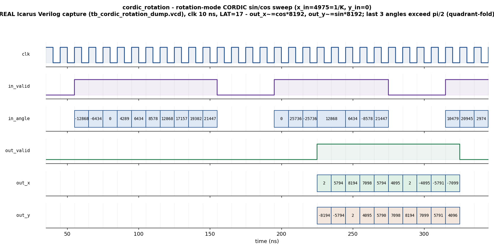

# Day 25 — Rotation-Mode CORDIC (Hardware sin/cos & Vector Rotator) Verification

CORDIC — **CO**ordinate **R**otation **DI**gital **C**omputer — is the classic way
hardware computes trigonometry **without a multiplier**. Using only adders,
subtracters and hard-wired shifts, a CORDIC engine rotates a 2-D vector by a
requested angle, one "elementary" `atan(2^-i)` micro-rotation at a time. It is the
block behind hardware **sin/cos** generators, **polar ⇄ rectangular** converters,
**phase rotators** (DDS, QAM modems, software-defined radio), FFT **twiddle**
multiplies, and magnitude/`atan2` units.

This project verifies a fully-pipelined **rotation-mode** CORDIC. Given a start
vector `(x_in, y_in)` and an angle `z` (radians, signed fixed-point) it emits

```
x_out ≈ K · ( x_in·cos(z) − y_in·sin(z) )
y_out ≈ K · ( x_in·sin(z) + y_in·cos(z) )
```

where `K ≈ 1.64676` is the fixed CORDIC processing gain (this core is
gain-*uncompensated*). Preload `x_in = round(2^FRAC / K) = 4975`, `y_in = 0` and
the outputs read directly as scaled cosine and sine: `x_out ≈ cos(z)·8192`,
`y_out ≈ sin(z)·8192`.

---

## Verification goal

Prove, against an **independent golden reference model**, that for every request
the DUT computes the correct rotation:

- The output vector equals the input rotated by `z` (times gain `K`) — for pure
  **sin/cos generation**, for **axis** vectors, and for **general** `(x, y)`
  vectors.
- **Full `[-π, π]` angle range** works, including angles beyond `±π/2` that
  exercise the combinational **quadrant-fold** pre-stage (rotation-mode CORDIC
  only converges natively for `|z| ≤ 1.7433 rad`).
- Every result is presented at a **fixed latency** `LAT = NITER+1 = 17` cycles
  after its request, back-to-back (**zero-bubble**), with **no X/Z** on the
  result buses, and `in_angle` correctly echoed to `out_angle`.

The DUT is a fixed-point **shift-add recurrence**; the golden model is
**language-level trigonometry** (`$cos`/`$sin`, scaled by `K`). They share no
implementation, so agreement is a genuine cross-check. Because CORDIC is a
finite-precision approximation, the checker uses a small **fixed-point tolerance**
(see below) rather than a bit-exact compare — this is the honest and standard way
to verify a DSP datapath.

---

## How the algorithm works (and why the tolerance is what it is)

Rotation-mode CORDIC starts with `(x, y, z) = (x_in, y_in, angle)` and, for
`i = 0 … NITER-1`, drives the angle accumulator `z` toward zero:

```
dᵢ = (z ≥ 0) ? +1 : −1
x ← x − dᵢ · (y >>> i)          # arithmetic shift = multiply by ±2^-i
y ← y + dᵢ · (x >>> i)
z ← z − dᵢ · atan(2^-i)         # atan table, Q2.13
```

Each step rotates `(x, y)` by exactly `±atan(2^-i)` and lengthens it by
`√(1+2^-2i)`; after `NITER` steps `z ≈ 0`, the vector has been rotated by the
requested angle, and its length has grown by the constant

```
K = ∏_{i=0}^{NITER-1} √(1 + 2^-2i) ≈ 1.6467602579   (NITER = 16)
```

**Quadrant fold.** The sum of all elementary angles is only `≈ 1.7433 rad`, so
the raw iteration diverges past `±π/2`. A combinational pre-stage maps any
`in_angle ∈ [-π, π]` into `[-π/2, π/2]`: for `angle > π/2` it uses `angle − π` and
**negates** the start vector; for `angle < -π/2` it uses `angle + π` and negates
(rotating a vector by `π` negates it). The golden model always uses the *original*
angle, so the fold is checked end-to-end.

**Precision & tolerance.** With `DW = 16`, `FRAC = 13`, `NITER = 16` and
*truncating* shifts, the worst-case output error is **≈ 11 LSB** (measured in
Python over 200 000 random rotations). The scoreboard allows `|error| ≤ TOL = 24`
LSB (≈ `0.003`, under `0.1 %` of the `±4.0` full scale) — comfortably above the
finite-precision floor yet tight enough to catch any real functional break.

---

## Parameters

| Parameter | Meaning | Default |
|-----------|---------|---------|
| `DW` | `x`/`y` word width (signed, Q2.`FRAC`, range ±4.0) | 16 |
| `AW` | angle word width (signed radians, Q2.`FRAC`) | 16 |
| `FRAC` | fractional bits shared by `x`/`y` and angle | 13 |
| `NITER` | number of CORDIC micro-rotation stages (= pipe depth) | 16 |

Derived: `LAT = NITER + 1 = 17` (1 input/fold register + `NITER` stages),
`XYW = DW + 4 = 20` internal guard-bit datapath, `K ≈ 1.64676`,
`round(2^13/K) = 4975`, `π = 25736`, `π/2 = 12868` in Q2.13.

## Ports

| Port | Dir | Width | Meaning |
|------|-----|-------|---------|
| `clk` | in | 1 | clock |
| `rst_n` | in | 1 | synchronous active-low reset (clears the valid pipeline) |
| `in_valid` | in | 1 | request strobe |
| `in_x` | in | `DW` (signed) | start-vector X (Q2.13) |
| `in_y` | in | `DW` (signed) | start-vector Y (Q2.13) |
| `in_angle` | in | `AW` (signed) | rotation angle, radians (Q2.13), `[-π, π]` |
| `out_valid` | out | 1 | result strobe (`LAT` cycles after `in_valid`) |
| `out_x` | out | `DW` (signed) | rotated X ≈ `K·(x·cos − y·sin)` |
| `out_y` | out | `DW` (signed) | rotated Y ≈ `K·(x·sin + y·cos)` |
| `out_angle` | out | `AW` (signed) | echoed `in_angle` (pipeline-delayed) |

---

## Testbench architecture

```
                          cordic_rotation_pkg (UVM)
  ┌───────────────────────────────────────────────────────────────────────┐
  │  cordic_vseqr (virtual sequencer)                                       │
  │      │  smoke_vseq / regress_vseq                                       │
  │      ▼                                                                  │
  │  ┌────────────┐   seq_item   ┌───────────┐   drv_cb   ┌──────────────┐  │
  │  │ sequencer  │─────────────▶│  driver   │───────────▶│              │  │
  │  │ (cordic_   │              │ (1 req/cyc,│           │  cordic_     │  │
  │  │  item)     │              │  0-bubble) │           │  rotation    │  │
  │  └────────────┘              └───────────┘           │   (DUT)      │  │
  │   sincos / corner / random                mon_cb ┌───│  17-stage    │  │
  │                                                   │   │  pipeline    │  │
  │                              ┌───────────┐        ▼   └──────────────┘  │
  │                              │  monitor  │  ap_in / ap_out              │
  │                              └─────┬─────┘                              │
  │                       ap_in  ┌─────┴──────┐  ap_out                     │
  │                              ▼            ▼                             │
  │                     ┌──────────────┐  ┌──────────────┐                  │
  │                     │  coverage    │  │ scoreboard   │                  │
  │                     │ quad×fold×   │  │  golden      │                  │
  │                     │  kind        │  │  cordic_model│                  │
  │                     └──────────────┘  │  ±TOL check  │                  │
  │                                       └──────────────┘                  │
  └───────────────────────────────────────────────────────────────────────┘
       golden cordic_model = real-valued  K·(cos/sin)  — independent of the DUT
```

The **monitor** is latency-independent: it publishes every request on `ap_in`
and every result on `ap_out`. The **scoreboard** pushes the golden expectation
for each request into a FIFO and pops it in arrival order to check each result —
so it never hard-codes the pipeline depth.

---

## Simulation timing



*A **real Icarus Verilog capture** (`tb_cordic_rotation_dump.vcd`, rendered by
`docs/make_waveform.py` — **not** a hand-drawn diagram). The directed showcase
preloads `x_in = 4975 = round(1/K)`, `y_in = 0` and sweeps the angle
`-π/2, -π/4, 0, π/6, π/4, π/3, π/2, 2π/3, 3π/4, 5π/6` back-to-back (zero-bubble).
After the fixed `LAT = 17` cycle latency, `out_x` tracks `cos(angle)·8192` and
`out_y` tracks `sin(angle)·8192`: e.g. angle `0 → (8194, 2) ≈ (1.0, 0.0)`,
`π/2 → (2, 8194) ≈ (0.0, 1.0)`, and the last three angles exceed `π/2` and
exercise the quadrant-fold → `2π/3 → (−4095, 7099) ≈ (−0.5, 0.866)`. All within
tolerance of the golden `cos/sin`.*

---

## What the testbench checks

**Golden model** (`cordic_model`, reused by scoreboard **and** coverage) — an
independent real-valued reference:
`exp_x = round(K·(x·cos(a) − y·sin(a))·2^13)`,
`exp_y = round(K·(x·sin(a) + y·cos(a))·2^13)`.

**Scoreboard** — fixed-latency, in-order: for each result, `|out_x − exp_x| ≤ TOL`
**and** `|out_y − exp_y| ≤ TOL`, and `out_angle == in_angle`. Reports
`worst |err|` and an unmatched-FIFO error if any request never produced a result.

**Stimulus**

- **Directed sin/cos sweep** — `x=1/K, y=0` across all four quadrants + the fold,
  zero-bubble (this is the captured waveform).
- **Directed corners** — identity (`angle = 0`), `±π`, unit `+x` rotated `+90°`
  (→ `+y`), unit `+y` rotated `+90°` (→ `−x`), general `(1,1)` at `+45°`, a
  negative vector, and a general vector into the fold region.
- **Constrained-random** — random start vectors (`|x|,|y| ≤ 1.0`) and random
  angles across the full `[-π, π]` range (**4000** rotations in the Icarus run).

**Functional coverage** (`cordic_coverage`) — angle *quadrant* (`−far / −near /
zero / +near / +far`) × *fold* flag × *vector kind* (cos/sin-gen / axis /
general), with a quadrant × kind cross.

**SVA** (in `cordic_rotation.sv`, under `+define+CORDIC_SVA`) — the fixed-latency
contract (`in_valid |-> ##LAT out_valid`) and no-X on the result buses.

---

## Run instructions

**Open-source / portable (Icarus Verilog) — actually runs here and captures the
waveform:**

```bash
make icarus_dump     # compile + run the self-checking TB -> "RESULT: *** PASS ***"
make waveform        # re-render docs/cordic_rotation_waveform.png from the VCD
```

**Full UVM environment (needs a UVM-capable simulator):**

```bash
make vcs       UVM_TESTNAME=cordic_smoke_test      # Synopsys VCS
make questa    UVM_TESTNAME=cordic_regress_test    # Siemens Questa
make verilator UVM_TESTNAME=cordic_smoke_test      # Verilator >= 5 (--uvm)
```

`cordic_smoke_test` runs the sin/cos-sweep + corner virtual sequence;
`cordic_regress_test` adds eight constrained-random bursts.

> **Toolchain note.** This design was genuinely simulated with **Icarus Verilog**
> — the module-based testbench (`tb_cordic_rotation_dump.sv`) checks **4018**
> transactions against the golden model and prints `RESULT: *** PASS ***`, and the
> committed waveform is that real VCD. The UVM environment
> (`cordic_rotation_pkg.sv` + `tb_top.sv`) targets a UVM-capable simulator
> (VCS/Questa/Verilator ≥ 5) and was **not** run in this environment, which has
> only Icarus (which does not implement the UVM class library).

---

## Files

| File | Role |
|------|------|
| `cordic_rotation.sv` | DUT — pipelined rotation-mode CORDIC + quadrant fold + SVA |
| `cordic_rotation_if.sv` | UVM interface (request/result + clocking blocks) |
| `cordic_rotation_pkg.sv` | UVM env — model, item, driver, monitor, agent, scoreboard, coverage, virtual sequencer, sequences, tests |
| `tb_top.sv` | UVM top (clock/reset, DUT+IF, `run_test`) |
| `tb_cordic_rotation_dump.sv` | portable Icarus self-checking TB (runs everywhere; dumps the VCD) |
| `Makefile` | `icarus_dump` / `waveform` / `vcs` / `questa` / `verilator` targets |
| `docs/make_waveform.py` | renders the committed PNG from the real VCD |
| `docs/cordic_rotation_waveform.png` | captured directed-showcase waveform |
