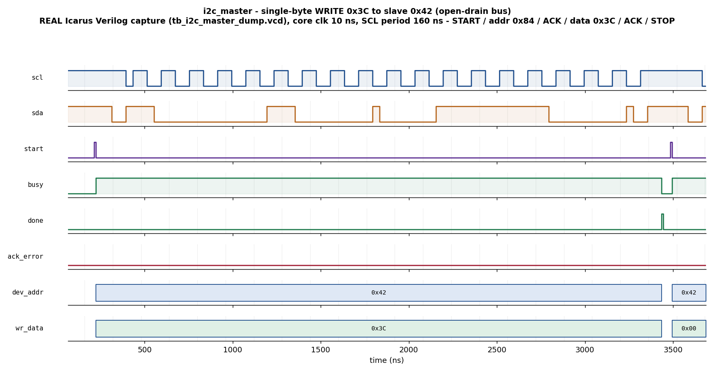

# Day 26 — UVM I²C Master Controller Verification

Verification of a **single-master, open-drain I²C controller** — the canonical
two-wire serial bus (SDA/SCL) that connects a host to sensors, EEPROMs, RTCs,
codecs and power-management ICs on virtually every board. Where Day 4 (UART) and
Day 11 (SPI) covered the other two classic serial links, this day adds the
distinctive I²C verification challenge: a **bidirectional, wired-AND, open-drain
bus** where a device never drives a logic ‘1’ — it only pulls the line low or
releases it to an external pull-up — and where data on SDA must be **stable
while SCL is high** and may only change while SCL is low. START and STOP are
themselves defined by the illegal-looking SDA-transition-while-SCL-high.

The DUT (`i2c_master.sv`) performs one **single-byte** transaction per `start`
pulse using 7-bit addressing:

```
WRITE (rw=0): START · {addr,W} · [slave ACK] · data · [slave ACK] · STOP
READ  (rw=1): START · {addr,R} · [slave ACK] · data(from slave) · master NACK · STOP
```

`ack_error` is raised when the addressed slave does not acknowledge the address
phase (or the data phase on a write).

---

## Verification goal

Prove that for **every** transaction the master:

1. frames the bus correctly (START, 8 address bits MSB-first with the R/W bit,
   9th-bit ACK slot, 8 data bits, ACK/NACK slot, STOP),
2. drives SDA **only while SCL is low** and holds it stable through the SCL-high
   sampling window (true open-drain, never a hard ‘1’),
3. returns the correct **read byte** captured from the slave, delivers the
   correct **write byte** to the slave, and
4. correctly reports **`ack_error`** when (and only when) the addressed device
   does not ACK.

An **independent golden reference model** predicts `{ack_error, rd_data,
slave-captured-write-byte}` from the transaction request and the known slave
address; a scoreboard checks the DUT + slave against it on every `done`.

---

## Features / coverage list

- 7-bit addressing, MSB-first, R/W bit appended (`{addr[6:0], rw}`).
- Single-byte **write** and **read** with slave ACK / master NACK.
- **Address-NACK** detection → `ack_error` (both on writes and reads).
- Programmable bit rate via `DIV` (SCL period = `4·DIV` core clocks); every bit
  is split into four quarter phases so SDA changes only in the SCL-low quarter.
- True **open-drain** driving (`oe=1`→pull low, `oe=0`→release-to-pull-up).
- Behavioral **I²C slave model** (`i2c_slave_model.sv`) as the bus far end:
  START/STOP detection, address match + ACK/NACK, write capture, read playback.
- Golden **reference-model scoreboard** (transaction-level).
- Directed showcase + **constrained-random** regression (~200 transactions).
- Functional coverage: `rw × ack` cross, plus data-byte classes {0x00, 0xFF,
  mid}.
- SVA: `done` is a one-cycle pulse, `done` only inside `busy`, no-X on the bus
  while busy (interface-bound for UVM sims; equivalent checkers in the Icarus TB).

---

## DUT parameters

| Parameter | Default | Meaning |
|-----------|---------|---------|
| `DIV`     | `4`     | Core clocks per quarter phase; SCL period = `4·DIV` core clocks (here 16 clk = 160 ns SCL bit at a 10 ns clock). |

## DUT ports

| Port | Dir | Width | Description |
|------|-----|-------|-------------|
| `clk`       | in    | 1 | Core clock |
| `rst_n`     | in    | 1 | Active-low reset |
| `start`     | in    | 1 | 1-cycle pulse to launch a transaction (sampled when `!busy`) |
| `rw`        | in    | 1 | 0 = write, 1 = read |
| `dev_addr`  | in    | 7 | 7-bit slave address |
| `wr_data`   | in    | 8 | Byte to write (rw=0) |
| `busy`      | out   | 1 | High while a transaction is in flight |
| `done`      | out   | 1 | 1-cycle pulse at transaction end |
| `ack_error` | out   | 1 | Latched: address (or write data) not ACKed |
| `rd_data`   | out   | 8 | Captured read byte (valid at `done`, rw=1) |
| `scl`       | inout | 1 | Open-drain serial clock (needs external pull-up) |
| `sda`       | inout | 1 | Open-drain serial data (needs external pull-up) |

---

## Testbench architecture

```
              +----------------------------------------------------------+
              |                    i2c_smoke / regress vseq               |
              |             (write · read · addr-NACK · random)           |
              +----------------------------+-----------------------------+
                                           | seq_items (rw,addr,wdata,mem)
                                           v
   +-----------+        +-----------+   sequencer   +--------------------+
   |  i2c_txn  | -----> | i2c_driver| ------------> |     i2c_master     |
   | (rw,addr, |        | start pulse,             |        (DUT)        |
   |  wdata,   |        | program slv_mem          |   scl  <-------->   |
   |  mem)     |        +-----------+              +----+----------+-----+
   +-----------+                                        |  open-drain |
                                                        |  wired-AND  |  tri1 pull-ups
                                                   +----v----------v-----+
                                                   |  i2c_slave_model     |
                                                   |  (ACK/NACK, wr cap,  |
                                                   |   read playback)     |
                                                   +----+----------+------+
                                                        | pins + slv_wr_byte
                                          +-------------v--------------+
                                          |        i2c_monitor         |
                                          |  latch req @start, publish |
                                          |  {ack_error,rd_data,wr}    |
                                          +------+--------------+------+
                                                 | analysis      | analysis
                                                 v               v
                                    +------------------+  +----------------+
                                    |  i2c_scoreboard  |  |  i2c_coverage  |
                                    |  golden model    |  |  rw×ack, data  |
                                    |  predict & check |  |  classes       |
                                    +------------------+  +----------------+
```

The UVM environment (`i2c_master_pkg.sv` + `tb_top.sv`) targets VCS / Questa /
Verilator. Because **Icarus Verilog does not implement the UVM class library**,
the identical verification job is also provided as a portable module-based
self-checking testbench, `tb_i2c_master_dump.sv`, which is what actually runs in
the open-source flow and captures the committed waveform.

---

## Simulation timing



*Directed showcase — a single-byte **WRITE of 0x3C to slave 0x42**, captured
from a **real Icarus Verilog run** (`tb_i2c_master_dump.vcd`, `make waveform`).
Reading the open-drain pins: **START** (SDA falls while SCL high) → 8 SCL pulses
clocking the address byte `{0x42,W}=0x84` MSB-first → the **slave ACK** in the
9th pulse (SDA pulled low) → 8 SCL pulses clocking the data byte `0x3C` → a
second **ACK** → **STOP** (SDA rises while SCL high). `busy` is high for the
whole transfer, `done` pulses at the end and `ack_error=0` because the address
was acknowledged. This is a genuine captured waveform, **not** a hand-drawn
diagram.*

---

## How the checking works

**Golden reference model** (`i2c_model` in the package; `predict()` in the
Icarus TB): a transaction to the matching address ACKs, so on a **read** the
master must return the slave's memory byte and on a **write** the slave must
capture `wr_data`; any other address NACKs, so `ack_error` must be 1 and no data
moves. The model is fully independent of the DUT and of the slave model.

**Scoreboard**: on every completed transaction (published by the monitor at
`done`) it runs the golden model on the request and checks, in arrival order:

- `ack_error` matches the prediction,
- on an ACKed read, `rd_data` equals the slave's byte,
- on an ACKed write, the slave's captured byte equals `wr_data`.

**Slave model** (`i2c_slave_model.sv`) is a reactive bus component, not a second
DUT: it detects START/STOP from SDA edges while SCL is high, shifts the address
in on SCL falls, ACKs only its own address, captures write data, and plays read
data back MSB-first — giving the master a realistic far end to talk to.

---

## Functional-coverage intent

- **`rw × ack`** cross — every combination of {write, read} × {ACKed, NACKed}
  must be exercised (a write that succeeds, a write that is NACKed, a read that
  succeeds, a read that is NACKed).
- **Data classes** — the all-zeros `0x00`, all-ones `0xFF`, and mid-range data
  bytes are all seen, so the byte-serial shifter is exercised across its range.

The Icarus TB asserts every one of these bins was hit before it is allowed to
print `PASS`; the UVM `i2c_coverage` component collects the same via a
covergroup.

---

## What the testbench checks (summary)

| Check | Where |
|-------|-------|
| `ack_error` correct for matching / non-matching address | scoreboard vs golden model |
| Read byte equals slave memory | scoreboard |
| Write byte delivered to slave equals `wr_data` | scoreboard |
| `done` is a single-cycle pulse | SVA / checker |
| `done` only asserts inside `busy` | SVA / checker |
| No X on `scl`/`sda` while `busy` | SVA / checker |
| All coverage bins hit before PASS | Icarus TB / covergroup |
| Global timeout | both TBs |

---

## Run instructions

Open-source flow (Icarus + Python), runs everywhere and regenerates the
waveform:

```bash
make icarus_dump     # compile + run the self-checking TB, prints RESULT: *** PASS ***
make waveform        # re-render docs/i2c_master_waveform.png from the fresh VCD
```

UVM flow (needs a UVM-capable simulator):

```bash
make vcs       UVM_TESTNAME=i2c_smoke_test
make questa    UVM_TESTNAME=i2c_regress_test
make verilator UVM_TESTNAME=i2c_smoke_test
```

**Status:** `make icarus_dump` runs on Icarus Verilog and passes — **208 checks,
0 errors**, all coverage bins hit (`RESULT: *** PASS ***`). The UVM targets are
provided for VCS/Questa/Verilator and are not run here (no UVM-capable simulator
in this environment).
