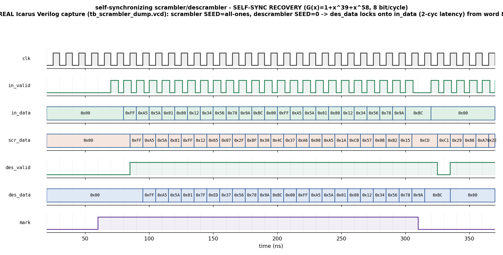

# Day 27 — Self-Synchronizing Scrambler / Descrambler (10GBASE-R PCS) Verification

Verification of a parameterized, WIDTH-bit-parallel **self-synchronizing
(multiplicative) scrambler / descrambler** — the physical-layer data-whitening
block on serial links. The showcase geometry is the IEEE 802.3 **10GBASE-R PCS**
scrambler,

```
G(x) = 1 + x^39 + x^58        (58-bit state, feedback taps at 39 and 58)
```

used to guarantee enough bit transitions for the receiver's clock-and-data
recovery and to spread the transmitted spectrum. It is *multiplicative* — the
shift register is fed by the bit that travels on the wire — which makes the
descrambler **self-synchronizing**: it re-derives the transmitter's LFSR state
from the received bits alone, regardless of its own reset seed. That recovery is
the headline property this project verifies.

This is the SerDes / line-coding companion to the link-layer integrity blocks
already in the series — Day 23 (CRC-32 FCS, error *detection*) and Day 24
(SECDED ECC, error *correction*) — and to the board-level serial links
UART (Day 4), SPI (Day 11) and I²C (Day 26).

## Verification goal

Prove, transaction-by-transaction against an independent reference model, that
the chained link

```
in_data --> [ scrambler SEED_TX ] --scr--> (optional wire error) --> [ descrambler SEED_RX ] --> des
```

1. **scrambles correctly** — the scrambled midpoint is bit-exact against a
   bit-serial golden model that is itself pinned to a Python-generated
   Known-Answer vector (an implementation-independent oracle);
2. **self-synchronizes** — the descrambler is deliberately reset to a *different*
   seed than the scrambler, yet the recovered stream equals the original payload
   from word `ceil(LFSR_W/WIDTH) = 8` (58 received bits) onward;
3. **degrades gracefully under a wire error** — a single flipped line bit
   produces a *bounded* error burst (the self-synchronizing descrambler
   multiplies a channel error by the tap count, so echoes appear at bit offsets
   0 / 39 / 58) and then the descrambler **re-locks** automatically;
4. holds its **fixed-latency valid contract** and never emits X.

## Features / coverage

- Parameterized `WIDTH`-bit-parallel datapath — the `WIDTH` serial steps are
  unrolled in `always_comb` (the classic "parallelize the LFSR" exercise, a rich
  source of tap-index / shift-direction / off-by-one bugs).
- One RTL module covers **both directions** via `MODE_DESCRAMBLE`; only the bit
  shifted into the register differs (output bit for scramble, input bit for
  descramble).
- **Independent bit-serial golden model** (a different implementation from the
  parallel RTL) reused by the scoreboard and coverage.
- **Python Known-Answer vectors** embedded in the TB pin the SV golden to an
  implementation-independent oracle (28 vectors: all-zero whitening + a mixed
  payload).
- Directed showcase (self-sync recovery from a wrong seed, all-zero whitening),
  a **valid-gap** corner (out_valid drops, data holds), a **single-bit wire-error**
  corner (bounded burst → re-lock), an all-ones burst, and a large
  **constrained-random** regression (~4000 words) with sprinkled single-bit wire
  errors.
- Functional coverage: payload data-class {zero, 0xFF, mid} × clean/error wire,
  and recovery lock-state {locked, unlocked} seen.
- Assertions: fixed-latency pipeline contract (`out_valid` == prev `in_valid` per
  stage), no-X on payloads while valid (concurrent SVA in `scrambler_if.sv` for
  the UVM flow; equivalent procedural checkers in the Icarus TB).
- Global timeout watchdog and a VCD dump for the committed waveform.

## DUT — `scrambler.sv`

### Parameters

| Parameter | Default | Meaning |
|-----------|---------|---------|
| `WIDTH` | `8` | payload bits processed per clock (parallel LFSR) |
| `LFSR_W` | `58` | shift-register width (highest polynomial power) |
| `TAP_A` | `39` | feedback tap A (the `x^39` term) |
| `TAP_B` | `58` | feedback tap B (the `x^58` term) |
| `MODE_DESCRAMBLE` | `0` | `0` = scramble, `1` = descramble |
| `SEED` | all-ones | LFSR reset state |

### Ports

| Port | Dir | Width | Description |
|------|-----|-------|-------------|
| `clk` | in | 1 | clock |
| `rst_n` | in | 1 | active-low async reset |
| `in_valid` | in | 1 | input word valid |
| `in_data` | in | `WIDTH` | input word (payload for scramble, wire bits for descramble); bit 0 first |
| `out_valid` | out | 1 | output word valid (== `in_valid` delayed 1 cycle) |
| `out_data` | out | `WIDTH` | output word (scrambled or recovered) |
| `state_o` | out | `LFSR_W` | live LFSR state (post-word), for monitors/SVA |

The recurrence, per serial step, with `state[i]` = the bit fed `i+1` steps ago:

```
fb  = state[TAP_A-1] ^ state[TAP_B-1];
out = in ^ fb;
fed = MODE_DESCRAMBLE ? in : out;     // descramble feeds the received bit
state = {state[LFSR_W-2:0], fed};     // shift new bit into [0]
```

## Testbench architecture

```
                       UVM environment (VCS / Questa / Verilator)
  +------------------------------------------------------------------------------+
  |  scr_vseqr (virtual sequencer)                                               |
  |     |  scr_smoke_vseq / scr_regress_vseq                                     |
  |     v                                                                        |
  |  scr_sequencer --> scr_driver ==(in_valid,in_data,inject_mask)==> scrambler_if|
  |                                                                              |
  |  scr_in_monitor  --ap_in--------------------------.                          |
  |                                                    v                         |
  |  scr_out_monitor --ap_scr----> +-------------------------------+             |
  |                   --ap_des----> |  scr_scoreboard               |             |
  |                                 |  (bit-serial golden model:    |             |
  |                                 |   scramble + descramble +     |             |
  |                                 |   self-sync recovery check)   |             |
  |  scr_in_monitor  --ap_in----->  |  scr_coverage (subscriber)    |             |
  |                                 +-------------------------------+             |
  +------------------------------------------------------------------------------+
                         |                                   ^
             in_valid/in_data/inject_mask                    | taps
                         v                                   |
   +----------------+   scr   +--(X inject_mask_q)--+  link  +----------------+
   |  u_scr         |-------->|  wire-error XOR      |------->|  u_des         |--> des_data
   |  scrambler     | scr_data|  (aligned 1 cycle)   |link_data descrambler   |
   |  SEED=all-ones |         +---------------------+        |  SEED=0        |
   +----------------+                                        +----------------+

   Icarus flow: tb_scrambler_dump.sv instantiates the SAME chained link and does
   the SAME checks with module-based golden model + queues (no UVM classes).
```

## Simulation timing



*Real Icarus Verilog capture (`tb_scrambler_dump.vcd`, rendered by
`docs/make_waveform.py` — **not** hand-modeled). The mixed payload
`00 FF A5 5A 01 80 12 34 56 78 9A BC …` is driven straight out of reset while
the descrambler still holds its wrong seed (`SEED_RX=0` vs `SEED_TX=all-ones`).
`scr_data` is the whitened line data (note it bears no resemblance to the
payload). `des_data` is the recovered stream, two cycles behind `in_data`: the
first few words are the **self-synchronization transient** (e.g. `des_data`
shows `81 7F ED 37` where the payload was `01 80 12 34`), and from word 8 on the
descrambler has re-derived the transmitter state and reproduces the payload
exactly. `mark` bounds the captured window.*

## How the checking works

An **independent bit-serial golden model** (`serial_step` / `gser`, a different
implementation from the RTL's parallel unroll) maintains two LFSR states — one
mirroring the transmitter (`g_tx`, seed all-ones) and one the receiver (`g_rx`,
seed 0). For every driven word the scoreboard, in arrival order:

- predicts the **scrambled** word from `g_tx` and checks it against the observed
  midpoint (`scr_data`);
- feeds `g_rx` the **observed** (possibly error-injected) wire word and predicts
  the **descrambled** word, checked against the observed endpoint (`des_data`) —
  because the golden receiver sees exactly the bits the DUT receiver sees, the
  check stays bit-exact even through the wire-error corner;
- when the receiver state already matches the transmitter state *entering* the
  word and the wire is clean, the word is **locked**: the recovered word must
  additionally equal the *original payload* — this is the self-synchronization /
  end-to-end recovery check.

The SV golden's scramble output is independently cross-checked against 28
Python-computed Known-Answer bytes (`KAT self-test`), tying it to an
implementation-independent oracle.

## Functional-coverage intent

- Every payload data-class — all-zero (worst case for whitening), all-ones, and
  general mid values — is exercised, crossed with clean vs error-injected wire.
- Both recovery lock-states are observed: the unlocked self-sync transient
  (right after reset and after each wire error) *and* sustained locked recovery.
- PASS requires zero mismatches **and** that all data-classes, both lock-states,
  and at least one injected wire error were actually seen — so an empty or
  trivially-passing run cannot report success.

## Running

Portable / open-source (Icarus Verilog — the flow actually run here):

```bash
make icarus_dump      # compile + run the self-checking TB (prints RESULT: *** PASS ***)
make waveform         # re-render docs/scrambler_waveform.png from the captured VCD
```

UVM (needs a UVM-capable simulator):

```bash
make vcs       UVM_TESTNAME=scrambler_smoke_test
make questa    UVM_TESTNAME=scrambler_regress_test
make verilator UVM_TESTNAME=scrambler_smoke_test
```

> Note on the toolchain used here: Icarus Verilog does not implement the UVM
> class library, so the UVM environment (`scrambler_pkg.sv` + `tb_top.sv`) is
> provided for VCS / Questa / Verilator and was **not** run in this environment.
> The **Icarus companion** (`tb_scrambler_dump.sv`) performs the same
> verification job and is the flow whose PASS and waveform are captured above.

## What the testbench checks

- **Scramble correctness** — scrambled midpoint bit-exact vs the golden model
  (pinned to Python KAT vectors).
- **Self-synchronization / recovery** — descrambler seeded differently from the
  scrambler recovers the original payload from word `ceil(58/8)=8` onward.
- **Descramble correctness through corruption** — recovered stream bit-exact vs
  a golden receiver fed the same (possibly error-injected) wire.
- **Wire-error resilience** — a single flipped line bit yields a bounded error
  burst and the descrambler re-locks automatically.
- **Valid-gap handling** — `out_valid` drops and payload holds when input stalls.
- **Fixed-latency contract & no-X** — each stage's `out_valid` is the previous
  `in_valid`; payloads are never X while valid.
- **Result gating** — `RESULT: *** PASS ***` only when every check passed and
  the coverage/lock-state goals were all met.
