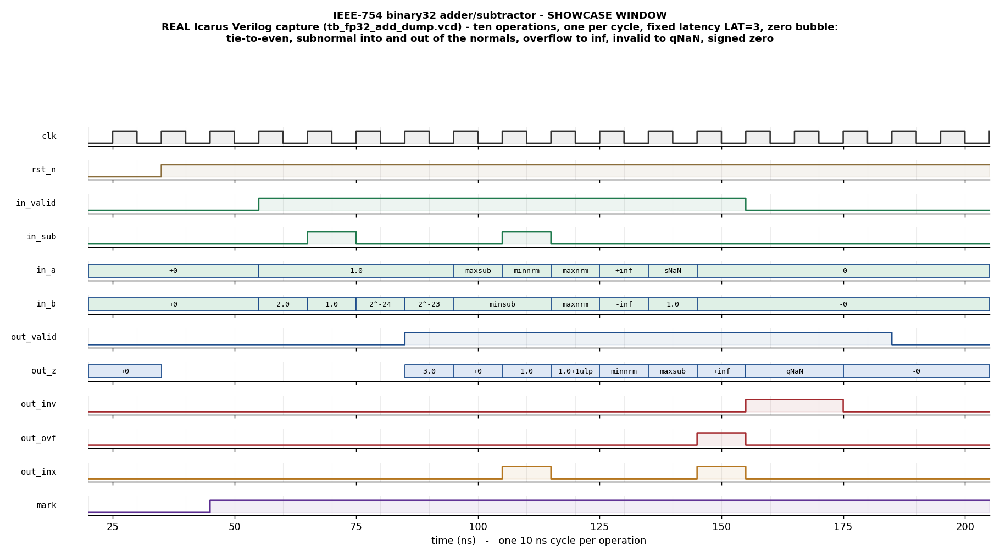

# Day 28 — IEEE-754 binary32 Floating-Point Adder / Subtractor Verification

A fully-pipelined **IEEE-754 binary32 (single-precision) floating-point adder /
subtractor** with round-to-nearest-ties-to-even, full subnormal support and
complete special-case handling — verified against a golden reference model that
is itself pinned to the host CPU's own IEEE-754 hardware.

Every FPU, GPU shader core, DSP MAC and neural-network accumulator contains one
of these. It is also the canonical example of a block whose *happy path is
trivial and whose corner space is enormous*: `1.0 + 2.0 = 3.0` is one line of
RTL away, and everything interesting lives in the five places where
floating-point addition is genuinely hard.

| The hard part | Why it breaks | Where it is exercised |
|---|---|---|
| **Alignment** | The smaller operand is shifted right by the exponent difference. Bits shifted past the end must survive as a **sticky** bit, or a 2⁻¹⁰⁰ term silently vanishes instead of nudging the rounding of a 2¹⁰⁰ term. | `KIND_HUGEDIFF`, `ediff` coverage |
| **Cancellation** | `a - b` with `a ≈ b` destroys almost every significand bit and needs a full-width leading-zero normalise — up to 24 positions in one step. | `KIND_CANCEL`, `KIND_NEAR` |
| **Rounding** | Round-to-nearest-**even** needs `{L, G, sticky}`. An exact half-way case must round toward the *even* significand, and a round-up can carry straight out of the significand and increment the exponent. | phase 4 tie campaign |
| **Subnormals** | A denormal input has **no hidden bit** and a fixed effective exponent; a subnormal *result* must stop normalising at the exponent floor; and a subnormal can round up **into** the smallest normal. | phase 5 |
| **Specials** | Signed zeros (`(−0)+(−0) = −0` but `(+0)+(−0) = +0`), `x + (−x) = +0`, infinity arithmetic, `(+∞)+(−∞) = invalid NaN`, NaN precedence over infinity, and overflow to infinity. | phase 3 landmark cross-product |

Together with Day 25's fixed-point CORDIC, this completes the arithmetic
thread of the series: Day 25 is the multiplier-free *transcendental* datapath,
Day 28 is the *floating-point* datapath with its rounding and exception model.

## Verification goal

Prove, bit-for-bit, that the RTL implements IEEE-754 binary32 addition and
subtraction under round-to-nearest-ties-to-even — **result word and all four
exception flags** — across the normal range, the subnormal range, both signed
zeros, both infinities, quiet and signalling NaNs and the overflow boundary,
while holding a fixed-latency, zero-bubble streaming contract.

The interesting methodological problem is *"what checks the checker?"*. A
reference model for a rounder is about as easy to get subtly wrong as the RTL
it is judging, so this project does not simply assert that two pieces of my own
code agree:

1. **`docs/gen_kat.py`** implements the algorithm in Python and cross-checks it
   against **`numpy` float32** — i.e. against the host CPU's IEEE-754 unit —
   over 400 000+ randomised operations plus an exhaustive small-exponent sweep,
   bit-exactly. It emits a 48-row **Known-Answer Table** whose result words are
   numpy's, one row per named corner.
2. **`fp32_ref_pkg::kat_selfcheck()`** replays that table through the
   SystemVerilog golden model. Every testbench calls it *before* it checks a
   single DUT result, so a broken model fails loudly on its own rather than
   quietly blessing broken RTL.
3. The **RTL itself** was additionally driven against **200 000** numpy-derived
   vectors (result + all four flags) during development: **0 mismatches**.
4. The KAT is then replayed **through the DUT** (phase 2), so the RTL is checked
   against hardware-IEEE answers directly and not only against the model.

### A proven invariant: underflow is unreachable

The exact sum of two binary32 values is always an integer multiple of 2⁻¹⁴⁹ —
neither operand's ULP is ever finer than that — so whenever the exact result
falls in the subnormal range it is **also exactly representable**. Addition and
subtraction therefore *never round inside the subnormal range*, and `out_unf`
can never assert. This does **not** hold for multiply or divide.

Rather than assume this, the environment **asserts** it: an SVA
(`a_no_unf`), a procedural checker and a scoreboard check all fail if
`out_unf` ever fires. The run below produced **382 subnormal results and 0
underflow flags**, and a 600 000-operation tiny-weighted Python sweep found
107 381 subnormal results and 0 underflows.

## Features / coverage

**DUT**
- IEEE-754 binary32; parameterised on `EW`/`MW` so the same datapath is a
  generic binary floating-point adder (verified at the `8, 23` default).
- Add and subtract selected per operation (`in_sub`); subtraction is add with
  `b`'s sign inverted.
- Round-to-nearest, ties-to-even, using an explicit `{L, G, R, S}` guard field.
- Subnormal inputs (no hidden bit, effective exponent 1) and subnormal outputs
  (normalisation clamped at the exponent floor), including subnormal→normal
  round-up and normal→subnormal cancellation.
- Signed zeros, infinities, quiet/signalling NaNs, overflow to infinity.
- Canonical qNaN (`0x7FC00000`) on every NaN result — payloads are not
  propagated, so the result is a pure function of the operands.
- Four exception flags: `inv`, `ovf`, `unf`, `inx`.
- Three register stages, fixed latency `LAT = 3`, one result per cycle, no
  back-pressure and no stall.

**Testbench**
- Full UVM environment: agent (driver / monitor / sequencer), reference-model
  scoreboard, functional-coverage subscriber, virtual sequencer, virtual
  sequences and two tests.
- Golden model shared by the UVM flow and the portable Icarus flow, pinned to
  numpy-generated Known-Answer vectors.
- FIFO-pairing scoreboard — nothing in the checking depends on knowing `LAT`.
- Directed campaigns: KAT replay, showcase, 16×16×{add,sub} landmark
  cross-product, round-to-nearest-even half-ULP ties, the subnormal exponent
  floor, the overflow boundary.
- Constrained-random regression shaped by an 8-way `kind` knob (uniform 32-bit
  operands are a big normal ~99% of the time and would miss everything).
- Concurrent SVA in the interface; equivalent procedural checkers in the
  portable testbench.
- Functional coverage: operand classes on both inputs, **result** class,
  alignment distance, flags, and four crosses.
- Watchdog timeout and a VCD dump.

## DUT — `fp32_add.sv`

### Parameters

| Parameter | Default | Meaning |
|---|---|---|
| `EW` | `8` | Exponent field width. `BIAS = 2^(EW-1) − 1 = 127`, `EMAX = 255`. |
| `MW` | `23` | Stored mantissa width. The significand is `MW+1 = 24` bits including the hidden bit. |

Derived internally: `W = 1+EW+MW = 32` (word width), `SIG = MW+1 = 24`
(significand), `WS = SIG+3 = 27` (significand plus guard/round/sticky),
`XW = EW+2 = 10` (exponent working width), `LAT = 3` (pipeline latency).

### Ports

| Port | Dir | Width | Meaning |
|---|---|---|---|
| `clk` | in | 1 | Rising-edge clock. |
| `rst_n` | in | 1 | Asynchronous active-low reset; clears only the valid pipeline. |
| `in_valid` | in | 1 | Request strobe. May be held high indefinitely — one operation per cycle. |
| `in_sub` | in | 1 | `0` = `a + b`, `1` = `a − b`. |
| `in_a` | in | `W` | Operand A, IEEE-754 binary32 bit pattern. |
| `in_b` | in | `W` | Operand B. |
| `out_valid` | out | 1 | Result strobe — exactly `in_valid` delayed `LAT = 3` cycles. |
| `out_z` | out | `W` | Result. NaN results are always the canonical qNaN `0x7FC00000`. |
| `out_inv` | out | 1 | **Invalid**: a signalling-NaN input, or `(+∞) + (−∞)`. |
| `out_ovf` | out | 1 | **Overflow**: the rounded magnitude exceeded the largest finite value; `out_z` is forced to ±∞. Implies `out_inx`. |
| `out_unf` | out | 1 | **Underflow**: result is subnormal-or-zero *and* inexact. Provably always `0` for add/sub — see above. |
| `out_inx` | out | 1 | **Inexact**: a nonzero guard/sticky was discarded, or overflow occurred. |

There is no back-pressure: the interface contract is purely
`out_valid == in_valid` delayed `LAT` cycles.

### Pipeline

| Stage | Work |
|---|---|
| **S1** | Unpack and classify both operands; resolve the special cases; magnitude-compare and swap so the larger term is "big"; align the smaller significand right by the exponent difference, OR-ing everything shifted past the end into a **sticky** bit (the shifter is clamped at `WS`, beyond which all distances are indistinguishable). |
| **S2** | Add the significands (like signs) or subtract them (unlike signs); on a carry-out, renormalise right by one while preserving sticky; otherwise left-normalise by the leading-zero count, **clamped so the exponent never falls below the subnormal floor**. Exact cancellation is detected here and delivers `+0`. |
| **S3** | Round to nearest-even on `{L, G, sticky}`; handle the round-up carrying out of the significand (`exponent++`); pack, convert an out-of-range exponent into ±∞, and emit the flags. |

## Testbench architecture

```
                     +----------------------------------------------+
                     |            fp32_ref_pkg  (shared)           |
                     |  fp_ref()      - the golden model            |
                     |  kat_selfcheck() - 48 numpy KAT vectors      |
                     |  fp_classify() / fp_str() - class + logging   |
                     +----------------------------------------------+
                          ^                              ^
              used by     |                              |    used by
       the UVM scoreboard |                              | the portable TB
                          |                              |
  +-----------------------+--------------------+   +-----+-------------------+
  |            UVM  (tb_top.sv)                |   | Icarus                  |
  |                                            |   | (tb_fp32_add_dump.sv)   |
  |  fp_vsequencer                             |   |                         |
  |    | fp_smoke_vseq / fp_regress_vseq       |   |  do_op() driver         |
  |    v                                       |   |    + circular request   |
  |  +--------------- fp_agent ------------+   |   |      queue              |
  |  |  fp_sequencer --> fp_driver         |   |   |  negedge checker        |
  |  |                      |              |   |   |    = procedural SVA     |
  |  |  fp_monitor          |              |   |   |    + FIFO pairing       |
  |  +----------------------+--------------+   |   +-------------------------+
  |     | ap_req    | ap_rsp                   |            |
  |     v           v                          |            v
  |  +------------ fp_scoreboard ----------+   |     tb_fp32_add_dump.vcd
  |  |  pending-request FIFO               |   |            |
  |  |  fp_ref() compare: z + 4 flags      |   |            v
  |  +-------------------------------------+   |     docs/make_waveform.py
  |     | ap_cov (request paired w/ result)    |            |
  |     v                                      |            v
  |  fp_coverage  (covergroup + 4 crosses)     |   docs/fp32_add_waveform.png
  +--------------------------------------------+

                        DUT: fp32_add.sv
        in_valid/in_sub/in_a/in_b  ->  [S1 align] -> [S2 add/normalise]
                                   ->  [S3 round/pack]  ->  out_valid/out_z/flags
                                       fixed LAT = 3, zero bubble
```

Both flows drive the same DUT and call the same `fp_ref()`, so they cannot
disagree about what the right answer is. The Icarus testbench exists because
Icarus implements neither the UVM class library nor a constraint solver, and it
is what produces the committed waveform.

The coverage collector deliberately sits **downstream of the scoreboard**:
crossing an operand class with the *result* class needs the request and result
paired, and the scoreboard already owns that pairing. Re-deriving it in a
second subscriber would mean two copies of the same logic that could drift
apart, so the scoreboard republishes each fully-resolved transaction instead.

## Simulation timing



**Captured from a real Icarus Verilog run** — this is the `mark`-delimited
showcase window of `tb_fp32_add_dump.vcd`, rendered by
`docs/make_waveform.py`. It is not hand-modeled. Bus values are annotated with
their floating-point meaning rather than raw hex.

Ten operations are pushed back to back, one per cycle, and each result appears
exactly `LAT = 3` cycles later — the whole point of the fixed-latency contract:

| # | Operation | `out_z` | Flags | What it shows |
|---|---|---|---|---|
| 1 | `1.0 + 2.0` | `3.0` | — | the happy path |
| 2 | `1.0 − 1.0` | `+0` | — | exact cancellation gives **+0**, not −0 |
| 3 | `1.0 + 2⁻²⁴` | `1.0` | `inx` | an **exact tie**: rounds to the *even* significand, so the result is unchanged but **inexact** |
| 4 | `1.0 + 2⁻²³` | `1.0+1ulp` | — | exactly one ULP: representable, so **exact** |
| 5 | `maxsub + minsub` | `minnrm` | — | two subnormals **carry into** the normal range |
| 6 | `minnrm − minsub` | `maxsub` | — | and a normal **drops back out** into the subnormals |
| 7 | `maxnrm + maxnrm` | `+inf` | `ovf`,`inx` | overflow saturates to infinity |
| 8 | `(+∞) + (−∞)` | `qNaN` | `inv` | the classic **invalid** operation |
| 9 | `sNaN + 1.0` | `qNaN` | `inv` | a signalling NaN raises invalid and is **canonicalised** |
| 10 | `(−0) + (−0)` | `−0` | — | the signed-zero rule — only `−0 + −0` gives `−0` |

Note `in_sub` pulsing on operations 2 and 6 only, `out_inx` firing on exactly
the tie (3) and the overflow (7), and `out_inv` spanning the two NaN-producing
operations (8, 9). `out_unf` is not plotted because it is provably always zero.

## How the checking works

**The reference model** — `fp32_ref_pkg::fp_ref(a, b, sub)` returns a packed
`{z, inv, ovf, unf, inx}`. It is written as a flat, sequential, wide-integer
software algorithm with early returns — deliberately **not** structured like
the DUT's three-stage register pipeline — so a datapath mistake in one is
unlikely to be mirrored in the other. It is then pinned to numpy, as described
under *Verification goal*.

**Pairing** — the monitor publishes requests and results on two separate
analysis ports and makes **no attempt** to associate them; latency is a design
detail. The scoreboard queues each request and pops the oldest on each result,
so the check depends only on *ordering*. That means a latency change in the RTL
would be caught by the SVA (which is where the latency contract belongs) rather
than silently absorbed by the scoreboard.

**Per-operation check** — result word and all four flag bits must match
`fp_ref` exactly (`!==`, so an X fails). On a mismatch the error prints both
words, both flag vectors, the operands in hex *and* in readable
floating-point form, and the phase name so the failure points at a named corner.

**End of test** — the scoreboard also verifies that every request produced a
result and that nothing is left in flight, then prints the summary and
`RESULT: *** PASS ***` only if `n_err == 0`.

**Assertions** — the interface carries concurrent SVA; the portable testbench
carries procedural equivalents:

| Property | Meaning |
|---|---|
| `a_lat` | `in_valid ⇒ ##LAT out_valid` — the fixed-latency contract |
| `a_cause` | `out_valid ⇒ $past(in_valid, LAT)` — nothing appears unbidden |
| `a_nox_z`, `a_nox_fl`, `a_nox_req` | no X on result, flags or request while valid |
| `a_canon_nan` | every NaN emitted is exactly `0x7FC00000` |
| `a_ovf_inx` | overflow always loses information |
| `a_ovf_inf` | overflow always delivers an infinity |
| `a_inv_nan` | invalid always delivers the canonical qNaN |
| `a_spec_exact` | an inf/NaN result is never merely "inexact" |
| `a_no_unf` | **underflow never fires** — the invariant proven above |

## Functional-coverage intent

| Coverpoint | Bins | Intent |
|---|---|---|
| `cp_op` | add, sub | both operations |
| `cp_class_a`, `cp_class_b` | zero, subnormal, normal, inf, NaN | every operand class on **both** inputs — the special-case ladder must be entered from either side |
| `cp_class_z` | zero, subnormal, normal, inf, NaN | every class must be **produced**, which is the harder half: a subnormal or an infinity only comes out of the right stimulus |
| `cp_ediff` | 0, 1, 2–23, **24**, 25–26, ≥27 | the alignment shifter: no shift, the `MW+1 = 24` **tie distance**, and past the datapath width where only sticky survives |
| `cp_inexact`, `cp_overflow`, `cp_invalid` | 0/1 | each exception flag both ways |
| `x_class` | 5×5 | the full operand-class matrix — proves NaN-over-inf-over-zero precedence was exercised from both positions |
| `x_op_z` | 2×5 | each operation reaching each result class; subtraction producing a subnormal is a different RTL path from addition producing one |
| `x_op_ediff` | 2×6 | a wide gap under subtraction is the sticky-forces-round-down case |
| `x_inx_z` | 2×5 | inexactness against result class. The `{inexact, subnormal}` bin is the **deliberately unreachable** underflow case — documenting the hole rather than leaving it unexplained |

The random stimulus is shaped to reach these bins: `fp_txn`'s `kind` knob
steers items into `NEAR`, `SUBNORMAL`, `SPECIAL`, `TIE`, `HUGEDIFF`, `CANCEL`
and `HUGE` regions, because a uniform 32-bit operand is a large-exponent normal
almost every time. Exponents and mantissas are randomised as `int` rather than
as packed vectors so that relational constraints like *"`eb` within 2 of `ea`"*
cannot silently wrap around zero and hand the solver an empty range.

## Running

**Portable (Icarus Verilog) — this is the flow that was actually run:**

```bash
make icarus_dump
```

Regenerate the committed waveform PNG from the captured VCD:

```bash
make waveform
```

Regenerate the Known-Answer Table from numpy (needs `numpy`):

```bash
make kat
```

**UVM (needs a UVM-capable simulator — VCS / Questa / Verilator ≥ 5 `--uvm`):**

```bash
make vcs UVM_TESTNAME=fp32_add_smoke_test
```

```bash
make questa UVM_TESTNAME=fp32_add_regress_test
```

`fp32_add_smoke_test` runs the KAT, the showcase and a short random burst.
`fp32_add_regress_test` adds the landmark cross-product and three rounds of the
tie / subnormal / overflow / random campaigns.

### Result of the Icarus run

```
[phase 0] reference model reproduced all 48 numpy-generated KAT vectors
 operations driven        : 5958
 operations checked       : 5958
 inexact results          : 3489
 overflow -> inf          : 67
 invalid  -> qNaN         : 214
 subnormal operands seen  : 1175
 results  normal          : 4949
 results  subnormal       : 382
 results  zero            : 57
 results  infinity        : 172
 results  NaN             : 398
 underflow flags asserted : 0 (unreachable for binary32 add/sub)
 mismatches / check fails : 0
RESULT: *** PASS ***  (5958 operations checked against the reference model)
```

The UVM environment has not been run here — this machine has no UVM-capable
simulator (Icarus implements neither the UVM class library nor a constraint
solver). The UVM code is provided complete for VCS / Questa / Verilator; the
numbers above come from the portable testbench, which shares the DUT and the
golden model with it.

## What the testbench checks

1. **The reference model first.** 48 Known-Answer vectors whose result words
   come from numpy float32 — the host CPU's IEEE-754 unit — must be reproduced
   before any DUT result is judged. Failure aborts with `RESULT: *** FAIL ***`.
2. **Bit-exact results.** `out_z` must equal `fp_ref`'s word exactly, for every
   operation, in arrival order.
3. **All four exception flags**, not just the result: `inv`, `ovf`, `unf`,
   `inx` are compared as a vector.
4. **The fixed-latency contract.** `out_valid` must equal `in_valid` delayed
   exactly `LAT = 3` cycles — catching both a missing result and a spurious one.
5. **Zero-bubble throughput.** Every phase streams one operation per cycle with
   `in_valid` held high; 5958 driven, 5958 checked, 0 left in flight.
6. **Round-to-nearest-even.** A dedicated campaign builds exact half-ULP ties
   with alternating even/odd retained LSBs, plus quarter-ULP (rounds down) and
   three-quarter-ULP (rounds up) neighbours.
7. **The subnormal boundary in both directions** — carrying up into the
   normals and cancelling back down out of them — plus the exact boundary steps
   deterministically.
8. **The overflow boundary**, including a value that is finite before rounding
   and infinite after.
9. **Every special case**, via the 16×16×{add,sub} landmark cross-product: both
   zeros, both infinities, sNaN, qNaN, min/max subnormal, min normal, max
   finite, and the tie constants — 512 directed operations covering NaN
   precedence, infinity arithmetic and the signed-zero rules from both operand
   positions.
10. **Canonical NaN.** Every NaN emitted must be exactly `0x7FC00000`; the DUT
    never emits a signalling NaN and never propagates an input payload.
11. **Flag consistency.** Overflow implies inexact and an infinite result;
    invalid implies the canonical qNaN; an inf/NaN result is never merely
    inexact.
12. **Underflow is unreachable.** Asserted, not assumed — 382 subnormal
    results were produced and `out_unf` never fired.
13. **No X** on the result, the flags or the request bus while valid.
14. **A watchdog** fails the run rather than hanging.
