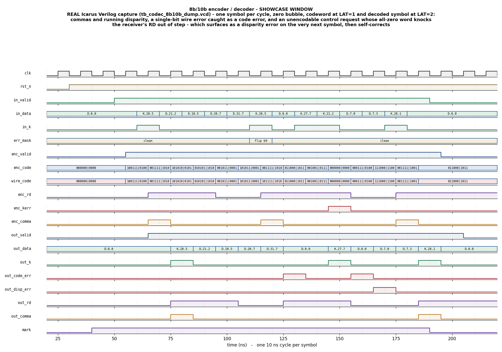

# Day 29 — 8b/10b Line-Code Encoder / Decoder Verification

The SerDes physical-layer block that makes a serial link physically possible: **8b/10b**, the line code behind Gigabit Ethernet (IEEE 802.3 clause 36), PCI Express gen 1/2, SATA, DisplayPort, Fibre Channel, DVI/HDMI and InfiniBand. It maps each 8-bit byte onto a 10-bit codeword so that the resulting bit stream has three properties an AC-coupled, clock-recovered wire cannot do without:

- **DC balance** — every codeword has 4, 5 or 6 ones, and the *running disparity* (RD, the cumulative ones-minus-zeros of everything sent so far) never leaves `{-1, +1}`. A transformer- or capacitor-coupled link cannot pass a stream whose average wanders.
- **Transition density** — no run of more than 5 identical bits, anywhere, including across codeword boundaries. The receiver has no forwarded clock; its CDR recovers one from the edges, and a long run starves it.
- **Framing** — 12 **control (K) symbols** live outside the 256 data codewords, and three of them carry the **comma**, the bit pattern `0011111` / `1100000` that by construction can only ever occur aligned to a symbol boundary. Finding a comma in a raw serial stream is how a receiver discovers where symbols start. That is the whole trick, and it is why the code has the exceptions it has.

It completes the link-layer trio in this series — **CRC-32** (Day 23) detects corruption, **SECDED ECC** (Day 24) corrects it, the **self-synchronizing scrambler** (Day 27) whitens the spectrum — with the layer underneath all of them: the one that decides what actually goes on the wire.

The design is also a good verification subject for an unglamorous reason: **8b/10b is a table code, and tables are exactly the kind of thing that is wrong in ways that still work.** A single transposed bit in a 40-row table produces RTL whose encoder and decoder agree perfectly — they share the typo — round-trips every byte, passes any loopback test you write, and emits a stream that violates the line code on the wire. Which is the failure that matters, and the one a loopback test cannot see. Most of the effort here goes into making that class of bug impossible to miss.

---

## Verification goal

Prove that the DUT implements the 8b/10b code — not merely *a* bijection between bytes and 10-bit words — and that its receiver correctly classifies everything that can arrive on the wire.

That splits into three questions, deliberately answered by three different mechanisms:

**1. Are the tables the real 8b/10b tables?**
Not assumed. `docs/gen_kat.py` builds the code from the two sub-block tables and then *proves* it against the five properties that define it, exhaustively, over every symbol in both RD states:

| | property | how it is checked |
|---|---|---|
| P1 | every codeword has 4, 5 or 6 ones | all 536 symbol/RD pairs |
| P2 | RD stays in `{-1,+1}` at every sub-block | all 536 pairs, both sub-blocks |
| P3 | no run of more than 5 identical bits | inside every codeword, **and across all ~143 000 RD-compatible codeword junctions** |
| P4 | the 10-bit → 8-bit map is a function | 464 distinct codewords, each onto exactly one of 268 symbols |
| P5 | the comma appears only in K.28.1/.5/.7, only aligned, and is never manufactured at a junction | every codeword, and every junction window that straddles a boundary |

plus the three landmark codewords: `K.28.5 = 0011111010 / 1100000101`, `K.28.1 = 0011111001 / 1100000110`, `K.28.7 = 0011111000 / 1100000111`.

P3 and P5 are **junction** properties — invisible to any per-symbol check, and the reason the code has the odd exceptions it does. They earned their keep immediately: the first run of the checker reported 2714 violations, all traceable to two entries (`D.07` in the 5b/6b table and `D.x.3` in the 3b/4b table) that are *balanced yet still alternate* between two patterns. Treating them as ordinary balanced codes — the obvious reading — produces a code that round-trips all 256 bytes perfectly and puts 6-bit runs on the wire.

**2. Are the DUT's rules right, given the tables?**
The DUT computes 8b/10b from rules — sub-block tables plus a disparity rule, the alternating-balanced exception, the `D.x.A7` exception and a re-encode step in the receiver. The **reference model contains no rules at all**: encode is a flat 1024-entry ROM generated by the script above, and decode is a flat 2048-entry table built at elaboration by brute-force inversion of that ROM. A rule bug in the DUT cannot hide in the model, because the model has nothing to be wrong about. That asymmetry is the entire point of the split.

**3. Does the receiver classify correctly?**
Every 10-bit word that can appear on the wire — all 1024 of them, in both RD states — falls into exactly one of three classes: a clean symbol, a legal codeword arriving with the wrong polarity for the current RD (**disparity error**), or not a codeword at all (**code error**). The testbench injects wire errors and checks the verdict, the recovered symbol and the resulting RD against the model, symbol for symbol.

### A measured property, not an assumed one

A tempting claim is *"8b/10b detects every single-bit wire error."* The testbench includes a dedicated sweep — 60 isolated single-bit flips across six symbol classes and all ten wire positions, each followed by a guaranteed clean 8-symbol window — to find out what is actually true:

```
 single-bit wire errors, detection latency (60 injected,
 each followed by a clean 8-symbol window)
   flagged 0 symbol(s) after the flip ...... 39
   flagged 5 symbol(s) after the flip ...... 21
   never flagged ........................... 0
   worst-case detection latency ............ 5 symbols
```

So the claim is true, but the naive version — *detected on the symbol that carried it* — is false for a third of cases, and the testbench would have failed had it asserted that. What is really going on: a flip changes a sub-block's ones-count by ±1, so the corrupted word's disparity always differs from the original's by ±2. If the corrupted word happens to be a legal codeword with the right polarity, nothing is flagged **but the receiver's RD is now out of step with the transmitter's**. It stays hidden only for as long as the symbols that follow are *balanced and non-alternating* — the 72 of 268 symbols whose codeword is identical in both RD states. The clean window in the sweep is deliberately built from four such symbols followed by `D.0.0`, which is unbalanced: 21 of the 21 delayed detections land at exactly offset 5, the moment the first RD-sensitive symbol arrives.

### The K.28.7 restriction, derived

`K.28.7` is legal but restricted — the standard warns it may not be used next to arbitrary traffic. The junction sweep does not take that on faith; it reports the exact successor set:

```
  K.28.7 restriction (derived, not assumed):
    64 successor codewords would break run<=5 or forge a comma
    offending successors: D.3.y, D.11.y, D.12.y, D.19.y, D.20.y, D.28.y (all y),
                          and every K.28.y
```

The SVA `a_run_length` and its procedural twin encode that exemption; `docs/gen_kat.py` is what justifies it.

---

## Features / coverage

- **Full 8b/10b encoder** — 5b/6b and 3b/4b sub-block tables, running disparity threaded through both halves in sequence, the balanced-but-alternating entries (`D.07`, `D.x.3`, every control sub-block), and the alternate `D.x.A7` 3b/4b encoding for `y == 7` at the six x values that need it.
- **All 12 control symbols** — `K.28.0`…`K.28.7`, `K.23.7`, `K.27.7`, `K.29.7`, `K.30.7` — plus detection of a request for a control symbol that does not exist (`enc_kerr`).
- **Comma detection** on both the transmit and receive sides.
- **Strict receiver** — reverse sub-block tables recover a candidate symbol, then the candidate is pushed back through the *encoder's own rules* and compared with what actually arrived. Sub-block pairs no transmitter can emit (a `D.x.7` sent with the wrong one of its two 3b/4b patterns, for instance) are rejected as code errors rather than quietly accepted.
- **Two distinct receive error classes**, never both at once: `out_code_err` (not a codeword) and `out_disp_err` (a codeword, wrong polarity for RD).
- **Self-correcting running disparity** — the receiver advances RD from the bits that arrived, not the bits it expected, so a corrupted symbol costs a transient RD disagreement rather than a permanent one.
- **Injectable per-symbol wire errors** (`err_mask`), aligned to the symbol they corrupt so the testbench never has to reason about pipeline timing.
- **Fixed latency, zero bubble** — one symbol per cycle, codeword at `LAT = 1`, decoded symbol at `LAT = 2`.

---

## DUT — `codec_8b10b.sv`

One file, three modules and a shared package:

| module | role |
|---|---|
| `codec_8b10b_rtl_pkg` | the two sub-block tables, the encode rule `enc_f()`, the RD-advance rule, comma detection — shared by both directions |
| `enc_8b10b` | byte + K flag → 10-bit codeword, one per cycle |
| `dec_8b10b` | 10-bit codeword → byte + K flag + error verdict, one per cycle |
| `codec_8b10b` | the DUT: encoder, a wire with injectable bit errors, decoder |

### Parameters

| parameter | default | meaning |
|---|---|---|
| `ENC_INIT_RD` | `RD_NEG` (`1'b0`) | running disparity the transmitter resets to |
| `DEC_INIT_RD` | `RD_NEG` (`1'b0`) | running disparity the receiver resets to; set it differently to study RD resynchronisation |

`RD_NEG = 1'b0` means "one more zero than one has been sent"; `RD_POS = 1'b1` is the other state. Those are the only two the code ever occupies.

### Ports

| port | dir | width | meaning |
|---|---|---|---|
| `clk`, `rst_n` | in | 1 | clock, active-low async reset |
| `in_valid` | in | 1 | a symbol is being requested this cycle |
| `in_data` | in | 8 | the byte; `x = in_data[4:0]`, `y = in_data[7:5]`, so the symbol is `D.x.y` |
| `in_k` | in | 1 | request a control symbol rather than a data symbol |
| `err_mask` | in | 10 | bits to flip on the wire for **this** symbol (`0` = clean) |
| `enc_valid` | out | 1 | a codeword is on the wire (`in_valid` delayed 1 cycle) |
| `enc_code` | out | 10 | the codeword the transmitter produced, `{abcdei, fghj}`, `a` first on the wire |
| `wire_code` | out | 10 | `enc_code ^ err_mask` — what the receiver actually sees |
| `enc_rd` | out | 1 | running disparity **after** the codeword currently on `enc_code` |
| `enc_kerr` | out | 1 | the requested control symbol does not exist |
| `enc_comma` | out | 1 | the transmitted codeword carries a comma |
| `out_valid` | out | 1 | a decoded symbol is present (`in_valid` delayed 2 cycles) |
| `out_data` | out | 8 | the recovered byte (`8'h00` on a code error) |
| `out_k` | out | 1 | the recovered symbol is a control symbol |
| `out_code_err` | out | 1 | the received word is not in the code |
| `out_disp_err` | out | 1 | the received word is a codeword, but not the one RD called for |
| `out_rd` | out | 1 | the receiver's running disparity after this word |
| `out_comma` | out | 1 | the received word carries a comma |

**Contract on an unencodable control request:** nothing legal goes on the wire (`enc_code = 10'b0`, which is not a codeword, so the far end reports a code error too) and the transmitter's RD is left untouched. The all-zero word does carry a disparity the transmitter never sent, so the *receiver's* RD ends up out of step — visible in the waveform as a disparity error on the very next symbol, after which the link self-corrects.

### Pipeline

```
        cycle 0            cycle 1                     cycle 2
   in_valid/in_data  ->  enc_valid/enc_code   ->   out_valid/out_data
   in_k/err_mask          wire_code, enc_rd         out_k, error flags, out_rd
                          enc_kerr, enc_comma       out_comma
```

`err_mask` is registered one cycle inside the DUT so it lands on the codeword its own byte produced. Both stages are unconditionally registered — one symbol per cycle, zero bubbles, and RD only advances on valid symbols.

---

## Testbench architecture

```
                       +---------------------------+
                       |        c8b_vseqr          |   virtual sequencer
                       |  smoke / regress vseq     |
                       +-------------+-------------+
                                     |
                       +-------------v-------------+
                       |       c8b_sequencer       |
                       +-------------+-------------+
                                     |  c8b_txn {data, k, err_mask}
                       +-------------v-------------+
                       |        c8b_driver         |  one symbol per cycle,
                       |  try_next_item, no stall  |  zero bubble
                       +-------------+-------------+
                                     | pins
   +---------------------------------v----------------------------------+
   |                          codec_8b10b (DUT)                          |
   |   enc_8b10b  --enc_code--> (^ err_mask) --wire_code--> dec_8b10b    |
   +----+---------------------------+----------------------------+------+
        |                           |                            |
   c8b_in_monitor            c8b_tx_monitor               c8b_rx_monitor
   (the request               (what went on               (what came back
    stream, in order)          the wire)                   off it)
        |  req_ap                   |  tx_ap                     |  rx_ap
        +---------------+-----------+----------------------------+
                        |
             +----------v-----------+        codec_8b10b_ref_pkg
             |    c8b_scoreboard    |<------  flat 1024-entry encode ROM
             |                      |         flat 2048-entry decode table
             |  steps the model     |         (brute-force inversion)
             |  ONCE per request,   |
             |  threads tx_rd/rx_rd |
             |  -> tx_q, rx_q       |
             +----------+-----------+
                        | resolved {request, verdict}
             +----------v-----------+
             |     c8b_coverage     |  symbol class x verdict crosses
             +----------------------+

   codec_8b10b_if : concurrent SVA (latency, DC balance, run length across
                    junctions with the derived K.28.7 exemption, comma source,
                    error exclusivity, RD stability, no-X)
```

The scoreboard is the only place the model is stepped. It runs `ref_link_step()` once per **request**, in request order, threading the transmitter's and the receiver's RD registers itself, and files the result in two expectation queues — one drained by the transmit monitor a cycle later, one by the receive monitor a cycle after that. Nothing in the environment re-implements the code.

Coverage sits **downstream of the scoreboard** rather than on the request stream, so the symbol class that went in can be crossed with the verdict that came out.

`tb_codec_8b10b_dump.sv` is the procedural twin of all of this: same model, same two expectation queues, same properties checked in ordinary always blocks instead of SVA, same coverage questions tallied. It exists because Icarus implements neither the UVM class library nor a constraint solver, and it is what captures the committed waveform.

---

## Simulation timing



**A real Icarus Verilog capture**, not a hand-drawn diagram: `make waveform` runs the RTL, dumps `tb_codec_8b10b_dump.vcd` and renders the marked showcase window with `docs/make_waveform.py`. Buses are annotated with their meaning — `D.x.y` / `K.x.y` symbol names, and codewords split into their `abcdei|fghj` sub-blocks.

Fourteen symbols go in back to back, one per cycle. Reading the trace left to right:

| # | request | codeword | what to look at |
|---|---|---|---|
| 1 | `D.0.0` | `100111|0100` | unbalanced in both halves — `enc_rd` goes to RD+ |
| 2 | `K.28.5` | `001111|1010` | the comma: `enc_comma` and `out_comma` assert, `out_k` comes back set |
| 3 | `D.21.2` | `101010|0101` | balanced in both halves — `enc_rd` does not move |
| 4 | `D.10.5` | `010101|1010` | balanced again |
| 5 | `D.20.7` | `001011|0001` | a `D.x.7` symbol: the alternate-encoding rule picks between its two 3b/4b patterns (here, at RD+, the primary one complemented) |
| 6 | `D.31.7` | `101011|0001` | unbalanced in both halves |
| 7 | `K.28.5`, bit 9 flipped | `001111|1010` → wire `101111|1010` | the corrupted 6b half has 5 ones — not a valid sub-block — so `out_code_err` fires and `out_data` is forced to `00` |
| 8 | `D.0.0` | `011000|1011` | recovery: the link carries on from the very next symbol |
| 9 | `K.27.7` | `001001|0111` | a non-`K.28` control symbol |
| 10 | `K.21.2` | — | **does not exist**: `enc_kerr` asserts, the all-zero word goes out, and the far end reports a code error |
| 11 | `D.7.0` | `000111|0100` | `D.07`, balanced but alternating — and `out_disp_err` fires here, because the all-zero word from #10 left the receiver's RD out of step with the transmitter's |
| 12 | `D.7.3` | `111000|1100` | `D.x.3`, the other balanced-but-alternating entry — RD is back in step, no error |
| 13 | `K.28.1` | `001111|1001` | another comma |
| 14 | `D.0.0` | `011000|1011` | |

Symbols 10 → 11 → 12 are the most informative three cycles in the picture: an illegal request puts a disparity on the wire the transmitter never accounted for, the receiver notices one symbol later, and the link is back in step the symbol after that — entirely without intervention, and predicted exactly by the reference model.

---

## How the checking works

**The golden model has no rules.** `codec_8b10b_ref_pkg.sv` holds two flat tables:

- `enc_rom[{rd, k, byte}] -> {codeword, rd'}` — 536 entries, generated by `docs/gen_kat.py` and spliced into the package by `make kat`;
- `dec_tbl[{rd, codeword}] -> {code_err, disp_err, k, data, rd'}` — all 2048 combinations, built at elaboration by brute-force inversion of the ROM in three passes:

```
1. every word in both RD states is assumed not to be a codeword
2. overlay words that are legal but carry the OPPOSITE polarity  -> disparity error
3. overlay words that are exactly what the transmitter would send -> clean
```

Pass 2 runs before pass 3 so that a word which is simultaneously the correct variant here and the alternate variant of the same symbol — which is every balanced, non-alternating symbol — ends up marked clean.

The single question the model asks about any received word is *"is this exactly the word the transmitter would have sent?"* It never inspects sub-blocks. The DUT does nothing but inspect sub-blocks. Whenever they disagree, it is the DUT's rules losing an argument with data.

**What checks the checker.** Before a single DUT result is judged, both the UVM base test (`start_of_simulation_phase`) and the Icarus TB run:

- `property_selfcheck()` — re-proves P1, P2, P3-within-codeword, P4 and P5 over all 536 symbol/RD pairs *inside the simulator*, so the committed tables are not merely trusted from Python;
- `kat_selfcheck()` — replays the 48-vector Known-Answer Table in `docs/codec_8b10b_kat.txt` through the model's own encode and decode paths.

Either failing is fatal: a wrong reference model makes every subsequent "PASS" meaningless.

**Per-symbol checking.** For each request the scoreboard compares:

| side | fields checked |
|---|---|
| transmit | `enc_code`, `wire_code`, `enc_rd`, `enc_kerr`, `enc_comma` |
| receive | `out_data`, `out_k`, `out_code_err`, `out_disp_err`, `out_rd`, `out_comma` |

in arrival order, and `check_phase` fails the run if either expectation queue is left non-empty.

---

## Functional-coverage intent

Coverage is collected on the **resolved** pair — the request together with the verdict it produced — so the interesting crosses are expressible.

| coverpoint | bins | why |
|---|---|---|
| `cp_kind` | data, legal K, unencodable K | the three request classes |
| `cp_y` | 0…7 | the 3b/4b half, where the alternate-encoding rule lives |
| `cp_x_class` | A7-data `{11,13,14,17,18,20}`, K-capable `{23,27,29,30}`, `K.28`, `D.07`, other | the 5b/6b half, bucketed by the role x plays in the code — every exception gets its own bin |
| `cp_nflip` | 0, 1, 2, 3+ | how badly the wire was corrupted |
| `cp_verdict` | clean, disparity error, code error (`both` is an `illegal_bins`) | what the receiver made of it |
| `cp_comma`, `cp_recovered` | | framing, and end-to-end round-trip success |

| cross | question it answers |
|---|---|
| `cx_kind_verdict` | was every request class seen both clean and broken? |
| `cx_nflip_verdict` | does a single bit flip really get caught — and how often does one slip through at that symbol? |
| `cx_x_verdict` | did each of the code's structural exceptions get exercised in every verdict state? |
| `cx_y_kind` | all eight 3b/4b values, as data and as control |

The Icarus testbench tallies the same questions procedurally and **fails the run if a bin the stimulus was written to hit came back empty** — a coverage hole is a hole in the test, not a pass.

---

## Running

```bash
# portable: Icarus Verilog, self-checking, no UVM required
make icarus_dump

# re-render the committed waveform from the captured VCD
make waveform

# re-prove the 8b/10b tables and regenerate the reference model's ROM
make kat

# UVM (needs VCS / Questa / Verilator >= 5 built with --uvm)
make vcs       UVM_TESTNAME=codec_8b10b_smoke_test
make questa    UVM_TESTNAME=codec_8b10b_regress_test
make verilator UVM_TESTNAME=codec_8b10b_smoke_test
```

| test | stimulus |
|---|---|
| `codec_8b10b_smoke_test` | all 256 data symbols, then all 12 control symbols from both RD states |
| `codec_8b10b_regress_test` | the above plus the alternate-encoding corners, the bit-flip walk, and four constrained-random bursts |

### Result of the Icarus run

```
[1] reference-model self-check
  property self-check: 536 symbol/RD pairs, longest run 5, 0 violation(s)
  KAT self-check: 48 vectors, 0 mismatch(es)

[2] directed showcase
[3] all 256 data symbols
[4] all 12 control symbols from both RD states, plus unencodable requests
[5] alternate-encoding corners: D.x.A7, D.07, D.x.3
[6] single and double bit flips walked across the wire
[7] single-bit error detection latency sweep
[8] pseudo-random regression

--------------------------------------------------------
 requests driven ........... 4944
 codewords checked ......... 4944
 symbols checked ........... 4944
 verdicts .................. 3916 clean, 570 disparity error, 458 code error
 unencodable requests ...... 110
--------------------------------------------------------
 functional coverage
   request kind ............ data=3700 legal-K=1134 unencodable-K=110
   injected flips .......... 0=4020 1=618 2=248 3+=58
   verdict ................. clean=3916 disp=570 code=458
   3b/4b half (y) .......... 690 570 679 460 484 652 482 927
   5b/6b half (x class) .... A7-data=659 K-capable=805 K.28=856 D.07=106 other=2518
   RD entering the symbol .. RD-=2237 RD+=2707
   commas on the wire ...... 243
   symbols recovered ....... 3590
   corrupted words the receiver did not flag ... 326
--------------------------------------------------------
 single-bit wire errors, detection latency (60 injected,
 each followed by a clean 8-symbol window)
   flagged 0 symbol(s) after the flip ...... 39
   flagged 5 symbol(s) after the flip ...... 21
   never flagged ........................... 0
   worst-case detection latency ............ 5 symbols
--------------------------------------------------------

RESULT: *** PASS ***  (4944 requests, 4944 codeword checks, 4944 symbol checks, 0 mismatches)
```

`corrupted words the receiver did not flag ... 326` is the code's genuine residual, reported rather than hidden: multi-bit corruption can land on another legal codeword, and even a single flip is often only visible one or more symbols later as an RD violation. The latency sweep above is what turns that number into a bounded, verified property instead of a worry.

And `docs/gen_kat.py`, which is where the tables come from:

```
8b/10b table validation
  symbols ............... 268 (256 D + 12 K), each in 2 RD states
  distinct codewords .... 464
  worst run, 200k-symbol random stream ... 5 bits
  running imbalance, same stream ......... +2 bits
  P1 DC balance .......... PASS (all codewords have 4/5/6 ones)
  P2 bounded disparity ... PASS (RD in {-1,+1} at every sub-block)
  P3 run length <= 5 ..... PASS (~143648 legal codeword junctions)
  P4 unique decode ....... PASS (464 codewords, onto 268 symbols)
  P5 unique comma ........ PASS (aligned, only in K.28.1/.5/.7, never manufactured at a junction)
  landmarks K.28.1/.5/.7 . PASS
```

A 200 000-symbol random stream ends **+2 bits** away from perfect balance, after two million bits. That is the DC-balance guarantee, measured.

---

## What the testbench checks

**Against the reference model, every symbol:**

- the transmitted codeword, the post-injection wire word, `enc_rd`, `enc_kerr` and `enc_comma`;
- the recovered byte and K flag, both error verdicts, `out_rd` and `out_comma`;
- that both expectation queues drain exactly — no symbol invented, none lost.

**Structurally (SVA in `codec_8b10b_if.sv`, procedural twins in the Icarus TB):**

| check | property |
|---|---|
| `a_enc_lat`, `a_dec_lat` | `enc_valid` is `in_valid` delayed 1 cycle; `out_valid` is `enc_valid` delayed 1 more |
| `a_enc_src`, `a_dec_src` | no output without a request behind it |
| `a_balance` | every transmitted codeword has 4, 5 or 6 ones |
| `a_run_length` | no run of 6 across a codeword junction, with the derived `K.28.7` exemption |
| `a_comma_source` | a comma on the wire can only have come from `K.28.1`, `K.28.5` or `K.28.7` |
| `a_kerr_silent` | an unencodable request puts `10'b0` on the wire and does not disturb the transmitter's RD |
| `a_kerr_only_k` | `enc_kerr` never fires for a data request |
| `a_err_exclusive` | code error and disparity error are never reported together |
| `a_code_err_no_sym` | a word that is not in the code carries no symbol (`out_data == 0`, `out_k == 0`) |
| `a_enc_rd_stable`, `a_dec_rd_stable` | running disparity only moves on a valid symbol |
| `a_enc_nox`, `a_dec_nox` | no X on either side while valid |

**Stimulus coverage:**

- the directed showcase (the waveform window);
- **all 256 data bytes**, in order, which also walks the encoder through a long non-repeating RD trajectory;
- **all 12 control symbols from both RD states**, plus three requests for control symbols that do not exist;
- the alternate-encoding corners: all six `D.x.A7` symbols from both RD states, and both balanced-but-alternating entries (`D.07`, `D.x.3`);
- a single bit flip walked through **all ten wire positions** of a comma, a fully balanced data symbol and an `D.x.A7` symbol; then adjacent double flips;
- the 60-point single-bit error detection latency sweep;
- 4000 pseudo-random symbols with occasional 1-, 2- and 3-bit corruption and occasional idle gaps.
