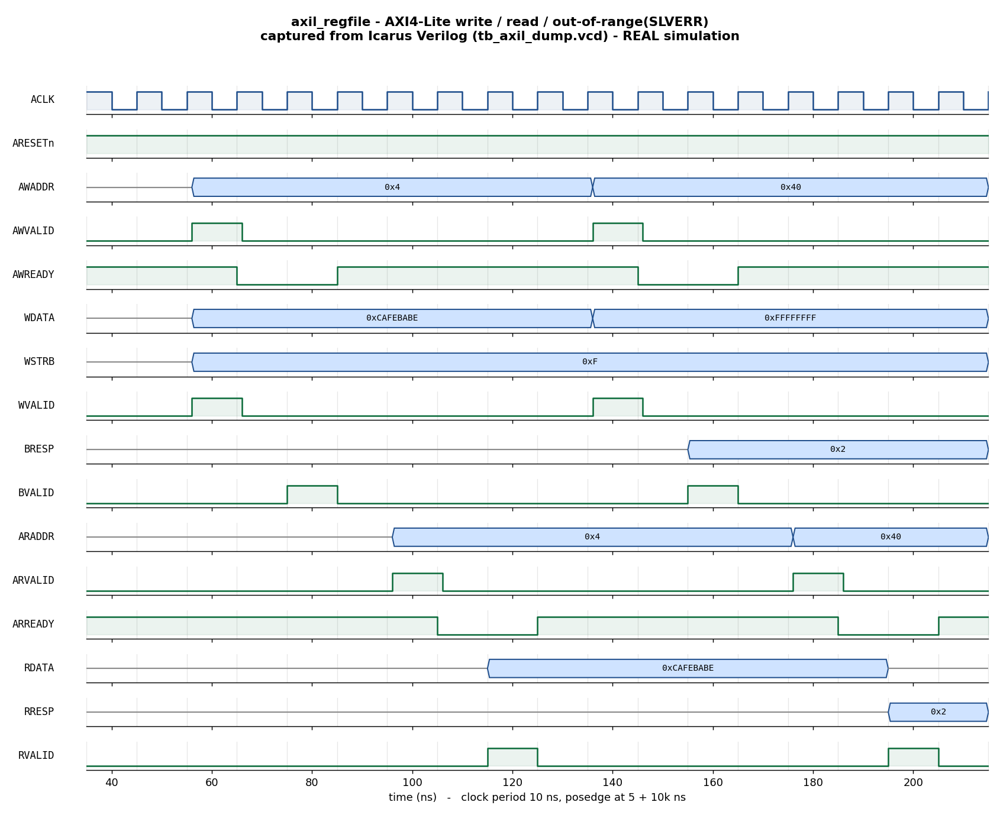

# Day 3 — UVM AXI4-Lite Register-Block Verification

A complete **UVM** testbench for an **AXI4-Lite** slave register file: a full
agent (**driver + monitor + sequencer**) driving all five AXI4-Lite channels, a
**golden reference-model scoreboard**, layered **sequences**, a **virtual
sequencer** with **virtual sequences**, **functional coverage**, and **SVA**
protocol assertions on the interface.

## Overview

`axil_regfile` is a single-outstanding AXI4-Lite slave exposing `NUM_REGS`
32-bit registers. It implements all five channels with standard VALID/READY
handshakes — write address (**AW**), write data (**W**), write response
(**B**), read address (**AR**), read data (**R**) — supports **byte-granular
writes** via `WSTRB`, and returns **`SLVERR` (`2'b10`)** on an out-of-range word
address (`OKAY` = `2'b00` otherwise). The write address and write data are
captured independently, so `AW` and `W` may arrive in either order or the same
cycle; `AWREADY`/`WREADY`/`ARREADY` are combinational (asserted while idle),
making the handshake latency deterministic.

The UVM environment observes every completed transfer with a passive monitor
that reconstructs `AW`/`W`/`B` and `AR`/`R` beats, and checks each against a
**golden register model** kept in the scoreboard. The model applies the exact
same byte-strobe write rules and address-range check as the RTL, so DUT and
model must agree bit-for-bit on read data and on the response code, or the
scoreboard flags a mismatch.

## Verification goal

Prove that the register file:

1. Stores and returns data correctly for every register (write/read round-trip
   across the whole address space).
2. Honors **byte strobes** — only the selected byte lanes of a register change
   on a write.
3. Returns **`SLVERR`** exactly when (and only when) the addressed word is out
   of range, and an out-of-range access never corrupts stored state.
4. Returns `0` on an out-of-range read.
5. Obeys the **AXI4-Lite handshake rules**: every channel holds `VALID` (and a
   stable payload) until its `READY`; responses are restricted to `OKAY`/`SLVERR`
   (checked by SVA).

## Features / coverage list

- **UVM agent** — configurable `UVM_ACTIVE`/`UVM_PASSIVE`; driver runs the
  five-channel master protocol (always-ready on `B`/`R`), monitor reconstructs
  completed transfers onto an analysis port.
- **Reference-model scoreboard** — golden 16×32-bit register array, checked on
  every observed transfer (read data, response code, OOB integrity).
- **Layered sequences** — `write_all`, `read_all`, constrained-`rand`, and an
  `oob` (out-of-range) error burst.
- **Virtual sequencer + virtual sequences** — `axil_smoke_vseq` (write-all then
  read-all) and `axil_regress_vseq` (write → random → OOB errors → read-back
  sweep).
- **Functional coverage** — direction, response code, address region
  (low/mid/high/OOB), byte-strobe pattern, and a direction×response cross.
- **SVA assertions** — `VALID`-stable-until-`READY` and payload stability on
  every channel, legal `BRESP`/`RRESP`, and no response `VALID` during reset.
- **Safety** — global watchdog timeout; VCD waveform dump.

## DUT parameters

| Parameter    | Default | Description |
|--------------|---------|-------------|
| `ADDR_WIDTH` | 8       | `AWADDR`/`ARADDR` width (byte address) |
| `DATA_WIDTH` | 32      | Register / data-bus width in bits |
| `NUM_REGS`   | 16      | Number of 32-bit registers |

## DUT ports

| Channel | Port      | Dir | Width          | Description |
|---------|-----------|-----|----------------|-------------|
| clk/rst | `ACLK`    | in  | 1              | Bus clock |
|         | `ARESETn` | in  | 1              | Active-low reset (async assert, sync release) |
| AW      | `AWADDR`  | in  | `ADDR_WIDTH`   | Write byte address |
|         | `AWVALID` | in  | 1              | Write-address valid |
|         | `AWREADY` | out | 1              | Write-address ready |
| W       | `WDATA`   | in  | `DATA_WIDTH`   | Write data |
|         | `WSTRB`   | in  | `DATA_WIDTH/8` | Byte-lane write strobes |
|         | `WVALID`  | in  | 1              | Write-data valid |
|         | `WREADY`  | out | 1              | Write-data ready |
| B       | `BRESP`   | out | 2              | Write response (`OKAY`/`SLVERR`) |
|         | `BVALID`  | out | 1              | Write-response valid |
|         | `BREADY`  | in  | 1              | Write-response ready |
| AR      | `ARADDR`  | in  | `ADDR_WIDTH`   | Read byte address |
|         | `ARVALID` | in  | 1              | Read-address valid |
|         | `ARREADY` | out | 1              | Read-address ready |
| R       | `RDATA`   | out | `DATA_WIDTH`   | Read data |
|         | `RRESP`   | out | 2              | Read response (`OKAY`/`SLVERR`) |
|         | `RVALID`  | out | 1              | Read-data valid |
|         | `RREADY`  | in  | 1              | Read-data ready |

## Testbench architecture

```
                     +-------------------------- tb_top ---------------------------+
                     |  clk/reset gen        axil_if (SVA)        axil_regfile DUT   |
                     |        |                  | vif                    ^          |
                     |        v                  v                        |          |
  +-------------------------------- axil_env -------------------------------------+  |
  |                                                                              |  |
  |   axil_vsequencer                     axil_agent                             |  |
  |   (virtual seqr)                +-----------------------------------------+  |  |
  |        |  axil_seqr handle      |  axil_sequencer                         |  |  |
  |        v                        |      | seq_item                         |  |  |
  |   axil_*_vseq  --- start -----> |      v                                  |  |  |
  |   (write/rand/oob/read)         |  axil_driver  --drive AW/W/AR-------> DUT  |  |
  |                                 |               <--- B / R responses ---     |  |
  |                                 |  axil_monitor <--sample 5 channels------ DUT|  |
  |                                 |      | analysis port (ap)               |  |  |
  |                                 +------|----------------------+-----------+  |  |
  |                                        |                      |              |  |
  |                              +---------v-------+     +--------v----------+   |  |
  |                              | axil_coverage   |     | axil_scoreboard   |   |  |
  |                              | (covergroup)    |     | golden reg model  |   |  |
  |                              +-----------------+     | + resp checking   |   |  |
  |                                                      +-------------------+   |  |
  +------------------------------------------------------------------------------+  |
                     +--------------------------------------------------------------+
```

## What the testbench checks

The scoreboard (`axil_scoreboard`) holds a golden `model[NUM_REGS]` initialized
to `0` (the DUT reset value). For every transfer the monitor reconstructs:

1. **Response check** — recompute `oob = (word_index >= NUM_REGS)` and require
   `resp == (oob ? SLVERR : OKAY)` for both writes (`BRESP`) and reads (`RRESP`).
2. **OOB integrity** — on an out-of-range access the model is left untouched;
   an out-of-range read must return `0`.
3. **Write** — apply the byte-strobed write to the model
   (`for each lane b: if WSTRB[b], model[idx][8b+:8] = WDATA[8b+:8]`).
4. **Read** — compare `RDATA` against `model[idx]`.

Any disagreement is a `uvm_error`; the run ends clean only if every transfer
matched. `report_phase` also fails if the scoreboard saw no transfers (a
silent-testbench guard).

The portable `tb_axil_dump.sv` uses the same golden-model logic inline and
prints `RESULT: *** PASS ***` when `errors == 0`.

## Functional-coverage intent

`axil_coverage` samples every completed transfer:

- `cp_dir` — read vs. write.
- `cp_resp` — `OKAY` vs. `SLVERR`.
- `cp_idx` — address region: low / mid / high / **OOB**.
- `cp_strb` — single-byte lanes vs. full-word writes.
- `x_dir_resp` — cross of direction × response, so we have evidence that **both**
  a bad-address write *and* a bad-address read were observed.

Hitting the OOB and single-byte-strobe bins is the proof that the random and
`oob` sequences actually stressed the error and partial-write paths.

## Simulation timing



*Caption — **This is a real waveform captured from an Icarus Verilog
simulation** (not a hand-drawn mock-up). `docs/make_waveform.py` parses the
`tb_axil_dump.vcd` produced by `make icarus_dump` and renders the "showcase"
window. It shows, on genuine simulator time: a **write** to `reg1`
(`AWADDR=0x04`, `WDATA=0xCAFEBABE`, `WSTRB=0xF`) accepted when `AWVALID`/`WVALID`
meet `AWREADY`/`WREADY` (~56–66 ns), completing with `BVALID` at ~75 ns and
`BRESP=OKAY`; a **read** of `reg1` (`ARADDR=0x04`, ~96–106 ns) returning
`RDATA=0xCAFEBABE` with `RVALID` at ~115 ns and `RRESP=OKAY`; then an
**out-of-range write** (`AWADDR=0x40`, word index 16 ≥ `NUM_REGS`) where
`BRESP=0x2` (**`SLVERR`**) at ~155 ns; and an **out-of-range read**
(`ARADDR=0x40`) where `RRESP=0x2` (**`SLVERR`**) and `RDATA` returns to `0` at
~195 ns.*

> The image is rendered from the **module-based** companion testbench
> (`tb_axil_dump.sv`), because the open-source simulator available here (Icarus
> Verilog) does not implement the UVM class library. The DUT, checks, and
> waveform are genuine; see the run note below regarding the UVM testbench.

## Files

| File | Description |
|------|-------------|
| `axil_regfile.sv`     | Synthesizable AXI4-Lite slave register-file DUT |
| `axil_if.sv`          | AXI4-Lite interface, clocking blocks, protocol SVA |
| `axil_regfile_pkg.sv` | Full UVM environment (txn/seqs/driver/monitor/coverage/agent/scoreboard/vseqr/tests) |
| `tb_top.sv`           | UVM top: clock/reset, DUT + interface, `run_test()` |
| `tb_axil_dump.sv`     | Portable module-based self-checking testbench (Icarus) |
| `Makefile`            | UVM targets (vcs/questa/verilator) + `icarus_dump`, `waveform` |
| `docs/make_waveform.py` | Manual VCD parser → renders the committed waveform PNG |
| `docs/axil_regfile_waveform.png` | Waveform captured from the Icarus run |

## Run instructions

UVM testbench (needs a UVM-capable simulator), pick the test with
`UVM_TESTNAME`:

```bash
make vcs        UVM_TESTNAME=axil_regress_test   # Synopsys VCS
make questa     UVM_TESTNAME=axil_smoke_test     # Siemens Questa / ModelSim
make verilator  UVM_TESTNAME=axil_smoke_test     # Verilator 5 built with --uvm
```

Portable self-checking run + waveform (works with open-source Icarus Verilog):

```bash
make icarus_dump    # runs tb_axil_dump.sv -> prints RESULT: *** PASS ***
make waveform       # regenerates docs/axil_regfile_waveform.png from the VCD
make clean
```

Expected tail of `make icarus_dump`:

```
INFO: 256 checks, 0 errors
RESULT: *** PASS ***
```

> **Run status (honest):** The **module-based** testbench (`tb_axil_dump.sv`)
> **was executed** here with Icarus Verilog 13.0 and printed
> `RESULT: *** PASS ***` (256 checks, 0 errors); the committed waveform is
> captured from that run's VCD. The **UVM** testbench (`axil_regfile_pkg.sv` +
> `tb_top.sv`) was **not run** here because no UVM-capable simulator
> (VCS/Questa/Verilator-uvm) is installed in this environment; it is provided to
> compile and run under any of the UVM targets above. No UVM pass log is claimed.

## What the testbench checks (summary)

- ✅ Write/read round-trip correct for every register
- ✅ Byte-strobed writes modify only the selected lanes
- ✅ `SLVERR` returned iff the word address is out of range
- ✅ Out-of-range accesses never corrupt stored state; OOB reads return `0`
- ✅ AXI4-Lite `VALID`-stable-until-`READY` with stable payload (SVA)
- ✅ Legal `BRESP`/`RRESP` and no response `VALID` during reset (SVA)
- ✅ Functional coverage of direction, response, address region, and strobe
