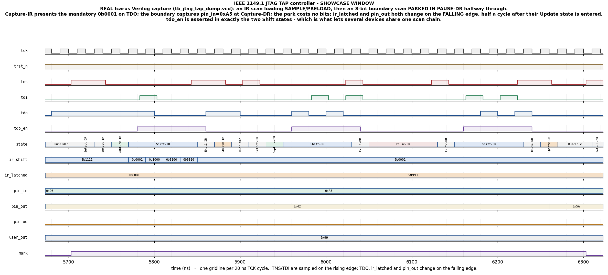

# Day 30 — IEEE 1149.1 JTAG TAP Controller Verification

The most widely implemented state machine in digital hardware. Nearly every non-trivial chip made since 1990 contains a **JTAG Test Access Port** — the four-wire (TCK/TMS/TDI/TDO) debug and board-test port defined by IEEE 1149.1. It is how a bare board is tested before any firmware exists, how a CPU is halted and single-stepped, how an FPGA is loaded, how a device on an unknown board is identified, and how a scan chain is walked at manufacturing test.

At its centre is a **sixteen-state controller** driven by a single signal. TMS is the only control input: one bit per TCK, and the position in the state diagram is the entire protocol. There are no packets, no addresses, no handshake — the meaning of TDI and TDO depends *only* on where in those sixteen states the controller currently is.

That design makes it a near-perfect verification subject, for three reasons that show up nowhere else in this series:

- **The state diagram is the specification.** Sixteen states, thirty-two transitions, and a promise the whole standard rests on: *five TCK clocks with TMS held high reach Test-Logic-Reset from anywhere*. That is a property, not a waveform, and it either holds for all sixteen starting states or the standard is broken.
- **Both clock edges carry meaning.** TMS/TDI are sampled and shift/capture happen on the **rising** edge; the update latches and TDO change on the **falling** edge. An implementation that collapses this onto one edge still passes a loopback test and still reads IDCODE — and quietly changes a device's output pins in the middle of a shift.
- **The register action at an edge belongs to the state the controller was in *before* the edge**, not the one it lands in. Get that off by one edge and a Capture-DR/Shift-DR pair captures twice, or shifts before it captures. Every symptom is a wrong bit in a scan result, ten cycles downstream of the cause.

It also has the highest ratio of *mandatory small print* to gate count of anything in the series. Capture-IR must load a pattern with a 1 in its least-significant bit. IDCODE bit 0 must be 1. An unimplemented opcode must select BYPASS. Pause-DR must be transparent. CLAMP must select BYPASS's register while still driving the boundary. Every one of those is a one-line requirement whose violation produces hardware that works fine on the bench and fails on a tester.

---

## Verification goal

Prove that the DUT is *the* IEEE 1149.1 TAP controller — not merely a state machine that can read an IDCODE.

Concretely, four questions, answered by four different mechanisms:

**1. Is the state diagram right, in every state, on both TMS values?**
Not sampled — enumerated. A **cycle-exact scoreboard** compares controller state, IR shift register, TDO, TDO's drive enable, the latched instruction, both update latches and the boundary drive against a reference model on **every rising and every falling edge** of the run. Coverage then reports how many of the sixteen states and thirty-two arcs were actually taken; the run fails if any is missed.

**2. Do the mandatory constants and rules hold?**
The reference model re-proves them inside the simulator before a single DUT result is judged (see [What checks the checker](#what-checks-the-checker)): five-TMS reset from all sixteen states, reachability of all sixteen, the Capture-IR LSB, all ten unimplemented opcodes landing on BYPASS, and an end-to-end scan of each of the four chains.

**3. Is each register the register it claims to be?**
A second, **model-independent** scoreboard reassembles complete scans from the state sequence and restates the standard's requirements directly: BYPASS is exactly one flip-flop of delay, the boundary register captures the pins that were there at the Capture-DR edge, the last `chain_len` bits shifted in reach the update latch, IDCODE reads back its constant with bit 0 set.

**4. Does it survive stimulus nobody designed?**
A random TMS/TDI walk. Because the checker is driven off the pins rather than off the testbench's intent, an unstructured TMS stream is legal stimulus — and it goes places no directed scan does: scans abandoned mid-chain, Select-IR-Scan taken straight back to Test-Logic-Reset, long parks in Pause, TRST_n asserted mid-shift.

### Why two scoreboards

The cycle-exact scoreboard is much stronger — it catches an off-by-one-edge that a transaction-level check sails straight past. But it can only ever be as right as the reference model, and a model and a DUT written from the same misreading agree perfectly.

So the transaction-level scoreboard shares **no code** with the model. It works from reassembled scans and asks the standard's questions in a different form. If both agree, either the TAP is right or two independent expressions of the specification are wrong the same way.

### What checks the checker

`ref_selfcheck()` runs before any DUT comparison and re-derives, in the simulator, the properties the standard makes mandatory:

| | property | how it is checked |
|---|---|---|
| a | IDCODE bit 0 is 1 | the constant, after the design's forced bit |
| b | five TMS=1 clocks reach Test-Logic-Reset | from **all sixteen** starting states |
| c | every state is reachable from Test-Logic-Reset | breadth-first walk of the next-state function; must find 16 |
| d | Capture-IR loads a pattern with LSB=1 | stepped through Capture-IR → Shift-IR |
| e | every unimplemented opcode selects BYPASS | all sixteen opcodes; the ten unimplemented ones must land on BYPASS, and no chain may have length 0 |
| f | CLAMP selects BYPASS's register | the one instruction where chain selection and boundary drive disagree |
| g | an *n*-bit scan of an *n*-bit chain returns its captured contents | end to end, LSB first, for all four chains |

A failure here is fatal and no DUT result is reported, because a broken model cannot be trusted to disagree with a broken DUT.

---

## Features / coverage

| | |
|---|---|
| DUT | full IEEE 1149.1 TAP: 16-state controller, 4-bit IR, four DR chains |
| instructions | EXTEST, SAMPLE/PRELOAD, IDCODE, USER, CLAMP, BYPASS, + 10 unimplemented opcodes |
| chains | BYPASS (1 bit), IDCODE (32), boundary-scan (`BSR_LEN`), user (`USER_LEN`) |
| edges | rising: sample TMS/TDI, transition, capture, shift · falling: update latches, TDO |
| reset | asynchronous TRST_n **and** five-TMS=1, both re-arming IDCODE |
| verification | UVM: 2 agents, 3 monitors, 2 scoreboards, virtual sequencer, 12 sequences, 2 virtual sequences |
| golden model | pure-function whole-cycle TAP model with a 7-property self-check |
| checking | cycle-exact (every edge) **plus** model-independent transaction-level |
| coverage | 16 states, 32 transitions (state × TMS), 16 opcodes, 4 chains, scan length, pause |
| assertions | 7 SVA in the DUT + 12 SVA and 6 cover properties in the interface |
| stimulus | 16 directed scenarios, all 16 opcodes swept, random TMS walk, random scans |
| portable TB | `tb_jtag_tap_dump.sv` — same checking, no UVM, runs on Icarus |

---

## DUT — `jtag_tap.sv`

A synthesizable TAP controller. Reset-safe (asynchronous TRST_n to Test-Logic-Reset), parameterized, no latches, no clock gating, and lint-clean apart from Icarus's known constant-select advisory.

### Parameters

| parameter | default | meaning |
|---|---|---|
| `IDCODE` | `32'h10DE_5097` | device identification register. Bit 0 is **forced to 1** in the design because IEEE 1149.1 requires it; a parameter with bit 0 clear produces a note at elaboration rather than a silently non-compliant device. |
| `BSR_LEN` | `8` | boundary-scan register length (number of boundary cells) |
| `USER_LEN` | `8` | length of the user-defined data register reached by the USER opcode |

### Ports

| port | dir | width | meaning |
|---|---|---|---|
| `tck` | in | 1 | test clock. Both edges are used. |
| `trst_n` | in | 1 | asynchronous test reset, active low → Test-Logic-Reset |
| `tms` | in | 1 | test mode select — sampled on the rising edge; the entire protocol |
| `tdi` | in | 1 | test data in — sampled on the rising edge |
| `tdo` | out | 1 | test data out — changes on the **falling** edge |
| `tdo_en` | out | 1 | TDO is driven only in Shift-IR / Shift-DR |
| `pin_in` | in | `BSR_LEN` | what the mission logic presents to the boundary cells |
| `pin_out` | out | `BSR_LEN` | the boundary cells' update latch |
| `pin_oe` | out | 1 | asserted by EXTEST and CLAMP, never in Test-Logic-Reset |
| `user_capture` | in | `USER_LEN` | the value the user register captures |
| `user_out` | out | `USER_LEN` | the user register's update latch |
| `state_o` | out | 4 | controller state — verification hook, no functional role |
| `ir_shift_o` | out | 4 | IR shift register — verification hook |
| `ir_latched_o` | out | 4 | latched instruction — verification hook |

### Instruction decode

Unimplemented opcodes are not a don't-care; the standard requires them to select BYPASS.

| opcode | instruction | DR chain | length | boundary driven |
|---|---|---|---|---|
| `0000` | EXTEST | boundary-scan | `BSR_LEN` | **yes** |
| `0001` | SAMPLE/PRELOAD | boundary-scan | `BSR_LEN` | no |
| `0010` | IDCODE | identification | 32 | no |
| `1000` | USER | user data | `USER_LEN` | no |
| `1100` | CLAMP | **BYPASS** | 1 | **yes** |
| `1111` | BYPASS | BYPASS | 1 | no |
| 10 others | → BYPASS | BYPASS | 1 | no |

**CLAMP is the interesting row.** It is the only instruction where "which chain is in the DR path" and "is the boundary driving" disagree. A checker built on the assumption that they move together fails on exactly that one line — which is why the directed tests scan CLAMP through five bits and confirm they came back as one flip-flop of delay, not eight bits of boundary register.

### Timing, per clause 4 of the standard

```
                    ___________             ___________
   TCK    _________|           |___________|           |________
                   ^           ^           ^
                   |           |           |
        rising edge|           |falling    |rising edge
                   |           |edge       |
        - sample TMS, TDI      |           - next transition
        - state transition     - update latches load
        - capture (Capture-xR) - TDO changes
        - shift   (Shift-xR)   - tdo_en tracks the new state
```

The register action taken at a rising edge belongs to the state the controller was in **before** that edge. So the Capture-DR → Shift-DR transition *captures* on its edge, and the first *shift* happens one edge later — which is why an *n*-bit scan takes exactly *n* clocks in Shift-DR, the last one carrying TMS=1 out to Exit1-DR.

---

## Testbench architecture

```
                             +----------------------------+
                             |  jtag_vseqr (virtual sqr)  |
                             +-------------+--------------+
                                           |
             +-----------------------------+-----------------------------+
             |                                                           |
   +---------v----------+                                    +-----------v---------+
   |    jtag_agent      |  (TAP side, active)                |   jtag_pin_agent    |
   |                    |                                    |  (system side)      |
   |  jtag_sequencer    |                                    |  jtag_pin_sequencer |
   |        |           |                                    |        |            |
   |  jtag_driver -----------> trst_n / tms / tdi             |  jtag_pin_driver ------> pin_in
   |                    |                                    |        |             \    user_capture
   |  jtag_pin_monitor  |<-- posedge snapshot                |  jtag_pin_side_mon  |
   |        |           |                                    |        |            |
   |  jtag_scan_monitor |<-- state sequence                  +--------|------------+
   +--------|-----------+                                             |
            |                                                        |
   cyc_ap --+--> jtag_scoreboard        (CYCLE-EXACT, vs ref model)   |
            |                                                        |
            +--> jtag_coverage <-------------------------------------+ pin_ap
            |         ^
  scan_ap --+---------+
            |
            +--> jtag_scan_scoreboard   (TRANSACTION, model-independent)

                              +-------------------------+
                              |  DUT: jtag_tap.sv       |
                              |  16-state TAP + IR + 4  |
                              |  data-register chains   |
                              +-------------------------+
```

### Two agents, on purpose

A real device does not hold still while it is being scanned. The **pin agent** keeps the mission-side inputs moving underneath the TAP agent's scans, so a Capture-DR has to grab whatever happened to be on the boundary at that exact edge. That is the interleaving a single-agent testbench never produces, and it is what makes the virtual sequences do real work rather than just calling sub-sequences in order:

- **phase 1** forks a *static* pin sequence against the directed scans, because a check that names the value it expects captured needs the source to hold still;
- **phase 2** forks a *random wiggle* sequence against random scans and TMS walks, and lets the two agents interleave freely.

Both phases use `fork ... join_any; disable fork`, with the pin sequences running forever — the TAP side decides how long a phase lasts and the pin side just keeps up. A pin sequence with a fixed length would either run out early and leave the boundary frozen, or outlive its phase and hold the pin sequencer against the next one.

### One pin monitor, not two

JTAG uses both clock edges, so the obvious design is a rising-edge monitor and a falling-edge monitor. That is a trap. A clocking block samples *before* its edge, so a falling-edge monitor would read TDO one edge before the edge that changes it — and pairing two same-timestep streams inside a scoreboard is a race waiting to happen.

Sampling once, at rising edge *k+1*, gives the whole cycle in one atomic snapshot:

| field | what it is |
|---|---|
| `tms`, `tdi`, `pin_in`, `user_capture` | the vector the DUT is about to sample at edge *k+1* |
| `state`, `ir_shift` | what rising edge *k* produced |
| `tdo`, `tdo_en`, `ir_latched`, `pin_out`, `pin_oe`, `user_out` | what falling edge *k* produced — nothing has touched them since |

So one item carries the stimulus for cycle *k+1* and the complete result of cycle *k*. The transaction-level view is then a genuinely different monitor — one that reassembles whole scans — rather than a second copy of the pin-level one.

### Sequences

| sequence | what it drives |
|---|---|
| `jtag_reset_seq` | TRST_n, then five-TMS reset — both ways the standard provides |
| `jtag_idcode_seq` | IDCODE with **no IR scan first**: after reset a TAP must already be able to identify itself |
| `jtag_bypass_seq` | BYPASS at 9, 16 and 1 bits — one flip-flop and nothing more |
| `jtag_boundary_seq` | the real board-test flow: SAMPLE → PRELOAD → EXTEST → CLAMP → back |
| `jtag_user_seq` | the user register, and the proof that scanning it leaves the boundary latch alone |
| `jtag_pause_seq` | every scan parked in Pause-DR / Pause-IR, holds of 0 to 5 |
| `jtag_opcode_sweep_seq` | all sixteen opcodes, each with an exact-length and an over-length scan |
| `jtag_tms_walk_seq` | unstructured TMS/TDI — the strongest stimulus in the file |
| `jtag_rand_seq` | random opcodes, payloads, scan lengths, parks, resets |
| `jtag_pin_static_seq` | a known boundary for the directed checks |
| `jtag_pin_wiggle_seq` | the mission logic refusing to hold still, extremes first |

Tests: `jtag_tap_smoke_test` (reset, IDCODE, BYPASS, board-test flow) and `jtag_tap_regress_test` (both phases, everything).

---

## Simulation timing



**A real Icarus Verilog capture**, not a hand-drawn diagram: `make waveform` runs the RTL, dumps `tb_jtag_tap_dump.vcd`, and renders the window the testbench delimits with its `mark` signal using `docs/make_waveform.py`. The `state` row is annotated with state names and tinted by what each state does — green captures, orange updates, blue shifts, red pauses.

The window is a complete IR scan loading SAMPLE/PRELOAD, immediately followed by an eight-bit boundary scan **parked in Pause-DR halfway through**. Reading left to right:

| states | what to look at |
|---|---|
| `Run/Idle → Select-DR → Select-IR → Capture-IR` | three clocks of TMS to reach the IR path at all. `ir_shift` loads `0b0001` on the Capture-IR edge |
| `Shift-IR` ×4 | TDO opens (`tdo_en`) and immediately shows a **1** — that mandatory Capture-IR LSB, the bit a board tester uses to tell a live TAP from a chain stuck at zero. `ir_shift` walks `0001 → 1000 → 0100 → 0010 → 0001` as the opcode goes in LSB-first. The fourth cycle carries TMS=1, so the last bit is shifted in *on the way out* — that is how *n* bits fit into *n* clocks |
| `Exit1-IR → Update-IR` | `ir_latched` changes from IDCODE to SAMPLE — and it changes on the **falling** edge, half a cycle after Update-IR is entered |
| `Run/Idle → Select-DR → Capture-DR` | the boundary register grabs `pin_in = 0xA5` on this rising edge |
| `Shift-DR` ×4 | the captured `0xA5` starts coming out LSB-first while `0x5A` goes in |
| `Exit1-DR → Pause-DR → Exit2-DR → Shift-DR` ×4 | **the park.** Nothing is lost across it: the `Shift-DR → Exit1-DR` transition still shifts a bit, `Exit2-DR → Shift-DR` does not, and the remaining four bits of `0xA5` come out on the far side |
| `Exit1-DR → Update-DR` | `pin_out` takes the preloaded `0x5A`, again on the falling edge |

Two things worth noticing that are easy to state and easy to get wrong:

- `tdo_en` is asserted in **exactly** the two Shift states and nowhere else. That is what lets several devices share one scan chain — each one is electrically absent except while it is shifting.
- `pin_out` holds `0x42` (left by an earlier test) right through the capture and the whole shift, and only moves at Update-DR. A device's output pins must not twitch while its boundary register is being loaded.

---

## How the checking works

### The reference model

`jtag_tap_ref_pkg.sv` models **one whole TCK cycle as a pure function**:

```systemverilog
next = ref_tap_cycle(current, tms, tdi, pin_in, user_capture);
```

Hand it the TAP's complete state before a rising edge plus the pins sampled at that edge, and it returns the complete state after the following falling edge — including TDO and whether TDO is driven. Inside, it follows the standard's own ordering:

```
1. act on the CURRENT state       capture / shift / IR reload in Test-Logic-Reset
2. advance the state              next_state(current, tms)
3. apply the falling-edge work    update latches, TDO, tdo_en, pin_oe
   of the NEW state
```

Step 3 using the **new** state is the subtle part, and the one a hand-written checker usually gets wrong: an Update-DR reached at a rising edge does its latching at the falling edge inside that same cycle.

It is written from the standard's state diagram and register descriptions, not from the RTL, and it is structurally nothing like it — a combinational function over a packed state word, no clocks, no latches, no shift gating. That difference is what gives an agreement between them any weight.

### The cycle-exact scoreboard

`jtag_scoreboard` steps the model once per rising edge and compares eight things against the DUT every cycle: `state`, `ir_shift`, `tdo`, `tdo_en`, `ir_latched`, `pin_out`, `user_out`, `pin_oe`. TDO is judged only while `tdo_en` says someone is listening — off-shift its value is a don't-care to whatever is downstream, and asserting on it would be checking an implementation detail rather than a requirement.

On the first cycle after a reset the scoreboard rearms its model and confirms the two things reset must produce: the controller is in Test-Logic-Reset, and IDCODE is the latched instruction.

### The transaction-level scoreboard

`jtag_scan_scoreboard` receives reassembled scans and shares no code with the model:

| chain | what it checks |
|---|---|
| IDCODE | the 32 bits out equal the constant, and bit 0 is 1 |
| boundary-scan | the bits out equal `pin_in` **as it stood at the Capture-DR edge**; the last `BSR_LEN` bits in reached `pin_out` |
| user | same, against `user_capture` and `user_out` |
| BYPASS / CLAMP / unimplemented | captured bit 0 is 0, and the *n* bits out equal the *n* bits in shifted up one position — exactly one flip-flop of delay |
| IR (any) | the captured pattern's LSB is 1, and the last four bits in became the latched instruction |

`tail(written, n, len)` is the small piece of arithmetic that makes over-length scans checkable: after *n* bits go LSB-first into a `len`-bit shift register, bit *j* of the register is written bit `n-len+j`. So a 34-bit scan of a 32-bit chain still has a predictable final register content, and the check does not have to skip it.

A DR scan shorter than its chain is legal stimulus but unpredictable in content — only part of the register came out — so those are counted and skipped rather than guessed at.

---

## Functional-coverage intent

| coverpoint | intent |
|---|---|
| `cp_state` | all sixteen controller states, individually named |
| **`cx_state_tms`** | **the sixteen states crossed with the TMS value taken out of each — which is exactly the thirty-two arcs of the state diagram.** Full coverage here means every legal transition was actually taken |
| `cp_instr` | all sixteen opcodes, implemented and not |
| `cp_chain` | all four DR chains |
| `cp_len` | scan length at the boundaries where a shift path saturates or wraps wrong: 1, the chain length exactly, one over, well over |
| `cp_paused` | scans parked mid-chain vs. run straight through |
| `cx_instr_paused` | every opcode both ways |
| `cx_chain_len` | each chain at each length class — the cell that matters is "32-bit chain, 33+ bit scan" |
| `cp_pin_in`, `cp_user` | the capture sources at all-zero and all-ones, because an always-zero boundary would let a stuck-at-0 capture path pass |
| `cp_oe`, `cp_tdo_en` | the boundary drive and TDO enable both seen asserted and deasserted |

The portable Icarus testbench collects the same state and transition coverage procedurally (Icarus has no covergroups) and **fails the run** if any of the sixteen states, thirty-two transitions or sixteen opcodes went unvisited. A coverage hole is a test failure here, not a footnote.

---

## Running

```bash
# portable: Icarus Verilog, self-checking, no UVM required
make icarus_dump

# re-render the committed waveform from the captured VCD
make waveform

# UVM (needs VCS / Questa / Verilator >= 5 built with --uvm)
make vcs       UVM_TESTNAME=jtag_tap_smoke_test
make questa    UVM_TESTNAME=jtag_tap_regress_test
make verilator UVM_TESTNAME=jtag_tap_smoke_test
```

| test | stimulus |
|---|---|
| `jtag_tap_smoke_test` | reset both ways, IDCODE with no IR scan, BYPASS, the SAMPLE → PRELOAD → EXTEST → CLAMP board-test flow, on a static boundary |
| `jtag_tap_regress_test` | the above plus the user register, chain isolation, every Pause path, all sixteen opcodes, then random scans and TMS walks against a moving boundary |

The SVA in `jtag_tap.sv` and `jtag_tap_if.sv` is guarded by `+define+JTAG_SVA`, which the `vcs` / `questa` / `verilator` targets pass and the Icarus target does not — Icarus does not implement concurrent assertions.

### Result of the Icarus run

```
-- reference-model self-check --
REF SELFCHECK: 0 problem(s) in the reference model

 1. asynchronous TRST_n
 2. five TMS=1 clocks from Shift-DR reach Test-Logic-Reset
 3. IDCODE read with no IR scan (reset default)
 4. Capture-IR pattern
 5. BYPASS: a single flip-flop in the path
 6. unimplemented opcode 0b0111 must select BYPASS
 7. SAMPLE/PRELOAD: capture the pins, preload the latch
 8. EXTEST drives the boundary
 9. CLAMP: a one-bit DR while still driving the boundary
10. the user data register
11. an unselected chain holds while another is scanned
12. parking in Pause-DR costs no bits
13. parking in Pause-IR
14. Select-IR-Scan with TMS=1 goes straight to reset
15. all sixteen opcodes, each followed by a DR scan
16. TRST_n in the middle of a Shift-DR
17. random TMS/TDI walk, 6000 cycles, pins wiggling
18. 300 random complete scans

============================================================
 state coverage
============================================================
   Exit2-DR          visited     483 time(s)
   Exit1-DR          visited     884 time(s)
   Shift-DR          visited    2867 time(s)
   Pause-DR          visited    1247 time(s)
   Select-IR         visited     502 time(s)
   Update-DR         visited     581 time(s)
   Capture-DR        visited     582 time(s)
   Select-DR         visited    1084 time(s)
   Exit2-IR          visited     211 time(s)
   Exit1-IR          visited     544 time(s)
   Shift-IR          visited    1499 time(s)
   Pause-IR          visited     805 time(s)
   Run-Test/Idle     visited    1985 time(s)
   Update-IR         visited     441 time(s)
   Capture-IR        visited     441 time(s)
   Test-Logic-Reset  visited     100 time(s)
 states hit      : 16 / 16
 transitions hit : 32 / 32

 opcode coverage (cycles spent with each opcode latched)
   0b0000 EXTEST                     1968
   0b0001 SAMPLE/PRELOAD             1628
   0b0010 IDCODE                     3584
   0b0011 unimplemented->BYPASS       367
   0b0100 unimplemented->BYPASS       585
   0b0101 unimplemented->BYPASS       568
   0b0110 unimplemented->BYPASS       525
   0b0111 unimplemented->BYPASS       327
   0b1000 USER                        911
   0b1001 unimplemented->BYPASS       523
   0b1010 unimplemented->BYPASS       346
   0b1011 unimplemented->BYPASS       546
   0b1100 CLAMP                      1151
   0b1101 unimplemented->BYPASS       425
   0b1110 unimplemented->BYPASS       515
   0b1111 BYPASS                      287

============================================================
 14256 rising edges and 14256 falling edges checked against the model
 RESULT: *** PASS ***
============================================================
```

### Does the checking actually bite?

A scoreboard that never fails is indistinguishable from one that does not check. Four single-line mutations of the DUT, each a plausible implementation slip, each run against the unmodified testbench:

| mutation | result |
|---|---|
| Capture-IR loads `0b0000` — drops the mandatory LSB | **FAIL**, 4 770 reported lines |
| unimplemented opcodes select the boundary register instead of BYPASS | **FAIL**, 10 416 lines |
| one wrong next-state entry: `Exit2-DR` with TMS=0 → Capture-DR | **FAIL**, 13 516 lines |
| update latch loads on the rising edge instead of the falling edge | **FAIL**, 1 052 lines |

The last one is the reason the checker is cycle-exact. Loading the update latch half a cycle early is invisible to any check that only looks at the value after a scan completes — the final content is identical. What changes is *when* a device's output pins move, and the only way to see it is to compare on every edge.

---

## What the testbench checks

**Every rising edge**
- controller state matches the reference model's next-state function
- the IR shift register matches — captured in Capture-IR, shifted in Shift-IR, frozen everywhere else

**Every falling edge**
- TDO matches, whenever `tdo_en` says it is driven
- `tdo_en` is asserted in exactly Shift-IR and Shift-DR
- the latched instruction matches — changing only out of Update-IR or in Test-Logic-Reset
- the boundary and user update latches match — changing only out of Update-DR
- `pin_oe` matches — asserted by EXTEST and CLAMP, never in Test-Logic-Reset

**Every complete scan** (independently of the model)
- Capture-IR presented a 1 in its LSB
- the last four bits of an IR scan became the latched instruction
- IDCODE reads back its constant, bit 0 set
- the boundary register captured the pins as they stood at the Capture-DR edge
- the last `chain_len` bits shifted in reached the update latch
- BYPASS, CLAMP and all ten unimplemented opcodes are one flip-flop of delay and nothing more
- an unselected chain holds its contents while another is scanned

**Structural**
- five TMS=1 clocks reach Test-Logic-Reset from all sixteen states
- all sixteen states reachable, all thirty-two transitions taken, all sixteen opcodes latched — a coverage hole fails the run
- TRST_n asserted mid-shift lands in Test-Logic-Reset, re-arms IDCODE and drops the boundary drive
- a park in Pause-DR or Pause-IR costs no bits, for holds of 0 to 5 clocks
- the reference model passes its own seven-property self-check before any DUT result is judged
