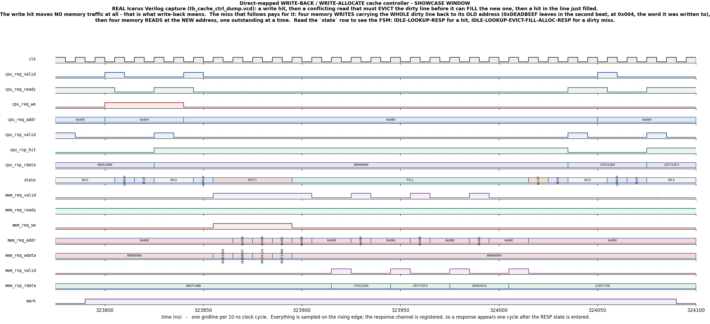

# Day 31 — Write-Back / Write-Allocate Cache Controller Verification

A direct-mapped, write-back, write-allocate cache controller, verified with a
full UVM environment (two agents, virtual sequencer, reference-model
scoreboard, functional coverage, SVA) and with a portable module-based twin
that runs on Icarus Verilog and captures the committed waveform.

| | |
|---|---|
| **DUT** | [`cache_ctrl.sv`](cache_ctrl.sv) — 8 sets × 4 words/line, blocking, write-back, write-allocate |
| **Reference model** | [`cache_ref_pkg.sv`](cache_ref_pkg.sv) — architectural memory + backing memory, as two separate images |
| **UVM environment** | [`cache_ctrl_pkg.sv`](cache_ctrl_pkg.sv), [`cache_ctrl_if.sv`](cache_ctrl_if.sv), [`tb_top.sv`](tb_top.sv) |
| **Portable testbench** | [`tb_cache_ctrl_dump.sv`](tb_cache_ctrl_dump.sv) — Icarus, no UVM, self-checking |
| **Waveform** | [`docs/cache_ctrl_waveform.png`](docs/cache_ctrl_waveform.png) — captured from a real Icarus run |

---

## Verification goal

A cache is the first block most engineers meet where **the design is
deliberately, continuously wrong** and that is the whole point. After a store
hits a write-back cache, DRAM holds the *old* value, and it is supposed to.
The cache and memory disagree, sometimes for millions of cycles, and the job of
the testbench is to prove that the disagreement is always exactly the intended
one and that it is always resolved at exactly the right moment.

That reframes what "checking the DUT" means. Checking that every load returns
the right data is necessary and easy, and it is not enough — a cache can return
perfect data forever while quietly writing the wrong line to the wrong address
behind your back, and nothing on the CPU port will ever notice. So this
environment checks four independent things:

1. **Every response is right.** Read data and the hit/miss flag are both
   compared against a golden model on every single access.
2. **Memory ends up right.** After each flush, the physical memory image the
   DUT actually wrote — rebuilt purely from observed memory-port writes — is
   compared word for word against what the model says DRAM should contain.
3. **The traffic itself is right.** The number of words the DUT pushed to and
   pulled from memory is reconciled against the number of line writebacks and
   fills the model says were required. A cache that writes back twice, or
   drops a beat, fails here even when checks 1 and 2 pass.
4. **The protocol is right.** SVA on both the CPU port and the memory port,
   covering handshake stability, single-outstanding-access, alignment, and
   the fact that a hit costs no memory traffic at all.

### Why the model keeps two memory images

`cache_ref_pkg` holds `ref_arch[]` (the *architectural* value of every word —
what a load must return) and `ref_back[]` (what *backing memory* should
physically contain). They are equal everywhere except inside a resident dirty
line, and eviction or flush is precisely the event that makes them equal again.

A single-image model cannot express the bug class that matters most. "The read
was right but DRAM kept a stale copy" and "the line was written back to the
wrong address" both look identical to a model that only tracks one memory.

### Reset is modelled honestly, not conveniently

The DUT's reset clears valid/dirty, which throws away every store that has not
yet been written back. That is correct behaviour for a cache with no
battery-backed state, and it means a load after a reset legitimately returns
the *old* data.

`ref_hw_reset()` therefore rolls `ref_arch` back to `ref_back` for the dirty
lines. It would have been easier to give up and stop checking across resets —
and that shortcut is exactly how a real data-loss bug survives to silicon, so
the model does the work instead.

### What checks the checker

Before the reference model is allowed to judge anything, it re-proves its own
invariants inside the simulator (`ref_selfcheck`, run by both testbenches and
by `tb_top`): cold reads miss and return memory; siblings in a filled line hit;
a store updates the architectural view and *not* memory; byte strobes merge
rather than overwrite; a conflicting tag evicts and the eviction lands; flush
cleans without invalidating; after a flush both memory images agree everywhere;
reset discards dirty data; and every address in the window round-trips through
the tag/index/offset split. If any of those fail, the run stops there rather
than reporting a DUT bug that is really a model bug.

---

## Features / coverage

- Direct-mapped, 8 sets × 4 words × 32 bits, parameterised
- **Write-back**: stores land in the cache only; memory is updated on eviction
  or flush
- **Write-allocate**: a store that misses refills the line first, so a store
  can generate a read burst
- **Blocking**, one access in flight — which is what makes the golden model a
  pure function and lets the scoreboard predict hit/miss exactly
- Byte-strobe (`wstrb`) merge on both the hit path and the allocate path,
  including the legal zero-strobe store
- Dirty-line eviction: the *whole* line goes back, to its *old* address
- Line fill: one outstanding memory read at a time, in order
- Maintenance **flush** that walks every set and cleans the dirty ones, and
  deliberately does **not** invalidate
- Flush priority over new requests, so a hot request stream cannot starve
  maintenance
- Reset with dirty lines resident — data loss, verified as intended behaviour
- Memory-side backpressure (`mem_req_ready` deassertion) and variable read
  latency, applied as a *sequence*, so a test can turn hostile mid-run
- Functional coverage: op × hit/miss, set, tag, word offset, byte-strobe
  pattern, hit/miss transition pairs, and memory direction × word offset
- SVA on the DUT and on the interface (see [SVA](#assertions-sva))

---

## DUT — `cache_ctrl.sv`

### Parameters

| Parameter | Default | Meaning |
|---|---|---|
| `ADDR_W` | 32 | byte-address width |
| `DATA_W` | 32 | data width; `wstrb` is `DATA_W/8` bits |
| `LINE_WORDS` | 4 | words per cache line — also the eviction/fill burst length |
| `SETS` | 8 | number of direct-mapped lines |

Derived: `BYTE_W = 2`, `OFF_W = $clog2(LINE_WORDS) = 2`,
`IDX_W = $clog2(SETS) = 3`, `TAG_W = ADDR_W − IDX_W − OFF_W − BYTE_W = 25`.

```
 31                     7 6     4 3   2 1  0
+-------------------------+-------+-----+----+
|          tag            | index | off |byte|
+-------------------------+-------+-----+----+
          25 b               3 b    2 b   2 b
```

### Ports

| Port | Dir | Width | Description |
|---|---|---|---|
| `clk` | in | 1 | rising-edge clock |
| `rst_n` | in | 1 | asynchronous active-low reset; clears valid/dirty |
| `cpu_req_valid` | in | 1 | request offered |
| `cpu_req_ready` | out | 1 | request accepted this cycle (only from `IDLE`, never with a flush queued) |
| `cpu_req_addr` | in | 32 | byte address |
| `cpu_req_we` | in | 1 | 1 = store, 0 = load |
| `cpu_req_wdata` | in | 32 | store data |
| `cpu_req_wstrb` | in | 4 | per-byte store enables; `0000` is a legal no-op store |
| `cpu_rsp_valid` | out | 1 | one-cycle response pulse |
| `cpu_rsp_rdata` | out | 32 | load data; driven `0` on the store path |
| `cpu_rsp_hit` | out | 1 | 1 if the access hit, 0 if it missed |
| `flush_req` | in | 1 | request a maintenance flush; latched whenever seen |
| `flush_busy` | out | 1 | the flush walk is running |
| `flush_done` | out | 1 | one-cycle completion pulse |
| `mem_req_valid` | out | 1 | memory request offered |
| `mem_req_ready` | in | 1 | memory accepted the request |
| `mem_req_we` | out | 1 | 1 = posted write, 0 = read |
| `mem_req_addr` | out | 32 | always word-aligned |
| `mem_req_wdata` | out | 32 | writeback data |
| `mem_rsp_valid` | in | 1 | read data returning (single outstanding) |
| `mem_rsp_rdata` | in | 32 | read data |
| `state_o` | out | 4 | FSM state, for observability |
| `stat_hit` / `stat_miss` / `stat_wb` | out | 1 | one-cycle event pulses from the lookup |

### FSM

```
 IDLE --accept--> LOOKUP --hit-------------------------------> RESP
                     |                                           ^
                     +--miss, line dirty--> EVICT --+            |
                     |                              v            |
                     +--miss, line clean----------> FILL --> ALLOC

 IDLE --flush_req--> FSCAN <--> FWB               (maintenance walk)
```

- `EVICT` writes the whole dirty line back, word by word, at the **resident**
  tag's address.
- `FILL` reads the whole new line in, one outstanding read at a time.
- `ALLOC` re-tags the line and then performs the access that missed — which is
  where write-allocate actually happens.
- `FSCAN`/`FWB` walk every set, writing back the dirty ones and leaving them
  resident and clean.

Timing: a **hit costs 3 cycles** end to end (accept, `LOOKUP`, `RESP`). A
**clean miss** costs 3 + 2·`LINE_WORDS` with an instant memory. A **dirty
miss** adds `LINE_WORDS` more for the writeback.

---

## Testbench architecture

```
                       +--------------------------------------+
                       |           cache_ctrl_pkg             |
                       |                                      |
   +----------------+  |  +------------+      +------------+  |
   | cache_vseqr    |--|->| cpu_ag.sqr |      | mem_ag.sqr |<-+---+
   | (virtual seqr) |  |  +-----+------+      +------+-----+  |   |
   +----------------+  |        |                    |        |   |
        ^   ^          |        v                    v        |   |
        |   |          |  +------------+      +--------------+|   |
   smoke|   |regress   |  |cache_driver|      | mem_responder ||   |
    vseq|   |vseq      |  | + rst_n    |      | = the memory  ||   |
        |   |          |  +-----+------+      +-------+-------+|   |
        +---+          |        |                     |        |   |
                       |        v                     v        |   |
                       |  ~~~~~~~~~~~~ cache_ctrl_if ~~~~~~~~~~~   |
                       |        |                     |        |   |
                       |  +-----+------+      +-------+------+ |   |
                       |  |cache_monitor|     | mem_monitor  | |   |
                       |  +-----+------+      +-------+------+ |   |
                       +--------|---------------------|--------+   |
                                |                     |            |
                    cache_txn   v                     v  mem_txn   |
                          +-----+---------------------+-----+      |
                          |  cache_scoreboard               |      |
                          |    cache_ref_pkg (golden)       |      |
                          |    dut_back[] (observed writes) |      |
                          +---------------------------------+      |
                          |  cache_coverage (covergroups)   |      |
                          +---------------------------------+      |
                                                                   |
              mem_fast_seq / mem_hostile_seq ----------------------+

                      +--------------+           +--------------+
   DUT:               |  cache_ctrl  |<--------->| backing mem  |
                      +--------------+           +--------------+
```

### Two agents, on purpose

There are two independent things to control, so there are two agents.

`cpu_agent` is the master side: loads, stores, flushes and resets. It also
owns `rst_n`, because resetting a cache full of dirty lines is one of the
behaviours under test, and a reset that could only happen at time zero would
never reach it.

`mem_agent` is the slave side, and its driver **is** the backing memory: it
answers reads, absorbs posted writes, and applies whatever ready/latency policy
the current sequence asks for. Its monitor reports every memory transaction to
the scoreboard, which is the only way the scoreboard ever learns what the cache
actually wrote to DRAM.

### The memory response policy is a sequence, not a config field

`mem_policy_txn` carries `{stall_pct, lat_min, lat_max, hold_cycles}`, and the
memory responder consumes those items forever. That is deliberately more
machinery than a config field, and it buys one specific thing: a test can
change memory behaviour **mid-run**. `cache_regress_vseq` runs the directed
scenarios against an instant, always-ready memory — so that a failure there is
unambiguously the cache — then kills that policy, starts `mem_hostile_seq`, and
runs the same design against 20–70 % stall rates and 0–8 cycle read latencies.
Fill/evict interaction bugs live exactly at that boundary.

### Virtual sequences

| Virtual sequence | What it coordinates |
|---|---|
| `cache_smoke_vseq` | fast memory in the background, then reset → cold fill → write hit → thrash → flush |
| `cache_regress_vseq` | phase 1 on a fast memory (cold fills across all 8 sets, write hit, write-allocate, every byte strobe, flush); then switches the memory agent to hostile and runs four rounds of thrash + random + flush, with a mid-stream reset on a dirty cache |

| CPU sequence | Purpose |
|---|---|
| `cache_reset_seq` | assert reset asynchronously, release it synchronously |
| `cache_cold_seq` | miss on a fresh line, then the three siblings that must now hit |
| `cache_wr_hit_seq` | store into a resident line, read it back — memory must stay untouched |
| `cache_wr_alloc_seq` | store that misses: the write-allocate path |
| `cache_strobe_seq` | all 16 byte-strobe patterns into one word, each read back |
| `cache_thrash_seq` | two tags fighting over one set: every access evicts the previous line |
| `cache_flush_seq` | dirty several lines, flush, flush again (must move nothing), then confirm the line still hits |
| `cache_random_seq` | constrained-random with a **locality** term |

The locality term is worth calling out. `cache_txn` randomises an address as
`(tag, set, word)` rather than as a flat 32-bit number, because the interesting
stimulus for a direct-mapped cache is "same set, different tag" and that is
trivial to constrain in this form and awkward in any other. Half the random
accesses stay on the previous line and move only the word offset. Without that
term the stream is ~88 % misses and the hit path — the one a real workload
takes most often — barely gets exercised. With it the Icarus run lands at
**1167 hits / 908 misses**.

---

## Simulation timing



**This is a real capture from an Icarus Verilog simulation of the RTL** —
`make icarus_dump` writes `tb_cache_ctrl_dump.vcd`, and `docs/make_waveform.py`
parses that VCD and renders the window the testbench delimits with its `mark`
signal. It is not a hand-drawn diagram.

The window is the entire argument for a write-back write-allocate cache, in
three accesses:

1. **Write hit** at `0x004` (`cpu_req_we` high). `LOOKUP` hits, `RESP` returns
   `cpu_rsp_hit=1` — and the memory port never moves. `0xDEADBEEF` is now in
   the cache and DRAM does not know about it. That silence is the feature.
2. **Read miss** at `0x080` — same index bits, different tag, so it wants the
   line the dirty data is in. `EVICT` puts four memory **writes** on the bus
   carrying the *whole* line back to its *old* address (`0x000`, `0x004`,
   `0x008`, `0x00C`; `0xDEADBEEF` leaves in the second beat, at `0x004`,
   because that is the word it was written to). Then `FILL` issues four memory
   **reads** at the new address (`0x080`…`0x08C`), one outstanding at a time.
   `ALLOC` re-tags, `RESP` returns `cpu_rsp_hit=0` and the freshly fetched
   `0xC7E52260`.
3. **Read hit** at `0x084` in the line just filled: three cycles, no memory
   traffic, `0xC97723F3`.

Read the `state` row left to right and the FSM is right there:
`IDLE → LOOKUP → RESP` for a hit, `IDLE → LOOKUP → EVICT×4 → FILL×8 → ALLOC →
RESP` for a dirty miss.

The backing memory is configured always-ready with zero read latency **for this
window only**, so the picture is about the cache rather than about a slow
memory. The rest of the run hammers it with random stalls and latency.

---

## How the checking works

### The reference model

`cache_ref_pkg` is written from the contract, not from the RTL. It has no FSM,
no burst counters, no handshakes and no notion of a clock — which is the point.
Structurally it is nothing like the DUT, and that difference is what gives an
agreement between them any weight.

```systemverilog
ref_rsp_t r = ref_access(addr, we, wdata, wstrb);   // r.rdata, r.hit, r.evict, r.fill
int n      = ref_flush();                            // returns lines written back
             ref_hw_reset();                         // models the data loss
```

`ref_access` predicts hit/miss from `valid`/`tag`, evicts the resident line
into `ref_back` if it is dirty, allocates, then applies the access to
`ref_arch`. `ref_flush` writes back every dirty line and leaves it resident.

### The scoreboard

`cache_scoreboard` subscribes to two analysis streams via
`` `uvm_analysis_imp_decl(_cpu) `` and `` `uvm_analysis_imp_decl(_mem) ``.

On the **CPU stream** it applies the transaction to the model and compares:

- `cpu_rsp_hit` against `exp.hit` — an exact prediction, not a range
- `cpu_rsp_rdata` against `exp.rdata` on every load
- on `OP_FLUSH`: `ref_flush()`, then a full memory comparison
- on `OP_RESET`: `ref_hw_reset()`

Putting flush and reset on the *same ordered stream* as the accesses is what
lets the scoreboard apply them to the model in the right order without having
to reason about time.

On the **memory stream** it maintains `dut_back[]` — a mirror of physical
memory rebuilt from **observed memory writes alone**. Nothing else feeds it.
Comparing `dut_back[]` against `ref_back[]` after a flush is the check that
gives the environment its teeth: it is the only one that can distinguish a
cache that returns the right data from a cache that returns the right data and
corrupts DRAM.

`check_phase` additionally reconciles the traffic:

```
memory writes  ==  (ref_evicts + ref_flush_wbs) * LINE_WORDS
memory reads   ==   ref_fills                   * LINE_WORDS
```

### Assertions (SVA)

Compiled under `+define+CACHE_SVA` (the `vcs` / `questa` / `verilator`
targets). Icarus does not implement concurrent assertions, so its target omits
them.

In `cache_ctrl.sv`:

| Property | Statement |
|---|---|
| `a_mem_req_stable` | a memory request, once offered, stays offered and stable until taken |
| `a_no_stray_rsp` | read data may only arrive while a read is actually outstanding |
| `a_ready_only_idle` | the CPU port only accepts from `IDLE`, never with a flush queued |
| `a_rsp_from_resp` | exactly one response per accepted request |
| `a_hit_is_silent` | **a hit costs no memory traffic** |
| `a_hit_xor_miss` | hit and miss are mutually exclusive outcomes of one lookup |
| `a_wb_implies_dirty` | a writeback is only announced for a line that really was dirty |
| `a_fill_terminates` | the last beat of a fill always reaches `ALLOC` |
| `a_flush_done_once` | `flush_done` is a single cycle and only ever ends a flush |
| `a_alloc_tags` | after `ALLOC` the line is resident with the requested tag |
| `a_rsp_known` | a response never carries X |

In `cache_ctrl_if.sv` — these constrain **both** sides of the wire, because a
testbench bug that looks like a DUT bug costs more to debug than either:

| Property | Statement |
|---|---|
| `p_cpu_req_stable` | the request payload does not move while waiting to be accepted |
| `p_one_outstanding` | only one access in flight |
| `p_rsp_needs_req` | a response answers a request that is actually outstanding |
| `p_mem_rdata_known` | the memory model never returns X |
| `p_mem_addr_aligned` | the cache's memory address is always word-aligned |
| `p_flush_busy_ends` | `flush_busy` falls only after `flush_done` |

---

## Functional-coverage intent

Declared in `cache_coverage`, sampled from the same analysis streams the
scoreboard uses. The intent is stated in the coverage collector rather than in
the scoreboard on purpose: a coverage collector that also checks is a coverage
collector that stops being read.

| Coverpoint | Why |
|---|---|
| `cp_op` | read / write / flush / reset all reached |
| `cp_hit` | hit and miss both reached |
| `cp_set` (all 8) | a direct-mapped cache with a decode bug typically works perfectly for seven sets out of eight |
| `cp_tag` (all 8) | every tag in the window, so conflicts are real conflicts |
| `cp_word` (all 4) | every word offset within a line |
| `cp_strb` | zero, full, and every partial byte-strobe pattern |
| `x_op_hit` | **read-miss** is the plain fill path and **write-miss** is the write-allocate path — both must be hit |
| `x_set_hit` | hit *and* miss in every set |
| `cp_seq` | hit→hit, hit→miss, miss→hit, miss→miss: a cache that gets hit and miss right in isolation can still corrupt state on the transition |
| `cp_dir × cp_woff` | every word of a line moved in **both** directions, or a burst that drops its first or last beat goes unnoticed |

The Icarus twin has no covergroups, so it counts the same intent by hand and
**fails the run** if any of it is unreached: all 8 FSM states, all 8 sets, all
16 strobe patterns, at least one dirty eviction, at least one flush that wrote
something back, at least one back-pressured memory cycle, and both hit/miss
transition directions.

---

## Running

```bash
# portable: Icarus Verilog, self-checking, no UVM required
make icarus_dump
```

```bash
# re-render the committed waveform from the captured VCD
make waveform
```

```bash
# UVM (needs VCS / Questa / Verilator >= 5 built with --uvm)
make vcs    UVM_TESTNAME=cache_ctrl_smoke_test
make questa UVM_TESTNAME=cache_ctrl_regress_test
```

```bash
make clean
```

### Result of the Icarus run

```
============================================================
 cache_ctrl - direct-mapped write-back write-allocate cache
 8 sets x 4 words/line, 256-word memory window
============================================================
[1] reference-model self-check
  reference-model self-check: 0 problem(s)
[2] cold read miss - line fill, no eviction
[3] the rest of the filled line hits
[4] write hit - the line goes dirty, memory is NOT touched
[5] conflicting access on a dirty line - evict then fill
[6] write miss - write-allocate pulls the line in first
[7] byte strobes merge into the cached word
[8] flush with several dirty lines - memory catches up
[9] flush with nothing dirty - no memory traffic at all
[10] flush cleans but does not invalidate - the line still hits
[11] index thrash - two tags fighting over one set
[12] memory backpressure and non-zero read latency
[13] flush requested while an access is still in flight
[14] reset discards un-written-back stores - and must
[15] back-to-back requests with no idle gap
[16] touch every set, so no index is left unexercised
[17] 2000 constrained-random accesses with backpressure
[18] showcase window (this is what the committed PNG shows)

---- coverage ----------------------------------------------
  FSM states visited     : 8 / 8
  cache sets exercised   : 8 / 8
  byte-strobe patterns   : 16 / 16
  accesses               : 2075 (678 read, 1397 write)
  hits / misses          : 1167 / 908
  flushes                : 9
  memory reads / writes  : 3624 / 2972 (reconciled against the model)
  dirty eviction seen    : 1
  flush with writeback   : 1
  flush with nothing to do: 1
  memory backpressure    : 1
  hit-after-miss         : 1
  miss-after-hit         : 1
  reset-discards-dirty   : 1

RESULT: *** PASS ***
```

The traffic line is worth a second look: **3624 memory reads = 906 fills × 4**
and **2972 memory writes = 743 line writebacks × 4**, both reconciled against
the model's independent count. Every beat is accounted for.

> The UVM environment has **not** been run here. This machine has Icarus
> Verilog only, and Icarus implements neither the UVM class library nor a
> constraint solver. The `vcs` / `questa` / `verilator` targets are provided
> for a UVM-capable simulator; the `PASS` above is from the portable
> module-based testbench, which checks the same properties against the same
> reference model.

### Does the checking actually bite?

Passing on correct RTL proves nothing on its own. Eight mutations were injected
into `cache_ctrl.sv` and the Icarus testbench re-run on each:

| # | Mutation | Caught by |
|---|---|---|
| 1 | flush leaves the line marked dirty | `flush of a clean cache still wrote to memory` |
| 2 | flush invalidates instead of cleaning | hit/miss mispredicted at `0x030` |
| 3 | allocate ignores byte strobes | read data wrong at `0x3fc` |
| 4 | writeback uses the **new** tag instead of the resident one | read data wrong at `0x080` |
| 5 | hit ignores the tag (index-only match) | hit/miss mispredicted at `0x080` |
| 6 | fill drops the last word of the line | read data wrong at `0x00c` |
| 7 | eviction writes only 3 of the 4 words | read data wrong at `0x2ec` |
| 8 | flush skips the last set | memory word 127 differs: DUT `b0000007`, model `b000000b` |

All eight are caught, most within the first few microseconds.

One further mutation — *"eviction forgets to clear `dirty`"* — is **not**
caught, and should not be: `ALLOC` assigns `dirty_arr[req_idx]`
unconditionally on the very next state, so the mutation is functionally
equivalent to the original. That is an equivalent mutant, not a hole in the
testbench.

---

## What the testbench checks

1. Every load returns the architectural value of its address, on every access.
2. `cpu_rsp_hit` matches an exact model prediction, on every access.
3. A store that hits produces **no** memory traffic at all.
4. A store that misses pulls the line in first (write-allocate), and the other
   three words of the allocated line really are memory contents.
5. Byte strobes merge into the cached word rather than overwriting it, for all
   16 patterns including the zero-strobe no-op.
6. A conflicting access to a dirty line writes the **whole** line back, to the
   **resident** tag's address, before filling the new one.
7. After every flush, physical memory — rebuilt from observed memory writes
   alone — matches the model word for word across the entire 1 KB window.
8. A flush of a clean cache moves nothing.
9. A flush cleans but does not invalidate: the line still hits afterwards.
10. A flush requested while an access is in flight completes the access first,
    then runs.
11. Reset discards un-written-back stores, and reads afterwards return the
    pre-store data.
12. Total memory read and write traffic reconciles exactly with the model's
    independent count of fills and writebacks.
13. The design behaves identically against an instant memory and against one
    that stalls 20–70 % of cycles with 0–8 cycle read latency.
14. Every FSM state, every set, every tag, every word offset and every strobe
    pattern is reached — and the run **fails** if any of them is not.
