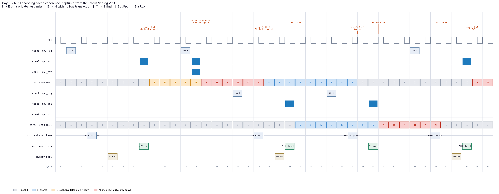

# Day 32 — UVM MESI Snooping Cache-Coherence Verification

Day 31 verified one write-back cache and made the point that such a cache is *deliberately, continuously wrong*: after a store hits, DRAM holds the old value, and it is supposed to. This is what happens when you put a second one next to it.

Two caches, one bus, one memory. Each cache is correct on its own. The bug class that appears the moment there are two of them is the one that has no local symptom at all: **core 0 writes a line, core 1 reads the same address and gets the stale value from DRAM — and both caches behaved exactly as designed.** Nothing on either CPU port is out of spec. The error only exists in the relationship between them.

That is what makes coherence a genuinely different verification problem rather than a bigger one, and it drives every decision in this environment: *there is no expected output to compare against.* Feed the same two instruction streams in twice and the caches legitimately end up in different states, because the interleaving is chosen by the bus arbiter and not by the testbench. A scoreboard that says "core 1's third load should return `0x1234`" is wrong as often as it is right.

So nothing here checks a value against a prediction of what the DUT will do. It checks **invariants** — statements that must be true of every legal execution, whatever the arbiter decides.

---

## The design under test

A **MESI snooping coherence system**: `NCORE` write-back / write-allocate L1 caches on a shared snoop bus, with a round-robin arbiter, wired-OR snoop response, cache-to-cache transfer, and a backing memory port. Direct-mapped, `NSET` lines of one word each. Multi-word line fills and byte strobes are deliberately **out of scope** — Day 31 covered those, and leaving them out means everything in this project is about the protocol.

MESI is the protocol in every multi-core CPU you have used. Each cached line is in one of four states:

| state | meaning | may read | may write | is the only copy | matches DRAM |
|---|---|---|---|---|---|
| **M** — Modified | dirty, exclusively owned | yes | yes, silently | yes | **no** |
| **E** — Exclusive | clean, exclusively owned | yes | yes, silently | yes | yes |
| **S** — Shared | clean, other caches may hold it too | yes | no | no | yes |
| **I** — Invalid | not present | no | no | — | — |

Four bus commands carry the whole protocol:

| command | issued when | effect on other caches | result for the issuer |
|---|---|---|---|
| `BusRd` | read miss | M → S (with flush), E → S, S → S | **E** if nobody answered, **S** if somebody did |
| `BusRdX` | write miss (read-for-ownership) | any valid → I (M flushes first) | **M** |
| `BusUpgr` | write hit on **S** | sharers → I. No data moves. | **M** |
| `BusWB` | dirty victim eviction | none | victim → I |

### Why E exists, and why it is the headline property

E is the entire difference between MESI and the simpler MSI, and it is worth being precise about what it buys. A read miss that **no other cache answers** installs the line in E rather than S. E is clean, so it agrees with DRAM — but it is also known to be the *only* copy, so a later store to it can go straight to M **with no bus transaction at all**.

That silent `E → M` upgrade is why private data — which is most data in most programs — costs nothing to write after the first read. Get it wrong by installing S instead, and the design is still *functionally correct*: every load returns the right value, every test passes, and every private store now pays for a `BusUpgr` that invalidates nobody. The performance is gone and the correctness checks never notice.

So this is verified as a **traffic property, not a data property**: a store that hits an E line must complete with exactly zero bus transactions. `mutation_test.py` includes that mutation (`read miss always installs S`) precisely because it is the one a value-comparing scoreboard would wave through.

### The race worth building the design around

Both caches hold a line in S. Both cores decide to store to it in the same cycle. Both request the bus; one wins.

The winner's `BusUpgr` invalidates the loser. But the loser is still sitting in `C_REQ` with a queued `BusUpgr` of its own — and by the time it is granted, that command is **a lie**: it claims to hold a shared copy of a line it no longer has. Issue it anyway and it invalidates the new owner without fetching the data, and the two cores now disagree about a line neither of them owns correctly.

The fix is one line — a queued `BusUpgr` that gets snoop-invalidated must be downgraded to a full `BusRdX` — and the DUT carries an assertion that a grant can never land in the same cycle as the invalidation that would make it stale. `p_upgr_never_exclusive` and the scoreboard's "a `BusUpgr` may only be issued from S" check both fire on the mutation that removes it.

### The same-cycle hazard inside a single cache

A subtler version of the same problem lives inside one cache. A snoop can land in the same cycle as the CPU lookup that is about to use the line. If the lookup reads the pre-snoop state it will decide "write hit on E" for a line the other core has just taken away.

The DUT resolves it with `eff_state` — the lookup reads the state **reconciled with the snoop happening this cycle**, so an invalidation turns the hit into a miss, and a `BusRd` downgrade turns an exclusive write hit into the `BusUpgr` path. Both the snoop transition and the CPU update then commit on the same edge, consistently.

This is also why `cpu_ack` is combinational rather than coming from a separate response state. With a response state the cache would update its tag array on one edge and announce it on a later one, and any checker driven off the announcement would apply a racing invalidation to the wrong version of the line. Making the announcement and the commit the same edge is what lets the model stay aligned with the RTL under a snoop that hits an access in flight — a verification requirement that changed the design.

---

## What is actually checked

Three independent layers. A bug has to survive all of them.

### 1. The data-value invariant — black box, order-agnostic

Every bus transaction is globally serialised and each core has one access outstanding, so **the order in which accesses complete is a valid total order**. Against that order the rule is absolute and needs no knowledge of MESI whatsoever:

> a load returns the value written by the most recent store.

`arch[]` in the golden model carries that value; a store takes global effect when its access completes. This is the property coherence exists to provide, and it is checked on every single completion — 2 924 of them in the committed run.

It is worth noting *why* completion order is a legal total order here rather than a convenient fiction. Two cores cannot complete a read and a write to the same address in the same cycle: a write hit needs M or E, a read hit needs any valid state, and SWMR makes those mutually exclusive. The ordering the checker relies on is guaranteed by the property it is checking.

### 2. The state invariants — white box, every cycle, model-free

Read straight out of both caches' tag/state arrays on every clock edge:

- **SWMR** (single-writer / multiple-reader) — an exclusive copy (M or E) must be the **only** copy in existence.
- **no-two-dirty** — a line can be Modified in at most one cache.
- **sharer agreement** — every core holding a line in S must hold the same bytes.

These are deliberately model-free. The model updates its architectural view when an access *completes*; the RTL updates its arrays one to two cycles earlier. Comparing them every cycle would be comparing across that skew and would flag legal behaviour. Everything above is a structural property of the DUT's own arrays at a single instant, so it holds on every edge with no skew to reason about — and it is the property whose violation *is* the bug. Three of the nine mutants are caught by SWMR alone.

### 3. The state prediction and full reconciliation — at quiesce

The model re-derives what every cache's state must be from the **observed bus event stream**, and it is structurally nothing like the RTL: no FSM, no handshake, a flat table that applies the transition rules. At every quiesce point — both cores idle, bus idle, nothing in flight, so model and DUT describe the same instant — everything is compared: state, tags, cached data, physical memory, and the architectural value.

**`pmem[]` is rebuilt from observed memory-port writes alone.** The model never writes it from its own idea of what should have happened. A cache that returns perfect load data forever while writing the correct data back to the *wrong address* is the bug class that matters most here, and only an independently reconstructed memory image can see it — which is exactly how the `writeback uses the new tag` mutant dies.

### Plus: traffic reconciliation

Checking the CPU port is not enough. Every memory access must be accounted for by a protocol event that required it:

```
memory writes == cache-to-cache flushes + dirty writebacks      810 == 282 + 528
memory reads  == line fetches - fetches a cache supplied        890 == 1172 - 282
```

A cache that writes back twice, drops a writeback, or goes to DRAM for a line another cache already owned fails this even when every value it returns is right. The equality is exact, not approximate.

### And: the model proves itself first

`ref_selfcheck()` walks the canonical two-core coherence sequence inside the simulator — cold read miss → E, silent E→M, remote read flushing M→S, `BusUpgr`, `BusRdX`, dirty eviction, and reset discarding dirty data — asserting every transition, **before a single DUT result is judged**. A reference model for a protocol is as easy to get subtly wrong as the RTL it is judging, and a model that happens to agree with a broken DUT is worse than no model at all.

Reset is modelled **honestly**, not conveniently: it clears valid/dirty and therefore *discards* every store not yet written back, so a load afterwards legitimately returns the old data. `ref_hw_reset()` rolls the architectural view back rather than relaxing the check, because that shortcut is exactly how a real data-loss bug reaches silicon.

---

## Mutation testing — does the checker actually work?

A green regression proves nothing on its own: it might mean the design is right, or it might mean the checker cannot tell the difference. `make mutants` introduces one realistic single-line coherence bug at a time and requires every one to fail.

| # | mutation | caught by |
|---|---|---|
| 1 | read miss always installs S (MESI degraded to MSI) | state prediction — *DUT state S, model E* |
| 2 | read miss always installs E | **SWMR** — exclusive copy coexists with 2 valid copies |
| 3 | remote read invalidates instead of downgrading | state prediction — *DUT state I, model S* |
| 4 | remote store downgrades instead of invalidating | **SWMR** |
| 5 | dirty owner never flushes | cache-to-cache check — *DUT c2c=0, model 1* |
| 6 | writeback uses the new tag, not the resident one | **data-value invariant** — read returned `0x44444444`, expected `0xc0de000a` |
| 7 | store on a shared line treated as a hit | **SWMR** |
| 8 | queued `BusUpgr` not downgraded after invalidation | *core0 issued BusUpgr while holding the line in I* |
| 9 | tag compare ignores the tag (index-only hit) | hit prediction — *cpu_hit=1, model expected 0* |

**All 9 caught**, and — more useful than the count — caught by *six different checks*. Every layer of the checker earns its place; none of them is redundant with another.

---

## Verification environment

Two **active** CPU agents is the entire point: coherence bugs only exist between cores, and a single-agent environment cannot produce one.

```
                        +-------------------------------------+
   mesi_cpu_agent[0] -->|  core 0 : mesi_cache                |
     driver/monitor     |    tag/state/data, MESI FSM, snoop  |--+
     sequencer          +-------------------------------------+  |
                                                                 |  snoop bus
                        +-------------------------------------+  |  (arbiter,
   mesi_cpu_agent[1] -->|  core 1 : mesi_cache                |--+   wired-OR
     driver/monitor     |    tag/state/data, MESI FSM, snoop  |  |   shared,
     sequencer          +-------------------------------------+  |   c2c flush)
                                                                 |
                        +-------------------------------------+  |
                        |  mesi_bus : arbiter + snoop combine |<-+
                        +------------------+------------------+
                                           | memory port
                        +------------------v------------------+
   mesi_mem_agent   <-->|  driver IS the backing memory       |
     driver (memory)    |  monitor = the ONLY window onto     |
     monitor            |  what the caches wrote to DRAM      |
     sequencer(policy)  +-------------------------------------+

   mesi_bus_agent (passive)  ---> bus events + white-box {state, tag, data}
                                        |
              +-------------------------+--------------------------+
              |                                                    |
      +-------v---------+                                  +-------v-------+
      | mesi_scoreboard |                                  | mesi_coverage |
      |  cycle-binned   |---- completions (with the ------>|  access x     |
      |  mesi_ref_pkg   |     state each access FOUND)     |  found-state  |
      +-----------------+                                  |  x hit/miss   |
                                                           |  MESI arcs    |
                                                           +---------------+

   mesi_vsequencer : cpu_sqr[0], cpu_sqr[1], mem_sqr
       mesi_smoke_vseq / mesi_regress_vseq fork the cores against a
       memory whose response policy is itself a sequence
```

**The memory agent's driver *is* the memory.** The slave side is not a passive wire, and its monitor is the scoreboard's only window onto what the caches actually pushed to DRAM. Its response policy is a **sequence item, not a config field**, so `mesi_regress_vseq` runs the directed scenarios against an instant always-ready memory — where a failure is unambiguously the cache — then kills that policy mid-test and re-runs the same design against 20–70 % stall rates and 1–8 cycle read latencies, which is exactly where fill/evict interaction bugs live.

**The scoreboard is cycle-binned.** Four monitors publish into one scoreboard, and coherence checking is order-sensitive — a snoop landing in the same cycle as a completion has to be applied first or the model diverges. UVM does not order analysis writes within a time step, so every event carries the cycle it was observed in and the scoreboard processes a cycle's events only once that cycle is closed, in a fixed order: **launches → memory write → bus address phase → bus completion → CPU completions → invariants**. The result no longer depends on which monitor happened to run first.

**Coverage sits downstream of the scoreboard**, so the state an access *found* the line in can be crossed with what the DUT did about it. The scoreboard stamps `found_state` before applying the access, because that information does not survive the model update.

Coverage closes on the **MESI state diagram itself** — all ten arcs the design can take (`I→E`, `I→S`, `I→M`, `E→M`, `E→S`, `E→I`, `S→M`, `S→I`, `M→S`, `M→I`), crossed with core, sampled by diffing consecutive state snapshots so arcs no CPU access is responsible for (a line invalidated by the *other* core) are counted too. **An arc that never fires fails the run.** The access covergroup crosses op × found-state × hit/miss with the impossible combinations excluded by `ignore_bins`, so an unreachable bin cannot quietly hold coverage down.

### Files

| file | what it is |
|---|---|
| `mesi_cache.sv` | DUT — `mesi_cache` (per-core MESI L1), `mesi_bus` (arbiter, snoop combine, flush routing), `mesi_system` (top) |
| `mesi_ref_pkg.sv` | golden model: architectural + physical memory images, per-core MESI mirror, all the invariant checks, `ref_selfcheck()` |
| `mesi_cache_if.sv` | `mesi_cpu_if` (×2), `mesi_mem_if`, `mesi_bus_if` + SVA, including SWMR written directly as an assertion |
| `mesi_cache_pkg.sv` | the UVM environment: 3 agent types, cycle-binned scoreboard, coverage, 9 sequences, virtual sequencer, 2 virtual sequences, 2 tests |
| `tb_top.sv` | UVM top level |
| `tb_mesi_cache_dump.sv` | portable procedural twin — the testbench that actually ran here, and the one that captured the waveform |
| `docs/make_waveform.py` | VCD parser + renderer for the committed PNG |
| `docs/mutation_test.py` | the nine-mutant check on the checker |

---

## DUT parameters

| parameter | default | meaning |
|---|---|---|
| `DW` | 32 | data word width (one word per line) |
| `AW` | 8 | word address width |
| `NSET` | 4 | direct-mapped lines per cache (power of two) |
| `NCORE` | 2 | cores on the snoop bus (power of two) |
| `CORE_ID` | — | per-instance cache id, set by `mesi_system` |

## `mesi_cache` ports

| port | dir | width | description |
|---|---|---|---|
| `clk`, `rst_n` | in | 1 | clock, async active-low reset |
| `cpu_req` | in | 1 | access request; latched on the first idle edge |
| `cpu_we` | in | 1 | 1 = store |
| `cpu_addr` | in | `AW` | word address |
| `cpu_wdata` | in | `DW` | store data |
| `cpu_ack` | out | 1 | one-cycle pulse, asserted **in the cycle that commits** |
| `cpu_rdata` | out | `DW` | load data |
| `cpu_hit` | out | 1 | served with **no** bus transaction |
| `cpu_busy` | out | 1 | an access is in progress |
| `bus_req` / `bus_gnt` | out/in | 1 | arbitration |
| `m_cmd`, `m_addr`, `m_wdata` | out | 2/`AW`/`DW` | this cache's bus command |
| `bus_valid`, `bus_cmd`, `bus_addr`, `bus_master` | in | — | broadcast address phase, watched by every cache |
| `snp_hit`, `snp_dirty`, `snp_data` | out | 1/1/`DW` | snoop answer, registered one cycle after the address phase |
| `fill_valid`, `fill_shared`, `fill_data` | in | 1/1/`DW` | completion; `fill_shared` is the wired-OR that decides **E vs S** |
| `dbg_state`, `dbg_tag`, `dbg_data` | out | packed | white-box coherence state — a coherence checker cannot work from the pins alone, because SWMR is a statement about what the caches hold, not about anything that appears on a wire |

## Bus protocol

One transaction outstanding globally.

```
cycle T     ADDRESS  the granted master drives bus_valid/cmd/addr/master.
                     Every other cache decodes it combinationally.
cycle T+1   SNOOP    each snooper presents {snp_hit, snp_dirty, snp_data}
                     describing the line as it stood BEFORE the transaction,
                     and applies its own transition on this edge.
cycle T+2+  DATA     a dirty snooper's flush goes to the requester AND to
                     memory in one move (no Owned state), otherwise memory is
                     read. The requester latches fill_data and fill_shared.
```

---

## Simulation timing



**This is a real captured waveform**, not a hand-drawn timing diagram: `docs/make_waveform.py` parses the VCD that `tb_mesi_cache_dump.sv` wrote during the self-checking run above and plots the values it actually recorded. The window is the five-access showcase at the top of that run — the whole protocol, in order.

Reading it left to right, on address 4 (set 0):

- **cycle 3** — core 0 misses. `BusRd @4 (c0)` goes out; core 1 does not answer.
- **cycle 5** — no cache had the line, so **memory** is read (`MEM RD`).
- **cycle 8** — `fill EXCL` — the completion carries `shared = 0`.
- **cycle 9** — core 0's set 0 goes **I → E**. *Exclusive, not Shared* — the MESI decision.
- **cycles 12–13** — core 0 stores. `cpu_ack` and `cpu_hit` both assert, and **the bus rows are completely empty**. This is the silent `E → M` upgrade: a store that costs nothing.
- **cycle 14** — core 0 is **M**. DRAM is now stale, deliberately.
- **cycle 19** — core 1 misses and issues `BusRd @4 (c1)`. Core 0 snoops it and answers dirty.
- **cycle 20** — core 0 drops **M → S** without waiting for anything.
- **cycle 21** — `MEM WR`: the flush updates DRAM in the same move that supplies the requester, so no cache is left holding the only copy.
- **cycle 22** — `fill shared/c2c` — served **cache-to-cache**, and `shared = 1`.
- **cycle 23** — core 1 lands in **S**. Both cores now share a clean line that matches DRAM.
- **cycle 28** — core 1 stores to its shared copy: `BusUpgr @4 (c1)`. Note the memory port stays idle — **no data moves**, this transaction exists only to invalidate.
- **cycles 29–31** — core 0 goes **S → I**, core 1 goes **S → M**.
- **cycle 36** — core 0 stores to a line it no longer holds: `BusRdX @4 (c0)`, read-for-ownership.
- **cycles 37–39** — core 1 flushes (`MEM WR` at 38, `fill shared/c2c`) and drops to **I**; core 0 takes the line in **M**.

The two MESI rows are the design. At no point in the trace do they show an exclusive state in one cache alongside any valid state in the other — that visual property is SWMR, and it is asserted on every edge of all 13 803 monitored cycles.

---

## Running it

```bash
make icarus_dump
```

Builds and runs the portable self-checking testbench under Icarus Verilog and writes `tb_mesi_cache_dump.vcd`.

```bash
make waveform
```

Re-renders `docs/mesi_cache_waveform.png` from that VCD.

```bash
make mutants
```

Runs the nine-mutant check on the checker (~2 minutes).

```bash
make vcs UVM_TESTNAME=mesi_regress_test
```

The UVM environment, on a UVM-capable simulator (`make questa` / `make verilator` likewise). `mesi_smoke_test` runs the showcase and the sharing sequences; `mesi_regress_test` runs everything, including the random phase against a hostile memory. The SVA in the DUT and the interfaces is enabled by `+define+MESI_SVA`, which these targets pass.

---

## Results

Under **Icarus Verilog 13.0** (`make icarus_dump`):

```
 [0] reference model self-check
  golden model re-proved 7 protocol properties        ok

 [1] directed coherence scenarios          18 scenarios, all ok
 [2] constrained-random regression          4 scenarios, all ok

 [3] what the run actually exercised
    read misses installing E (exclusive, unshared) 369
    read misses installing S (someone else had it) 201
    SILENT E->M upgrades (zero bus transactions)   123
    M->S downgrades caused by a remote read        84
    invalidations caused by a remote store         282
    cache-to-cache flushes (owner supplied data)   282
    dirty victim writebacks                        528
    BusRd / BusRdX / BusUpgr / BusWB               570 / 602 / 97 / 528
    cache hits / misses                            1655 / 1269

 [3b] memory traffic reconciliation
    writes  810  ==  282 flushes + 528 writebacks
    reads   890  ==  1172 fetches - 282 supplied cache-to-cache

 [4] summary
    scenarios                     22
    cycles monitored              13803
    CPU accesses checked          2924  (1464 reads, 1460 writes)
    bus transactions              1797
    hit predictions voided by a racing snoop   102
    errors                        0
    coverage holes                0

RESULT: *** PASS ***
```

**2 924 accesses checked, 13 803 cycles of SWMR, 1 797 bus transactions, memory traffic reconciled exactly, 0 errors, 0 coverage holes** — and all 9 mutants caught.

Two numbers are worth reading rather than skipping. **123 silent E→M upgrades** means the property that separates MESI from MSI was genuinely exercised, not merely assumed; a zero there fails the run. And **102 hit predictions voided by a racing snoop** is the honest count of accesses where another core's transaction landed on the address mid-flight, making the hit/miss prediction legitimately undecidable — those are reported rather than hidden, and the data-value invariant still checks every one of them.

### What was and was not run

The portable testbench (`tb_mesi_cache_dump.sv`) was **actually executed** under Icarus, and every number above is from that run. The UVM environment (`mesi_cache_pkg.sv`, `tb_top.sv`, `mesi_cache_if.sv`) is **not runnable on this machine** — Icarus implements neither the UVM class library, nor a constraint solver, nor concurrent assertions, and no VCS/Questa/Verilator-with-UVM install is available here. It is written against UVM-1.2 and reviewed, but it has not been compiled, and the SVA in the DUT and interfaces has not been simulated. The two testbenches drive the same stimulus through the same golden model and apply the same checks; the Icarus twin is what the results above come from.
