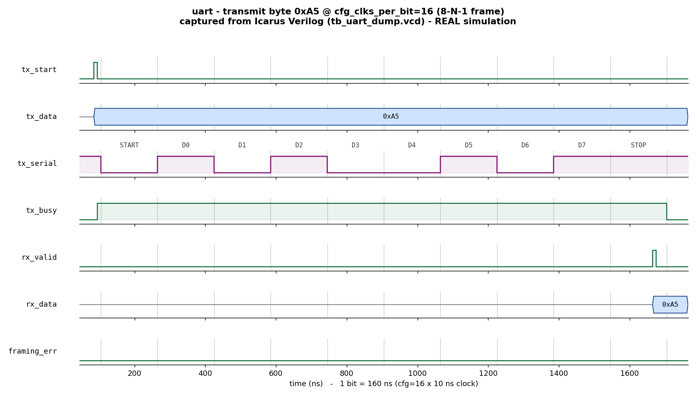

# Day 4 — UVM UART Verification Environment

A complete **UVM** testbench for a full-duplex **UART** (TX + RX) controller:
a **TX agent** and an **RX agent**, **serial-line monitors** that reconstruct
bytes bit-by-bit from the wire, a **dual scoreboard**, **functional coverage**
of data patterns and baud settings, and **SVA** framing assertions.

## Overview

`uart` is an 8-N-1 UART (1 start bit, 8 data bits **LSB-first**, 1 stop bit, no
parity) with a **runtime baud divisor** `cfg_clks_per_bit` (the number of clock
cycles per serial bit). It has two independent wires — `tx_serial` (out) and
`rx_serial` (in). The transmitter serializes a parallel byte into a framed
waveform; the receiver double-flops the incoming line for metastability, detects
the start edge, samples each bit **at its centre**, and raises a one-cycle
`rx_valid` pulse with the assembled byte, flagging `framing_err` if the stop bit
is not high.

Two paths are verified **independently**:

- **TX path** — the TX agent pulses `(tx_start, tx_data)`; a serial monitor
  reconstructs the byte from `tx_serial`; the scoreboard checks *reconstructed ==
  sent* (the transmitter serializes correctly).
- **RX path** — the RX agent **bit-bangs** a byte onto `rx_serial`; a serial
  monitor reconstructs it from the wire; another monitor captures
  `(rx_valid, rx_data)`; the scoreboard checks *received == on-the-wire* (the
  receiver deserializes correctly).

The portable Icarus testbench instead wires the UART in **loopback**
(`tx_serial → rx_serial`) and checks *received == sent* end-to-end plus an
independent line decode, across several baud divisors.

## Verification goal

Prove that the UART:

1. Serializes a parallel byte into a correct 8-N-1 frame — start bit low, eight
   data bits LSB-first, stop bit high.
2. Deserializes a framed byte back to the exact value that was on the wire.
3. Works across a range of **baud divisors** (`cfg_clks_per_bit`).
4. Never reports a **framing error** on a well-formed frame, and the transmit
   line idles high between frames.
5. Produces a single-cycle `rx_valid` pulse per received byte.

## Features / coverage list

- **Two UVM agents** — a TX agent (driver + sequencer + input monitor + line
  monitor + coverage) and an RX agent (bit-bang driver + sequencer + line
  monitor + output monitor).
- **Serial-line monitors** — reconstruct bytes by centre-sampling the serial
  wire at the configured baud, independent of the DUT's own logic.
- **Dual scoreboard** — order-matched queues: TX *sent-vs-serialized* and RX
  *on-wire-vs-deserialized*; also fails if bytes are left unmatched.
- **Sequences** — directed corner patterns (`0x00`, `0xFF`, `0xA5`, `0x55`,
  `0x01`, `0x80`, `0x7E`, `0xC3`) plus constrained-random payloads.
- **Virtual sequencer + virtual sequences** — `uart_smoke_vseq` (one baud) and
  `uart_regress_vseq` (sweeps baud divisors 16 / 24 / 12 / 20, running TX and RX
  streams in parallel at each).
- **Functional coverage** — data-pattern bins, baud bins (12/16/20/24), and a
  data×baud cross.
- **SVA** — transmit line idles high, `rx_valid` is a one-cycle pulse, the stop
  level is high on a clean `rx_valid`, and `tx_busy` clears after `tx_done`.

## DUT parameters / configuration

| Signal              | Width | Description |
|---------------------|-------|-------------|
| `cfg_clks_per_bit`  | 16    | Runtime baud divisor — clock cycles per serial bit |

*(8-N-1 framing is fixed; the frame is 1 + 8 + 1 = 10 bits.)*

## DUT ports

| Group | Port         | Dir | Width | Description |
|-------|--------------|-----|-------|-------------|
| clk/rst | `clk`      | in  | 1 | Clock |
|       | `rst_n`      | in  | 1 | Active-low reset |
| cfg   | `cfg_clks_per_bit` | in | 16 | Baud divisor (cycles/bit) |
| TX    | `tx_start`   | in  | 1 | 1-cycle pulse to launch a byte |
|       | `tx_data`    | in  | 8 | Byte to transmit (sampled on start) |
|       | `tx_serial`  | out | 1 | Serial transmit line (idles high) |
|       | `tx_busy`    | out | 1 | High while a frame is in flight |
|       | `tx_done`    | out | 1 | 1-cycle pulse at end of stop bit |
| RX    | `rx_serial`  | in  | 1 | Serial receive line |
|       | `rx_data`    | out | 8 | Received byte |
|       | `rx_valid`   | out | 1 | 1-cycle pulse when a byte lands |
|       | `framing_err`| out | 1 | Stop bit was not high |

## Testbench architecture

```
                 +------------------------------ tb_top --------------------------------+
                 |  clk/reset gen         uart_if (SVA)                uart DUT           |
                 |       |                    | vif                  (uart_tx + uart_rx)  |
                 |       v                    v                                          |
  +------------------------------------- uart_env ----------------------------------+    |
  |                                                                                 |    |
  |   uart_vsequencer -- baud sweep + parallel start -->                            |    |
  |        |                                                                        |    |
  |        v                                                                        |    |
  |  +----------- uart_tx_agent ----------+     +----------- uart_rx_agent ------+   |    |
  |  | tx_seq -> tx_driver --(tx_start,   |     | rx_seq -> rx_driver --bit-bang->|  |    |
  |  |                        tx_data)-->DUT     |                    rx_serial->DUT | |    |
  |  | tx_in_mon  (sent byte) ----------. |     | rx_line_mon (on-wire) --------. | |    |
  |  | tx_line_mon(tx_serial decode)--. | |     | rx_out_mon (rx_valid/data) --.| | |    |
  |  | coverage <- tx_in_mon          | | |     |                              || | |    |
  |  +--------------------------------|-|-+     +------------------------------||-+ |    |
  |            (sent)  (serialized)   | |             (on-wire)  (received)    || |     |
  |                                   v v                                      vv |      |
  |                          +----------------------- uart_scoreboard --------------+     |
  |                          |  TX: sent-queue == serialized                        |     |
  |                          |  RX: on-wire-queue == received                       |     |
  |                          +------------------------------------------------------+     |
  +---------------------------------------------------------------------------------+    |
                 +--------------------------------------------------------------------+
```

## What the testbench checks

- **TX scoreboard** — every byte reconstructed from `tx_serial` (start/8-data/
  stop, centre-sampled) equals the byte pushed on `tx_start`. Order-matched via a
  queue; leftover entries fail the run.
- **RX scoreboard** — every byte captured on `(rx_valid, rx_data)` equals the
  byte reconstructed from `rx_serial`. `framing_err` on a received byte is a
  `uvm_error`.
- The portable `tb_uart_dump.sv` does the same at the *frame* level: for each
  byte it checks (1) the RX hardware output equals the sent byte with
  `framing_err == 0`, and (2) an independent TB serial decoder sees start=0, the
  correct 8 data bits, and stop=1.

## Functional-coverage intent

`uart_coverage` samples every transmitted byte:

- `cp_data` — corner patterns (`0x00`, `0xFF`, `0x01`, `0x80`, `0xA5`, `0x55`)
  plus `others`.
- `cp_baud` — baud divisor bins (12 / 16 / 20 / 24).
- `x_data_baud` — the cross, evidence that the corner patterns were exercised at
  more than one baud.

## Simulation timing



*Caption — **This is a real waveform captured from an Icarus Verilog
simulation** (not a hand-drawn mock-up). `docs/make_waveform.py` parses the
`tb_uart_dump.vcd` produced by `make icarus_dump` and renders the showcase byte
`0xA5` transmitted at `cfg_clks_per_bit=16` (so one bit = 160 ns). The
`tx_start` pulse (~85 ns) launches the frame; `tx_busy` stays high for the whole
frame (~95 → ~1705 ns). On `tx_serial` you can read the 8-N-1 framing directly:
a **START** bit low, then the eight data bits **LSB-first** — `D0=1, D1=0, D2=1,
D3=0, D4=0, D5=1, D6=0, D7=1` = `0xA5` — then a **STOP** bit high. The receiver
(fed by loopback) raises `rx_valid` for one cycle at ~1665 ns with
`rx_data = 0xA5` and `framing_err = 0`. Every bit boundary sits exactly 160 ns
apart, matching the configured baud.*

> The image is rendered from the **module-based** companion testbench
> (`tb_uart_dump.sv`), because the open-source simulator available here (Icarus
> Verilog) does not implement the UVM class library. The DUT, checks, and
> waveform are genuine; see the run note below regarding the UVM testbench.

## Files

| File | Description |
|------|-------------|
| `uart.sv`         | Synthesizable UART DUT (`uart_tx`, `uart_rx`, `uart` top) |
| `uart_if.sv`      | UART interface, clocking blocks, framing SVA |
| `uart_pkg.sv`     | Full UVM environment (txn/seqs/drivers/monitors/coverage/agents/scoreboard/vseqr/tests) |
| `tb_top.sv`       | UVM top: clock/reset, DUT + interface, `run_test()` |
| `tb_uart_dump.sv` | Portable module-based self-checking loopback testbench (Icarus) |
| `Makefile`        | UVM targets (vcs/questa/verilator) + `icarus_dump`, `waveform` |
| `docs/make_waveform.py` | Manual VCD parser → renders the committed waveform PNG |
| `docs/uart_waveform.png` | Waveform captured from the Icarus run |

## Run instructions

UVM testbench (needs a UVM-capable simulator), pick the test with
`UVM_TESTNAME`:

```bash
make vcs        UVM_TESTNAME=uart_regress_test   # Synopsys VCS
make questa     UVM_TESTNAME=uart_smoke_test     # Siemens Questa / ModelSim
make verilator  UVM_TESTNAME=uart_smoke_test     # Verilator 5 built with --uvm
```

Portable self-checking run + waveform (works with open-source Icarus Verilog):

```bash
make icarus_dump    # runs tb_uart_dump.sv -> prints RESULT: *** PASS ***
make waveform       # regenerates docs/uart_waveform.png from the VCD
make clean
```

Expected tail of `make icarus_dump`:

```
INFO: 175 checks, 0 errors
RESULT: *** PASS ***
```

> **Run status (honest):** The **module-based** testbench (`tb_uart_dump.sv`)
> **was executed** here with Icarus Verilog 13.0 and printed
> `RESULT: *** PASS ***` (175 checks, 0 errors) over baud divisors 16/24/12/20;
> the committed waveform is captured from that run's VCD. The **UVM** testbench
> (`uart_pkg.sv` + `tb_top.sv`) was **not run** here because no UVM-capable
> simulator (VCS/Questa/Verilator-uvm) is installed in this environment; it is
> provided to compile and run under any of the UVM targets above. No UVM pass
> log is claimed.

## What the testbench checks (summary)

- ✅ TX serializes a byte into a correct start / 8-data-LSB-first / stop frame
- ✅ RX deserializes a framed byte back to the exact value on the wire
- ✅ End-to-end loopback: received byte == sent byte
- ✅ Correct operation across baud divisors 16 / 24 / 12 / 20
- ✅ No framing error on well-formed frames; transmit line idles high (SVA)
- ✅ `rx_valid` is a single-cycle pulse (SVA)
- ✅ Functional coverage of data patterns crossed with baud
