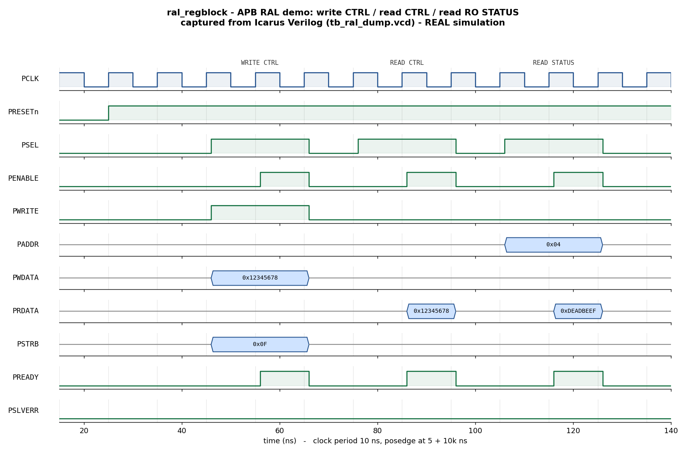

# Day 5 — UVM RAL (Register Abstraction Layer) Demo

A **UVM RAL** environment for an APB register block whose registers exercise the
common field access policies **RW / RO / W1C**. It shows the full register-layer
flow: a `uvm_reg` model in a `uvm_reg_block` with an address **map**, a
**`uvm_reg_adapter`**, an **explicit `uvm_reg_predictor`**, **front-door** and
**back-door** access, the built-in **`uvm_reg_hw_reset_seq`** and
**`uvm_reg_bit_bash_seq`**, and **register field-value coverage**.

## Overview

`ral_regblock` is a zero-wait-state APB4 slave exposing four 32-bit registers:

| Offset | Register   | Policy | Reset        | Behaviour |
|--------|------------|--------|--------------|-----------|
| `0x00` | `CTRL`     | RW     | `0x00000000` | Plain read/write |
| `0x04` | `STATUS`   | RO     | `0xDEADBEEF` | Read-only hardware value; bus writes ignored |
| `0x08` | `INTFLAGS` | W1C    | `0x00000000` | Hardware (`hw_event`) sets bits; a bus write of `1` clears a bit |
| `0x0C` | `SCRATCH`  | RW     | `0x00000000` | Plain read/write |

The register storage nodes are named `ctrl_q` / `status_q` / `intf_q` /
`scratch_q` so the RAL model can attach **back-door HDL paths** to them. Writes
are byte-strobed via `PSTRB`; an out-of-range word address raises `PSLVERR`.

The RAL model mirrors these policies with `uvm_reg_field` access strings
(`"RW"`, `"RO"`, `"W1C"`). The **explicit predictor** watches the bus monitor
and keeps the model's mirror in step with what actually happens on the wire, so
front-door reads are checked against the predicted value and the built-in
register sequences can self-check the DUT.

## Verification goal

Prove that the register block:

1. Comes out of reset with the correct value in every register
   (`uvm_reg_hw_reset_seq`).
2. Honours each field's access policy under a walking-bit test
   (`uvm_reg_bit_bash_seq`): RW bits read back what was written, RO bits never
   change, W1C bits clear on a written `1`.
3. Agrees between **front-door** (bus) and **back-door** (HDL peek/poke) views
   of the same register.
4. Sets W1C `INTFLAGS` bits on a hardware event and clears them on a
   write-1-to-clear.
5. Raises `PSLVERR` on an out-of-range access.

## RAL model / environment architecture

```
                +--------------------------- tb_top ----------------------------+
                |  clk/reset gen     apb_if (SVA)     ral_regblock DUT (`dut`)    |
                |       |                | vif        ctrl_q/status_q/intf_q/...  |
                |       v                v                    ^   ^              |
  +---------------------------------- ral_env -----------------|---|-----------+ |
  |                                                            |   | back-door | |
  |   ral_block (uvm_reg model)                                |   | peek/poke | |
  |   +-------------------------------------------+            |   | (HDL path)| |
  |   | reg_ctrl(RW) reg_status(RO)               |            |   |           | |
  |   | reg_intflags(W1C) reg_scratch(RW)         |            |   |           | |
  |   | uvm_reg_map "map"  + field coverage       |            |   |           | |
  |   +----------------+--------------------------+            |   |           | |
  |        front-door  | set_sequencer(seqr, adapter)          |   |           | |
  |                    v                                       |   |           | |
  |   apb_reg_adapter (reg2bus / bus2reg)                      |   |           | |
  |                    |                                       |   |           | |
  |            apb_agent: sequencer -> driver --SETUP/ACCESS-->+   |           | |
  |                       monitor --sampled txn--> uvm_reg_predictor (explicit) | |
  |                                                (map + adapter, bus_in)      | |
  +----------------------------------------------------------------------------+ |
                +---------------------------------------------------------------+
```

## What the checking proves

- **`uvm_reg_hw_reset_seq`** — resets the model, then front-door reads every
  register and compares against its configured reset value
  (`CTRL/INTFLAGS/SCRATCH = 0`, `STATUS = 0xDEADBEEF`).
- **`uvm_reg_bit_bash_seq`** — walks a 0 and a 1 through every accessible bit of
  each register, honouring the field policy: RW must read back the written bit,
  RO must stay at its hardware value, W1C must clear on a written 1.
- **`ral_frontback_test`** — a front-door RW round-trip on `CTRL`, an RO read of
  `STATUS`, and a **back-door poke** of `SCRATCH` confirmed by a **back-door
  peek** *and* a front-door read (front and back door agree).
- The explicit **predictor** updates the mirror from observed bus traffic, so
  any DUT/model divergence surfaces as a `uvm_reg` compare error.

## Field-value coverage

`reg_ctrl` and `reg_intflags` carry field-value covergroups
(`UVM_CVR_FIELD_VALS`), enabled from the base test via
`uvm_reg::include_coverage("*", UVM_CVR_FIELD_VALS)` and sampled by the reg
model on every access — CTRL covers all-zero / all-ones / other, INTFLAGS covers
none / some flags set.

## Portable Icarus path (what actually ran here)

Because Icarus Verilog does not implement the UVM class library (and no
back-door DPI), the committed run and waveform come from a **module-based**
companion testbench, `tb_ral_dump.sv`. A task-based APB master BFM drives the
same DUT through the **front door** and self-checks every access against an
inline golden model that mirrors each field policy — reset values, RW round
trips (incl. byte strobes), RO write-ignored, W1C hardware-set + write-1-clear,
a walking-1 bit-bash on `CTRL`, constrained-random RW traffic, and an
out-of-range `PSLVERR`. It prints `RESULT: *** PASS ***` when `errors == 0`.
This mirrors, without UVM, exactly what the RAL model + predictor and the
built-in register sequences verify under a UVM simulator.

## Simulation timing



*Caption — **This is a real waveform captured from an Icarus Verilog
simulation** (not a hand-drawn mock-up). `docs/make_waveform.py` parses the
`tb_ral_dump.vcd` produced by `make icarus_dump` and renders the showcase
window. On genuine simulator time it shows reset release (~25 ns), a **write to
`CTRL`** (`PWDATA=0x12345678`, `PSTRB=0x0F`) over the APB SETUP→ACCESS handshake
(~46–66 ns), a **read of `CTRL`** returning `0x12345678` (~86 ns), and a **read
of the read-only `STATUS`** (`PADDR=0x04`) returning its hardware reset value
`0xDEADBEEF` (~116 ns). `PSLVERR` stays low throughout, and `PENABLE` always
rises exactly one cycle after `PSEL` — the APB two-phase handshake.*

> The image is rendered from the module-based companion testbench
> (`tb_ral_dump.sv`); the DUT, checks, and waveform are genuine. See the run
> note below regarding the UVM RAL testbench.

## Files

| File | Description |
|------|-------------|
| `ral_regblock.sv` | Synthesizable APB register block with RW/RO/W1C fields |
| `apb_if.sv`       | APB4 interface, clocking blocks, protocol SVA |
| `ral_pkg.sv`      | UVM RAL env (reg model, adapter, predictor, APB agent, tests) |
| `tb_top.sv`       | UVM top: clock/reset, DUT (`dut`) + interface, `run_test()` |
| `tb_ral_dump.sv`  | Portable module-based self-checking testbench (Icarus) |
| `Makefile`        | UVM targets (vcs/questa/verilator) + `icarus_dump`, `waveform` |
| `docs/make_waveform.py` | Manual VCD parser → renders the committed waveform PNG |
| `docs/ral_regblock_waveform.png` | Waveform captured from the Icarus run |

## Run instructions

UVM RAL testbench (needs a UVM-capable simulator; back-door peek/poke needs HDL
access — VCS/Questa), pick the test with `UVM_TESTNAME`:

```bash
make vcs        UVM_TESTNAME=ral_hw_reset_test    # reset-value check
make questa     UVM_TESTNAME=ral_bit_bash_test    # walking-bit per field policy
make vcs        UVM_TESTNAME=ral_frontback_test   # front-door + back-door
make verilator  UVM_TESTNAME=ral_hw_reset_test    # Verilator 5 built with --uvm
```

Portable self-checking run + waveform (works with open-source Icarus Verilog):

```bash
make icarus_dump    # runs tb_ral_dump.sv -> prints RESULT: *** PASS ***
make waveform       # regenerates docs/ral_regblock_waveform.png from the VCD
make clean
```

Expected tail of `make icarus_dump`:

```
INFO: 291 checks, 0 errors
RESULT: *** PASS ***
```

> **Run status (honest):** The **module-based** testbench (`tb_ral_dump.sv`)
> **was executed** here with Icarus Verilog 13.0 and printed
> `RESULT: *** PASS ***` (291 checks, 0 errors); the committed waveform is
> captured from that run's VCD. The **UVM RAL** testbench (`ral_pkg.sv` +
> `tb_top.sv`) was **not run** here because no UVM-capable simulator
> (VCS/Questa/Verilator-uvm) is installed in this environment; it is provided to
> compile and run under any of the UVM targets above (back-door access needs a
> simulator with HDL peek/poke support). No UVM pass log is claimed.

## What the testbench checks (summary)

- ✅ Reset values correct for every register (hw_reset)
- ✅ RW registers read back what was written, incl. byte strobes
- ✅ RO `STATUS` ignores writes and keeps `0xDEADBEEF`
- ✅ W1C `INTFLAGS`: hardware sets bits, a written `1` clears them, `0` is a no-op
- ✅ Front-door and back-door views of a register agree (peek/poke)
- ✅ Out-of-range access raises `PSLVERR`
- ✅ Register field-value coverage (`UVM_CVR_FIELD_VALS`)
