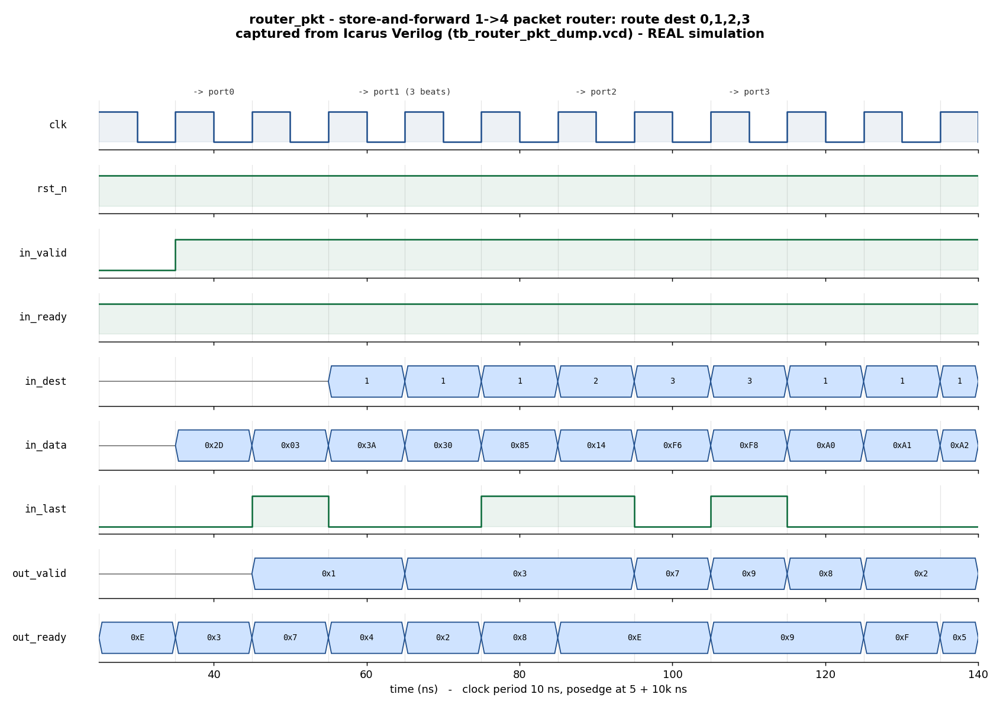

# Day 6 — UVM Packet-Router Verification

A **UVM** environment for a **store-and-forward 1→N packet router**. A single
AXI-Stream-like input port carries beats tagged with a destination index
(`in_dest`) and an end-of-packet marker (`in_last`); the router buffers each beat
into a small per-output FIFO and drains it out of the selected output port. The
environment proves the router's three core promises — **correct routing**,
**per-port ordering**, and **lossless backpressure (no drops, no duplicates)** —
with a **golden per-port FIFO reference model** in the scoreboard.

## Overview

`router_pkt` has one input stream and `NUM_OUT` output streams. Each output owns
an independent `DEPTH`-entry FIFO:

* **Input accept** — a beat is taken only when the *selected* output FIFO has
  room: `in_ready = ~full[in_dest]`. When that FIFO is full the source stalls;
  nothing is ever dropped.
* **Output present** — each port shows its FIFO head as first-word-fall-through
  (`out_valid[p] = ~empty[p]`) and pops on a completed handshake
  (`out_valid[p] & out_ready[p]`).
* **Ordering** — because each port is a FIFO, beats leave a port in exactly the
  order they arrived for that port. That per-port order is the invariant the
  scoreboard checks.

The design is fully synchronous, single-clock, active-low async-reset, and uses
flattened output buses so it elaborates identically on Icarus, Verilator, VCS,
and Questa.

## Verification goal

Prove that the router:

1. **Routes** every accepted beat to the output port named by `in_dest`.
2. Preserves **per-port order** (a port's FIFO must be strictly first-in
   first-out).
3. Is **lossless**: the count and content of delivered beats exactly equals the
   count and content of accepted beats — no drop, no duplicate, no misroute.
4. Honours **backpressure** on both sides: it stalls the input when the selected
   FIFO is full, and it holds an output beat stable while `out_ready` is low.
5. Comes out of **reset** with all FIFOs empty and all outputs idle.

## Features / coverage checklist

- [x] Golden **per-port FIFO** reference model (one expected queue per output)
- [x] **Two-agent** UVM env: input-stream agent + output-backpressure agent
- [x] Full component set: **sequencer / driver / monitor / agent / scoreboard**
- [x] **Virtual sequencer** + **virtual sequences** (smoke, regress)
- [x] Directed stimulus (one packet per port) **+ constrained-random** beats
- [x] FIFO-**full** corner (hammer one port past `DEPTH`) and random
      per-output backpressure driving the **empty** corner
- [x] **Functional coverage**: destination × end-of-packet cross
- [x] **SVA** design assertions (no valid-while-empty; valid stable under
      backpressure)
- [x] Global **timeout** and **VCD** dump
- [x] Portable Icarus self-checking companion TB (really runs here)

## DUT parameters

| Parameter | Default | Meaning |
|-----------|---------|---------|
| `NUM_OUT` | `4`     | Number of output ports |
| `DW`      | `8`     | Payload data width (bits) |
| `DEPTH`   | `4`     | Per-output FIFO depth (entries) |
| `DEST_W`  | derived | `$clog2(NUM_OUT)` — width of `in_dest` (do not override) |

## DUT ports

| Port | Dir | Width | Description |
|------|-----|-------|-------------|
| `clk`       | in  | 1               | Clock |
| `rst_n`     | in  | 1               | Active-low async reset |
| `in_valid`  | in  | 1               | Input beat valid |
| `in_ready`  | out | 1               | Input accept (`~full[in_dest]`) |
| `in_dest`   | in  | `DEST_W`        | Selected output-port index |
| `in_data`   | in  | `DW`            | Input payload |
| `in_last`   | in  | 1               | End-of-packet marker |
| `out_valid` | out | `NUM_OUT`       | Per-port output valid |
| `out_ready` | in  | `NUM_OUT`       | Per-port output ready (backpressure) |
| `out_data`  | out | `NUM_OUT*DW`    | Per-port payload (`out_data[p*DW +: DW]`) |
| `out_last`  | out | `NUM_OUT`       | Per-port end-of-packet marker |

## Testbench architecture

```
              +------------------------------- tb_top --------------------------+
              |  clk/reset gen      router_if (3 clocking blocks)   router_pkt   |
              |       |                     | vif                    DUT (`dut`)  |
              |       v                     v                         ^   ^      |
              |                     in_* / out_* wires                |   |      |
  +-------------------------------- router_env ------------------------|---|----+ |
  |                                                                    |   |    | |
  |   router_in_agent                          router_out_agent        |   |    | |
  |   +----------------------------+           +---------------------+  |   |    | |
  |   | beat_sqr (sequencer)       |           | bp_sqr (sequencer)  |  |   |    | |
  |   | in_driver  --in_valid/-----|---------->| bp_driver           |--+   |    | |
  |   |             dest/data/last |  in_ready | drives out_ready ---|------+    | |
  |   | in_monitor --accepted----+ |           | out_monitor         |           | |
  |   | coverage (dest x last)   | |           |  --delivered beats-+|           | |
  |   +--------------------------|-+           +-------------------|-+           | |
  |             accepted beats   |                 delivered beats |             | |
  |                              v                                 v             | |
  |                     router_scoreboard  (golden per-port FIFO queues)         | |
  |                        write_in()  -> push gold[dest]                        | |
  |                        write_out() -> pop  gold[port] and compare            | |
  |                        check/report -> RESULT: *** PASS ***                  | |
  |                                                                             | |
  |   router_vsequencer { beat_sqr, bp_sqr }  <- smoke_vseq / regress_vseq       | |
  +-----------------------------------------------------------------------------+ |
              +----------------------------------------------------------------+
```

## How the checking works (scoreboard / reference model)

The scoreboard keeps one **golden queue** per output port, `gold[NUM_OUT][$]`,
holding the expected `{last, data}` for each port in arrival order:

* The **input monitor** publishes every *accepted* input beat
  (`in_valid & in_ready`). `write_in()` pushes `{last, data}` onto
  `gold[dest]` — this is the reference "route" decision.
* The **output monitor** publishes every *delivered* output beat
  (`out_valid[p] & out_ready[p]`). `write_out()` pops the head of `gold[port]`
  and compares it against the observed `{last, data}`. A pop from an empty queue
  (spurious / duplicated beat) or a value mismatch (misroute / corruption) is an
  error.
* `check_phase` fails the test if any golden queue is left non-empty (dropped
  beats), and `report_phase` prints `RESULT: *** PASS ***` only when
  `errors == 0`, `accepted == delivered`, and at least one beat was seen.

The DUT also carries inline **SVA** (enabled with `+define+ROUTER_PKT_SVA`, set
by `tb_top`): no output may assert `valid` while its FIFO is empty, and an
output beat must remain asserted while it is back-pressured.

## Functional-coverage intent

`router_coverage` (a `uvm_subscriber` on the input monitor) samples each accepted
beat:

* `cp_dest` — every destination port `0..NUM_OUT-1` is exercised.
* `cp_last` — both mid-packet beats and end-of-packet beats occur.
* `cp_dest × cp_last` — every port sees both a middle beat and a final beat,
  i.e. each port carries a complete packet.

## Simulation timing



*Caption — **This is a real waveform captured from an Icarus Verilog run**, not a
hand-drawn diagram.* The image is rendered by `docs/make_waveform.py`, which
parses the `tb_router_pkt_dump.vcd` produced by `make icarus_dump` and draws the
directed showcase window: after reset release, one packet is routed to each
output port in turn. Watch `in_dest` select the port, `in_last` frame each
packet, and the matching bit of the `out_valid` mask assert as each port drains
its FIFO under the random `out_ready` backpressure (`out_valid` climbs
`0x1 → 0x3 → 0x7 …` as more ports hold buffered beats).

## What actually ran here

Because Icarus Verilog does not implement the UVM class library (and no
UVM-capable simulator was installed in this environment), the **UVM environment
(`router_pkt_pkg.sv` + `tb_top.sv`) was not executed here**. It is written for
VCS / Questa / Verilator.

The portable, module-based **self-checking companion testbench**
(`tb_router_pkt_dump.sv`) **was executed** with Icarus Verilog 13.0. It
reproduces the same verification intent — golden per-port FIFO model, directed +
constrained-random stimulus, random per-output backpressure, full end-of-test
reconciliation — and printed:

```
----------------------------------------------------------
 router_pkt self-check:  accepted=76  delivered=76  errors=0
RESULT: *** PASS ***
----------------------------------------------------------
```

The committed waveform PNG is captured from that same Icarus run.

## Files

| File | Role |
|------|------|
| `router_pkt.sv`            | Synthesizable store-and-forward router DUT (+ inline SVA) |
| `router_if.sv`             | Interface with input-driver / bp-driver / monitor clocking blocks |
| `router_pkt_pkg.sv`        | UVM env: txns, sequences, drivers, monitors, agents, scoreboard, vseqs, tests |
| `tb_top.sv`                | UVM top (clock/reset, DUT+IF, `run_test`) |
| `tb_router_pkt_dump.sv`    | Portable module-based self-checking testbench (Icarus) |
| `Makefile`                 | UVM targets (vcs/questa/verilator) + `icarus_dump`, `waveform` |
| `docs/make_waveform.py`    | Renders the PNG from the captured VCD |
| `docs/router_pkt_waveform.png` | Waveform captured from the Icarus run |

## Run instructions

Portable self-checking run + waveform (works with open-source Icarus Verilog):

```bash
make icarus_dump    # runs tb_router_pkt_dump.sv -> prints RESULT: *** PASS ***
make waveform       # re-renders docs/router_pkt_waveform.png from the VCD
```

UVM run (needs a UVM-capable simulator):

```bash
make vcs       UVM_TESTNAME=router_smoke_test
make questa    UVM_TESTNAME=router_regress_test
make verilator UVM_TESTNAME=router_smoke_test
```

Available UVM tests: `router_smoke_test` (all-ready, one packet per port) and
`router_regress_test` (random backpressure + FIFO-full hammer + heavy random
traffic).

## What the testbench checks

* Every delivered beat matches the head of its port's golden FIFO
  (**routing + ordering + payload/`last` integrity**).
* No beat is delivered that was never accepted (**no duplicates / spurious**).
* No accepted beat is left undelivered at end of test (**no drops**).
* `accepted == delivered` overall (**lossless**).
* SVA: no `out_valid` over an empty FIFO; output beats stable under
  backpressure.
* Coverage: every port carries both mid-packet and end-of-packet beats.
