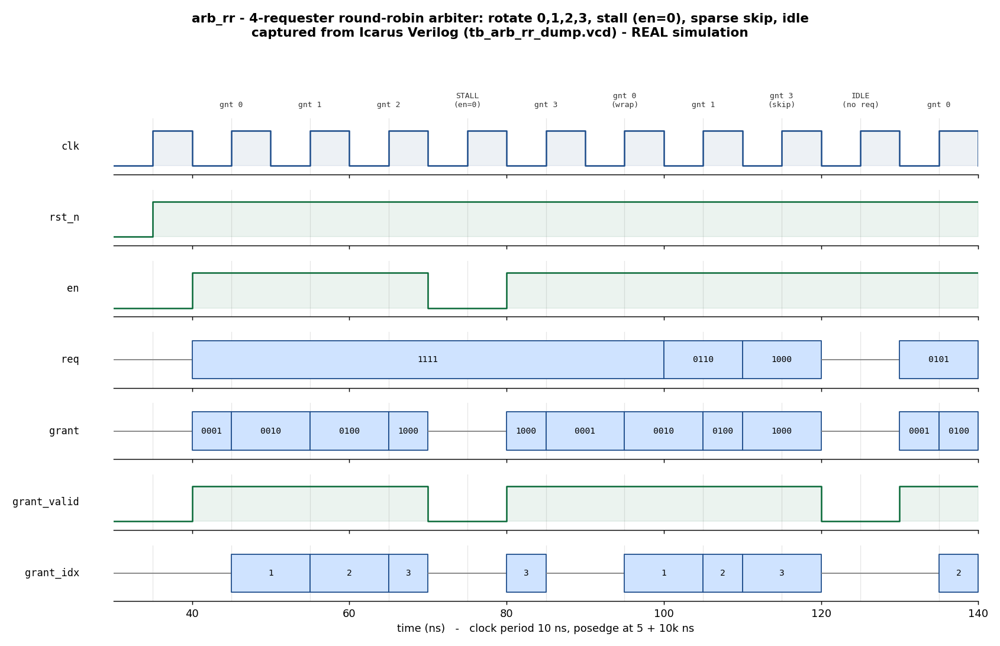

# Day 7 — UVM Round-Robin Arbiter Verification

A **UVM** environment for a parameterized **round-robin arbiter**. A single
shared resource is contested by `NUM_REQ` requesters; each cycle the arbiter
grants it to at most one of them, chosen in round-robin order from a rotating
priority pointer. The property under verification is **fairness** — no requester
can be starved while it keeps asking — proven cycle-by-cycle against an
**independent golden round-robin reference model** in the scoreboard.

## Overview

`arb_rr` exposes a request vector `req`, a grant-enable / downstream-ready input
`en`, and a one-hot grant vector `grant` (plus `grant_valid` and `grant_idx`):

* **Round-robin selection** — the winner is the first asserted requester at or
  after the priority pointer `ptr`, scanning the request vector circularly. The
  grant is purely combinational in `req` and `ptr`.
* **Pointer rotation** — after a grant is *issued* (`en & |req`), `ptr` advances
  to `winner+1`, so the just-served requester drops to lowest priority next
  cycle. This is what guarantees fairness.
* **Backpressure** — while `en` is low no grant is issued (`grant == 0`) and the
  pointer *holds*; the contention state is preserved across the stall.
* **Idle** — with no requests asserted the grant is deasserted and the pointer
  is unchanged.

The design is fully synchronous, single-clock, active-low async-reset, and
parameterized in the number of requesters, so it elaborates identically on
Icarus, Verilator, VCS and Questa.

## Verification goal

Prove that the arbiter:

1. Grants **one-hot-or-zero** every cycle — never two requesters at once.
2. Grants only to an **actual requester** (`grant & ~req == 0`).
3. Selects the correct **round-robin winner** for the current pointer, including
   the circular **wrap** and **skip** cases.
4. Makes **progress**: whenever `en` is high and any request is asserted, some
   requester is granted (no deadlock).
5. Honours **backpressure**: no grant while `en` is low, and the priority
   pointer survives the stall unchanged.
6. Is **fair**: across sustained contention every requester is served, in
   rotating order — no starvation.
7. Comes out of **reset** with the pointer at 0 and no grant.

## Features / coverage checklist

- [x] Independent **golden round-robin reference model** in the scoreboard
      (its own pointer, re-derived from scratch — not the DUT's logic)
- [x] Full UVM component set: **sequencer / driver / monitor / agent /
      coverage / scoreboard**
- [x] **Virtual sequencer** + **virtual sequences** (smoke, regress)
- [x] Directed stimulus (all-request rotation, one-hot walk) **+
      constrained-random** request/enable
- [x] Backpressure **stall** corner (chop `en` under full contention) and the
      **idle** / sparse-request **skip** corners
- [x] **Functional coverage**: winner index, request density, enable, and a
      winner × density cross
- [x] **SVA** design assertions (one-hot0, grant-is-request, no-grant-when-
      disabled, progress)
- [x] **Fairness / anti-starvation** check (every requester served)
- [x] Global **timeout** and **VCD** dump
- [x] Portable Icarus self-checking companion TB (really runs here)

## DUT parameters

| Parameter | Default | Meaning |
|-----------|---------|---------|
| `NUM_REQ` | `4`     | Number of requesters contending for the resource |
| `PW`      | derived | `$clog2(NUM_REQ)` — width of `grant_idx` (do not override) |

## DUT ports

| Port | Dir | Width | Description |
|------|-----|-------|-------------|
| `clk`         | in  | 1         | Clock |
| `rst_n`       | in  | 1         | Active-low async reset |
| `en`          | in  | 1         | Grant enable / downstream ready (backpressure) |
| `req`         | in  | `NUM_REQ` | Request vector (one bit per requester) |
| `grant`       | out | `NUM_REQ` | One-hot (or zero) grant vector |
| `grant_valid` | out | 1         | `|grant` — a grant was issued this cycle |
| `grant_idx`   | out | `PW`      | Index of the granted requester (valid when `grant_valid`) |

## Testbench architecture

```
              +------------------------------- tb_top ---------------------------+
              |  clk/reset gen        arb_if (2 clocking blocks)      arb_rr      |
              |       |                      | vif                     DUT (`dut`)|
              |       v                      v                          ^   |     |
              |                    req/en  ------------------------->  req/en    |
              |                    grant/grant_valid/grant_idx <-----  grant     |
  +------------------------------------ arb_env -----------------------|---|----+ |
  |                                                                    |   |    | |
  |   arb_agent (UVM_ACTIVE)                                           |   |    | |
  |   +---------------------------------------------+                  |   |    | |
  |   | arb_sequencer  <---- arb_vsequencer.req_sqr |                  |   |    | |
  |   | arb_driver     ----drive req/en, sample-----|------------------+   |    | |
  |   | arb_monitor    ----sample every cycle-------|----------------------+    | |
  |   |     |  ap (analysis_port)                   |                           | |
  |   |     +--> arb_coverage (winner x density cg) |                           | |
  |   +-----|---------------------------------------+                           | |
  |         | agent.ap                                                          | |
  |         v                                                                   | |
  |   arb_scoreboard  (independent golden round-robin model, pointer m_ptr)     | |
  |       write_mon() -> exp = rr_pick(req, m_ptr); compare grant/idx/valid;    | |
  |                      advance m_ptr; tally fairness histogram                | |
  |       report_phase -> RESULT: *** PASS ***                                  | |
  |                                                                             | |
  |   arb_vsequencer { req_sqr }  <- arb_smoke_vseq / arb_regress_vseq           | |
  +-----------------------------------------------------------------------------+ |
              +----------------------------------------------------------------+
```

## Simulation timing



*Captured from a **real** Icarus Verilog run (`tb_arb_rr_dump.vcd`, produced by
`make icarus_dump`) and rendered by `docs/make_waveform.py` — this is a genuine
simulation trace, not a hand-drawn diagram.* Reading left to right after reset
release: all four requesters hold `req = 1111` and the grant rotates
`0001 → 0010 → 0100` (winners 0, 1, 2); `en` then drops for one cycle — a
**STALL** with `grant = 0` while the pointer holds — after which the rotation
resumes at winner 3 and wraps to 0. The sparse vectors `0110` and `1000` show
the **circular skip** (the pointer scans forward to the next asserted request),
and `req = 0000` shows an **idle** cycle with the grant deasserted. Each label
marks the clock edge at which that grant is registered by the checker.

## How the checking works (scoreboard / reference model)

The scoreboard keeps its **own** priority pointer `m_ptr`, initialised to 0 at
reset, and an independent implementation of the round-robin pick
(`ref_pick`) written from scratch — so a copy-paste bug in the DUT cannot hide
behind an identical checker. On every monitored cycle it:

1. Computes the expected grant, `exp = (en & |req) ? ref_pick(req, m_ptr) : 0`,
   and the expected winner index `exp_i`.
2. Compares the DUT's `grant`, `grant_valid` and `grant_idx` against the model,
   and independently asserts `$onehot0(grant)`.
3. Advances its pointer with the DUT's exact rule — `m_ptr = winner+1` only when
   a grant was issued — so the model and DUT stay in lockstep through stalls
   (pointer holds) and idle cycles.
4. Tallies a **fairness histogram** (`served[i]`) and, in `report_phase`, fails
   if any requester was never served (anti-starvation) or any comparison
   mismatched — otherwise it prints `RESULT: *** PASS ***`.

The portable Icarus companion (`tb_arb_rr_dump.sv`) carries the same independent
model inline and checks it every cycle without UVM.

## Functional coverage intent

The `arb_coverage` subscriber (and the companion TB's histogram) target:

* **`cp_winner`** — every requester index appears as a winner (bins `0..NUM_REQ-1`).
* **`cp_density`** — request density is exercised at none / single / some / full
  contention (`$countones(req)`).
* **`cp_valid`, `cp_en`** — both grant/no-grant and enabled/stalled cycles occur.
* **`x_winner_density`** — the winner × density cross, so each requester is seen
  winning under genuine multi-requester contention (the interesting case for a
  round-robin policy).

## Assertions (SVA)

Compiled in on UVM-capable simulators via `+define+ARB_RR_SVA` (see the
Makefile). Inside `arb_rr.sv`:

* `a_onehot0` — `grant` is always one-hot-or-zero.
* `a_grant_is_req` — a grant only ever goes to an asserted requester.
* `a_no_grant_when_disabled` — no grant while `en` is low.
* `a_valid_matches` — `grant_valid == |grant`.
* `a_progress` — `en & |req` implies a grant is issued (no deadlock).

## Run instructions

Open-source flow (Icarus + Python) — actually runs here:

```bash
make icarus_dump     # compile + run the self-checking TB (prints RESULT: *** PASS ***)
make waveform        # re-render docs/arb_rr_waveform.png from the fresh VCD
```

UVM flow (needs a UVM-capable simulator):

```bash
make vcs       UVM_TESTNAME=arb_smoke_test
make questa    UVM_TESTNAME=arb_regress_test
make verilator UVM_TESTNAME=arb_smoke_test
```

## What the testbench checks

| # | Check | Where |
|---|-------|-------|
| 1 | Grant equals the golden round-robin winner for the current pointer | scoreboard `write_mon` / dump TB |
| 2 | `grant_idx` matches the winner index when a grant occurs | scoreboard / dump TB |
| 3 | `grant_valid == \|grant` every cycle | scoreboard / dump TB |
| 4 | `grant` is one-hot-or-zero | `$onehot0` + SVA `a_onehot0` |
| 5 | Grant only to an asserted requester | SVA `a_grant_is_req` |
| 6 | No grant while `en` is low; pointer holds across the stall | scoreboard model + SVA `a_no_grant_when_disabled` |
| 7 | Progress: `en & \|req` always yields a grant | SVA `a_progress` |
| 8 | Fairness: every requester is served (no starvation) | scoreboard `report_phase` / dump TB histogram |
| 9 | Reset leaves pointer at 0 and no grant | model init + reset sequence |

## Files

| File | Role |
|------|------|
| `arb_rr.sv`            | Round-robin arbiter DUT (+ inline SVA) |
| `arb_if.sv`            | Interface with driver / monitor clocking blocks |
| `arb_rr_pkg.sv`        | UVM env: txn, sequencer, driver, monitor, coverage, agent, scoreboard, vsequencer, sequences, virtual sequences, tests |
| `tb_top.sv`            | UVM top-level (clock/reset, DUT, config DB, `run_test`) |
| `tb_arb_rr_dump.sv`    | Portable Icarus self-checking TB (independent model, VCD dump) |
| `Makefile`             | `icarus_dump` / `waveform` / `vcs` / `questa` / `verilator` targets |
| `docs/make_waveform.py`| VCD → PNG renderer |
| `docs/arb_rr_waveform.png` | Captured simulation waveform |
