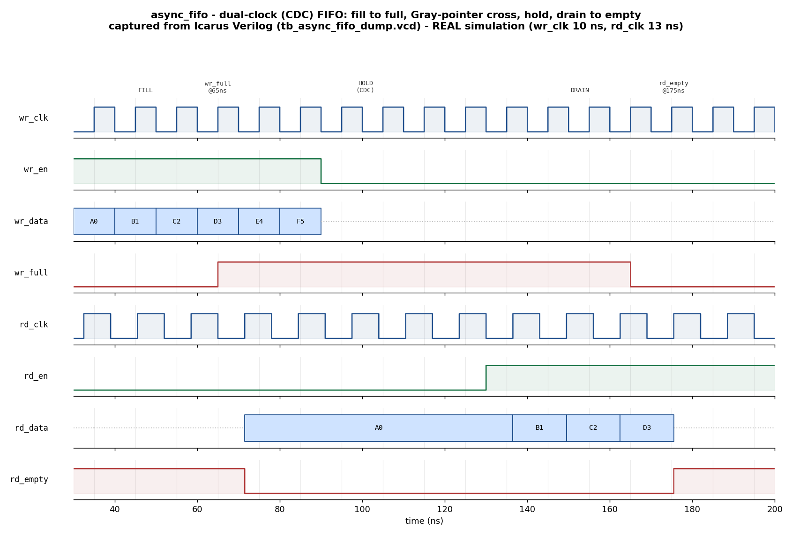

# Day 8 — UVM Asynchronous FIFO (Clock-Domain-Crossing) Verification

Verification of a **dual-clock asynchronous FIFO** — the canonical
clock-domain-crossing (CDC) building block. A UVM environment with one agent per
clock domain drives independent, non-commensurate clocks and proves that **data
integrity and ordering survive the crossing** while the full/empty flags never
allow an overflow or underflow.

## Overview

An asynchronous FIFO decouples a producer running on `wr_clk` from a consumer
running on `rd_clk`. The classic (Cummings-style) implementation verified here:

* stores data in a dual-port RAM (write port in the write domain, combinational
  first-word-fall-through read port),
* maintains **binary + Gray-coded** read/write pointers that are `AW+1` bits wide
  (the extra MSB separates the full and empty wrap conditions),
* crosses each Gray pointer into the opposite domain through a **2-flop
  synchronizer** — Gray coding guarantees only one bit changes per step, so a
  metastable capture resolves to either the old or the new pointer, never a
  corrupt intermediate value,
* generates a registered `wr_full` in the write domain and a registered
  `rd_empty` in the read domain.

The verification problem is fundamentally different from a single-clock FIFO
(Day 1): the checker cannot assume a single timeline. It must be tolerant of the
synchronizer latency yet still guarantee that **every word read equals the
matching word written, in order**.

## Verification goal

Prove, across two independent clocks, that:

1. Every word popped equals the oldest un-popped word pushed — **FIFO ordering
   and data integrity** hold across the CDC.
2. The FIFO **never overflows** (no accepted write while `wr_full`) and **never
   underflows** (no accepted read while `rd_empty`).
3. The **full** corner (occupancy reaches `DEPTH`) and the **empty** corner
   (occupancy returns to zero) are both reached and behave correctly.
4. The Gray pointers only ever change **one bit at a time** (safe CDC).
5. Flags de-assert with the correct synchronizer latency (a produced word
   becomes readable, and freed space becomes writable, after the crossing).

## Features / coverage checklist

- [x] Parameterized DUT (`DW` data width, `AW` address width → depth `2**AW`)
- [x] Two independent clock domains with **non-commensurate** periods
      (`wr_clk` 10 ns, `rd_clk` 13 ns) — edges never coincide
- [x] Asynchronous, independently-released resets per domain
- [x] Gray-code pointer CDC with 2-flop synchronizers
- [x] First-word-fall-through (FWFT) read semantics
- [x] Golden-queue **reference-model scoreboard** (push on write, compare+pop on read)
- [x] Two-agent UVM env (write agent + read agent), each active
- [x] Virtual sequencer + virtual sequences (fill/drain and concurrent random)
- [x] Directed **fill-to-full** and **drain-to-empty** stimulus
- [x] Constrained-random concurrent traffic with randomized inter-beat gaps
- [x] Functional coverage on data value ranges (write & read)
- [x] SVA: no-write-when-full, no-read-when-empty, single-bit Gray transitions
- [x] Timeout watchdog + VCD dump
- [x] Portable Icarus companion TB (actually runs here, prints `RESULT: *** PASS ***`)

## DUT parameters

| Parameter | Default | Meaning |
|-----------|---------|---------|
| `DW`      | 8       | Data width in bits |
| `AW`      | 4       | Address width; FIFO depth = `2**AW` (16). Must be ≥ 2 (an elaboration check enforces this). The Icarus TB uses `AW=2` (depth 4) so the full/empty corners appear in a few cycles. |

## DUT ports

| Port       | Dir | Domain  | Description |
|------------|-----|---------|-------------|
| `wr_clk`   | in  | write   | Write-domain clock |
| `wr_rst_n` | in  | write   | Active-low async reset (write domain) |
| `wr_en`    | in  | write   | Write request (ignored while `wr_full`) |
| `wr_data`  | in  | write   | Write data, `DW` bits |
| `wr_full`  | out | write   | Registered full flag |
| `rd_clk`   | in  | read    | Read-domain clock |
| `rd_rst_n` | in  | read    | Active-low async reset (read domain) |
| `rd_en`    | in  | read    | Read/pop request (ignored while `rd_empty`) |
| `rd_data`  | out | read    | FWFT read data — current head, valid whenever `!rd_empty` |
| `rd_empty` | out | read    | Registered empty flag |

## Testbench architecture

```
        +----------------------------------- tb_top ------------------------------------+
        |  wr_clk gen (5.0ns)   rd_clk gen (6.5ns)   async_fifo_if #(DW)   async_fifo    |
        |       |                    |                     | vif             DUT (`dut`)  |
        |       v                    v                     v                   ^         |
        |            wr_en/wr_data ----------------------------------------->  write port|
        |            wr_full       <-----------------------------------------             |
        |            rd_en         ----------------------------------------->  read  port|
        |            rd_data/rd_empty <-------------------------------------             |
  +----------------------------------- fifo_env -----------------------------|---|------+ |
  |                                                                          |   |      | |
  |  wr_agent (UVM_ACTIVE)   [wr_clk]        rd_agent (UVM_ACTIVE)  [rd_clk] |   |      | |
  |  +---------------------------+           +---------------------------+   |   |      | |
  |  | wr_sequencer              |           | rd_sequencer              |   |   |      | |
  |  | wr_driver  -- drive, obey |           | rd_driver  -- drive, obey |   |   |      | |
  |  |             wr_full ------|-----------+             rd_empty -----|---+   |      | |
  |  | wr_monitor -- accepted    |           | rd_monitor -- accepted    |       |      | |
  |  |     | ap    writes -------|-----+     |     | ap    reads --------|-------+      | |
  |  +-----|---------------------+     |     +-----|---------------------+              | |
  |        |                           |           |                                    | |
  |        |            +--------------+-----------+                                    | |
  |        v            v              v           v                                    | |
  |   fifo_coverage (cg_wr, cg_rd)   fifo_scoreboard (golden queue `golden[$]`)         | |
  |                                    write_wr() -> push;  write_rd() -> compare+pop    | |
  |                                    report_phase -> RESULT: *** PASS ***             | |
  |                                                                                     | |
  |   fifo_vseqr { wr_sqr, rd_sqr }  <- fill_drain_vseq / concurrent_vseq               | |
  +-------------------------------------------------------------------------------------+ |
        +------------------------------------------------------------------------------+
```

## Simulation timing



*Captured from a **real** Icarus Verilog run (`tb_async_fifo_dump.vcd`, produced
by `make icarus_dump`) and rendered by `docs/make_waveform.py` — this is a
genuine simulation trace, not a hand-drawn diagram.* Reading left to right on a
depth-4 FIFO:

* **FILL** — the write domain streams `A0, B1, C2, D3`; on the fourth word the
  FIFO is full and **`wr_full` asserts at 65 ns**. The next two words (`E4, F5`)
  are presented while full and are **refused** by the DUT's guard (they never
  enter the golden model either).
* **CROSS** — `rd_empty` de-asserts at ~71 ns, a couple of read clocks after the
  write Gray pointer propagates through the 2-flop synchronizer into the read
  domain.
* **HOLD** — both domains idle; the FIFO holds its four words across the CDC
  (`rd_data` shows the FWFT head `A0`).
* **DRAIN** — the read domain streams reads; words fall through in FIFO order
  `A0, B1, C2, D3`, `wr_full` clears at 165 ns as space frees, and **`rd_empty`
  re-asserts at ~175 ns** once the FIFO is empty.

(The dotted bus segments are the don't-care cycles: `wr_data` while `wr_en` is
low, and `rd_data` while `rd_empty` is high.)

## How the checking works (scoreboard / reference model)

The scoreboard is deliberately timing-agnostic. It keeps **one golden queue**
(`golden[$]`) and is driven by the two monitors, each sampling only *accepted*
transactions in its own clock domain:

1. `write_wr(tr)` — on every accepted write (`wr_en & !wr_full`), push
   `tr.data` onto the golden queue.
2. `write_rd(tr)` — on every accepted read (`rd_en & !rd_empty`), the monitor
   captures the FWFT `rd_data` present this cycle; the scoreboard pops the
   golden queue front and asserts it equals the captured data. A read with an
   empty golden queue (a spurious `!rd_empty`) is a failure.
3. `report_phase` — passes only if there was real traffic in both directions and
   zero mismatches, printing `RESULT: *** PASS ***`.

Because a word can only be read after `rd_empty` de-asserts — which happens only
after the write pointer has crossed the synchronizer — the corresponding push
always precedes its pop in simulation time, so the golden queue is causally
correct without the checker modelling pointer timing at all. This cleanly
separates *what* the FIFO must preserve (order + data) from *when* the flags move
(left to the SVA and the flag-corner coverage).

The portable Icarus companion (`tb_async_fifo_dump.sv`) carries the same golden
queue inline. The two clocks use half-periods of 5.0 ns and 6.5 ns so their
edges never line up — the shared queue is therefore updated deterministically
(writes at integer times, reads at half-integer times). After all stimulus, the
reader performs a **deterministic final drain** — it holds `rd_en` high until
`rd_empty` is stably asserted — and the pass gate then requires the golden queue
to be **fully drained** (`gq.size()==0`, `n_wr==n_rd`). This closes an important
gap: an empty flag that asserted one entry early would deliver fewer words than
were written, and the residency check (not just per-word comparison) catches it.

## Functional coverage intent

The `fifo_coverage` subscriber and the companion TB's counters target:

* **`cp_wr_data` / `cp_rd_data`** — data value ranges (low half, high half, plus
  the all-zeros and all-ones boundary bins) are exercised on both sides.
* **Occupancy corners** — the companion TB tracks max occupancy and asserts it
  reaches `DEPTH` (full corner) and returns to zero (empty corner).
* **Backpressure / underflow** — cycles where a write is attempted while full and
  where a read is attempted while empty are counted, confirming the guards are
  genuinely exercised (not merely never violated because they were never
  stressed).
* **Simultaneous read+write** — cycles where both domains are active are counted,
  confirming true concurrent CDC traffic.

## Assertions (SVA)

Compiled in on UVM-capable simulators via `+define+ASYNC_FIFO_SVA` (see the
Makefile). Inside `async_fifo.sv`:

* `a_no_overflow` — a write attempt while `wr_full` must **not advance** the
  write pointer. The datapath gates writes with `wr_en & ~wr_full`, so holding
  `wr_en` high under backpressure is legal; the assertion proves that guard
  actually blocks the write (no word is admitted, no pointer corruption). This
  verifies the guard rather than forbidding legal held-enable stimulus.
* `a_no_underflow` — symmetric: a read attempt while `rd_empty` must not advance
  the read pointer.
* `a_wr_gray_onebit` / `a_rd_gray_onebit` — each Gray pointer changes by **at
  most one bit** per clock, the core CDC-safety property.

## Run instructions

Open-source flow (Icarus + Python) — actually runs here:

```bash
make icarus_dump     # compile + run the self-checking TB (prints RESULT: *** PASS ***)
make waveform        # re-render docs/async_fifo_waveform.png from the fresh VCD
```

UVM flow (needs a UVM-capable simulator):

```bash
make vcs       UVM_TESTNAME=fifo_smoke_test
make questa    UVM_TESTNAME=fifo_regress_test
make verilator UVM_TESTNAME=fifo_smoke_test
```

## What the testbench checks

| # | Check | Where |
|---|-------|-------|
| 1 | Every read datum equals the golden FIFO front (data integrity) | scoreboard `write_rd` / dump TB |
| 2 | Reads occur in FIFO order (queue pop discipline) | scoreboard / dump TB |
| 3 | A read never occurs on an empty golden queue (no phantom data) | scoreboard / dump TB |
| 4 | FIFO never overflows — write pointer holds when `wr_en` is asserted during `wr_full` | SVA `a_no_overflow` + datapath guard |
| 5 | FIFO never underflows — read pointer holds when `rd_en` is asserted during `rd_empty` | SVA `a_no_underflow` + datapath guard |
| 6 | Full corner reached (occupancy = `DEPTH`) | dump TB `cov_maxocc` |
| 7 | Empty corner reached (occupancy = 0) | dump TB `cov_empty_hit` |
| 8 | Gray pointers change at most one bit per clock (safe CDC) | SVA `a_*_gray_onebit` |
| 9 | Reset leaves the FIFO empty and not full | reset sequence + flag init |
| 10 | Both corners are stressed (writes-while-full, reads-while-empty counted) | dump TB coverage counters |
| 11 | Every written word is ultimately read out — no tail loss / early-empty | dump TB residency gate (`gq.size()==0`, `n_wr==n_rd` after a deterministic final drain) |

## Files

| File | Role |
|------|------|
| `async_fifo.sv`         | Dual-clock CDC FIFO DUT (Gray pointers, 2-FF synchronizers, inline SVA) |
| `async_fifo_if.sv`      | Interface with per-domain driver / monitor clocking blocks |
| `async_fifo_pkg.sv`     | UVM env: txns, sequencers, drivers, monitors, agents, coverage, scoreboard, vsequencer, sequences, virtual sequences, tests |
| `tb_top.sv`             | UVM top-level (two clocks/resets, DUT, config DB, `run_test`) |
| `tb_async_fifo_dump.sv` | Portable Icarus self-checking TB (golden queue, VCD dump) |
| `Makefile`              | `icarus_dump` / `waveform` / `vcs` / `questa` / `verilator` targets |
| `docs/make_waveform.py` | VCD → PNG renderer |
| `docs/async_fifo_waveform.png` | Captured simulation waveform |
