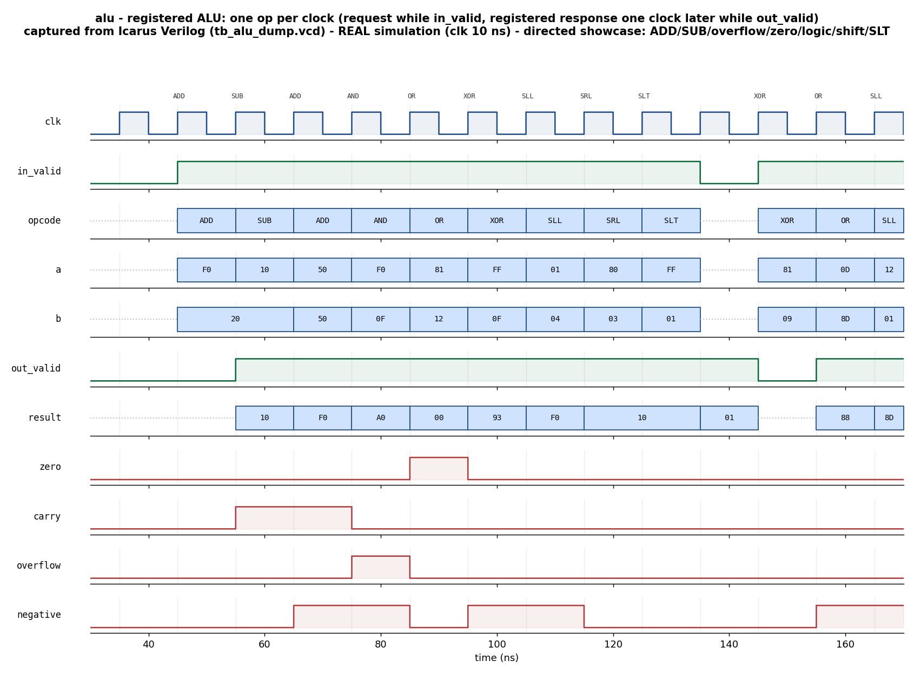

# Day 9 — UVM ALU Verification with Functional Coverage

A complete UVM-1.2 environment that verifies a small, registered
**arithmetic/logic unit (ALU)** against an independent golden reference model,
with directed + constrained-random stimulus, functional-coverage collection,
and assertion-based checking of the flag semantics.

The ALU is deliberately simple so the verification stays the star: the point of
the day is a clean, layered UVM testbench — transaction, sequences, driver,
monitor, agent, **golden reference-model scoreboard**, coverage collector,
virtual sequencer, and virtual sequences — plus SVA on the response invariants.

---

## Overview

The DUT ([alu.sv](alu.sv)) is a parameterized `WIDTH`-bit ALU with a one-cycle
**registered** output and a simple `in_valid → out_valid` handshake. Each clock
it can accept one `(opcode, a, b)` request; the result and four condition flags
appear one clock later.

Eight operations are supported:

| Opcode | Mnemonic | Operation | Notes |
|:------:|:---------|:----------|:------|
| `4'h0` | `ADD` | `a + b` | sets `carry` (carry-out) and `overflow` (signed) |
| `4'h1` | `SUB` | `a - b` | sets `carry` (unsigned borrow, `a<b`) and `overflow` (signed) |
| `4'h2` | `AND` | `a & b` | |
| `4'h3` | `OR`  | `a \| b` | |
| `4'h4` | `XOR` | `a ^ b` | |
| `4'h5` | `SLL` | `a << b[SHW-1:0]` | logical left shift |
| `4'h6` | `SRL` | `a >> b[SHW-1:0]` | logical right shift |
| `4'h7` | `SLT` | `($signed(a) < $signed(b)) ? 1 : 0` | signed set-less-than |

The four condition flags, computed for every operation, are:

- **zero** — `result == 0`
- **carry** — ADD carry-out; SUB unsigned borrow (`a < b`); `0` for logic/shift
- **overflow** — signed two's-complement overflow for ADD/SUB; `0` otherwise
- **negative** — MSB (sign bit) of the result

These flag definitions **are** the specification; the golden reference model in
the testbench re-implements them independently, so a bug in either the DUT or a
copy-pasted checker would show up as a mismatch.

---

## Verification goal

Prove that, for **every** opcode across directed corners and a large
constrained-random population, the DUT's registered `{result, zero, carry,
overflow, negative}` response exactly matches an independent golden model — with
functional coverage demonstrating the interesting opcode × flag combinations
were actually exercised, and assertions guarding the flag-consistency
invariants on every cycle.

---

## Features / coverage list

- **Golden reference-model scoreboard** — a single `alu_ref_model` re-implements
  the ALU spec; the scoreboard pushes an expected response per observed request
  and pops/compares per observed response (order + data), reporting
  `RESULT: *** PASS ***`.
- **Layered sequences** — `alu_directed_seq` (every opcode with meaningful
  operands), `alu_corner_seq` (sign-boundary/all-ones/zero bias), and
  `alu_random_seq` (constrained-random N-transaction stream).
- **Virtual sequencer + virtual sequences** — `alu_smoke_vseq` (directed only)
  and `alu_regress_vseq` (directed → corner → random) orchestrate the leaf
  sequencer; the structure scales cleanly to multi-agent DVs.
- **Functional coverage** — opcode coverpoint, operand corner-bin coverpoints,
  per-flag coverpoints, and `opcode × {carry, overflow, zero}` crosses.
- **SVA** — bound onto the DUT: `zero == (result==0)`, `negative == result MSB`,
  and no-X on the response bus while `out_valid`.
- **Directed + constrained-random** stimulus, a **timeout** watchdog, and a
  **VCD** dump.

---

## DUT parameters & ports

### Parameters

| Parameter | Default | Meaning |
|:----------|:-------:|:--------|
| `WIDTH`   | `8`     | operand / result width in bits |
| `SHW`     | `$clog2(WIDTH)` | shift-amount width (derived) |

### Ports

| Port | Dir | Width | Description |
|:-----|:---:|:-----:|:------------|
| `clk`       | in  | 1        | clock |
| `rst_n`     | in  | 1        | active-low async reset |
| `in_valid`  | in  | 1        | request valid — capture `opcode/a/b` this cycle |
| `opcode`    | in  | 4        | operation select (see table above) |
| `a`         | in  | `WIDTH`  | operand A |
| `b`         | in  | `WIDTH`  | operand B |
| `out_valid` | out | 1        | response valid — registered, one clock after request |
| `result`    | out | `WIDTH`  | operation result |
| `zero`      | out | 1        | result is zero |
| `carry`     | out | 1        | ADD carry-out / SUB borrow |
| `overflow`  | out | 1        | signed ADD/SUB overflow |
| `negative`  | out | 1        | result sign bit |

---

## Testbench architecture

```
                        +-------------------------------------------------+
                        |                    alu_env                      |
                        |                                                 |
   alu_smoke_vseq  ---> | alu_vsequencer --> alu_sequencer                |
   alu_regress_vseq     |                         |                       |
                        |                         v                       |
                        |                    alu_driver ---> alu_if ---> [ alu DUT ]
                        |                                        |         |
                        |                    alu_monitor <-------+ (req+rsp sample)
                        |                       |    |                     |
                        |             req_ap    |    |   rsp_ap            |
                        |            +----------+    +----------+          |
                        |            v                          v          |
                        |     alu_coverage             alu_scoreboard      |
                        |     (covergroup)          (golden ref model +    |
                        |                            expected FIFO check)  |
                        +-------------------------------------------------+

   golden reference model (alu_ref_model) is shared by scoreboard & coverage
```

- The **driver** pulls one `alu_txn` per clock and drives `in_valid/opcode/a/b`.
- The **monitor** samples on `posedge clk`: it publishes a *request* transaction
  whenever `in_valid` is high and a *response* transaction whenever `out_valid`
  is high, on two separate analysis ports.
- The **scoreboard** turns each observed request into an expected golden
  response (pushed to a FIFO) and checks each observed response against the
  oldest expectation — decoupled from the exact pipeline latency, so only order
  and data are asserted.
- The **coverage collector** subscribes to the request stream and samples the
  covergroup (using the same reference model to know which flags a request
  *should* raise).

---

## Simulation timing



**Caption.** Directed showcase window captured from a **real Icarus Verilog
run** (`tb_alu_dump.vcd`, produced by `make icarus_dump`) — this is genuine
captured simulation data, **not** a hand-drawn diagram. One operation is issued
per clock while `in_valid` is high; the registered response (`result` + flags)
appears one clock later while `out_valid` is high. The trace walks
`ADD (carry-out) → SUB (borrow) → ADD (signed overflow) → AND (→ zero) →
OR/XOR (→ negative) → SLL → SRL → SLT`, so you can read each flag asserting
against the operation that causes it: `carry` over the `ADD F0+20`/`SUB 10-20`
results, `overflow` over `ADD 50+50` (`+80 + +80 → -96`), and `zero` over
`AND F0&0F`. The tail shows the constrained-random regression beginning after a
brief idle gap.

> The UVM environment (`alu_pkg.sv` / `tb_top.sv`) also dumps `tb_top.vcd` under
> a UVM-capable simulator; the committed PNG is rendered from the portable
> Icarus run because Icarus is the open-source simulator this repo targets.

---

## How the checking works

There is a single executable specification, `alu_ref_model::predict()`, used by
both the scoreboard and the coverage collector. The scoreboard keeps an
**expected-response FIFO**:

1. On each observed **request**, `predict()` computes the golden
   `{result, zero, carry, overflow, negative}`, which is pushed to the FIFO.
2. On each observed **response**, the oldest expectation is popped and compared
   field-by-field. Any mismatch is a `uvm_error`.
3. `check_phase` fails if any expectation was never answered; `report_phase`
   prints `RESULT: *** PASS ***` only when there were matches, zero mismatches,
   and an empty leftover FIFO.

The portable Icarus testbench ([tb_alu_dump.sv](tb_alu_dump.sv)) reproduces the
identical scheme with a ring-buffer scoreboard and the same golden function, so
the design is self-checked even without a UVM-capable simulator.

---

## Functional-coverage intent

The covergroup (`alu_coverage`) targets:

- **cp_op** — all eight opcodes exercised.
- **cp_a / cp_b** — operand corner bins (`0x00`, `0x01`, `0x7F`, `0x80`, `0xFF`)
  plus a spread of mid-range values.
- **cp_zero / cp_carry / cp_ovf / cp_neg** — each flag observed both set and
  clear.
- **x_op_carry / x_op_ovf / x_op_zero** — the crosses that matter: which
  opcodes actually produced a carry, an overflow, or a zero result (e.g.
  overflow only meaningfully arises for `ADD`/`SUB`).

`report_phase` prints the achieved instance coverage.

---

## What the testbench checks

- Result and **all four flags** match the golden model for every transaction.
- Response ordering matches request ordering (FIFO scoreboard).
- No expected response is dropped (`check_phase`).
- Flag invariants hold every cycle (SVA): `zero` ⇔ zero result, `negative` =
  result MSB, and no unknown (`X`) on the response bus while `out_valid`.

---

## Run instructions

Open-source flow (Icarus Verilog + VCD → PNG), runs everywhere:

```bash
make icarus_dump     # compile + run the self-checking module TB, prints PASS
make waveform        # re-render docs/alu_waveform.png from the captured VCD
```

UVM flow (needs a UVM-1.2-capable simulator):

```bash
make vcs      UVM_TESTNAME=alu_smoke_test      # Synopsys VCS
make questa   UVM_TESTNAME=alu_regress_test    # Siemens Questa / ModelSim
make verilator UVM_TESTNAME=alu_smoke_test     # Verilator >= 5 built with --uvm
```

Available UVM tests: `alu_smoke_test` (directed sweep) and `alu_regress_test`
(directed → corner → random). SVA is enabled with `+define+ALU_SVA` (already set
in the UVM Makefile targets).

### Simulator status

The portable Icarus testbench was **run** on Icarus Verilog and passes
(`checks=409 errors=0`, all eight opcodes hit) — the committed waveform is from
that run. The UVM environment is provided in full but was **not executed here**,
because no UVM-capable simulator (VCS/Questa/Verilator ≥ 5 `--uvm`) is installed
in this environment; run one of the UVM targets above to execute it.
