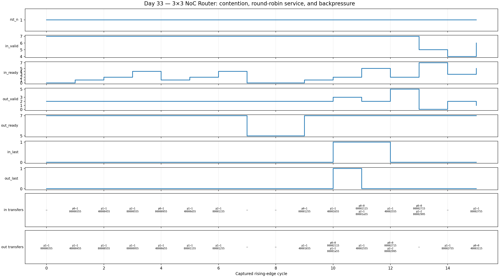

# Day 33 — UVM NoC Router Verification

## Overview

This project verifies a parameterized three-input, three-output Network-on-Chip router: a small but realistic SoC-fabric block. Each input has a one-flit elastic buffer, the destination field selects an output, and independent round-robin arbiters resolve same-output contention. Every output uses ready/valid backpressure and must hold its flit stable while stalled.

The exercise is based on skills called out in current high-compensation SoC DV roles: reusable SystemVerilog/UVM environments, NoC and bus-fabric verification, constrained-random stimulus, coverage-driven test plans, reference models, scoreboards, and assertions.

## Verification goal

Prove that every accepted flit reaches exactly its requested output without corruption, duplication, or loss; that each source's order is preserved even when sources merge; and that arbitration and backpressure never violate the ready/valid contract.

## Features and coverage

- Three active input agents plus an independently sequenced sink/backpressure agent
- Directed all-sources-to-one-output contention followed by constrained-random traffic
- Golden routing function and per-output/per-source reference queues
- Checks for destination, payload, packet-end marker, loss, duplication, and source ordering
- Source × destination × `last` functional-coverage cross
- Round-robin arbitration with a per-output fairness pointer
- SVA for legal destinations, stable stalled inputs/outputs, and known output payloads
- Portable Icarus testbench with 500 stimulus cycles, drain checking, timeout, and VCD dump
- UVM virtual coordination through concurrent per-port sequences and a sink sequence

## DUT parameters

| Parameter | Default | Meaning |
|---|---:|---|
| `NPORT` | 3 | Number of input and output ports |
| `FLIT_W` | 32 | Flit payload width |
| `DEST_W` | `$clog2(NPORT)` | Destination field width |

## DUT ports

| Port | Direction | Width | Description |
|---|---|---:|---|
| `clk`, `rst_n` | input | 1 | Clock and asynchronous active-low reset |
| `in_valid`, `in_ready` | input/output | `NPORT` | Per-input ready/valid handshake |
| `in_flit` | input | `NPORT*FLIT_W` | Packed input payloads |
| `in_dest` | input | `NPORT*DEST_W` | Packed requested output ports |
| `in_last` | input | `NPORT` | Packet-end marker per input |
| `out_valid`, `out_ready` | output/input | `NPORT` | Per-output ready/valid handshake |
| `out_flit` | output | `NPORT*FLIT_W` | Packed routed payloads |
| `out_dest` | output | `NPORT*DEST_W` | Packed echoed destinations |
| `out_last` | output | `NPORT` | Routed packet-end markers |

## Testbench architecture

```text
  input sequence[0] -> driver[0] --+                 +--> output 0
  input sequence[1] -> driver[1] --+--> NoC router --+--> output 1 <-- sink/backpressure sequence
  input sequence[2] -> driver[2] --+                 +--> output 2
          ^                                                   |
          +------------ regress virtual coordination ----------+

        all accepted inputs/outputs
                    |
                 monitor
                    |
            +-------+--------+
            |                |
   golden routing +      functional
   per-route queues       coverage
      scoreboard
```

## How checking works

The model deliberately does not reproduce the RTL arbiter. An accepted input is classified by the independent `route(dst)` function and placed in a golden queue indexed by `{output, source}`. The source ID is carried in the two most-significant payload bits. When a flit leaves an output, the scoreboard selects that source queue and compares payload and `last` exactly. This permits any legal inter-source round-robin merge while strictly checking the externally visible contract: routing, per-source order, data integrity, loss, and duplication. At end of test, every queue must be empty and accepted-input count must equal output count.

## Functional-coverage intent

The `source × destination × last` cross demonstrates that every source can reach every output for both body and end-of-packet flits. Stimulus biases destination 1 to create sustained multi-source contention, while the sink sequence randomizes all nonzero ready masks to cross routing with independent backpressure. Assertions cover protocol invariants that transaction coverage cannot express.

## Simulation timing



This is a **real captured waveform** from the portable self-checking Icarus run. It shows the opening directed phase: all three sources target output 1, the round-robin arbiter merges them, and output-ready stalls introduce backpressure. Packed destination and flit buses are annotated cycle by cycle; the top two payload bits identify the source.

## Run

```sh
make                         # portable self-checking Icarus run
make waveform                # rerun and render VCD to the committed PNG
make vcs UVM_TESTNAME=noc_router_regress_test
make questa UVM_TESTNAME=noc_router_regress_test
make verilator UVM_TESTNAME=noc_router_regress_test
make clean
```

The UVM targets require a simulator with UVM 1.2 support. The default Icarus target runs the module-based companion testbench because Icarus does not provide a UVM class library or constraint solver. Both environments apply the same golden routing/order contract and print `RESULT: *** PASS ***` only after all accepted traffic is accounted for.

## What the testbench checks

- Reset empties every input buffer and suppresses output valid
- A destination is legal when its input handshake occurs
- Same-output contenders are all eventually serviced under a ready sink
- Stalled outputs hold valid, destination, payload, and `last` stable
- Every accepted flit appears once on the selected output
- Per-source ordering survives arbitration
- Random output backpressure causes neither corruption nor loss
- All golden queues are empty after drain and total input/output counts match
