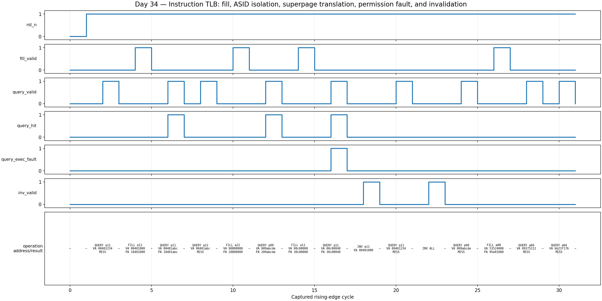

<!-- Author: Asresh Kuricheti -->
# Day 34 — UVM Instruction-TLB Verification

## Overview

This project verifies a parameterized instruction translation lookaside buffer (I-TLB), the CPU front-end structure that turns virtual instruction-fetch addresses into physical addresses without walking page tables on every fetch. The DUT supports 4 KiB pages, 2 MiB superpages, address-space identifiers (ASIDs), global mappings, execute permission, round-robin replacement, and selective or global invalidation.

The subject is based on current, high-compensation CPU and SoC verification work. An NVIDIA CPU verification posting specifically calls out front-end blocks including the TLB, scalable constrained-random SystemVerilog/UVM environments, scoreboards, stimulus, and coverage closure; current Apple silicon roles emphasize reusable UVM, reference models, SVA, and coverage-driven verification. This project turns those requirements into a small, portfolio-sized block.

## Verification goal

Prove that the TLB distinguishes address spaces, translates both supported page sizes correctly, preserves page offsets, enforces execute permission, protects global entries from ASID-only invalidation, removes exactly the selected mappings, and remains consistent while fills, replacement, queries, and invalidations are interleaved.

## Big-picture use cases

- CPU instruction fetch: translate the program counter before an instruction-cache lookup.
- Hypervisors and operating systems: keep processes with identical virtual addresses separate through ASIDs.
- Kernel mappings: share global executable mappings across address spaces without flushing them on every context switch.
- Huge-page code regions: translate a 2 MiB region with one entry, reducing miss and page-walk pressure.
- Secure execution: raise a fault when instruction fetch targets a mapped but execute-disabled page.
- Firmware-driven maintenance: model `SFENCE.VMA`/TLBI-style global, ASID, virtual-address, and combined invalidation behavior.

## DUT features

- Fully associative, parameterized entry array
- 4 KiB and 2 MiB page matching and offset construction
- ASID-tagged and global entries
- Execute permission and explicit execute-fault response
- First-invalid allocation followed by round-robin replacement
- Global, ASID-only, VA-only, and ASID+VA invalidation
- Reset-safe valid bits and known miss outputs
- SVA for response causality, fault causality, known outputs, aligned superpage fills, and mutually exclusive fill/invalidate commands

## DUT parameters

| Parameter | Default | Meaning |
|---|---:|---|
| `ENTRIES` | 8 | Number of fully associative translations |
| `VA_W` | 32 | Virtual-address width |
| `PA_W` | 32 | Physical-address width |
| `ASID_W` | 8 | Address-space identifier width |
| `IDX_W` | `$clog2(ENTRIES)` | Returned entry-index width |

## DUT ports

| Port | Direction | Width | Description |
|---|---|---:|---|
| `clk`, `rst_n` | input | 1 | Clock and asynchronous active-low reset |
| `query_valid` | input | 1 | Qualifies a combinational translation lookup |
| `query_vaddr` | input | `VA_W` | Virtual instruction-fetch address |
| `query_asid` | input | `ASID_W` | Current address-space identifier |
| `query_hit` | output | 1 | Matching valid translation exists |
| `query_exec_fault` | output | 1 | Hit exists but execute permission is clear |
| `query_paddr` | output | `PA_W` | Translated physical address on a hit |
| `query_index` | output | `IDX_W` | Matching array slot for debug/coverage |
| `fill_valid` | input | 1 | Install a translation on the next rising edge |
| `fill_vaddr`, `fill_paddr` | input | `VA_W`, `PA_W` | Aligned virtual and physical mapping bases |
| `fill_asid` | input | `ASID_W` | Mapping owner |
| `fill_global` | input | 1 | Ignore ASID during lookup; preserve on ASID flush |
| `fill_superpage` | input | 1 | Select 2 MiB instead of 4 KiB matching |
| `fill_exec` | input | 1 | Permit instruction fetch from this mapping |
| `inv_valid`, `inv_all` | input | 1 each | Request invalidation / invalidate all entries |
| `inv_asid_valid`, `inv_asid` | input | 1, `ASID_W` | Enable and supply the ASID selector |
| `inv_vaddr_valid`, `inv_vaddr` | input | 1, `VA_W` | Enable and supply the virtual-page selector |

## Testbench architecture

```text
 directed sequence ----+
                       +--> regress virtual sequence --> virtual sequencer
 constrained-random ---+                                  |
                                                          v
                                               +----------------------+
                                               | active TLB UVM agent |
                                               | sequencer -> driver  |
                                               |              monitor |----+
                                               +----------------------+    |
                                                          |                |
                                                          v                |
                                                     +---------+           |
                                                     | I-TLB   |           |
                                                     | DUT     |           |
                                                     +---------+           |
                                                                            v
                         +---------------------------+------------------------+
                         |                                                    |
                independent shadow table                              functional coverage
              + page/ASID match function                    op x hit x fault; size x global
              + translation function
              + invalidation/replacement model
                         |
                    scoreboard
               exact hit/fault/PA checks
```

## File map

```text
i_tlb.sv              synthesizable DUT + protocol/response SVA
i_tlb_if.sv           clocking-block interface used by driver and monitor
tlb_ref_pkg.sv        independent page-match and translation functions
i_tlb_pkg.sv          UVM item, sequences, driver, monitor, agent,
                      scoreboard, coverage, virtual sequencer, env, test
tb_top.sv             UVM DUT wiring, reset, config_db, and timeout
tb_i_tlb_dump.sv      portable independent scoreboard + real VCD capture
docs/make_waveform.py VCD parser and waveform renderer
Makefile              Icarus, VCS, Questa, Verilator, waveform targets
```

## Stimulus plan

The directed sequence demonstrates a cold miss, a 4 KiB fill and offset-preserving hit, an identical-VA/different-ASID miss, a global 2 MiB mapping accessed from another ASID, an execute-disabled mapping, ASID+VA invalidation, and a global flush. The constrained-random sequence then biases toward queries while mixing fills across page sizes, global/local mappings, execute permissions, and every invalidation selector combination.

## How checking works

The scoreboard owns an independent shadow table rather than reading DUT internals. For every query it searches valid entries using separately written page-size and ASID rules, independently constructs the expected physical address, and compares hit, translated address, and execute-fault exactly. For a fill it independently chooses the first invalid slot or the next round-robin victim. For invalidation it evaluates each entry against the global, ASID, and virtual-page selectors, including the rule that an ASID-only flush preserves global mappings.

The portable testbench uses the same specification but a separate parallel-array implementation, avoiding shared DUT code. It prints `RESULT: *** PASS ***` only after every directed and randomized comparison succeeds; a fixed timeout catches deadlock.

## Functional-coverage intent

- Cover query, fill, and invalidate operations.
- Cross query operation with hit/miss and execute-fault outcomes.
- Cross fill operation with 4 KiB/2 MiB and local/global mappings.
- Cover low ASIDs individually and collect all remaining ASIDs.
- Directed coverage guarantees the important semantic corners; constrained-random traffic stresses replacement and invalidation interleavings.

## Simulation timing



This is a **real captured waveform** from the self-checking Icarus run. It shows reset, a cold miss, a 4 KiB fill and hit, ASID isolation, a global 2 MiB superpage translation, an execute-permission fault, targeted invalidation, and a global flush. Address/result annotations come directly from the captured VCD.

## Run

```sh
make                         # portable Icarus regression; emits VCD
make waveform                # rerun and render the captured VCD to PNG
make vcs UVM_TESTNAME=tlb_regress_test
make questa UVM_TESTNAME=tlb_regress_test
make verilator UVM_TESTNAME=tlb_regress_test
make clean
```

The commercial-simulator targets run the full UVM environment. The default Icarus target runs the portable companion because Icarus has no UVM class library or constraint solver. Both check the same architectural contract.

## What the testbench checks

- Reset causes every lookup to miss.
- A 4 KiB entry preserves the low 12 virtual-address bits.
- A 2 MiB entry preserves the low 21 virtual-address bits.
- Local entries require an exact ASID; global entries match every ASID.
- Execute-disabled hits assert `query_exec_fault`; misses never do.
- First-invalid and round-robin replacement never return stale translations.
- ASID-only invalidation preserves global entries.
- VA-only invalidation covers matching local and global entries.
- Combined ASID+VA invalidation removes only the selected local mapping.
- Global invalidation removes all mappings.
- Outputs contain no unknown values on a hit.

## Job-market alignment

- [NVIDIA Senior Verification Engineer](https://nvidia.wd5.myworkdayjobs.com/en-US/NVIDIAExternalCareerSite/job/US-CA-Santa-Clara/Senior-Verification-Engineer_JR2013784): CPU front-end verification including TLB, constrained-random UVM, coverage strategy, and SVA.
- [Apple Design Verification Engineer](https://jobs.apple.com/en-sg/details/200658029-3956/design-verification-engineer): reusable UVM, reference models, constrained-random testing, SVA, and coverage-driven verification.
- [Micron Senior Design Verification Engineer](https://careers.micron.com/careers/job/41787962): UVM/SystemVerilog environments, constrained random, Python infrastructure, debug, and coverage closure.
