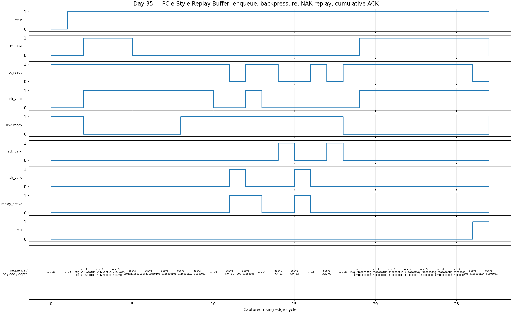

<!-- Author: Asresh Kuricheti -->
# Day 35 — UVM PCIe-Style Replay Buffer Verification

## Overview

This project verifies a parameterized replay buffer inspired by the PCI Express Data Link Layer. A newly accepted packet receives a sequence number, is transmitted over a ready/valid link, and remains stored until a cumulative ACK retires it. A NAK moves the transmit cursor back to the named unacknowledged packet and replays that packet plus every newer one. The block therefore separates **sent** from **retired**: link transmission does not free storage.

The exercise is based on current high-compensation verification roles. Recent NVIDIA PCIe and chip-verification postings call for UVM, reusable BFMs, scoreboards, reference models, constrained-random stimulus, functional coverage, and protocol/IP verification; Apple and Micron postings similarly emphasize scalable UVM environments, SVA, Python automation, and coverage closure.

## Verification goal

Prove lossless, ordered initial transmission and replay under backpressure; correct cumulative retirement; correct full/empty flow control; sequence-number wrap behavior; and stable output payload while the downstream link is stalled.

## Big-picture use cases

- PCIe Data Link Layer replay of unacknowledged TLPs after a NAK or replay timeout.
- Chiplet and die-to-die links that retain flits until link-level acknowledgement.
- Reliable NoC virtual channels with retry after a parity or CRC failure.
- Storage and networking transmit queues that separate dispatch from completion.
- Safety-critical control links where transient corruption triggers deterministic retransmission.

## DUT features

- Parameterized payload width, sequence width, and replay depth
- Circular storage for packets that have been sent but not acknowledged
- Automatic monotonically increasing sequence assignment with natural wrap
- Ready/valid link output with stable stalled data
- Cumulative ACK retirement through a named sequence number
- NAK-triggered replay from any still-retained sequence
- Independent `occupancy`, `full`, `empty`, and `replay_active` status
- Reset-safe state and SVA for occupancy, mutual exclusion, stable stalls, and flow control

## DUT parameters

| Parameter | Default | Meaning |
|---|---:|---|
| `DATA_W` | 32 | Packet payload width |
| `SEQ_W` | 8 | Link sequence-number width |
| `DEPTH` | 8 | Number of retained packets |
| `PTR_W` | `$clog2(DEPTH)` | Circular-pointer width |

## DUT ports

| Port | Direction | Width | Description |
|---|---|---:|---|
| `clk`, `rst_n` | input | 1 | Clock and asynchronous active-low reset |
| `tx_valid`, `tx_ready` | input, output | 1 | Transaction-layer enqueue handshake |
| `tx_data` | input | `DATA_W` | Payload to retain and transmit |
| `link_valid`, `link_ready` | output, input | 1 | Link-layer transmit handshake |
| `link_data` | output | `DATA_W` | Initial or replayed payload |
| `link_seq` | output | `SEQ_W` | Sequence assigned when enqueued |
| `ack_valid`, `ack_seq` | input | 1, `SEQ_W` | Cumulative acknowledgement command |
| `nak_valid`, `nak_seq` | input | 1, `SEQ_W` | Replay command and first sequence to resend |
| `replay_active` | output | 1 | A NAK-initiated replay is in progress |
| `full`, `empty` | output | 1 each | Storage boundary status |
| `occupancy` | output | `$clog2(DEPTH+1)` | Number of unacknowledged packets |

## Testbench architecture

```text
 directed sequence --------+
                           +--> regress virtual sequence --> virtual sequencer
 constrained-random bursts +                                  |
                                                              v
                                                   +----------------------+
                                                   | active replay agent  |
                                                   | sequencer -> driver  |
                                                   |              monitor |----+
                                                   +----------------------+    |
                                                              |                |
                                                              v                |
                                                   +----------------------+    |
                                                   | PCIe-style replay    |    |
                                                   | buffer DUT           |    |
                                                   +----------------------+    |
                                                                                v
                       +-------------------------------+-------------------------+
                       |                                                         |
            independent retained queue                                functional coverage
       + independently rebuilt replay queue                     event x occupancy; stalls
       + cumulative-ACK reference model
                       |
                   scoreboard
       sequence, payload, order, occupancy checks
```

## File map

```text
pcie_replay_buffer.sv       synthesizable DUT and SVA
pcie_replay_if.sv           UVM driver/monitor clocking interface
pcie_replay_ref_pkg.sv      independent sequence-window helper model
pcie_replay_pkg.sv          items, sequences, driver, monitor, agent,
                            scoreboard, coverage, virtual sequencer/env/test
tb_top.sv                   full UVM wiring, reset, configuration, timeout
tb_pcie_replay_dump.sv      portable self-checking regression and VCD capture
docs/make_waveform.py       VCD parser and real-waveform PNG renderer
Makefile                    Icarus, VCS, Questa, Verilator, waveform targets
```

## Stimulus plan

Directed stimulus enqueues three known payloads, holds `link_ready` low to test stability, drains them, NAKs the middle sequence, checks replay of the exact suffix, cumulatively ACKs through the middle, replays the remaining tail, and finally retires it. It then fills every slot to prove backpressure. Constrained-random traffic varies payloads and burst sizes, periodically replays entire outstanding windows, and retires each burst with a cumulative ACK.

## How checking works

The scoreboard maintains two independent queues. The **retained queue** is the golden ownership model: enqueue appends, while ACK removes the prefix through the matching sequence. The **send queue** is the golden link-order model: enqueue appends new traffic, a successful transfer removes its head, and NAK rebuilds it from the retained suffix beginning at `nak_seq`. Every observed link transfer must match the next modeled sequence and payload exactly. The scoreboard also compares DUT occupancy against retained-queue depth every cycle.

The portable Icarus testbench implements the same contract with fixed arrays and independent indices rather than copying the RTL pointers. It checks directed corners plus 40 randomized bursts and prints `RESULT: *** PASS ***` only when every packet, replay, status transition, and occupancy result agrees. A fixed timeout catches deadlock.

## Functional-coverage intent

- Cover enqueue, cumulative ACK, and NAK/replay events.
- Cover empty, partially occupied, and full storage states.
- Cross command type with occupancy class.
- Cover successful link transfers and stalled-valid cycles.
- Exercise replay from the oldest entry and from the middle of a retained window.
- Exercise sequence-number wrap through repeated randomized bursts.

## Simulation timing



This is a **real captured waveform** from the self-checking Icarus simulation. It shows reset, three enqueues, downstream backpressure with stable output, initial transmissions, a NAK that restarts at sequence 1, replay, cumulative ACK, and final retirement. Annotations are parsed directly from the VCD.

## Run

```sh
make
make waveform
make vcs UVM_TESTNAME=replay_regress_test
make questa UVM_TESTNAME=replay_regress_test
make verilator UVM_TESTNAME=replay_regress_test
make clean
```

The commercial-simulator targets run the full UVM environment. The default Icarus target runs the portable companion because Icarus does not provide the UVM class library or constraint solver.

## What the testbench checks

- Reset empties the replay window and suppresses link traffic.
- Each accepted payload gets the next sequence number.
- A stalled link holds `link_valid`, `link_seq`, and `link_data` stable.
- Initial transmissions are lossless and ordered.
- NAK replays the named retained packet and every newer packet exactly once.
- ACK cumulatively removes the prefix through the named sequence.
- Sent-but-unacknowledged packets still consume capacity.
- Full deasserts `tx_ready`; final ACK restores empty.
- Invalid/out-of-window ACK or NAK commands do not corrupt stored state.
- Sequence-number rollover does not disturb circular-buffer order.

## Job-market alignment

- [NVIDIA Design Verification Engineer — PCIe](https://nvidia.wd5.myworkdayjobs.com/en-US/NVIDIAExternalCareerSite/job/Design-Verification-Engineer---PCIE_JR2011533): PCIe controllers, UVM, reusable BFMs, scoreboards, constrained random, and functional coverage.
- [NVIDIA Senior Chip Design Verification Engineer](https://nvidia.wd5.myworkdayjobs.com/en-US/NVIDIAExternalCareerSite/job/Senior-Chip-Design-Verification-Engineer_JR2020870): networking silicon, reference models, and deep SystemVerilog/UVM experience.
- [Apple Design Verification Engineer](https://jobs.apple.com/en-us/details/200658028-0157/design-verification-engineer): reusable UVM, reference models, SVA, coverage-driven verification, and advanced fabric protocols.
- [Micron Sr. Design Verification Engineer](https://careers.micron.com/careers/job/41787962): end-to-end UVM environments, constrained random, Python infrastructure, and coverage closure.
