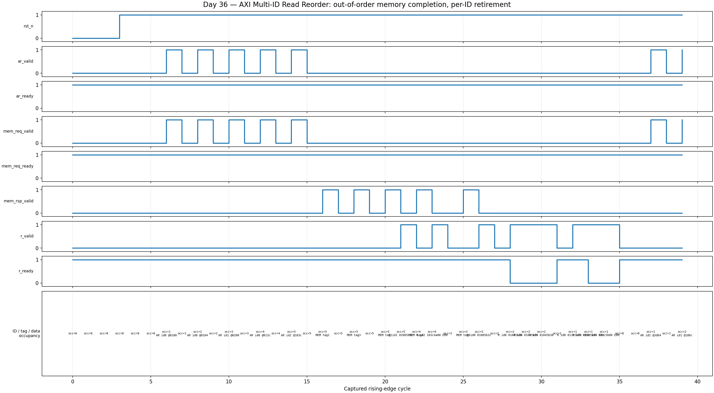

<!-- Author: Asresh Kuricheti -->
# Day 36 — UVM AXI Multi-ID Read Reorder Verification

## Overview

This project verifies a parameterized **AXI-style multi-ID read reorder engine**. The upstream side accepts reads carrying an AXI transaction ID. Each accepted read is translated into a downstream request with an internal tag, and the memory system may return those tags in any order. The engine must hold completed reads until each one is the oldest outstanding request for its own ID. Responses from different IDs may legally interleave.

That distinction is the core verification problem: a globally ordered scoreboard is too strict, while a scoreboard that accepts any response is too weak. The correct golden model is a bank of FIFO queues—one queue per AXI ID.

The topic follows current high-value SoC DV work: recent NVIDIA roles emphasize cache/coherency, complex memory hierarchies, AXI/ACE/CHI interconnects, constrained-random UVM, SVA, and coverage; recent Apple roles similarly call for reusable multi-instance UVM VIP, high-bandwidth DMA/fabric protocols, reference models, and coverage closure.

## Verification goal

Prove that arbitrary downstream completion order never causes loss, duplication, corruption, or same-ID reordering, while preserving legal cross-ID bypass and ready/valid behavior under backpressure.

## Design features

- Parameterized address, data, ID, tag, sequence, and reorder-depth widths.
- One internal tagged slot per outstanding request.
- Independent allocation and retirement sequence counters for every AXI ID.
- Arbitrary downstream completion order by internal tag.
- Legal response interleaving across IDs, strict FIFO retirement within an ID.
- Registered response hold state so ID/data/error remain stable while `r_ready` is low.
- Error response propagation and reset-safe slot/counter initialization.
- Occupancy reporting and backpressure when all slots are live.

## DUT parameters

| Parameter | Default | Meaning |
|---|---:|---|
| `ADDR_W` | 16 | Read-address width |
| `DATA_W` | 32 | Read-data width |
| `ID_W` | 2 | AXI transaction-ID width; supports `2**ID_W` independent order streams |
| `DEPTH` | 8 | Maximum outstanding reads / internal tags |
| `SEQ_W` | 16 | Per-ID allocation and retirement sequence width |
| `TAG_W` | `$clog2(DEPTH)` | Internal memory-completion tag width |

## DUT ports

| Port | Dir. | Width | Purpose |
|---|---|---:|---|
| `clk`, `rst_n` | In | 1 | Clock and asynchronous active-low reset |
| `ar_valid`, `ar_ready` | In/Out | 1 | Upstream read-request handshake |
| `ar_id` | In | `ID_W` | AXI ordering ID |
| `ar_addr` | In | `ADDR_W` | Read address |
| `mem_req_valid`, `mem_req_ready` | Out/In | 1 | Tagged downstream request handshake |
| `mem_req_tag` | Out | `TAG_W` | Slot tag returned with a completion |
| `mem_req_id`, `mem_req_addr` | Out | parameterized | Downstream request metadata |
| `mem_rsp_valid` | In | 1 | Out-of-order completion valid |
| `mem_rsp_tag` | In | `TAG_W` | Completion tag |
| `mem_rsp_data` | In | `DATA_W` | Completion data |
| `mem_rsp_error` | In | 1 | Completion error status |
| `r_valid`, `r_ready` | Out/In | 1 | Upstream response handshake |
| `r_id`, `r_data`, `r_error` | Out | parameterized | Ordered upstream response |
| `occupancy` | Out | `$clog2(DEPTH+1)` | Number of allocated slots |

## Testbench architecture

```text
                         reorder_regress_vseq
                        /                    \
             directed + random reads     memory-flow sequence
                      |                         |
              +-------v--------+         +------v-------+
              | AXI read agent |         | memory agent |
              | seqr + driver  |         | seqr + driver|
              +-------+--------+         +------+-------+
                      |  AR             request | completion tags
                      +----------+   +----------+
                                 v   v
                       +-----------------------+
                       | axi_read_reorder DUT  |
                       | tagged slots + per-ID |
                       | alloc/retire counters |
                       +-----------+-----------+
                                   | ordered R channel
                          +--------v---------+
                          | pin-level monitor|
                          +----+---------+---+
                               |         |
                    +----------v--+   +--v----------------+
                    | per-ID FIFO |   | functional coverage|
                    | scoreboard  |   | ID x error, depth, |
                    | + ref model |   | stalls             |
                    +-------------+   +--------------------+
```

## How the files fit together

```text
axi_read_reorder.sv
  synthesizable tagged-slot RTL + optional protocol SVA
        |
axi_read_reorder_if.sv
  shared interface and race-safe clocking blocks
        |
axi_read_reorder_ref_pkg.sv
  independent address-to-{error,data} golden function
        |
axi_read_reorder_pkg.sv
  items -> two agents -> monitor -> scoreboard/coverage
  directed/random sequences -> virtual sequencer -> regression test
        |
tb_top.sv
  UVM wiring, reset, UVM_TESTNAME selection, timeout

tb_axi_read_reorder_dump.sv
  portable non-UVM self-checking regression -> VCD
        |
docs/make_waveform.py -> docs/axi_read_reorder_waveform.png
```

## How checking works

On every accepted upstream request, the scoreboard evaluates an independent golden memory function and pushes `{error,data}` into the FIFO belonging to `ar_id`. It separately checks that the emitted downstream request has the same ID and address and that its tag is not already live. Every memory completion is checked against the address previously observed for that tag.

When an upstream response transfers, only the golden FIFO for `r_id` is popped. Therefore:

- a younger response escaping ahead of an older response with the same ID fails;
- a legal response from another ID is accepted immediately;
- extra, missing, corrupt, duplicated, or incorrectly flagged responses fail;
- downstream request corruption or live-tag reuse fails independently of upstream data checking.

The portable Icarus bench uses the same verification contract but a separately written fixed-function golden model. It fills batches, shuffles completion tags, injects error addresses, randomizes IDs, and randomly stalls the R channel.

## Directed and constrained-random stimulus

- Directed same-ID inversion: ID 0 requests A, B, C; completions B and C arrive before A.
- Directed cross-ID bypass: completed ID 1 and ID 2 reads retire while ID 0 waits for A.
- Error propagation through an address-selected error region.
- Fill/drain and internal-tag reuse.
- Random 1–8 request batches across all four IDs.
- Randomized reverse/newest/random completion selection.
- Random request-side and response-side backpressure.
- 500 µs simulation timeout to catch deadlock or lost responses.

## Assertions

With `AXI_REORDER_SVA` enabled, the RTL checks:

- response ID/data/error stay stable under backpressure;
- occupancy never exceeds `DEPTH`;
- a completion targets a live, incomplete slot;
- every upstream response comes from a live completed slot;
- a stalled upstream request holds ID and address stable.

## Functional-coverage intent

The UVM subscriber collects all response IDs, success/error outcomes, empty/low/high/full occupancy, transfers, stalls, and the response-ID × error cross. The memory sequence deliberately favors newest-entry completion so real reordering is common instead of accidental. A regression is only meaningful when it observes reordered completion tags and successfully drains every per-ID golden queue.

## Simulation timing



*Real waveform captured from the self-checking Icarus regression. Younger ID 0 tags complete before the oldest ID 0 tag, an ID 1 response bypasses legally, then ID 0 responses retire in request order. The final cycles also show `r_valid` held across randomized `r_ready` backpressure.*

## Run instructions

```bash
# Portable self-checking regression; creates tb_axi_read_reorder_dump.vcd
make icarus

# Re-run and render the real captured waveform PNG
make waveform

# Commercial/full-UVM targets
make vcs UVM_TESTNAME=axi_reorder_regress_test
make questa UVM_TESTNAME=axi_reorder_regress_test
make verilator UVM_TESTNAME=axi_reorder_regress_test

make clean
```

The checked-in portable run completed **150 reads with 0 mismatches** and printed:

```text
RESULT: *** PASS *** (150 reads checked)
```

## What the testbench checks

- Exact address-to-data/error reference-model result.
- Request conservation from AR acceptance to tagged downstream issue.
- Unique live tags and correct completion-to-address association.
- Strict response ordering inside every AXI ID.
- Legal independent progress across different IDs.
- Response stability under backpressure.
- Reset emptiness, bounded occupancy, full-depth traffic, tag reuse, and complete drain.
- Directed and randomized reordering rather than only in-order memory behavior.

## Big-picture use cases

- **CPU/GPU memory subsystems:** merge cache-miss returns whose DRAM banks complete at different times.
- **AXI interconnects and NoCs:** preserve protocol ordering at an initiator while the fabric routes requests independently.
- **DMA engines:** allow multiple channels or descriptors to overlap without corrupting per-stream order.
- **DDR/HBM controllers:** hide bank/row latency by completing other transaction IDs first.
- **PCIe/CXL bridges:** translate tag-based completion traffic back into locally ordered streams.
- **Cellular and AI accelerators:** keep many high-bandwidth data streams in flight across shared memory fabrics.

## Career relevance

This exercise demonstrates the exact reasoning expected in memory-fabric DV interviews: distinguishing global order from per-ID order, building a non-overconstrained scoreboard, coordinating multiple active UVM agents with a virtual sequence, stressing backpressure and completion permutations, and using coverage plus assertions to close protocol corner cases.
