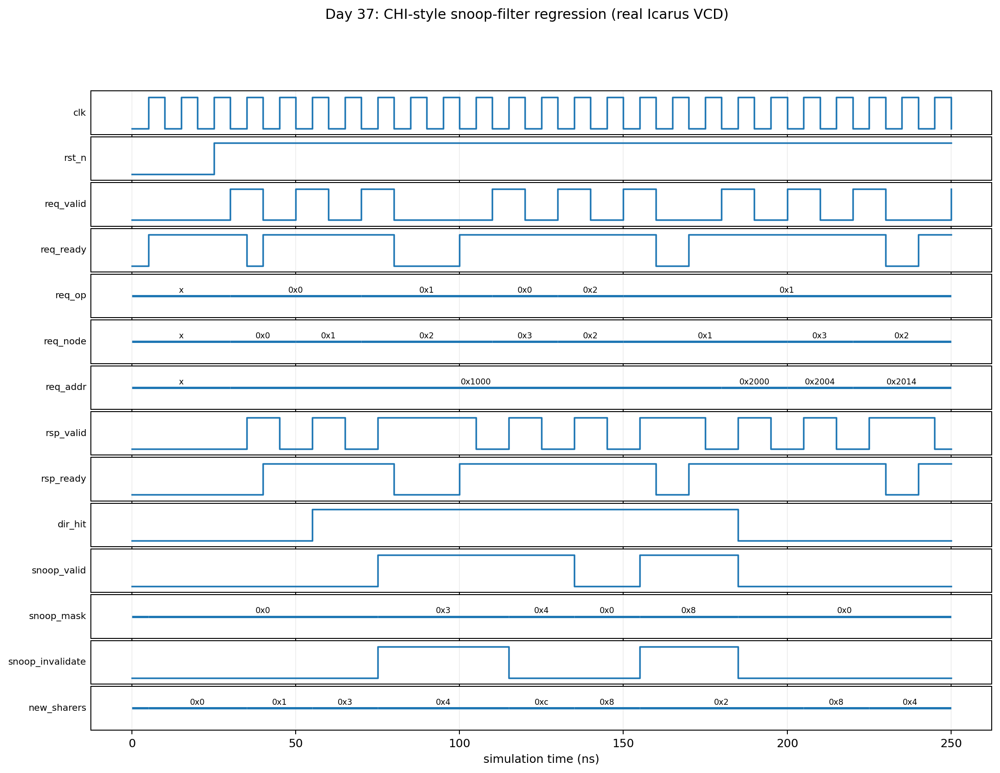

<!-- Author: Asresh Kuricheti -->
# Day 37 — UVM CHI-Style Coherent Snoop-Filter Verification

## Overview

This project verifies a parameterized directory slice inspired by the snoop-filter function in AMBA CHI and CXL.cache home agents. Instead of broadcasting every coherent request to every cache, the filter remembers which requesters may hold each line and targets only those nodes. It supports `READ_SHARED`, `READ_UNIQUE`, and `EVICT`, tracks a dirty owner, allocates empty directory entries before using round-robin replacement, and returns both the prior and resulting sharer masks.

The topic is based on a recent [NVIDIA Senior ASIC Verification posting for coherent high-speed interconnects](https://nvidia.wd5.myworkdayjobs.com/en-US/NVIDIAExternalCareerSite/job/Senior-ASIC-Verification-Engineer--Coherent-High-Speed-Interconnect_JR2010025). That role highlights PCIe, CXL, CHI, SV/UVM testbenches, constrained-random stimulus, functional coverage, and assertions, with a listed US base range up to $264,500. This project turns those requirements into a small, interview-sized verification target without claiming full CHI protocol compliance.

## Verification goal

Prove that the filter never misses a required snoop, never snoops the requester itself, invalidates all competing copies before unique ownership, preserves the exact sharer set across sharing and eviction, remains stable under response backpressure, and behaves correctly through directory hit, miss, full, and replacement cases.

## Design features

- Parameterized address width, node count, and directory depth.
- Fully associative tag lookup with first-free allocation and round-robin replacement.
- `READ_SHARED`: add the requester; snoop a different dirty owner when necessary.
- `READ_UNIQUE`: invalidate every other recorded sharer and leave one dirty owner.
- `EVICT`: clear the requester's sharer bit and invalidate an empty entry.
- Decoupled request/response handshake with response-payload stability under stall.
- Reset-safe, synthesizable, latch-free, lint-friendly RTL.

## DUT parameters

| Parameter | Default | Meaning |
|---|---:|---|
| `ADDR_W` | 16 | Coherent line-address width |
| `NODES` | 4 | Number of cache/requester nodes |
| `ENTRIES` | 8 | Fully associative directory entries |
| `NODE_W` | `$clog2(NODES)` | Requester-ID width |
| `IDX_W` | `$clog2(ENTRIES)` | Directory index width |

## DUT ports

| Port | Dir. | Width | Purpose |
|---|---|---:|---|
| `clk`, `rst_n` | In | 1 | Clock and active-low asynchronous reset |
| `req_valid`, `req_ready` | In/Out | 1 | Coherent-request handshake |
| `req_node` | In | `NODE_W` | Requesting cache/node |
| `req_addr` | In | `ADDR_W` | Line address |
| `req_op` | In | 2 | Shared read, unique read, or eviction |
| `rsp_valid`, `rsp_ready` | Out/In | 1 | Directory-result handshake |
| `dir_hit` | Out | 1 | Address existed before the operation |
| `old_sharers` | Out | `NODES` | Pre-operation directory state |
| `snoop_valid`, `snoop_mask` | Out | 1, `NODES` | Whether and where to send snoops |
| `snoop_invalidate` | Out | 1 | Snoop type: invalidate competing copies |
| `new_sharers` | Out | `NODES` | Post-operation directory state |

## Testbench architecture

```text
                         sf_regress_vseq
                         /              \
          directed/constrained requests  randomized response readiness
                     |                              |
             +-------v-------+              +-------v------+
             | requester agent|              | flow agent   |
             | seqr + driver  |              | seqr + driver|
             +-------+--------+              +------+-------+
                     | coherent request             | backpressure
                     +---------------+  +-----------+
                                     v  v
                            +------------------+
                            | chi_snoop_filter |
                            | tag + sharer dir |
                            +--------+---------+
                                     | response / targeted snoop
                              +------v------+
                              | pin monitor |
                              +---+------+--+
                                  |      |
                         +--------v-+  +-v----------------+
                         | shadow   |  | functional       |
                         | directory|  | coverage         |
                         | scoreboard| | op x node, hit,  |
                         +----------+  | snoop            |
                                       +------------------+
```

## How the files fit together

```text
chi_snoop_filter.sv          synthesizable directory RTL + optional SVA
        |
chi_snoop_filter_if.sv       clocking blocks for race-safe UVM access
        |
chi_snoop_filter_pkg.sv      items, two agents, monitor, scoreboard,
                             coverage, sequences, virtual sequence, test
        |
tb_top.sv                    UVM wiring, reset, and timeout

tb_chi_snoop_filter_dump.sv  portable independent self-checking regression
        |
VCD -> docs/make_waveform.py -> docs/chi_snoop_filter_waveform.png
```

## How checking works

The scoreboard owns an independent shadow directory: valid bits, tags, sharer masks, dirty bits, owners, and replacement pointer. On every accepted request it performs its own associative lookup and computes the complete expected response before the DUT result appears. Expected results are queued, so response stalls do not couple reference-model timing to RTL timing. On each accepted response it compares the hit flag, old sharers, snoop presence, exact snoop mask, invalidate type, and new sharers as one transaction.

This catches false hits/misses, missing or extra snoops, self-snoops, incorrect unique-owner invalidation, dirty-owner downgrade errors, bad eviction, and replacement-policy divergence. The portable Icarus bench contains a separately written model and uses the same transaction contract.

## Directed and constrained-random stimulus

- Node 0 reads a new line, then node 1 shares it.
- Node 2 requests unique ownership and must invalidate nodes 0 and 1.
- Node 3 reads a dirty line and must snoop its owner.
- Owner eviction followed by a new unique owner.
- Response stalls of zero, one, and two cycles.
- Random operations across all four nodes and eight hot addresses to force hits, sharing transitions, evictions, full-directory replacement, and repeated ownership changes.
- A 500 µs UVM timeout and 200 µs portable timeout detect deadlock.

## Assertions

With `CHI_SF_SVA` enabled, the DUT checks:

- the response payload remains stable while `rsp_ready` is low;
- a requester is never included in its own snoop mask;
- `snoop_valid` exactly matches a nonzero snoop mask;
- a `READ_UNIQUE` result has exactly one sharer.

## Functional-coverage intent

The UVM subscriber covers all operations, every requester node, directory hit/miss, snoop/no-snoop, and the operation × node cross. The small hot-line address set deliberately creates meaningful coherence state transitions rather than a stream dominated by cold misses.

## Simulation timing



*Real waveform captured from the self-checking Icarus regression. The directed prefix shows reset, two shared readers, a unique request that invalidates competing sharers, dirty-owner snooping, eviction, and randomized response backpressure.*

## Run instructions

```bash
make icarus                    # portable self-checking regression + VCD
make waveform                  # rerun and render the real VCD to PNG
make vcs UVM_TESTNAME=sf_regress_test
make questa UVM_TESTNAME=sf_regress_test
make verilator UVM_TESTNAME=sf_regress_test
make clean
```

The checked-in Icarus run completed 126 operations with zero mismatches and printed:

```text
RESULT: *** PASS *** (126 coherent operations checked)
```

## What the testbench checks

- Exact old/new directory state for every accepted operation.
- Correct hit/miss result and allocation/replacement behavior.
- Required probe to a remote dirty owner on a shared read.
- Exact invalidation target mask on a unique request.
- Single-writer/multiple-reader intent in the resulting sharer mask.
- Correct last-sharer and owner eviction handling.
- No requester self-snoop and no empty-mask `snoop_valid`.
- Response stability and complete request/response accounting under stalls.

## Big-picture use cases

- **CPU/GPU coherent fabrics:** prune broadcast snoops across many private caches.
- **CXL.cache home agents:** track device/host line ownership and target probes.
- **AMBA CHI interconnects:** implement a compact home-node directory or snoop filter.
- **Chiplet systems:** reduce die-to-die coherence traffic and energy.
- **Server/AI accelerators:** scale coherent sharing among CPUs, GPUs, NPUs, and DMA engines.
- **Verification IP development:** practice a reusable stateful predictor for a protocol component whose correct output depends on all earlier transactions.

## Career relevance

The exercise demonstrates current coherent-interconnect DV skills: reusable UVM architecture, two active agents coordinated by a virtual sequence, stateful reference modeling, constrained-random traffic, coverage closure, SVA, backpressure, and precise reasoning about sharers and ownership. It complements the series' full MESI cache by verifying the centralized directory that makes scalable non-broadcast coherence practical.
