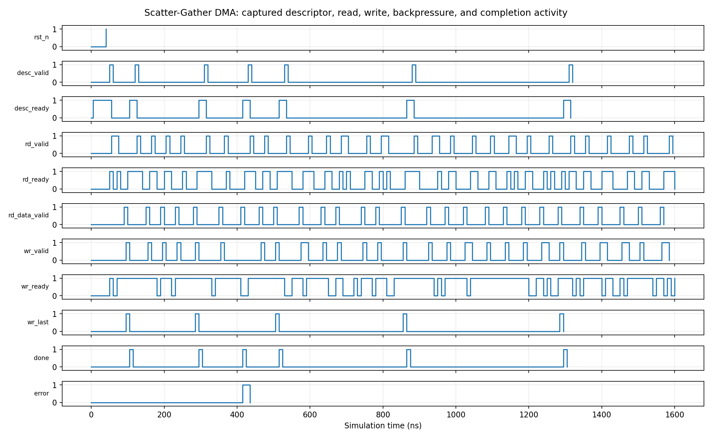

<!-- Author: Asresh Kuricheti -->
# Day 38 — UVM Scatter-Gather DMA Descriptor Engine Verification

## Overview

This project verifies a parameterized direct-memory-access data mover. Each descriptor names a source address, destination address, and word count. The RTL issues one memory read at a time, tolerates independent command/data/write backpressure, preserves data and address order, reports the final beat, counts committed words, and aborts cleanly on a read error. This exercise reflects current SoC DV roles that emphasize reusable UVM agents, memory subsystems, high-bandwidth DMA, coverage-driven stimulus, assertions, and end-to-end checking.

## Verification goal

Prove that every accepted descriptor causes exactly the expected ordered copy—no missing, duplicated, corrupted, or misaddressed words—and that stalls and errors cannot violate the interface contract.

## Features and coverage

- Full UVM descriptor agent plus active memory-model agent, monitor, scoreboard, coverage collector, sequence, and virtual sequence.
- Directed single-word, short-burst, backpressure, and read-error tests followed by constrained-random descriptors.
- Golden source-memory model checks every write address, data word, `wr_last`, completion status, and `words_moved` count.
- Coverage bins for one/short/long transfers, normal/error completion, read/write stalls, and length × status.
- SVA for stable stalled channels, no simultaneous read/write command, and one-cycle completion pulses.
- Portable Icarus harness, timeout, VCD dump, and captured waveform rendering.

## Parameters

| Parameter | Default | Meaning |
|---|---:|---|
| `ADDR_W` | 16 | Byte-address width |
| `DATA_W` | 32 | Data-path width; must be byte aligned |
| `LEN_W` | 8 | Descriptor word-count width |

## Ports

| Group | Signals | Purpose |
|---|---|---|
| Descriptor | `desc_valid/ready`, `desc_src`, `desc_dst`, `desc_words` | Submit a copy operation |
| Read command | `rd_valid/ready`, `rd_addr` | Request one source word |
| Read response | `rd_data_valid`, `rd_data`, `rd_error` | Return data or terminate with error |
| Write command | `wr_valid/ready`, `wr_addr`, `wr_data`, `wr_last` | Commit destination words in order |
| Completion | `done`, `error`, `words_moved` | One-cycle descriptor result |

## Testbench architecture

```text
 dma_regress_vseq
      |
      +--> descriptor sequence --> descriptor agent/driver --+
      |                                                       |
      +--> memory policy sequence --> memory agent/driver ----+--> DMA DUT
                                      (golden source RAM)      |
                                                             monitor
                                                               |
                                        +----------------------+----------------+
                                        |                                       |
                                reference-model scoreboard              functional coverage
                                address/data/order/status                length/stall/error crosses
```

The virtual sequence runs both active agents concurrently. The memory driver behaves like a real slave: it randomizes read acceptance, response latency, write acceptance, and occasional read errors. The passive monitor reconstructs only observed handshakes, so the scoreboard does not trust sequence intent.

## Simulation timing



Real waveform captured from the portable Icarus simulation. It shows reset release, descriptor acceptance, separate read command/data phases, randomized write backpressure, final-beat marking, and completion/error behavior.

## How checking works

At descriptor acceptance, the scoreboard records `{source, destination, length}`. Each read address must equal `source + 4×index`; each accepted write must equal the independently initialized golden source word at `destination + 4×index`. The checker separately verifies `wr_last`, error aborts, completion status, and the number of writes actually committed. Its expected memory contents are generated independently of the DUT FSM.

## Functional-coverage intent

Coverage is aimed at behavior boundaries rather than raw transactions: length 1, 2–4, and 5–16; success versus injected error; and independent read/write stall states. The length × completion-status cross ensures abort handling is exercised across transfer sizes.

## What the testbench checks

- Descriptor acceptance and serialization
- Increment-by-word source and destination addressing
- Exact read-data-to-write-data preservation
- Stable address/data/last while stalled
- Correct final-beat indication and moved-word count
- Clean read-error abort without an erroneous destination write
- Directed plus constrained-random operation under independent backpressure
- No hangs via a 2 ms timeout

## Use cases

- Storage controllers moving blocks between host buffers and flash/DRAM queues
- Networking NICs consuming scatter-gather descriptors for packet payloads
- GPU/AI accelerators feeding tensor tiles from system memory to local SRAM
- Camera/display pipelines transferring frames between tiled buffers
- Secure-boot and firmware engines copying authenticated images into execution memory

## Run

```sh
make icarus       # portable self-checking regression; creates VCD
make waveform     # rerun and render the captured waveform PNG
make vcs          # full UVM regression (VCS)
make questa       # full UVM regression (Questa)
make verilator    # full UVM regression where UVM support is available
```

Override the UVM test with `make vcs UVM_TESTNAME=dma_regress_test` (similarly for Questa/Verilator). Success prints `RESULT: *** PASS ***`.
