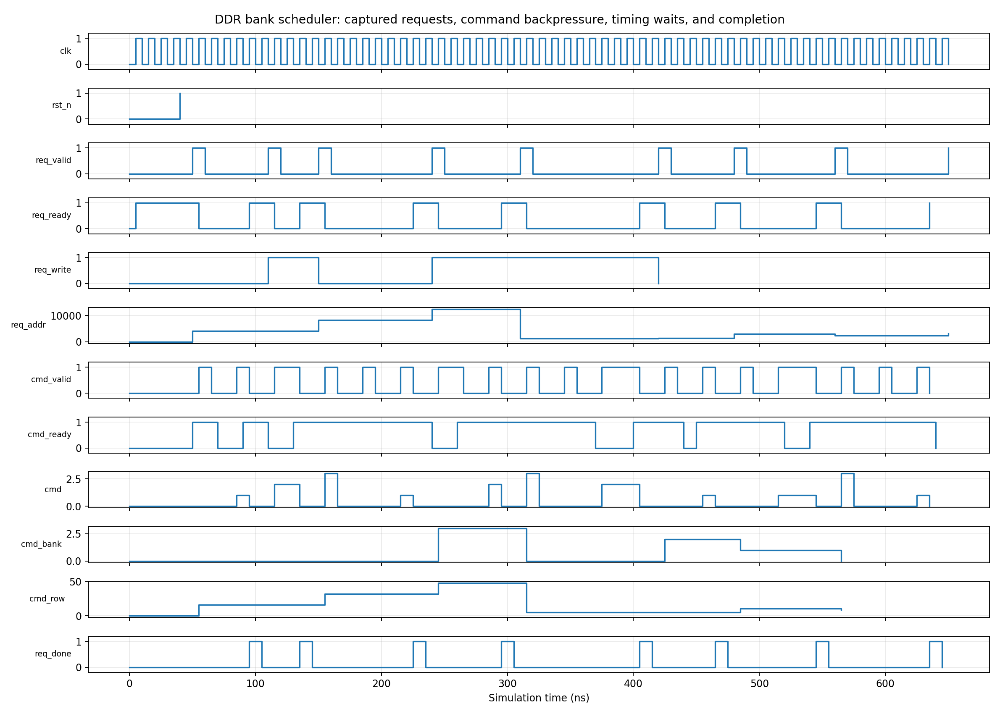

<!-- Author: Asresh Kuricheti -->
# Day 39 — UVM DDR Bank-Command Scheduler Verification

## Overview

This project verifies a parameterized open-page DDR command scheduler. A memory request is decoded as `{row, bank, column}` and translated into legal ACTIVATE, READ/WRITE, and PRECHARGE commands. The scheduler preserves an open row for hits, closes a conflicting row, respects `tRCD`, `tRP`, and `tRAS`, and holds commands stable under controller backpressure. It turns current high-value DV job themes—DDR/memory subsystems, UVM, constrained random, SVA, coverage, and reusable checkers—into a compact portfolio exercise.

## Job-market inspiration

Researched on August 18, 2026. Micron's current [Senior Design Verification Engineer](https://careers.micron.com/careers/job/41787962) role asks for UVM/SystemVerilog, constrained-random verification, Python infrastructure, coverage closure, and DRAM-protocol experience. Apple's ongoing [SoC Design Verification Engineer](https://jobs.apple.com/en-us/details/200662910-0157/soc-design-verification-engineer) opening highlights reusable UVM environments, high-bandwidth DMA, DDR, and memory-controller subsystems. This project concentrates those requirements into one reviewable block with a timing-aware reference model rather than duplicating the repository's existing cache, DMA, or coherency projects.

## Verification goal

Prove that each accepted request produces the minimum legal command sequence for the current bank state, never violates the modeled DDR timing windows, retains the exact address/data payload, and completes once without loss or duplication.

## Features and coverage

- Full UVM request agent and independently sequenced command-backpressure agent.
- Monitor plus cycle-aware shadow-bank reference model and scoreboard.
- Directed cold-miss, row-hit, row-conflict, bank-independence, read, and write cases.
- Constrained-random rows, banks, columns, operations, payloads, idle gaps, and stalls.
- Coverage for ACT/RD/WR/PRE, every bank, row-hit/cold/conflict behavior, and command × bank crosses.
- SVA for stable stalled commands, one-cycle completion, row/tRCD legality, and PRE/tRAS legality.
- Portable Icarus regression, timeout, VCD dump, and real captured waveform rendering.

## Parameters

| Parameter | Default | Meaning |
|---|---:|---|
| `ROW_W` | 8 | Row-address width |
| `BANK_W` | 2 | Bank-address width (`2^BANK_W` banks) |
| `COL_W` | 6 | Column-address width |
| `DATA_W` | 32 | Write-data width |
| `TRCD` | 2 | ACT-to-RD/WR minimum cycles |
| `TRP` | 2 | PRE-to-ACT minimum cycles |
| `TRAS` | 4 | ACT-to-PRE minimum cycles |

## Ports

| Group | Signals | Purpose |
|---|---|---|
| Request | `req_valid/ready`, `req_write`, `req_addr`, `req_wdata` | Submit one decoded memory operation |
| DDR command | `cmd_valid/ready`, `cmd`, `cmd_bank`, `cmd_row`, `cmd_col`, `cmd_wdata` | Emit ACT/RD/WR/PRE commands |
| Completion | `req_done` | One-cycle retirement indication |

## Testbench architecture

```text
                         ddr_regress_vseq
                    +-----------+------------+
                    |                        |
          directed + random requests    random ready/stalls
                    |                        |
             request agent             command-flow agent
                    +-----------+------------+
                                |
                       DDR bank scheduler DUT
                                |
                   cycle-by-cycle passive monitor
                                |
               +----------------+----------------+
               |                                 |
       shadow-bank scoreboard            functional coverage
  open-row + tRCD/tRP/tRAS model      command × bank + scenarios
```

The virtual sequence coordinates both active agents. The scoreboard observes pins only: it does not trust sequence intent. Its independent bank table tracks open rows and timing ages, then validates every accepted command and the exact request retirement order.

## Simulation timing



Real waveform captured from the portable Icarus regression. It shows request handshakes, command-generation gaps required by DDR timing, randomized command backpressure, stable valid behavior, and request completion.

## How checking works

On every request handshake, the scoreboard stores the decoded row, bank, column, operation, and data. It independently ages `tRCD`, `tRP`, and `tRAS` counters for all banks. ACT is accepted only for a precharged bank after `tRP`; PRE only for an open conflicting row after `tRAS`; RD/WR only for the requested open row after `tRCD`. The final data command must match the original operation and payload, after which exactly one completion is expected.

## Functional-coverage intent

Coverage demonstrates that all four command types are exercised on every bank and that the test reaches cold banks, repeated row hits, and conflicting-row precharge paths. Random rows are biased toward a small hot set so row reuse and conflicts occur frequently enough for meaningful closure.

## What the testbench checks

- Correct `{row, bank, column}` address decoding
- Minimal ACT→RD/WR path for a closed bank
- Direct RD/WR path for an open-row hit
- PRE→ACT→RD/WR path for a row conflict
- Independent per-bank open-row and timing state
- Exact read/write opcode, column, row, bank, and write data
- Stable command payload while `cmd_ready` is low
- `tRCD`, `tRP`, and `tRAS` cycle legality
- No lost, duplicated, premature, or hung requests

## Use cases

- DDR4/DDR5 memory controllers scheduling CPU, GPU, or accelerator traffic
- DRAM PHY/controller front ends that must enforce JEDEC timing
- Multi-bank scratchpad and HBM pseudo-channel schedulers
- Camera, networking, and storage SoCs sharing bandwidth across memory banks
- Performance verification of row-hit policies before adding arbitration or refresh

## Run

```sh
make icarus       # portable self-checking regression; creates VCD
make waveform     # rerun and render the captured waveform PNG
make vcs          # full UVM regression (VCS)
make questa       # full UVM regression (Questa)
make verilator    # full UVM regression where UVM support is available
```

Override the UVM test with `make vcs UVM_TESTNAME=ddr_regress_test` (similarly for Questa/Verilator). Success prints `RESULT: *** PASS ***`.
