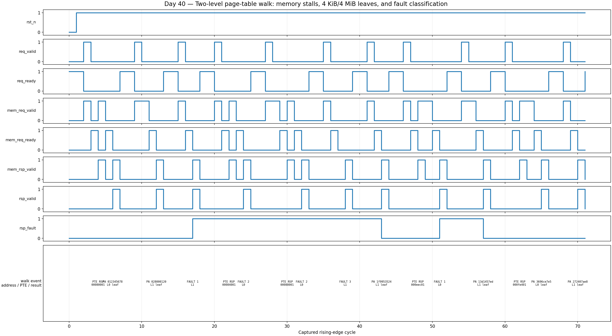

<!-- Author: Asresh Kuricheti -->
# Day 40 — UVM Two-Level Page-Table Walker Verification

## Overview

This project verifies a parameterized, synthesizable Sv32-style hardware page-table walker (PTW). A translation request carries a 32-bit virtual address, read/write/execute access type, and privilege mode. The walker fetches a level-1 PTE from the configured root, either completes a 4 MiB superpage translation or follows a pointer to a level-0 table, and then returns a 4 KiB translation or a precise fault. Both the PTE-request channel and translation-response channel tolerate backpressure.

The exercise focuses on the bugs that make MMU verification valuable: indexing the wrong VPN slice, confusing pointer and leaf PTEs, forming a physical address with the wrong offset, accepting malformed `W=1/R=0` entries, ignoring accessed/dirty or user permissions, and accepting a misaligned superpage.

## Job-market inspiration

Researched on August 19, 2026. NVIDIA's current [ASIC Verification Engineer — Memory Management Unit](https://nvidia.wd5.myworkdayjobs.com/en-US/NVIDIAExternalCareerSite/job/ASIC-Verification-Engineer---New-College-Grad-2026_JR2016248) role emphasizes MMU microarchitecture, reusable BFMs/checkers/monitors, constrained random, functional coverage, assertions, and SystemVerilog. Its current [ASIC Verification Engineer — Memory Subsystems](https://nvidia.wd5.myworkdayjobs.com/en-US/nvidiaexternalcareersite/job/ASIC-Verification-Engineer_JR2008448) posting lists a base range up to $218,500 and highlights memory coherence and high-speed I/O. Apple’s [SoC Design Verification Engineer](https://jobs.apple.com/en-us/details/200662910-3956/soc-design-verification-engineer) role asks for reusable UVM environments and sophisticated multi-instance VIP integration. This project turns those signals into a focused MMU block that complements, rather than repeats, Day 34’s I-TLB.

## Verification goal

Prove that every accepted request issues the correct one- or two-PTE address sequence, interprets each observed PTE according to the documented leaf/pointer and permission rules, returns the exact translated address or fault exactly once, and remains protocol-correct under independent memory and consumer stalls.

## Features and coverage

- Full UVM environment with independent request and PTE-memory responder agents.
- Coordinating virtual sequencer and virtual sequence for multi-agent scenarios.
- Pin-only monitor; the scoreboard never trusts sequence intent.
- Independent two-level walk reference model checking PTE addresses, translation, leaf level, and fault code.
- Directed 4 KiB and 4 MiB successes plus invalid, dirty-bit, user-permission, and misaligned-superpage faults.
- Constrained-random virtual addresses, access types, privilege, PTE types/permissions, memory stalls, response delays, and consumer backpressure.
- Functional coverage for read/write/execute × result, user/supervisor requests, both leaf levels, and every fault class.
- SVA for request/response stability while stalled, legal access encoding, response consistency, response-state legality, and no unknown result bits.
- Portable Icarus regression with timeout, VCD dump, and a real captured waveform.

## DUT parameters

| Parameter | Default | Meaning |
|---|---:|---|
| `VA_W` | 32 | Virtual-address width; Sv32 indexing uses VPN1=`[31:22]`, VPN0=`[21:12]` |
| `PA_W` | 34 | Physical-address width |
| `PPN_W` | 22 | Physical page-number width stored in a PTE |

## DUT ports

| Group | Signals | Purpose |
|---|---|---|
| Clock/reset | `clk`, `rst_n` | Active-low asynchronous reset |
| Configuration | `root_ppn` | Physical page number of the level-1 root table |
| Walk request | `req_valid/ready`, `req_vaddr`, `req_access`, `req_user` | Submit one translation and its permission context |
| PTE memory | `mem_req_valid/ready`, `mem_req_addr`, `mem_rsp_valid`, `mem_rsp_pte` | Read one 32-bit PTE through a decoupled memory interface |
| Translation response | `rsp_valid/ready`, `rsp_paddr`, `rsp_fault`, `rsp_fault_code`, `rsp_leaf_level` | Return translated address or classified fault |

`rsp_fault_code` is `0` for success, `1` for an invalid/non-leaf terminal PTE, `2` for a permission/A/D failure, and `3` for a misaligned level-1 superpage.

## PTE fields used

| Bits | Name | Checking behavior |
|---|---|---|
| `[31:10]` | PPN | Next-table base for a pointer or output page number for a leaf |
| `7` | D | Must be set for writes |
| `6` | A | Must be set for any permitted access |
| `4` | U | Must be set for a user-mode request |
| `3:1` | X/W/R | Select execute/write/read permission; `W=1,R=0` is malformed |
| `0` | V | Must be set |

## Testbench architecture

```text
                              ptw_regress_vseq
                         +-----------+-----------+
                         |                       |
              directed + random walks    scripted/random PTEs
                         |                       |
                 request UVM agent       PTE-memory UVM agent
                  driver/sequencer        responder/sequencer
                         +-----------+-----------+
                                     |
                         +-----------v-----------+
                         | page_table_walker DUT |
                         +-----------+-----------+
                                     |
                              pin-level monitor
                                     |
                    +----------------+----------------+
                    |                                 |
          independent walk scoreboard          functional coverage
       VPN address + PTE + permission model   access × result, leaf level
```

The request and memory agents are both active because a PTW must be verified against arbitrary memory latency and backpressure, not an always-ready array. The virtual sequence keeps their transaction streams aligned, while the scoreboard derives its expectations only from accepted interface activity.

## Simulation timing



Real waveform captured from the portable Icarus regression. It shows request acceptance, stalled PTE requests, delayed PTE responses, level-1 and level-0 activity, successful 4 KiB/4 MiB translations, and classified fault responses.

## How checking works

When a request handshakes, the scoreboard computes `root_base + VPN1*4`. It compares the first observed PTE request with that address and interprets the returned PTE independently. A pointer causes a second expected address, `next_table_base + VPN0*4`; a leaf causes permission, alignment, and address-formation checks. For a level-1 leaf, the low 22 virtual-address bits become the page offset; for a level-0 leaf, the low 12 bits do. The final response must match physical address, fault flag, fault code, and leaf level exactly.

## Functional-coverage intent

Coverage is result-oriented: every access type is crossed with success and all applicable fault classes. Successful walks must reach both level-1 and level-0 leaves. User and supervisor contexts ensure the `U` bit is meaningful. Random permissions deliberately produce negative tests; random memory/request delays exercise protocol behavior independently of translation semantics.

## What the testbench checks

- Correct root-table and next-level PTE byte addresses
- Correct distinction between pointer, leaf, malformed, and invalid PTEs
- 4 KiB and 4 MiB physical-address construction
- Misaligned-superpage rejection
- Read, write, execute, user, accessed, and dirty permissions
- Stable PTE request address while memory applies backpressure
- Stable translation response while its consumer is stalled
- Correct response fault/code relationship and known output values
- No missing, duplicated, premature, or hung response
- Directed coverage targets plus constrained-random stress

## Use cases

- CPU, GPU, and AI-accelerator MMUs that refill instruction or data TLBs after a miss
- IOMMU/SMMU address translation for DMA-capable PCIe, networking, storage, and camera devices
- GPU unified virtual memory and page-fault pipelines
- Hypervisor stage-1/stage-2 translation walkers
- Memory-protection units that need page-granular access checks
- SoC emulation environments where firmware-driven page-table behavior must be reproduced

## Run

```sh
make icarus       # portable self-checking regression; creates VCD
make waveform     # rerun and render the captured waveform PNG
make vcs          # full UVM regression (VCS)
make questa       # full UVM regression (Questa)
make verilator    # full UVM regression where UVM support is available
```

Override the UVM test with `make vcs UVM_TESTNAME=ptw_regress_test` (similarly for Questa/Verilator). Success prints `RESULT: *** PASS ***`.
