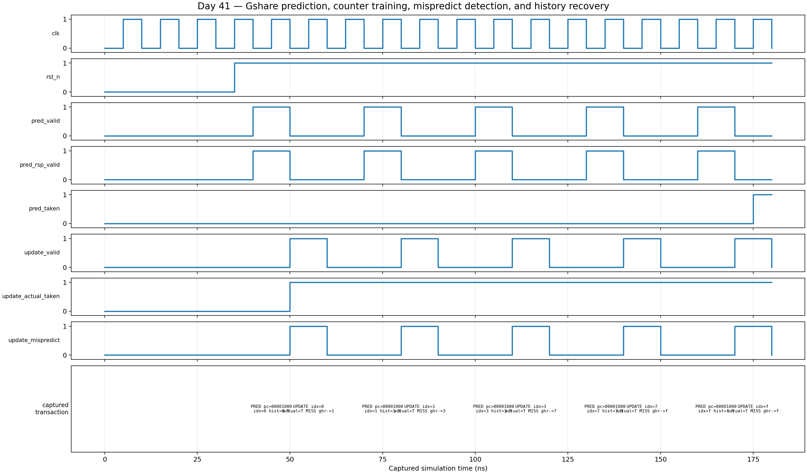

<!-- Author: Asresh Kuricheti -->
# Day 41 — UVM Gshare Branch-Predictor Verification

## Overview

A branch predictor guesses whether a conditional branch will be taken before the processor knows the real answer. A good guess keeps the CPU front end busy; a wrong guess flushes speculative work. This project implements a compact **gshare** predictor and verifies the stateful behavior that makes branch-predictor bugs difficult: every prediction depends on both a table counter and the path history produced by earlier branches.

The project was selected from current high-compensation CPU/SoC DV job themes. NVIDIA's CPU verification role explicitly calls out branch prediction, instruction cache, TLB, scalable constrained-random SystemVerilog/UVM environments, SVA, and coverage. Apple and Micron roles reinforce reference models, reusable agents, assertions, and coverage closure.

Industry references: [NVIDIA Senior Verification Engineer](https://nvidia.wd5.myworkdayjobs.com/en-US/NVIDIAExternalCareerSite/job/Senior-Verification-Engineer_JR2013784), [Apple Design Verification Engineer](https://jobs.apple.com/en-us/details/200658387-0505/design-verification-engineer), and [Micron Sr. Design Verification Engineer](https://careers.micron.com/careers/job/41787962).

## Verification goal

Prove that the predictor uses `PC index XOR global history`, predicts from the selected two-bit counter, trains that exact prediction-time entry with saturation, and reconstructs global history from the saved snapshot plus the resolved outcome. The last point matters when speculative history has changed between prediction and resolution.

## DUT parameters

| Parameter | Default | Meaning |
|---|---:|---|
| `PC_WIDTH` | 32 | Branch program-counter width |
| `GHIST_W` | 4 | Global-history-register width |
| `INDEX_W` | 4 | PHT index width; entries = `2**INDEX_W` |

`GHIST_W` and `INDEX_W` are equal in this exercise, which makes the XOR explicit and keeps the learning model easy to inspect.

## DUT ports

| Port | Dir | Description |
|---|---|---|
| `clk`, `rst_n` | in | Clock and asynchronous active-low reset |
| `pred_valid`, `pred_ready` | in/out | Prediction request handshake |
| `pred_pc` | in | Aligned conditional-branch PC |
| `pred_rsp_valid`, `pred_taken` | out | Immediate prediction response |
| `pred_history`, `pred_index` | out | Metadata saved with the in-flight branch |
| `update_valid` | in | Resolved branch is being trained |
| `update_index`, `update_history` | in | Metadata captured at prediction time |
| `update_pred_taken` | in | Original prediction |
| `update_actual_taken` | in | Architectural branch result |
| `update_mispredict` | out | Exact prediction/outcome disagreement |
| `global_history` | out | Current global history, exposed for checking |

## Testbench architecture

```text
                    gshare_regress_vseq
                  (directed + constrained random)
                              |
             +----------------+----------------+
             |                                 |
      prediction agent                   update agent
   sequencer -> driver                sequencer -> driver
             |                                 |
             +---------- gshare_if ------------+
                              |
                    +-------------------+
                    | gshare predictor  |
                    | GHR + 2-bit PHT   |
                    +-------------------+
                       |             |
                pred monitor    update monitor
                       |             |
                       +------v------+
                              |
             independent shadow-PHT scoreboard
                              |
                 functional coverage + result
```

The two active agents mirror a real CPU pipeline: fetch asks for predictions while a later execute stage reports resolved outcomes. A virtual sequencer owns both agent sequencers so a test can preserve or deliberately vary their relationship.

## How checking works

The scoreboard owns an independent array of two-bit counters, all reset to weakly-not-taken (`01`), plus a shadow history register. For each observed prediction it independently computes:

```text
expected_index = PC[INDEX_W+1:2] XOR shadow_history
expected_taken = shadow_PHT[expected_index].MSB
```

At update time it checks the saved metadata and mispredict flag, saturates only the referenced counter, and computes the next history from the prediction-time snapshot. The portable regression performs the same checks without requiring a commercial UVM library and fails on any mismatch or required coverage hole.

## Features and coverage

- Directed training through all four counter states and both saturation endpoints.
- Aliasing: different PC/history pairs selecting the same PHT entry.
- History patterns, recovery after correct predictions and mispredictions, and reset initialization.
- 240 aligned constrained-random branches with a 62% taken bias.
- Functional coverage for predicted/actual direction, correct/mispredict outcomes, all PHT indices, and increment/decrement saturation.
- SVA for immediate response, gshare index calculation, exact mispredict indication, history recovery, and unknown-free prediction metadata.
- A hard timeout and VCD waveform dumping.

## Simulation timing



*Waveform captured from the Icarus Verilog regression VCD. It shows reset, prediction metadata, counter learning, a correct prediction, a misprediction, and global-history recovery.*

## What the testbench checks

1. Reset makes every counter weakly not taken and clears history.
2. Every prediction uses the correct PC/history XOR index.
3. The prediction equals the selected counter's most-significant bit.
4. Taken updates increment and not-taken updates decrement without wrapping.
5. Only prediction-time metadata selects the training entry.
6. History recovery appends the actual outcome to the saved history.
7. `update_mispredict` is asserted if and only if prediction and outcome differ.
8. Directed and random traffic reach both decisions, both accuracy classes, both saturation cases, and every table index.

## Big-picture use cases

- **CPU instruction fetch:** choose the next fetch address before branch execution completes.
- **GPU command processors:** predict control-flow decisions in scalar front ends.
- **Network processors:** speculate through packet-classification decision trees.
- **Performance modeling:** compare aliasing and accuracy as history/table sizes change.
- **DV interview or onboarding exercise:** demonstrate UVM agents, virtual coordination, stateful scoreboarding, SVA, coverage, and waveform debug in one small block.

## Run instructions

```sh
make                 # portable Icarus self-checking regression
make vcs             # full UVM, override with UVM_TESTNAME=...
make questa          # full UVM
make verilator       # Verilator UVM where supported
make clean
```

A successful run prints `RESULT: *** PASS ***`. The Icarus target is the open-source executable regression; VCS/Questa targets exercise the full UVM environment.
