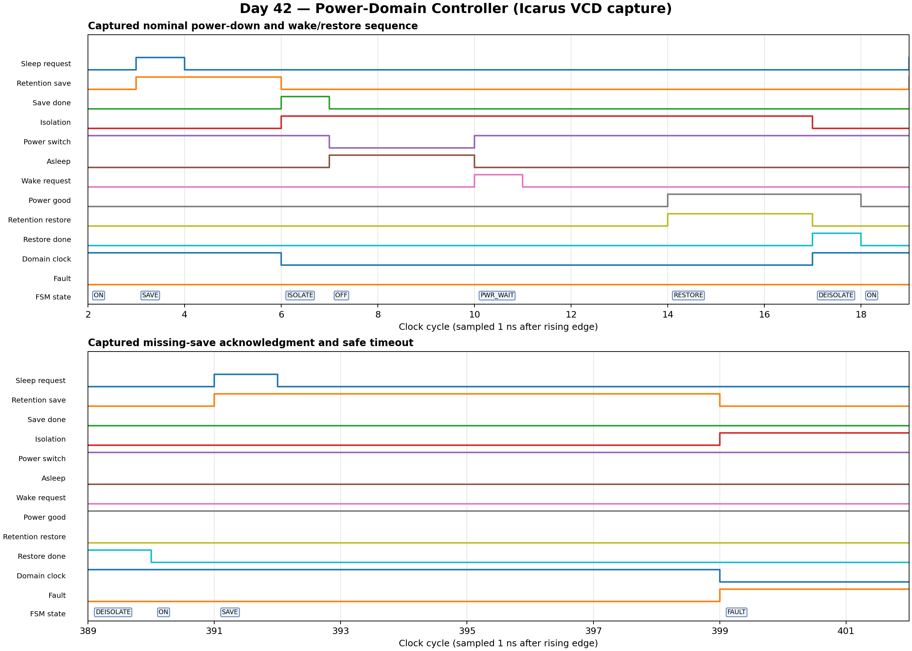

<!-- Author: Asresh Kuricheti -->
# Day 42: UVM Power-Domain Isolation and Retention Controller Verification

## Overview

Modern SoCs save energy by turning off an idle block. Power cannot simply disappear: the block must first save essential state, stop its clock, isolate its outputs so an unpowered signal cannot corrupt live logic, and only then switch off. Wake-up reverses that order. This project implements and verifies that safety-critical sequence.

The synthesizable DUT is an eight-state controller. It accepts sleep and wake requests, coordinates retention and power-good acknowledgments, and enters a latched safe-fault state if an external acknowledgment takes too long. The verification environment checks every control output on every observed cycle against an independent state model.

## Verification goal

Prove both the normal sequence and the safety rules:

1. Retention state is saved before isolation and power-off.
2. The domain is isolated and clock-gated whenever its power switch is off.
3. Wake-up waits for `pwr_good`, restores retained state while isolated, and only then enables the domain clock and removes isolation.
4. Missing `save_done`, `pwr_good`, or `restore_done` cannot leave unsafe controls; each timeout reaches `FAULT` with power on, isolation on, and the clock off.
5. Directed zero-delay and delayed cases plus randomized legal delays agree with a golden model.

## Why this project is useful for DV careers

Apple's current SoC Design Verification Engineer opening lists reusable UVM environments, reference models, coverage-driven verification, constrained-random testing, SVA, complex SoC integration, and industry-standard low-power architectures. It lists a US base-pay range of **$181,100-$318,400**. This exercise turns those requirements into a compact portfolio project: two coordinated UVM agents, an independent predictor, functional coverage, assertions, portable simulation, and a low-power sequencing DUT. See [Apple role 200658029-3956](https://jobs.apple.com/en-us/details/200658029-3956/design-verification-engineer?team=HRDWR).

The same reusable methodology also matches NVIDIA's current Senior SoC Verification role, which emphasizes complex-chip testbenches, UVM/SystemVerilog, CPU/SoC architecture, and compensation up to **$264,500**: [NVIDIA JR2012656](https://nvidia.wd5.myworkdayjobs.com/nvidiaexternalcareersite/job/us-ca-santa-clara/senior-verification-engineer--soc_jr2012656).

## DUT behavior

```text
                    save_done                     wake_req
                       |                              |
                       v                              v
  +------+ sleep  +------+       +---------+      +----------+
  |  ON  |------->| SAVE |------>| ISOLATE |----->|   OFF    |
  +--^---+        +------+       +---------+      +----+-----+
     |                                                    |
     |           +-----------+    +---------+    +--------v---+
     +-----------| DEISOLATE |<---| RESTORE |<---| POWER_WAIT |
                 +-----------+    +---------+    +------------+
                                      ^               ^
                                restore_done       pwr_good

        SAVE / POWER_WAIT / RESTORE timeout
                         |
                         v
          +-----------------------------------+
          | FAULT: power=1, isolate=1, clk=0 |
          +-----------------------------------+
```

`SAVE`, `POWER_WAIT`, and `RESTORE` are handshake states. `ISOLATE` and `DEISOLATE` deliberately occupy a full cycle, making the ordering visible and easy to assert. Reset returns to `ON`; a fault remains latched until reset.

## Features and coverage

- Parameterized timeout with a width derived from `TIMEOUT_CYCLES`.
- Reset-safe, synthesizable, latch-free RTL with explicit fail-safe defaults.
- Separate active UVM command and acknowledgment agents.
- Virtual sequencer and virtual sequence coordinating both agents.
- Directed nominal, immediate-ack, and three timeout tests.
- Forty constrained-random UVM delay combinations; 24 portable random round trips.
- Independent cycle-exact state/output reference model.
- Functional coverage for all eight states, busy, power, fault, and state × power.
- SVA for powered-off safety, retention ordering, asleep/fault contracts, mutual exclusion, and known outputs.
- Portable Icarus testbench with a timeout, VCD dump, and coverage-hole checks.

## Parameters

| Parameter | Default | Meaning |
|---|---:|---|
| `TIMEOUT_CYCLES` | 8 | Maximum cycles allowed while waiting for save, power-good, or restore acknowledgment |
| `COUNT_W` | `$clog2(TIMEOUT_CYCLES+1)` | Internal wait-counter width; normally left derived |

## Ports

| Port | Dir. | Width | Meaning |
|---|---|---:|---|
| `clk` | in | 1 | Controller clock |
| `rst_n` | in | 1 | Active-low asynchronous reset |
| `sleep_req` | in | 1 | Request entry into the powered-off state |
| `wake_req` | in | 1 | Request exit from the powered-off state |
| `save_done` | in | 1 | Retention hardware reports state saved |
| `restore_done` | in | 1 | Retention hardware reports state restored |
| `pwr_good` | in | 1 | Power rail is stable after switch-on |
| `isolate_en` | out | 1 | Clamp the domain's outward-facing signals |
| `retention_save` | out | 1 | Request retention capture |
| `retention_restore` | out | 1 | Request retention restore |
| `power_switch_en` | out | 1 | Enable the domain's power switch |
| `domain_clk_en` | out | 1 | Enable the domain clock |
| `busy` | out | 1 | A transition is in progress |
| `asleep` | out | 1 | Domain is safely powered off |
| `fault` | out | 1 | A handshake timed out; reset is required |
| `state_dbg` | out | 3 | Visible FSM state for debug and coverage |

## Testbench architecture

```text
 +---------------------- power_domain_regress_vseq ----------------------+
 |                                                                       |
 |  sleep/wake/reset policy                       ack delay/fault policy  |
 |            |                                             |            |
 |            v                                             v            |
 | +-------------------+                         +-------------------+    |
 | | command sequencer |                         | ack sequencer     |    |
 | | + driver          |                         | + driver          |    |
 | +---------+---------+                         +---------+---------+    |
 |           | sleep_req / wake_req                        | done/good    |
 +-----------|---------------------------------------------|--------------+
             v                                             v
        +-------------------------------------------------------+
        |      power_domain_if + power_domain_controller        |
        +---------------------------+---------------------------+
                                    |
                    every input, state, and output each cycle
                                    v
              +---------------------+---------------------+
              | cycle monitor -> golden FSM scoreboard    |
              |               -> functional coverage      |
              +--------------------------------------------+
```

The acknowledgment driver is deliberately independent of the command driver. That models the real system: retention logic and the power-management unit can respond with different latencies or fail entirely. The virtual sequence coordinates intent without letting either driver predict DUT outputs.

## How checking works

The scoreboard owns a shadow FSM and wait counter written separately from the RTL. For every monitor sample it:

1. advances the model from observed pins rather than sequence intent;
2. derives the expected isolation, retention, power, clock, status, and debug-state values;
3. compares all nine output fields exactly; and
4. counts complete round trips and timeout transitions.

This catches wrong state transitions, early power removal, early de-isolation, dropped retention requests, incorrect status, and unsafe timeout behavior. Interface assertions provide a second layer of checking based on safety invariants rather than the model implementation.

## Functional-coverage intent

Coverage asks whether the regression reached every controller state and observed both values of busy, power-enable, and fault. The state × power cross distinguishes states that look similar at transaction level; for example, `OFF` and `POWER_WAIT` are both isolated but have opposite power-switch values. The portable test fails if any state, normal round trip, randomized case, or timeout category is absent.

## What the testbench checks

- Reset output contract and return to `ON`.
- Save-before-isolate ordering.
- Isolate-and-clock-gate-before-power-off ordering.
- Stable `OFF` behavior while waiting for wake.
- Power-good-before-restore ordering.
- Restore-before-de-isolate ordering.
- Zero-delay, delayed, and randomized acknowledgments.
- Save, power-good, and restore timeout paths in UVM.
- Safe, latched fault outputs.
- No save/restore overlap and no unknown control outputs.
- Timeout of the testbench itself, preventing a hung run from appearing successful.

## Simulation timing



The image is rendered from the **real Icarus VCD produced by this regression**, not hand-modeled. The upper window shows save → isolate → power-off → power-good → restore → de-isolate. The lower window shows a deliberately missing `save_done`; after eight wait cycles the controller enters the safe `FAULT` state.

## Run

```bash
# Portable open-source regression; tested in this project
make icarus

# Full UVM regression on commercial/UVM-capable simulators
make vcs UVM_TESTNAME=power_domain_regress_test
make questa UVM_TESTNAME=power_domain_regress_test
make verilator UVM_TESTNAME=power_domain_regress_test

make clean
```

Observed portable result:

```text
RESULT: *** PASS *** checks=3501 cycles=388 roundtrips=26 timeout_faults=1
```

The portable run validates the synthesizable DUT and real waveform. The complete class-based UVM environment is supplied for simulators with UVM support; it was not executed with Icarus because Icarus does not provide a UVM library.

## Use-case examples

- **Mobile application processors:** shut down camera, display, video, or AI accelerators between workloads.
- **Cellular modem SoCs:** power-gate baseband or protocol engines when a radio path is idle.
- **GPU/AI chips:** independently gate compute clusters while preserving scheduling state.
- **Automotive SoCs:** place optional perception or infotainment islands into a deterministic safe state.
- **Always-on chips:** protect an always-on controller from signals coming from a switched domain.
- **Verification IP training:** reuse the two-agent environment pattern for reset, clock, voltage, and firmware-controlled power sequencing.

## Files

| File | Purpose |
|---|---|
| `power_domain_controller.sv` | Synthesizable DUT |
| `power_domain_if.sv` | Interface and SVA |
| `power_domain_pkg.sv` | UVM items, sequencers, drivers, monitor, agents, scoreboard, coverage, virtual sequence, env, and test |
| `tb_top.sv` | Full UVM top |
| `tb_power_domain_portable.sv` | Icarus-compatible self-checking regression and VCD capture |
| `Makefile` | Icarus, VCS, Questa, and Verilator targets |
| `docs/power_domain_controller_waveform.png` | Real captured timing diagram |
