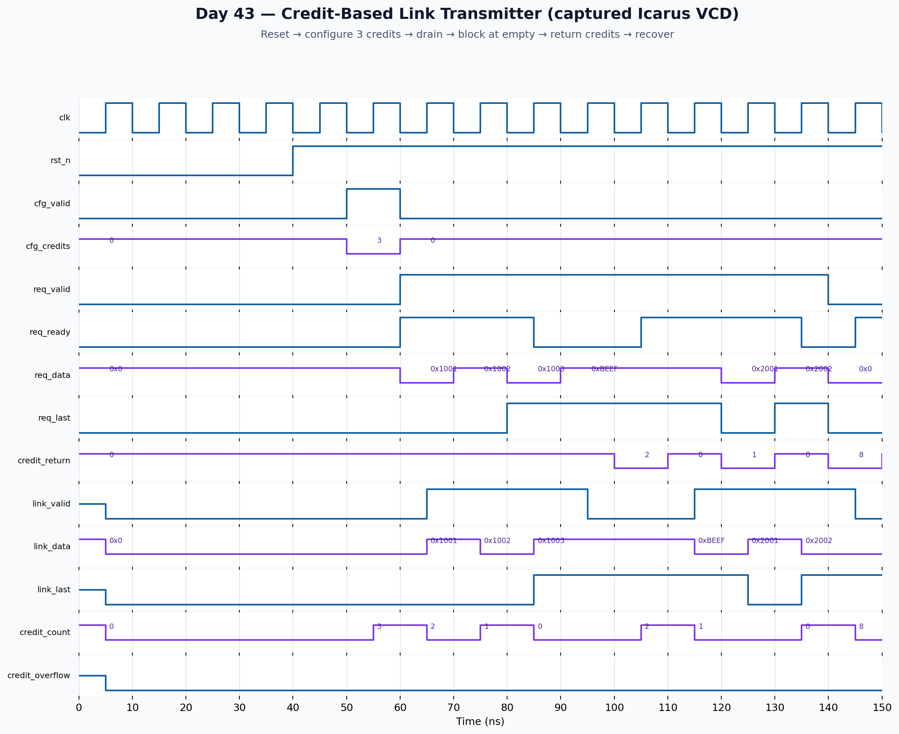

<!-- Author: Asresh Kuricheti -->
# Day 43 — UVM Credit-Based High-Speed Link Controller Verification

## Overview

This project verifies a parameterized transmitter for a credit-based chip-to-chip or on-chip link. A receiver advertises free buffer slots as credits. The transmitter may launch one flit only when at least one credit is available; every launch consumes one credit, and every returned credit restores capacity. This small rule is foundational to PCIe-style data-link flow control, NoC links, coherent fabrics, accelerator interconnects, and modem/RF transport paths.

The project was chosen from current high-compensation DV work: Apple's June 2026 baseband/RF-link Design Verification role lists reusable UVM environments, reference models, constrained-random testing, SVA, coverage-driven verification, fabric protocols, and link controllers, with a published base-pay range of $129,300–$225,300. The implementation turns those requirements into a focused daily exercise rather than claiming to implement a proprietary protocol.

## Verification goal

Prove that the transmitter never oversubscribes the receiver, preserves every accepted flit exactly, accounts for simultaneous send/return events correctly, blocks cleanly at zero credits, and safely saturates on an invalid excess credit return.

## Features and coverage

- Two reusable active UVM agents: a flit-source agent and credit-return/configuration agent.
- Virtual sequencer and virtual regression sequence coordinate both independent interfaces.
- Atomic cycle monitor feeds a cycle-exact reference-model scoreboard without analysis-port ordering races.
- Directed drain-to-empty, blocked-request, recovery, simultaneous send/return, end-of-packet, and overflow scenarios.
- Constrained-random payload, packet-boundary, credit-return, and backpressure stimulus.
- Functional coverage for empty/low/high credits, idle/return/send/simultaneous flow, packet end, and crosses.
- SVA for no launch without credit, one-cycle launch latency, bounded count, stable blocked requests, and known link data.
- Portable Icarus/Verilator self-checking regression, timeout, VCD dump, and real captured waveform.

## DUT parameters

| Parameter | Default | Meaning |
|---|---:|---|
| `DATA_W` | 16 | Flit payload width |
| `MAX_CREDITS` | 8 | Receiver-buffer capacity represented by the counter |
| `CREDIT_W` | `$clog2(MAX_CREDITS+1)` | Counter and return-bus width |

## DUT ports

| Port | Dir. | Width | Meaning |
|---|---|---:|---|
| `clk`, `rst_n` | In | 1 | Clock and asynchronous active-low reset |
| `cfg_valid` | In | 1 | Load the initial credit count |
| `cfg_credits` | In | `CREDIT_W` | Initial advertised capacity |
| `req_valid`, `req_ready` | In/Out | 1 | Local ready/valid request handshake |
| `req_data` | In | `DATA_W` | Flit offered by the producer |
| `req_last` | In | 1 | End-of-packet marker |
| `credit_return` | In | `CREDIT_W` | Slots released by the receiver this cycle |
| `link_valid` | Out | 1 | One-cycle pulse for a launched flit |
| `link_data` | Out | `DATA_W` | Launched payload |
| `link_last` | Out | 1 | Launched packet-end marker |
| `credit_count` | Out | `CREDIT_W` | Currently available receiver slots |
| `credit_overflow` | Out | 1 | Sticky indication that credits exceeded the configured maximum |

## Testbench architecture

```text
                 +---------------- link_regress_vseq ----------------+
                 |                                                   |
          +------v------+                                     +------v-------+
          | flit agent  |                                     | credit agent |
          | seqr/driver |                                     | seqr/driver  |
          | + monitor   |                                     | + monitor    |
          +------+------+
                 | req_*                                  cfg_*, credit_return
                 +--------------------+  +---------------------+
                                      v  v
                              +----------------+
                              | credit_link_tx |
                              +-------+--------+
                                      | link_*, credit_count
                                      v
                              +----------------+
                              | atomic cycle   |
                              | monitor        |
                              +-------+--------+
                                      v
                              +----------------+
                              | golden credit  |
                              | model + exact  |
                              | flit scoreboard|
                              +----------------+
```

The atomic monitor is deliberate. Send and credit return may occur on the same edge, and independent UVM analysis ports have no guaranteed callback order. Sampling a complete cycle transaction lets the scoreboard apply one unambiguous equation:

```text
next_credits = min(MAX_CREDITS, credits + returned - accepted)
```

## How checking works

At every clock, the scoreboard independently determines whether the offered request should have been accepted from its shadow credit count. It checks the one-cycle `link_valid` contract and compares `link_data`/`link_last` against the exact previously accepted flit. It then applies configuration, returns, and consumption to its own integer model, saturates it at `MAX_CREDITS`, and compares the DUT's `credit_count`. Counts of accepted and transmitted flits must reconcile at end-of-test.

The portable testbench uses the same requirements but a separate compact model. It also fails the run if important coverage events—empty, full, simultaneous return/send, blocked request, or packet end—are absent.

## Simulation timing



The waveform above is captured from the real Icarus regression VCD. It shows reset, initialization with three credits, three launches draining the counter, a blocked request at empty, credit recovery, and simultaneous flow-control activity.

## Functional-coverage intent

The useful state space is not payload values alone. Coverage asks whether traffic reached credit-empty, low, and high regions; whether send and return occurred independently and simultaneously; and whether packet endings crossed those occupancy states. These bins expose off-by-one errors at empty/full and incorrect ordering of `+return` versus `-send`.

## What the testbench checks

- No launch occurs unless a credit was available at acceptance.
- Each accepted flit produces exactly one matching link flit one cycle later.
- Payload and packet boundary are neither corrupted nor reordered.
- A blocked request remains stable until the transmitter can accept it.
- Simultaneous send and return preserve the correct net count.
- Credit count never exceeds `MAX_CREDITS`; excess returns saturate and set overflow.
- Reset removes link-valid state and clears accounting safely.
- Regression finishes before the timeout and reports `RESULT: *** PASS ***` only with zero errors.

## Use cases in the big picture

- **Network-on-chip:** every credit represents a free downstream virtual-channel buffer entry.
- **PCIe/CXL-style links:** posted, non-posted, or completion resources can be governed by separate instances of this accounting pattern.
- **Modem and RF transport:** baseband pipeline stages can prevent sample or descriptor loss when an adjacent stage has finite buffering.
- **GPU/AI fabrics:** accelerator tiles can stream work without a combinational ready path spanning the chip.
- **Chiplet links:** die-to-die transmitters can decouple latency while guaranteeing that the remote elastic buffer is not overrun.

## Run instructions

```sh
make icarus
make verilator
make vcs UVM_TESTNAME=credit_link_test
make questa UVM_TESTNAME=credit_link_test
make clean
```

`icarus` and `verilator` run the portable self-checking regression because those open-source installations usually do not ship a UVM class library. `vcs` and `questa` run the complete UVM environment.

## Industry reference

- [Apple — Design Verification Engineer, baseband modems and RF link controllers](https://jobs.apple.com/en-us/details/200658028-3956/design-verification-engineer?team=HRDWR) (posted June 11, 2026; accessed August 26, 2026).
