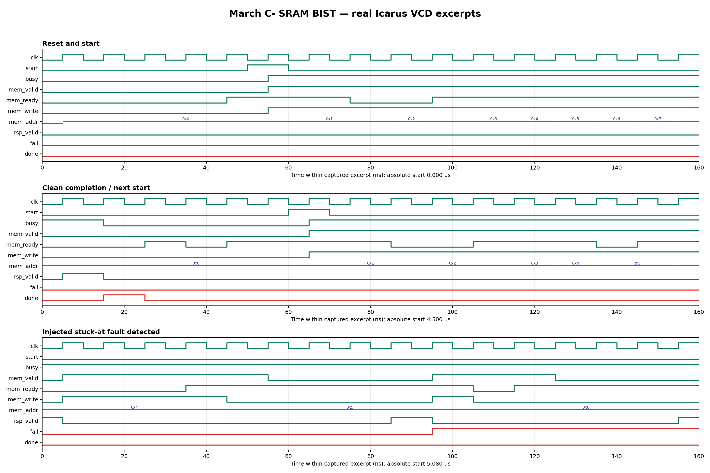

<!-- Author: Asresh Kuricheti -->
# Day 44 — UVM March C- SRAM BIST Controller Verification

## Overview

This project verifies a synthesizable built-in self-test (BIST) controller for an SRAM. When software or power-on logic pulses `start`, the controller walks every address in ascending and descending order, writes known backgrounds, reads them back, and reports the first mismatch with its address, expected data, and actual data. The memory remains outside the DUT so the verification environment can vary latency, backpressure, initial contents, and injected defects independently.

The project was selected from current semiconductor DV requirements. NVIDIA's Senior Memory Controller Verification Engineer opening, listed as posted two days before this project was prepared, calls out SystemVerilog/UVM, memory-controller experience, testbenches, BFMs, checkers, monitors, random stimulus, regressions, and coverage closure; its published U.S. base-pay range reaches $264,500. Current Apple roles also emphasize reusable UVM environments, reference models, constrained random, assertions, coverage, and waveform debug. March C- turns those job requirements into a small but realistic memory-verification exercise without claiming to model a proprietary product.

## Verification goal

Prove that the controller emits the exact March C- command stream under arbitrary command stalls and read-response latency, detects injected stuck-at faults, records the first failure accurately, completes a healthy memory as passing, and never changes a blocked command.

## March C- in plain language

For every address, `w0` writes all zeroes, `r0` expects zeroes, `w1` writes all ones, and `r1` expects ones. An upward arrow means low-to-high addresses; a downward arrow means high-to-low.

```text
↑(w0) → ↑(r0,w1) → ↑(r1,w0) → ↓(r0,w1) → ↓(r1,w0) → ↓(r0)
```

The alternating backgrounds and direction changes expose stuck-at, transition, addressing, and many coupling faults. A read waits for `mem_rsp_valid`; the following write is not issued early.

## Features and coverage

- Parameterized address and data widths; no embedded memory-size assumptions.
- Separate active UVM control and SRAM-responder agents coordinated by a virtual sequencer.
- Reactive memory driver with randomized request backpressure and randomized read latency.
- Independent algorithmic scoreboard that predicts phase, address, operation, data, completion, and pass/fail behavior.
- Directed healthy-memory and stuck-at-one fault cases at interior and boundary-adjacent addresses.
- Constrained-random memory readiness and response-latency configuration.
- Functional coverage for all six March elements, first/middle/last addresses, reads/writes, stalls, and crosses.
- SVA for stable blocked commands, no request while awaiting read data, and consistent pass/fail flags.
- Portable Icarus/Verilator regression, timeout, VCD dump, and a waveform rendered from the real captured VCD.

## DUT parameters

| Parameter | Default | Meaning |
|---|---:|---|
| `ADDR_W` | 4 | SRAM address width; depth is `2**ADDR_W` words |
| `DATA_W` | 8 | SRAM word width and test-background width |

## DUT ports

| Port | Dir. | Width | Meaning |
|---|---|---:|---|
| `clk`, `rst_n` | In | 1 | Clock and asynchronous active-low reset |
| `start` | In | 1 | Starts one complete March C- run while idle |
| `busy`, `done` | Out | 1 | Active-test and completion status |
| `pass`, `fail` | Out | 1 | Final result; `fail` is sticky during a run |
| `fail_addr` | Out | `ADDR_W` | Address of the first read mismatch |
| `fail_expected`, `fail_actual` | Out | `DATA_W` | First mismatch evidence |
| `mem_valid`, `mem_ready` | Out/In | 1 | SRAM-command ready/valid handshake |
| `mem_write` | Out | 1 | 1 for write, 0 for read |
| `mem_addr` | Out | `ADDR_W` | Command address |
| `mem_wdata` | Out | `DATA_W` | All-zero or all-one write background |
| `mem_rsp_valid` | In | 1 | Read response is available |
| `mem_rdata` | In | `DATA_W` | Returned SRAM read data |

## Testbench architecture

```text
                   +----------- march_c_regress_vseq -----------+
                   |                                             |
           +-------v--------+                           +---------v--------+
           | control agent  |                           | SRAM agent       |
           | sequence/driver|                           | cfg sequence     |
           | start + fault  |                           | reactive driver  |
           +-------+--------+                           +---------+--------+
                   | start, injected-fault policy                | ready/rsp
                   |                                             |
                   +----------------+   +------------------------+
                                    v   v
                             +---------------+
                             | march_c_bist  |
                             | synthesizable |
                             +-------+-------+
                                     | command + status every cycle
                                     v
                             +---------------+
                             | cycle monitor |
                             +-------+-------+
                                     v
                         +-----------------------+
                         | independent March C-  |
                         | scoreboard + coverage |
                         +-----------------------+
```

The memory driver is intentionally reactive: it observes accepted commands, stores writes, and returns reads after a randomized delay. Fault injection changes the physical value seen at one bit, not the scoreboard's expectation, so the checker cannot accidentally agree with the injected defect.

## How checking works

The scoreboard maintains only an independent phase number, expected address, and read/write sub-operation. It derives the expected command from the March C- definition and compares every accepted DUT command. The memory model separately applies writes and returns data. On completion, the scoreboard requires a healthy run to assert `pass` and injected runs to assert `fail`; the portable regression additionally checks exact failure address/data and reports PASS only after required coverage events occur.

## Simulation timing



This image is rendered from the real Icarus VCD captured by the portable regression. Three 16-cycle excerpts show reset/start and ascending writes, a clean completion followed by the next run, and a delayed read response at address `0x5` raising the sticky fault flag for an injected stuck-at-one defect.

## Functional-coverage intent

Coverage is organized around algorithm state, not random data values. Every March element must execute at low, middle, and high addresses; read and write operations must both occur; and command stalls must be observed. Crossing phase with operation catches missing second operations in `(read,write)` elements, while edge-address bins catch off-by-one direction-change bugs.

## What the testbench checks

- The complete command count and order match March C- exactly.
- Upward phases increment and downward phases decrement without skipping or repeating addresses.
- A combined element always completes its read before issuing its write.
- Zero and one backgrounds are correct for every phase.
- `mem_valid`, address, operation, and write data remain stable during backpressure.
- Read latency does not cause duplicate commands or an early phase transition.
- Healthy memory produces `done && pass && !fail`.
- Injected defects produce `done && fail && !pass` and accurate first-failure evidence.
- Reset returns the controller to a safe idle state.
- The test ends before timeout and prints `RESULT: *** PASS ***` only with zero errors.

## Use cases in the big picture

- **Power-on self-test:** firmware can quarantine an SRAM bank before normal boot uses it.
- **Automotive and industrial safety:** periodic online diagnostics can provide latent-fault coverage for safety memories.
- **GPU/AI accelerators:** register files, scratchpads, and cache data arrays can be tested after reset or power-gating events.
- **Memory-controller validation:** the same UVM responder/scoreboard pattern scales to repair, redundancy, scrambling, and ECC test modes.
- **Yield learning:** first-failure address and data help silicon-test teams classify systematic memory defects.
- **Chiplet/SoC manufacturing test:** a wrapper can expose this controller through JTAG, APB, or a test-access network.

## Run instructions

```sh
make icarus
make verilator
make vcs UVM_TESTNAME=march_c_bist_test
make questa UVM_TESTNAME=march_c_bist_test
make clean
```

`icarus` and `verilator` run the portable self-checking regression because typical open-source installations do not include a UVM class library. `vcs` and `questa` run the full dual-agent UVM environment.

## Industry references

- [NVIDIA — Senior Memory Controller Verification Engineer](https://nvidia.wd5.myworkdayjobs.com/en-US/NVIDIAExternalCareerSite/job/Senior-Memory-Controller-Verification-Engineer_JR2018502) — SystemVerilog/UVM, memory-controller verification, checkers/monitors/random stimulus, regressions, and coverage closure (listed as posted two days ago; accessed August 31, 2026).
- [Apple — Design Verification Engineer](https://jobs.apple.com/en-us/details/200658028-0157/design-verification-engineer) — reusable UVM, reference models, constrained random, SVA, coverage, and Python automation (posted June 11, 2026; accessed August 31, 2026).
